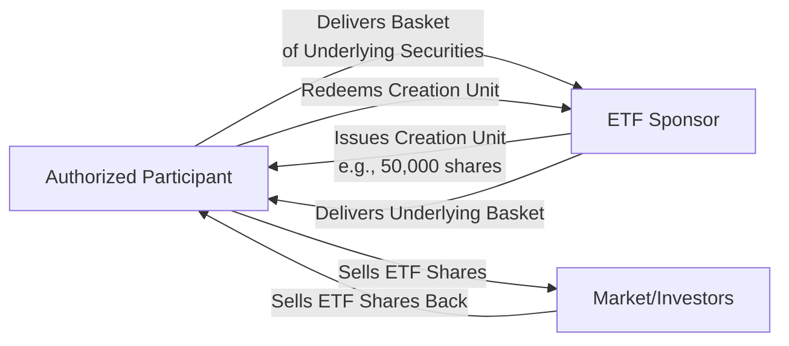
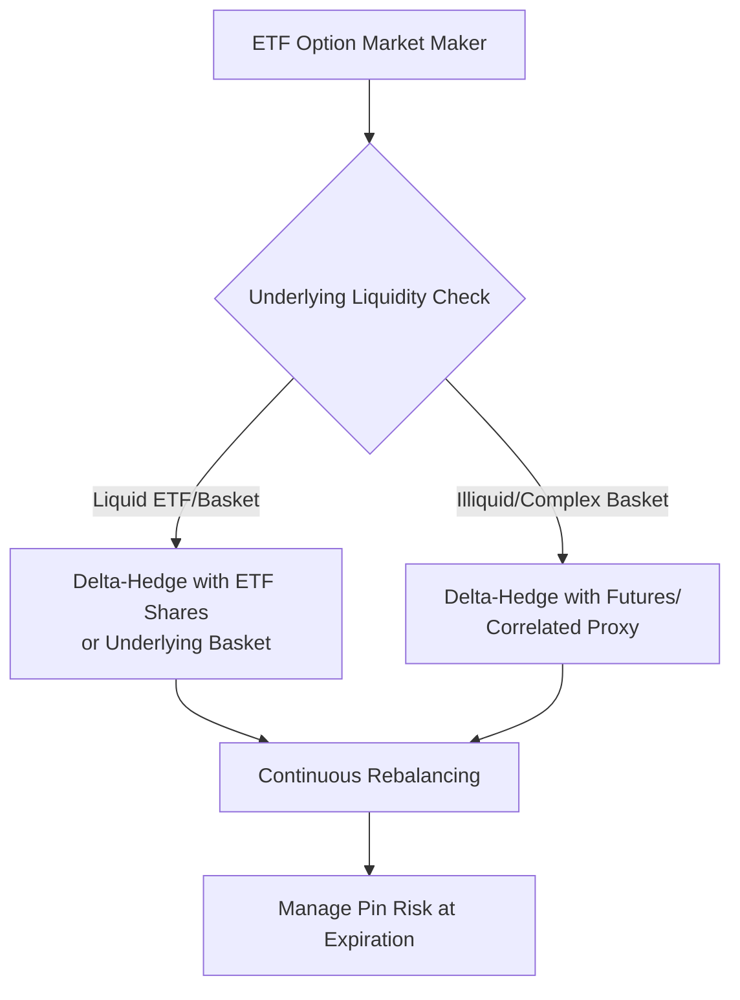

## Exchange Traded Funds and Their Options

### ETF Structure Overview

Exchange-Traded Funds (ETFs) are open-ended investment vehicles that trade intraday on exchanges like individual stocks while typically holding a diversified basket of underlying securities. Their unique creation/redemption mechanism distinguishes them from traditional mutual funds and directly affects the pricing and hedging of options written on them.

**Key Points**

- ETF shares trade continuously on exchange at market-determined prices, distinct from mutual funds priced once daily at NAV
- Authorized Participants (APs) — typically large broker-dealers — create and redeem ETF shares in large blocks ("creation units"), which keeps market price closely aligned with Net Asset Value (NAV)
- ETFs span nearly every asset class and strategy: broad index (SPY, QQQ), sector, thematic, leveraged/inverse, fixed income, commodity, and actively managed

### Creation/Redemption Mechanism

- **Creation:** AP assembles the required basket of underlying securities (or cash equivalent), delivers to the ETF sponsor, and receives newly created ETF shares in bulk (a "creation unit," often 25,000–100,000 shares)
- **Redemption:** Reverse process — AP delivers ETF shares back to the sponsor and receives the underlying basket
- **Arbitrage mechanism:** If ETF market price trades above NAV (premium), APs create new shares (buying underlying, selling ETF) to capture the spread, increasing ETF supply and pushing price toward NAV. If ETF trades below NAV (discount), APs redeem, reducing supply and pushing price up toward NAV

[Inference] This arbitrage mechanism generally keeps most highly liquid, broad-based ETFs trading very close to NAV under normal market conditions, though premiums/discounts can widen meaningfully during periods of underlying market stress, illiquidity in the underlying basket (e.g., international/emerging market ETFs during local market closures), or for niche/illiquid ETF products.

### ETF Options: Structural Characteristics

ETF options are listed, standardized options contracts (like single stock options) but referencing an ETF share as the underlying, combining features of both single-stock and index options.

**Key Points**

- **Exercise style:** American (physical settlement) — same as single stock options, since ETF shares are deliverable securities
- **Contract multiplier:** Standard 100 shares per contract
- **Settlement:** Physical delivery of ETF shares upon exercise/assignment
- **Liquidity:** Highly variable — SPY, QQQ, IWM options are among the most liquid derivatives globally; niche/thematic ETF options can be illiquid or nonexistent

### ETF Options vs Index Options: Key Distinctions

| Feature | ETF Options (e.g., SPY) | Index Options (e.g., SPX) |
| --- | --- | --- |
| Exercise style | American | European (typically) |
| Settlement | Physical (ETF shares) | Cash |
| Tax treatment | Standard capital gains | Section 1256 (60/40) if broad-based |
| Contract multiplier | 100 shares | 100× index (varies) |
| Early exercise risk | Yes (dividend-driven) | No |
| Pin risk at expiration | Yes | N/A (cash settled) |
| AM/PM settlement basis risk | N/A (continuously priced) | Relevant for AM-settled series |

**Example**

SPY and SPX both track the S&P 500, but SPY options settle via physical delivery of SPY shares and are American-exercise, while SPX options cash-settle and are European-exercise. A trader indifferent to these mechanics might choose SPX for tax efficiency (Section 1256) and no early-assignment risk, while SPY offers finer-denominated exposure (roughly 1/10th the notional of SPX) useful for smaller accounts.

### Dividend and Distribution Considerations

- ETFs pass through dividends from underlying holdings (typically distributed monthly or quarterly), and this distribution schedule affects option pricing similarly to single-stock dividends
- Early exercise of American-style ETF calls can become optimal just before ex-dividend dates when the dividend capture exceeds remaining time value — directly analogous to single stock option dynamics
- **Key Points**
  - ETF option market makers must forecast the ETF's aggregate dividend distribution (which itself depends on underlying constituent dividend schedules) — adding a layer of estimation versus a single stock with known dividend policy

### Leveraged and Inverse ETF Options

Leveraged (2x, 3x) and inverse (-1x, -2x, -3x) ETFs use daily rebalancing (via swaps and futures) to achieve their target daily multiple, which creates significant path-dependency ("volatility decay" or "beta slippage") over periods longer than one day.

**Key Points**

- Options on leveraged ETFs exhibit distinctly higher implied volatility, often approximately scaled by the leverage factor relative to the unleveraged underlying, though the relationship is not perfectly linear due to compounding effects
- [Inference] The volatility decay characteristic of leveraged/inverse ETFs generally makes long-dated options on these products behave in complex, path-dependent ways that can diverge meaningfully from simple linear scaling of the reference index's volatility — this is a well-documented structural feature, though exact magnitudes depend on realized volatility and path taken over the holding period
- Market makers hedging leveraged ETF options must account for the fund's own rebalancing flows (often occurring near market close), which can itself impact underlying market liquidity and closing price dynamics

### Sector and Thematic ETF Options

- Provide a liquid way to express sector-level or thematic volatility views without constructing custom baskets
- Often used in dispersion and relative value strategies (e.g., comparing XLF financial sector ETF implied volatility to individual bank stock implied volatilities)
- Liquidity drops off significantly outside the most popular sector ETFs (XLF, XLE, XLK, etc.) and mega-cap thematic products

### Pin Risk and Assignment Mechanics

Since ETF options are physically settled and American-exercise, pin risk (uncertainty about assignment when the ETF closes very near a strike at expiration) is a material consideration, particularly for market makers running large delta-hedged books.

**Key Points**

- Automatic exercise rules (typically triggered when an option is $0.01+ in-the-money at expiration under OCC rules) mean holders near the money face uncertainty about whether they'll be assigned/exercised
- This uncertainty is compounded for ETF options due to potential end-of-day NAV/price divergence from the ETF's underlying basket value

### Fixed Income and Commodity ETF Options

- Bond ETF options (e.g., on TLT, HYG, LQD) allow interest rate and credit spread volatility trading via a familiar equity-options-style wrapper, without needing direct access to bond or CDS markets
- Commodity ETF options (e.g., on GLD, USO, SLV) provide equity-market-accessible commodity volatility exposure; some commodity ETFs use futures-based structures (introducing roll yield/contango-backwardation effects) rather than physical holdings, which affects the underlying's price behavior and thus option pricing

[Unverified] The specific structure (physical holding vs. futures-based) varies significantly by ETF and should be confirmed via the fund's prospectus, as this materially affects both tax treatment and the underlying's price dynamics relative to spot commodity prices.

### Volatility Surface Characteristics

- Broad index ETF options (SPY) exhibit the classic negative skew seen in index options, since portfolio hedgers dominate demand for downside puts
- Sector/thematic ETF options often show flatter or differently shaped skew depending on the idiosyncratic risk profile of the sector (e.g., biotech ETF options may show more symmetric or right-skewed smiles reflecting binary regulatory/trial outcome risk in constituent names)

### Market Making and Liquidity Provision

**Related Topics**

- Creation/Redemption Arbitrage and NAV Tracking
- Leveraged/Inverse ETF Rebalancing and Volatility Decay
- SPY vs SPX: Tax and Structural Comparison
- Dispersion Trading Using Sector ETF Options
- Bond ETF Options and Fixed Income Volatility Products
- Commodity ETF Structures: Physical vs Futures-Based