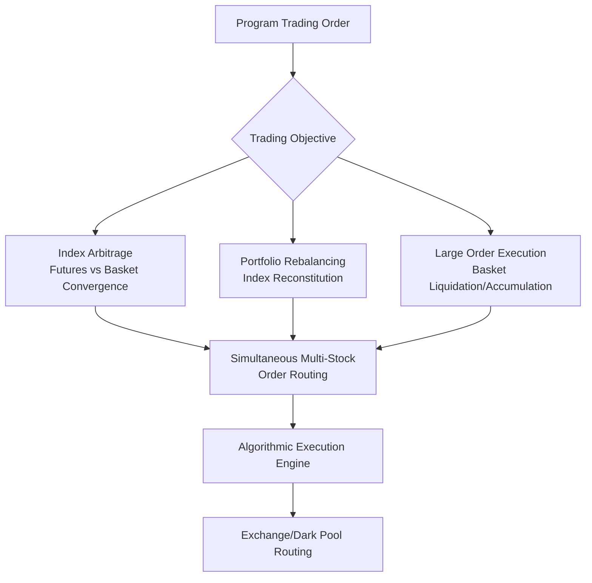

## Equity Index Futures and Program Trading

### Equity Index Futures: Overview

Equity index futures are standardized, exchange-traded contracts obligating the buyer/seller to exchange cash based on the value of an underlying equity index at a specified future date, providing efficient, capital-light exposure to broad market movements.

**Key Points**

- Cash-settled against the index value at expiration (no physical delivery of underlying stocks)
- Traded on regulated futures exchanges (CME for S&P 500/Nasdaq/Russell products, Eurex for Euro Stoxx, ICE for various regional indices)
- Highly liquid, especially in E-mini and Micro E-mini variants, enabling precise position sizing
- Primary uses: hedging, speculation, and index arbitrage/program trading

### Major Contract Specifications

| Contract | Index | Multiplier | Exchange |
| --- | --- | --- | --- |
| E-mini S&P 500 | S&P 500 | $50 × index | CME |
| Micro E-mini S&P 500 | S&P 500 | $5 × index | CME |
| E-mini Nasdaq-100 | Nasdaq-100 | $20 × index | CME |
| E-mini Russell 2000 | Russell 2000 | $50 × index | CME |
| Euro Stoxx 50 Futures | Euro Stoxx 50 | €10 × index | Eurex |

[Unverified] Exact contract specifications (multipliers, tick sizes, trading hours) are subject to periodic exchange revisions; current specifications should be verified against the relevant exchange's official contract specs before trading or valuation use.

### Futures Pricing: Cost-of-Carry Model

Equity index futures are priced using the cost-of-carry relationship, reflecting the theoretical no-arbitrage fair value:

$$F_0 = S_0 e^{(r - q)T}$$

where:

- $S_0$: current index spot level
- $r$: risk-free financing rate
- $q$: dividend yield of the index
- $T$: time to expiration

**Key Points**

- When $r > q$ (financing cost exceeds dividend yield), futures trade at a premium to spot ("contango")
- When $q > r$ (dividend yield exceeds financing cost), futures trade at a discount to spot ("backwardation") — historically common in low-rate environments with elevated dividend yields
- The theoretical basis ($F_0 - S_0$) converges to zero at expiration, forming the foundation of index arbitrage strategies

### Index Arbitrage

Index arbitrage exploits temporary deviations between the actual futures price and its theoretical fair value by simultaneously trading the futures contract against the underlying basket of stocks (or a proxy like an ETF).

**Mechanics:**

- **Cash-and-carry (futures overpriced):** Sell futures, buy the underlying basket, financed at the risk-free rate, capturing the mispricing as the basis converges by expiration
- **Reverse cash-and-carry (futures underpriced):** Buy futures, short the underlying basket, capturing the mispricing on convergence

**Example**

If SPX spot is 5,000, risk-free rate is 5%, dividend yield is 1.5%, and time to expiration is 0.25 years:

$$F_{theoretical} = 5000 \times e^{(0.05 - 0.015) \times 0.25} = 5000 \times e^{0.00875} \approx 5043.9$$

If the actual futures price trades at 5,055 (above fair value), an arbitrageur would sell the futures and buy the underlying basket, locking in the ~11-point mispricing (before transaction costs).

### Program Trading: Definition and Mechanics

Program trading refers to the simultaneous execution of a basket of securities (often 15+ stocks with a specified aggregate value) via automated systems, most commonly to execute index arbitrage, portfolio rebalancing, or large institutional order flow efficiently.

**Key Points**

- NYSE and other exchanges historically defined program trading with specific thresholds (e.g., baskets of 15+ stocks valued over $1 million), a classification originating from post-1987 "Black Monday" market structure reforms
- Modern program trading is executed almost entirely via algorithmic systems rather than manual basket orders
- Circuit breakers and trading curbs (e.g., NYSE Rule 80B-style market-wide circuit breakers) were introduced partly in response to concerns about program trading exacerbating market volatility during the 1987 crash

[Inference] The role of program trading in the 1987 crash remains debated among academics and practitioners — portfolio insurance strategies (which relied on programmatic futures selling to hedge equity portfolios) are widely cited as a contributing factor to the severity of the decline, but the precise causal weight relative to other factors is not something on which there is complete consensus.

### Portfolio Insurance and Historical Context

- **Portfolio insurance:** A 1980s-era strategy using dynamic futures selling (synthetic put replication) to hedge portfolio downside, requiring systematic selling as markets declined
- This created a feedback loop during the October 1987 crash: falling prices triggered more programmatic futures selling, which pressured prices further
- Modern equivalents (systematic vol-targeting strategies, risk parity funds) exhibit analogous mechanical de-leveraging behavior during drawdowns, prompting ongoing regulatory attention to potential pro-cyclical feedback loops

### Uses of Equity Index Futures

#### Hedging

- Portfolio managers use index futures to hedge broad market (beta) exposure without liquidating individual stock positions, preserving tax efficiency and avoiding transaction costs on the underlying basket
- Overlay hedging: applying a futures hedge on top of an existing portfolio to temporarily adjust net market exposure

#### Speculation

- Provides leveraged, capital-efficient directional exposure to broad market moves
- Futures require only initial margin (a fraction of notional), amplifying capital efficiency versus buying the underlying basket directly

#### Cash Equitization

- Asset managers use index futures to maintain full market exposure on uninvested cash balances (e.g., pending subscriptions/redemptions), avoiding "cash drag" on portfolio performance

#### Index Fund Rebalancing

- Passive index funds use futures to manage exposure during rebalancing windows and to bridge timing gaps between trade execution and settlement

### Roll Mechanics and Futures Curve

Since index futures have fixed expirations (typically quarterly: March, June, September, December), positions intended to be maintained beyond expiration must be "rolled" into the next contract.

**Key Points**

- **Roll yield:** The gain or loss incurred when rolling from an expiring contract into the next, driven by the difference between the two contracts' prices (reflecting the term structure of the cost-of-carry)
- Large-scale rolling activity by index funds and systematic strategies clusters around standardized roll dates/windows, creating observable trading volume and liquidity patterns

### Relationship to Equity Options and Volatility Markets

- Index futures serve as the primary delta-hedging instrument for index options market makers (more capital-efficient than trading the full underlying basket)
- The futures market's liquidity and depth directly affect the bid-ask spreads achievable in the associated options market
- Basis risk between the futures-implied forward and the options' own dividend/financing assumptions is a recurring source of small but persistent pricing discrepancies that sophisticated desks monitor closely

### Regulatory and Market Structure Considerations

- Equity index futures fall under CFTC jurisdiction in the U.S. (distinct from SEC-regulated cash equities and options), creating a bifurcated regulatory structure for closely related instruments
- Market-wide circuit breakers (triggered by S&P 500 declines of 7%, 13%, and 20% from prior close) apply across both cash equity and futures markets in a coordinated fashion following post-1987 and subsequent reforms
- Position limits and large trader reporting requirements apply to prevent excessive speculative concentration

**Related Topics**

- Cost-of-Carry Model and Futures Fair Value Calculation
- 1987 Market Crash and Portfolio Insurance Mechanics
- Circuit Breakers and Market-Wide Trading Halts
- Cash Equitization Strategies for Institutional Portfolios
- Index Reconstitution and Rebalancing Flow Effects
- Basis Trading and Futures Roll Yield Analysis