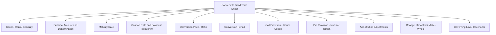

## Convertible Bond Structure and Terms

### Overview

A convertible bond is a hybrid security combining a straight (vanilla) corporate bond with an embedded equity call option, giving the holder the right to convert the bond into a predetermined number of the issuer's common shares. The instrument can be decomposed as:

$$V_{CB} = V_{bond} + V_{option}$$

where $V_{bond}$ is the value of the straight debt component (coupon and principal cash flows discounted at a credit-adjusted rate) and $V_{option}$ is the value of the embedded call option on the issuer's stock. This decomposition is a standard analytical convention rather than a precise legal split, since the two components interact (credit risk affects the discount rate applied to the residual bond floor, and conversion reduces outstanding debt).

### Core Structural Terms

**Face Value / Par Value**

The principal amount repaid at maturity if not converted, typically $1,000 per bond in the US market or standardized round-lot denominations elsewhere.

**Conversion Ratio**

The number of common shares received per bond upon conversion:

$$\text{Conversion Ratio} = \frac{\text{Par Value}}{\text{Conversion Price}}$$

**Conversion Price**

The effective price per share paid by the investor upon conversion, set at issuance at a premium to the prevailing stock price (typically 20%-40% for standard convertibles).

$$\text{Conversion Premium} = \frac{\text{Conversion Price} - \text{Stock Price}_{0}}{\text{Stock Price}_{0}}$$

**Coupon Rate**

The stated interest rate paid to bondholders, generally lower than an equivalent straight bond because the equity option has value the investor implicitly pays for via a reduced yield. Coupons may be fixed, and some structures carry zero coupon with the option value embedded entirely in a discounted issue price (see Zero-Coupon Convertibles / LYONs below).

**Maturity**

Stated final redemption date, commonly 5-10 years for standard corporate issuance, though structures range widely.

**Conversion Period**

The window during which conversion rights may be exercised — often the full life of the bond, but sometimes restricted (e.g., callable only after a lockout period, or convertible only after a specified date).

### Embedded Option Features

**Call Provision (Issuer Call)**

Allows the issuer to redeem the bond prior to maturity, typically once the stock price has risen well above the conversion price (a common trigger is 130%-150% of conversion price sustained over a measurement period). This forces conversion ("soft call") or redemption, capping the investor's upside and allowing the issuer to refinance cheaply once the option is deep in-the-money.

**Put Provision (Investor Put)**

Grants the holder the right to sell the bond back to the issuer at specified dates prior to maturity, at par or a predetermined price, providing downside protection and effectively shortening duration risk.

**Contingent Conversion (CoCo Threshold — corporate context)**

[Note: "CoCo" in corporate convertibles denotes a *contingent conversion feature*, distinct from bank regulatory-capital Contingent Convertible bonds discussed in a separate chapter item.] Some convertibles only become convertible if the stock trades above a threshold (e.g., 130% of conversion price) for a set number of trading days within a measurement period, or if the bond's trading price falls below a threshold relative to conversion value. This was historically used to defer accounting dilution under US GAAP treatment.

**Anti-Dilution / Conversion Price Adjustment Clauses**

Protect the conversion ratio against dilutive corporate actions: stock splits, stock dividends, rights offerings, spin-offs, and extraordinary dividends. Adjustment mechanics are typically formulaic:

$$\text{New Conversion Price} = \text{Old Conversion Price} \times \frac{\text{Shares Outstanding}_{pre}}{\text{Shares Outstanding}_{post}}$$

**Make-Whole / Change-of-Control Provisions**

Upon a change-of-control event (acquisition, merger), holders may receive an increased conversion ratio ("make-whole premium") to compensate for the lost option time value, following a make-whole table specified in the indenture.

### Key Valuation Components

**Investment Value (Bond Floor)**

The value of the security as a straight bond, ignoring the conversion option, discounted at a rate reflecting the issuer's credit risk:

$$B = \sum_{t=1}^{n}\frac{C}{(1+r)^t} + \frac{F}{(1+r)^n}$$

where $C$ is the periodic coupon, $F$ is face value, and $r$ is the credit-adjusted discount rate.

**Conversion Value (Parity)**

The value if converted immediately at the current stock price:

$$\text{Conversion Value} = \text{Stock Price} \times \text{Conversion Ratio}$$

**Investment Premium**

$$\text{Investment Premium} = \frac{\text{Market Price} - \text{Bond Floor}}{\text{Bond Floor}}$$

**Conversion Premium (Market)**

$$\text{Conversion Premium}_{mkt} = \frac{\text{Market Price} - \text{Conversion Value}}{\text{Conversion Value}}$$

The bond trades at the greater of its bond floor and conversion value, plus an option premium reflecting time value — this produces the characteristic convex payoff diagram.

### Payoff Diagram (svg_diagram)

<svg xmlns="http://www.w3.org/2000/svg" viewBox="0 0 640 380">
<rect width="640" height="380" fill="#ffffff" />
<text x="320" y="24" font-family="sans-serif" font-size="15" font-weight="bold" text-anchor="middle" fill="#1a1a1a">Convertible Bond Value vs. Stock Price (svg_diagram)</text>

<line x1="70" y1="320" x2="600" y2="320" stroke="#333" stroke-width="1.5" />
<line x1="70" y1="320" x2="70" y2="40" stroke="#333" stroke-width="1.5" />
<text x="335" y="355" font-family="sans-serif" font-size="12" text-anchor="middle" fill="#333">Stock Price</text>
<text x="30" y="180" font-family="sans-serif" font-size="12" text-anchor="middle" fill="#333" transform="rotate(-90 30 180)">Convertible Bond Value</text>

<line x1="70" y1="280" x2="600" y2="280" stroke="#8888aa" stroke-width="2" stroke-dasharray="6,4" />
<text x="440" y="272" font-family="sans-serif" font-size="12" fill="#5555aa">Bond Floor (Investment Value)</text>

<line x1="70" y1="320" x2="600" y2="80" stroke="#aa5555" stroke-width="2" stroke-dasharray="3,3" />
<text x="470" y="105" font-family="sans-serif" font-size="12" fill="#aa5555">Conversion Value (Parity)</text>

<path d="M 70,280 C 200,281 280,270 340,235 C 420,190 500,140 600,85" fill="none" stroke="#228833" stroke-width="3" />
<text x="180" y="255" font-family="sans-serif" font-size="12" fill="#228833" font-weight="bold">Convertible Bond Value</text>

<text x="110" y="310" font-family="sans-serif" font-size="11" fill="#666">Bond-like</text>

<text x="280" y="200" font-family="sans-serif" font-size="11" fill="#666">Hybrid / Balanced</text>

<text x="470" y="70" font-family="sans-serif" font-size="11" fill="#666">Equity-like</text>

</svg>

The curve is bond-floor-supported at low stock prices, tracks parity at high stock prices, and exhibits maximum convexity (option value) in the intermediate "balanced" range — this is the region typically targeted by convertible arbitrage strategies.

### Common Structural Variants

**Vanilla Convertible**

Standard cash-pay coupon, fixed conversion ratio, optional call/put features as described above.

**Zero-Coupon Convertible (LYON — Liquid Yield Option Note)**

Issued at a deep discount to par with no periodic coupon; accretion to par provides the bondholder's return absent conversion. Often paired with investor put rights at multiple dates.

**Mandatory Convertible**

Automatically converts to equity at maturity (or a specified date) — the investor bears more equity-like risk from inception; typically structured with a collar (minimum and maximum conversion ratio) that resembles a combination of a forward and a written call spread. Common in bank/utility equity-linked capital raises.

**Exchangeable Bond**

Convertible into shares of a company *other than* the issuer (commonly a subsidiary or a strategic equity stake the issuer holds), rather than the issuer's own stock.

**Synthetic / Structured Convertible (Asset Swap)**

The bond and embedded option are separated via an asset swap: a dealer strips the option and sells the bond floor to a fixed-income investor and the option to an equity/volatility investor, common in convertible arbitrage desk activity.

### Term Sheet Anatomy (Illustrative)

### Issuer and Investor Rationale

**Issuer Perspective**

- Lower coupon than straight debt, reducing near-term cash interest cost
- Delayed (contingent) equity dilution versus an immediate equity offering
- Attractive to companies with volatile or growth-oriented equity, where option value subsidizes the coupon

**Investor Perspective**

- Asymmetric payoff: downside cushioned by the bond floor, upside participation in equity appreciation
- Useful building block for convertible arbitrage (long convertible, short delta-hedged equity, harvesting volatility and credit spread)
- Income generation relative to holding equity outright, at the cost of capped/deferred upside relative to common stock

### Risk Factors

- **Credit Risk**: Bond floor depends on issuer creditworthiness; deterioration can lower the floor and increase yield.
- **Interest Rate Risk**: Bond floor component has standard fixed-income duration exposure.
- **Dilution Risk**: Conversion increases share count, diluting existing shareholders — relevant to EPS impact analysis (if-converted method under diluted EPS accounting).
- **Call Risk**: Issuer call provisions can truncate investor upside.
- **Liquidity Risk**: Convertible bond markets, especially for smaller issuers, can be less liquid than either the underlying equity or comparable straight debt.
- Behavioral outcomes described above (e.g., call timing, conversion behavior) reflect standard contractual mechanics; actual issuer/investor behavior may vary based on market conditions and idiosyncratic corporate decisions. [Inference where tied to real-world timing decisions]

### **Related Topics**

- Convertible Bond Valuation Models (Binomial Trees, Black-Scholes Adjusted, Credit-Adjusted Models)
- Convertible Arbitrage Strategy Mechanics (Delta Hedging, Gamma Trading, Credit Spread Capture)
- Mandatory Convertibles and Equity Units
- Contingent Convertible Capital Instruments (Bank Regulatory CoCos / AT1)
- Warrants: Structure and Valuation vs. Embedded Convertible Options
- Asset Swaps and Convertible Bond Stripping
- If-Converted Method and Diluted EPS Accounting Treatment