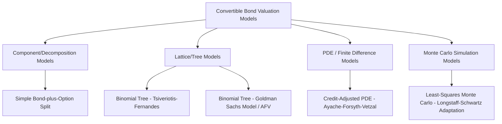

## Convertible Bond Valuation Models

### Overview

Convertible bond valuation requires jointly modeling an interest-rate-sensitive, credit-sensitive fixed income instrument and an equity-linked option whose exercise decision (conversion) interacts with issuer-controlled decisions (call) and investor-controlled decisions (put, conversion timing). No closed-form Black-Scholes-style formula fully captures this path dependency and multi-party optionality, so practitioners rely primarily on lattice/tree methods and credit-adjusted PDE frameworks, with simpler decomposition approaches used for approximate or intuition-building analysis.

### Valuation Approaches: Taxonomy

### 1. Component / Decomposition Approach

The simplest conceptual model treats the convertible as a straight bond plus a call option on the stock:

$$V_{CB} \approx B_{straight} + C_{BS}(\text{Stock}, K=\text{Conversion Price}, T, \sigma, r)$$

where $C_{BS}$ is a Black-Scholes call value and $B_{straight}$ is the discounted cash-flow value of the bond component at a credit-adjusted yield.

**Limitations**

- Ignores the interaction between credit risk and the option value — as credit spreads widen, the bond component should discount at a higher rate, but the equity option is typically treated as risk-neutral under a risk-free-adjacent rate, creating an internal inconsistency in the discount rate applied to each piece.
- Cannot handle embedded call/put features, contingent conversion triggers, or path-dependent exercise decisions.
- Treats conversion as a European-style terminal decision rather than allowing early conversion incentives (e.g., ahead of a dividend, or forced conversion via issuer call).

This method is generally used only as a first-pass sanity check, not for pricing or hedging in practice. [Inference — practitioner usage conventions may vary by desk]

### 2. Binomial Lattice Models

The dominant practical approach builds a binomial (or trinomial) tree of the underlying stock price, then works backward through the tree applying the convertible's contractual optionality (conversion, call, put) at each node, discounting cash flows appropriately.

**Stock Price Tree Construction (Cox-Ross-Rubinstein style)**

$$u = e^{\sigma\sqrt{\Delta t}}, \quad d = \frac{1}{u}, \quad p = \frac{e^{r\Delta t}-d}{u-d}$$

where $\sigma$ is stock volatility, $\Delta t$ is the time step, $r$ is the risk-free rate, and $p$ is the risk-neutral up-probability.

**Backward Induction with Embedded Options**

At each node, the model computes:

$$V_{node} = \max\big(\text{Conversion Value},\ \min(\text{Call Price}, \text{Continuation Value}),\ \text{Put Price}\big)$$

where Continuation Value is the discounted expected value of the node's successors, adjusted for any coupon paid at that step. The nested max/min structure encodes: the investor will convert if conversion value dominates; the issuer will call if the continuation value exceeds the call trigger (forcing the investor to either convert or accept the call price, whichever is greater to the investor up to the call price); the investor will put if contractually permitted and advantageous.

**Key Challenge: Discount Rate Selection**

The central modeling problem in lattice convertible pricing is *which discount rate to apply at each node*, since the convertible's payoff is state-dependent: in equity-like states (deep in-the-money conversion), the security behaves like equity and cash flows should arguably be discounted near the risk-free rate; in bond-like states (conversion far out-of-the-money), it behaves like credit-risky debt and should be discounted at a credit-adjusted rate. Two influential frameworks address this:

**Tsiveriotis-Fernandes (1998) Model**

Splits the convertible's value at each node into a "cash-only" (COCB) component, discounted at the credit-risky rate $r + s$ (risk-free plus credit spread), and an "equity" component, discounted at the risk-free rate $r$:

$$V = V_{equity} + V_{COCB}$$

At each node, if conversion is optimal, the full value flows into the equity component (discounted at $r$); if not, the coupon and principal-like cash flows are attributed to the COCB component (discounted at $r+s$). This is the most widely cited lattice framework in academic and practitioner literature.

**Limitations of Tsiveriotis-Fernandes**

- The COCB/equity split at each node can be somewhat arbitrary during backward induction, particularly around the call/put/conversion decision boundary. [Inference — degree of arbitrariness is a matter of some debate in the literature]
- Does not fully model true default risk (no explicit recovery-on-default mechanism); the credit spread is used as a discounting adjustment rather than a modeled jump-to-default process.

**Goldman Sachs Model / Ayache-Forsyth-Vetzal (AFV) Framework**

An alternative that explicitly models default as a jump process: the stock price can jump to zero with hazard rate $\lambda$ (often linked to the credit spread via $\lambda \approx s/(1-R)$, where $R$ is recovery rate), and upon default the bondholder recovers a fraction of face value or conversion value depending on seniority and whether conversion already occurred. This approach avoids the ad hoc component-splitting of Tsiveriotis-Fernandes by applying a single, consistently risk-adjusted discount rate throughout, since default risk is captured structurally via the jump-to-default mechanism rather than through a blended discount rate.

$$dS = (r - q + \lambda)S\,dt + \sigma S\,dW + \text{(jump-to-default term)}$$

where $q$ is the dividend yield. This framework, developed further by Ayache, Forsyth, and Vetzal (2003), is generally regarded as more theoretically consistent and is common in modern desk-level pricing engines. [Inference — relative adoption across institutions is not something that can be verified generically]

### 3. PDE / Finite Difference Methods

The AFV framework is more commonly implemented via a partial differential equation solved with finite difference methods rather than a discrete tree, allowing finer control over grid spacing, free-boundary (early exercise) handling, and default-jump terms:

$$\frac{\partial V}{\partial t} + \frac{1}{2}\sigma^2 S^2 \frac{\partial^2 V}{\partial S^2} + (r - q + \lambda)S\frac{\partial V}{\partial S} - (r+\lambda)V + \lambda(1-R)F \cdot \mathbb{1}_{\text{default payoff}} = 0$$

subject to the free-boundary conditions imposed by conversion, call, and put rights at each time step (analogous to American option PDE treatment). This is solved backward from maturity using implicit or Crank-Nicolson finite-difference schemes, with the early-exercise constraints applied via a projection/penalty method at each time step.

### 4. Monte Carlo Simulation Methods

Because issuer call decisions are themselves path-dependent (e.g., soft-call triggers requiring the stock to trade above a threshold for N of the last M trading days) and can interact with investor conversion decisions, some convertibles — especially those with complex contingent conversion/soft-call triggers — are better handled with simulation-based approaches, typically a **Least-Squares Monte Carlo (LSM)** method adapted from Longstaff-Schwartz (originally developed for American option pricing).

**LSM Mechanic**

1. Simulate many stock price paths forward under the risk-neutral measure (incorporating a default/jump process consistent with the credit spread).
2. Work backward along each path; at each decision date, regress the continuation value against basis functions of the current state (stock price, accumulated trigger-day count, etc.).
3. Use the regression-estimated continuation value to determine the optimal exercise decision (convert, hold, or issuer call if issuer-side logic is separately modeled) at each node/date.

**Trade-off**: Handles complex path-dependent triggers naturally but is computationally heavier and, because it is fundamentally suited to purely investor-side optimal-stopping problems, requires care in modeling the issuer's call decision (which is typically modeled as a fixed rule rather than an optimized adversarial decision, or via an outer iteration/nested simulation). [Inference — implementation practice varies by desk and by which party's optionality dominates the specific security]

### Model Comparison Summary

| Approach | Handles Call/Put | Handles Credit Risk | Path Dependency | Computational Cost |
| --- | --- | --- | --- | --- |
| Component/Decomposition | No | Crude (rate blend) | No | Very Low |
| Tsiveriotis-Fernandes Tree | Yes | Discounting adjustment | Limited | Low-Moderate |
| AFV Jump-Diffusion PDE | Yes | Structural (jump-to-default) | Limited | Moderate |
| Least-Squares Monte Carlo | Yes (approx.) | Structural (jump-to-default) | Yes | High |

### Key Sensitivities (Greeks) Derived from These Models

- **Delta** ($\partial V/\partial S$): equity price sensitivity, central to convertible arbitrage delta-hedging
- **Gamma** ($\partial^2 V/\partial S^2$): convexity, the primary source of arbitrage P&L in a delta-hedged position
- **Vega** ($\partial V/\partial \sigma$): sensitivity to implied volatility of the underlying
- **Rho / Credit Delta**: sensitivity to risk-free rates and to the issuer's credit spread respectively — critical because credit spread risk is often hedged separately (e.g., via CDS) from equity risk

### Practical Calibration Inputs

- **Underlying stock volatility**: often blended between historical and implied volatility from listed equity options where available
- **Credit spread**: derived from the issuer's CDS curve, comparable bond spreads, or an internally modeled synthetic spread when the issuer has no liquid straight debt
- **Dividend yield / borrow cost**: affects the equity process drift and is particularly relevant for convertible arbitrage funding cost calculations
- **Recovery rate assumption**: standard market convention (e.g., 40%) or issuer/seniority-specific estimates, feeding the jump-to-default magnitude in AFV-style models

### **Related Topics**

- Convertible Bond Structure and Terms
- Convertible Arbitrage Strategy Mechanics (Delta Hedging, Gamma Trading, Credit Spread Capture)
- Credit Default Swap Curve Construction and Hazard Rate Modeling
- American Option Pricing via Binomial Trees and Finite Difference Methods
- Longstaff-Schwartz Least-Squares Monte Carlo for American-Style Derivatives
- Volatility Surface Construction and Implied vs. Historical Volatility
- Contingent Convertible Capital Instruments (Bank Regulatory CoCos / AT1)