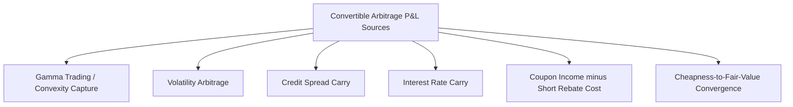

## Convertible Arbitrage Strategies

### Overview

Convertible arbitrage is a strategy that seeks to profit from pricing inefficiencies between a convertible bond and its underlying equity by holding the convertible while hedging out one or more of its risk factors — most commonly equity risk via a short stock position — to isolate and harvest the residual sources of value: option convexity (gamma), volatility mispricing, credit spread, and financing/carry dynamics. The strategy is a classic relative-value approach, exploiting the fact that convertibles frequently trade cheap relative to a fair-value model, particularly for smaller or less liquid issuers where a captive buyer base (convertible-focused fixed income funds) constrains price discovery.

### Core Position Structure

**Standard Delta-Neutral Setup**

1. Long the convertible bond
2. Short $\Delta \times \text{Conversion Ratio}$ shares of the underlying stock, where $\Delta = \partial V_{CB}/\partial S$ is the convertible's equity delta from a pricing model

$$\text{Shares Shorted} = \Delta \times \text{Conversion Ratio} \times \text{Number of Bonds}$$

This neutralizes first-order exposure to small moves in the stock price, leaving the position exposed primarily to the second-order (convexity) effect, volatility, credit, and interest rate factors.

### Sources of Return (P&L Decomposition)

**1. Gamma Trading (Convexity Capture)**

Because the convertible has positive gamma (its delta increases as the stock rises and decreases as it falls), a delta-neutral position profits from realized volatility through periodic rehedging: as the stock rises, delta increases, requiring the trader to sell additional shares short at the higher price; as the stock falls, delta decreases, requiring the trader to buy back shares at the lower price. This "sell high, buy low" rebalancing captures value proportional to realized variance:

$$\text{Gamma P\&L} \approx \frac{1}{2}\Gamma S^2 \left(\sigma_{realized}^2 - \sigma_{implied}^2\right)\Delta t \quad \text{(per rehedging interval, summed over the position's life)}$$

This is the classic long-gamma/long-volatility harvesting mechanic shared with any long-option delta-hedged position.

**2. Volatility Arbitrage**

If the convertible's embedded option is priced (implied volatility backed out from the convertible's market price) below the trader's estimate of the stock's true or listed-option-implied volatility, the position is structurally long cheap volatility. The trader profits if realized volatility, or the volatility used to mark the position, exceeds the volatility embedded in the convertible's purchase price.

**3. Credit Spread Carry and Credit Hedging**

The bond-floor component carries credit spread exposure. Managers may:

- Leave credit risk unhedged and collect spread carry as part of expected return (accepting issuer default/downgrade risk)
- Hedge credit risk explicitly via CDS on the issuer (when a liquid CDS market exists), isolating the trade closer to a pure volatility/gamma play
- Use asset-swap structures (see below) to strip and separately manage the credit component

**4. Interest Rate Carry**

The bond component has standard fixed-income duration exposure; some funds hedge rate risk via interest rate swaps or futures, particularly for longer-duration, low-coupon, or zero-coupon convertible positions.

**5. Financing / Carry Mechanics**

The position typically involves:

- Coupon income received on the long convertible bond
- Short rebate income (or cost) on the short stock position — the trader earns interest on short-sale proceeds (rebate), net of the stock's borrow fee, which can be significant or even negative for hard-to-borrow names
- Financing cost of the long bond position if leveraged (repo or margin financing)

$$\text{Net Carry} = \text{Bond Coupon} + \text{Short Rebate} - \text{Borrow Fee} - \text{Financing Cost}$$

**6. Cheapness Convergence**

Many convertibles are issued or subsequently trade at a discount to theoretical fair value (a "cheap" convertible), often due to structural factors: complexity discourages generalist buyers, credit risk is unfamiliar to pure equity investors, and issuance terms are calibrated to be attractive enough to clear the primary market. A manager identifying a convertible trading meaningfully below model fair value may capture value as the market price converges toward fair value over the holding period, independent of realized volatility.

### Dynamic Delta Hedging Mechanics

The hedge ratio must be continuously adjusted as the stock price moves and as time passes (delta decay/theta effects near conversion price and near maturity). Key operational considerations:

- **Rehedging frequency**: More frequent rehedging captures gamma P&L more precisely but incurs higher transaction costs and bid-ask spread erosion; less frequent rehedging leaves residual delta exposure between rebalances
- **Delta near key trigger levels**: Delta accelerates (gamma rises) near the conversion price and can become highly nonlinear near soft-call trigger zones or contingent-conversion thresholds, requiring more active hedge management
- **Borrow availability**: The strategy depends on being able to borrow the underlying stock to sell short; hard-to-borrow or restricted-availability names can constrain position sizing or increase carry costs substantially

### Related Structural Variants Used in the Strategy

**Asset Swap / Convertible Bond Stripping**

A dealer or fund can strip the convertible into its component parts via an asset swap: the credit-risky bond cash flows are swapped away to a fixed-income counterparty (who receives a floating-rate-equivalent return reflecting the issuer's credit spread), leaving the arbitrageur holding essentially the embedded equity option plus a credit-linked residual, cleanly isolating the volatility trade from the credit and rate components.

**Credit Default Swap Overlay**

Buying CDS protection on the issuer alongside the long convertible position hedges default/credit-deterioration risk directly, converting the trade into a more purely volatility-and-gamma-driven position (basis risk between the CDS and the bond's actual credit sensitivity remains).

### Risk Factors Specific to the Strategy

- **Negative Gamma Regime Shifts**: Certain provisions (e.g., approaching a hard call date, or the stock trading deep in-the-money such that the convertible behaves almost purely as equity) can compress convexity, reducing the gamma-trading opportunity set
- **Credit Event Risk**: An issuer credit deterioration or default can cause simultaneous losses on the bond floor and a spike in implied volatility that does not necessarily translate to favorable realized-vol capture, especially if the position was not credit-hedged
- **Liquidity and Redemption Mismatch**: Convertible bonds, particularly of smaller issuers, can be significantly less liquid than the equity hedge, creating unwind risk during market stress (a dynamic widely observed during the 2008 financial crisis, when forced convertible arbitrage fund deleveraging led to a sharp widening of convertible cheapness)
- **Model Risk**: Because fair value depends on a chosen pricing model (Tsiveriotis-Fernandes vs. AFV jump-diffusion, volatility surface assumptions, credit spread curve construction), P&L attribution and position sizing carry meaningful model-dependency
- **Borrow Cost / Squeeze Risk**: A sudden reduction in stock borrow availability or a spike in borrow fees can erode or reverse the carry component of the trade

### Illustrative Simplified P&L Attribution Table

| Component | Typical Sign (Long CB, Short Stock) | Primary Driver |
| --- | --- | --- |
| Gamma Trading | Positive (if realized vol > hedging assumption) | Stock price path / realized volatility |
| Volatility Mark | Variable | Change in market-implied vol of the CB |
| Credit Carry | Positive (if unhedged and no default) | Credit spread level and issuer stability |
| Financing/Rebate | Variable | Short rebate less borrow fee, less financing cost |
| Cheapness Convergence | Positive (if bought cheap) | Market re-rating toward fair value |

Realized outcomes for any specific position depend on issuer-specific and market-specific conditions and are not guaranteed by the structural mechanics described above.

### **Related Topics**

- Convertible Bond Valuation Models (Binomial Trees, AFV Jump-Diffusion, Monte Carlo)
- Convertible Bond Structure and Terms
- Delta Hedging and Dynamic Option Replication
- Credit Default Swaps: Mechanics and Spread Curve Construction
- Gamma Scalping and Realized vs. Implied Volatility Trading
- Asset Swaps: Structure and Use in Fixed Income Relative Value
- Historical Case Study: 2008 Convertible Arbitrage Deleveraging