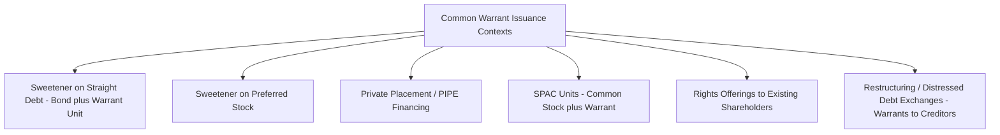

## Warrants and Their Valuation

### Overview

A warrant is a security issued by a company giving the holder the right, but not the obligation, to purchase a specified number of the company's shares at a predetermined exercise (strike) price before a specified expiration date. Structurally similar to a call option, warrants differ in a critical economic respect: exercise results in the **issuance of new shares** by the company rather than delivery of existing shares, meaning exercise is dilutive and directly increases the company's share count and cash balance (by the exercise proceeds), distinguishing warrant valuation from standard listed equity option valuation.

### Warrants vs. Listed Call Options: Key Distinctions

| Feature | Warrant | Listed Call Option |
| --- | --- | --- |
| Issuer | The company itself | Exchange-cleared, written by any market participant |
| Shares on exercise | Newly issued (dilutive) | Existing shares delivered |
| Typical maturity | Longer-dated (1-10+ years) | Shorter-dated (days to ~2-3 years for LEAPS) |
| Impact on share count | Increases shares outstanding | No effect on shares outstanding |
| Valuation adjustment needed | Dilution adjustment required | None |
| Common issuance context | Attached to bonds, private placements, SPAC units, restructuring | Standalone exchange product |

### Structural Terms

**Exercise (Strike) Price**

The fixed price at which the holder may purchase new shares, which may be fixed or, in some structures, subject to step-up schedules or anti-dilution adjustment.

**Exercise Ratio**

Number of shares receivable per warrant (often 1:1, but can vary).

**Expiration Date**

Warrants are typically longer-dated than exchange-listed options, often several years to over a decade, particularly when issued as a "sweetener" attached to debt or preferred stock issuance.

**Exercise Style**

May be American (exercisable any time up to expiration) or European (exercisable only at expiration), specified in the warrant agreement.

**Detachability**

Warrants issued alongside bonds or preferred stock may be either:

- **Attached/non-detachable**: cannot be traded separately from the host security
- **Detachable**: can be stripped and traded independently, creating two separate securities (a straight bond and a standalone warrant)

**Cashless Exercise Provisions**

Many warrant agreements permit "cashless" or "net" exercise, where the holder receives shares net of the exercise cost (calculated via a formula based on the then-current stock price) rather than paying cash — economically equivalent to the holder exercising and immediately selling enough shares to cover the strike cost.

### Common Issuance Contexts

**Bond-plus-Warrant Units**

Structurally similar in economic intent to a convertible bond — lowering the coupon needed to place the debt by attaching equity upside — but legally distinct: the bond and warrant are separate instruments. If detachable, the bond continues trading as straight debt after exercise (unlike a convertible, where conversion extinguishes the bond).

**SPAC Warrants**

A prominent modern use case: special purpose acquisition companies commonly issue units consisting of one common share plus a fraction of a warrant, with the warrants becoming a significant driver of SPAC-related equity dilution and a distinct traded security once detached, subject to their own redemption and adjustment terms specified in the warrant agreement.

### The Dilution Problem in Warrant Valuation

Applying a standard Black-Scholes call formula directly to a warrant overstates its value, because Black-Scholes assumes the option's exercise has no effect on the number of shares outstanding or the underlying share price. Warrant exercise increases share count, which (holding firm value constant) dilutes the per-share value of both existing and newly issued shares. The standard adjustment:

$$W = \frac{n}{n+m} \times C_{BS}(S, K, T, \sigma, r, q)$$

where:

- $n$ = existing shares outstanding
- $m$ = number of new shares issuable upon full warrant exercise
- $C_{BS}$ = standard Black-Scholes call value computed using the *current* (pre-dilution) stock price as input
- $\frac{n}{n+m}$ = the dilution adjustment factor

**Intuition**: Upon exercise, the exercise proceeds ($m \times K$) flow into the company, increasing firm equity value by that amount, but the resulting equity value is now spread across $n+m$ shares instead of $n$. The dilution factor approximates the proportional reduction in per-share option value from this share-count expansion.

### More Rigorous Dilution-Adjusted Model (Galai-Schneller Framework)

A more theoretically grounded approach explicitly models the firm's total equity value $E$ (rather than treating the stock price $S$ as exogenous) and solves for warrant value as a function of the change in total firm equity:

$$V_{firm,equity} = S \times n \quad \text{(pre-exercise)}$$

Upon exercise, new firm equity value becomes $S \times n + m \times K$, distributed over $n + m$ shares, giving a post-exercise theoretical share price:

$$S' = \frac{Sn + mK}{n+m}$$

The warrant is then valued as a call option on this adjusted, diluted terminal share price, requiring either:

1. An iterative/adjusted-volatility approach: scale the input volatility to reflect that the volatility of total firm equity value (not just the pre-existing shares) is the economically relevant quantity, or
2. A direct simultaneous-equations solution recognizing that the warrant's own value is embedded in the firm's total equity value being modeled (since warrants outstanding are themselves part of the capital structure) — this is the more rigorous formulation and generally requires numerical solution rather than a closed form, since $W$ appears on both sides of the valuation.

$$E_{total} = S \times n + W \times m \quad \text{(total equity claims, pre-exercise, including warrant value)}$$

This circularity — warrant value depends on total equity value, which itself includes warrant value — is the defining technical complication of rigorous warrant valuation relative to standard listed option pricing, and is the reason the simplified dilution-factor formula above is widely used as a practical approximation despite understating this feedback effect. [Inference — the degree of approximation error depends on $m/n$ and is most material for warrant issuances that are large relative to existing share count]

### Key Valuation Inputs

- **Underlying stock price** ($S$): current market price of existing shares
- **Exercise price** ($K$): per the warrant agreement, adjusted for any anti-dilution triggers since issuance
- **Time to expiration** ($T$): warrants' longer maturities make them considerably more sensitive to long-dated volatility and dividend assumptions than short-dated listed options
- **Volatility** ($\sigma$): given long maturities, historical volatility over a comparably long lookback, or a term structure of implied volatility where available, is typically used rather than short-dated implied vol alone
- **Risk-free rate** ($r$): matched to the warrant's tenor
- **Dividend yield** ($q$): material for long-dated warrants since expected dividends over a multi-year horizon meaningfully reduce call-equivalent value
- **Dilution factor** ($n/(n+m)$): as derived above

### Sensitivities Distinct from Standard Options

- **Long-dated Vega exposure**: warrants' extended maturities make them substantially more sensitive to changes in long-term volatility assumptions than typical listed options
- **Dilution sensitivity**: value is sensitive to $m/n$, meaning large warrant issuances relative to existing float have proportionally larger per-warrant value suppression from the dilution adjustment
- **Anti-dilution adjustment sensitivity**: for warrants with adjustable strike/ratio terms (protecting against splits, extraordinary dividends, or down-round financings in some private placement structures), value depends on the probability-weighted likelihood of future adjustment triggers

### Accounting and Disclosure Considerations

Warrants classified as equity versus liability under US GAAP (ASC 815-40) or IFRS depends on specific settlement terms (fixed-for-fixed criteria, net-cash settlement provisions, and similar features); liability-classified warrants require fair value remeasurement each reporting period through earnings, which was a notable driver of restated financials for a number of SPACs following a 2021 SEC statement on warrant accounting treatment. [Unverified — specific accounting classification outcomes are fact-pattern dependent and this summary should not be relied upon for accounting determinations]

### **Related Topics**

- Convertible Bond Structure and Terms
- Convertible Bond Valuation Models (Binomial Trees, AFV Jump-Diffusion, Monte Carlo)
- Black-Scholes Option Pricing Model and Its Assumptions
- SPAC Structures and Unit Economics
- Anti-Dilution Provisions and Down-Round Protection Mechanics
- Contingent Convertible Capital Instruments (Bank Regulatory CoCos / AT1)
- Equity Dilution Accounting: If-Converted and Treasury Stock Methods