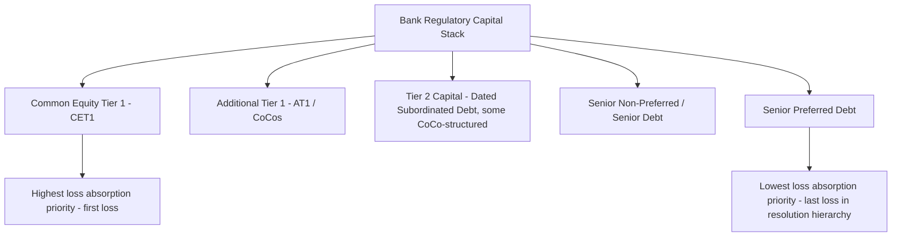

## Contingent Convertible Bonds and Loss Absorption

### Overview

Contingent Convertible bonds (CoCos) are hybrid capital instruments, issued primarily by banks and insurers, that automatically convert to equity or are written down when a pre-specified trigger event occurs — typically a decline in the issuer's regulatory capital ratio below a defined threshold. Unlike corporate convertible bonds (where conversion is an investor-favorable option exercised voluntarily) or the contingent-conversion feature on ordinary corporate convertibles (a deferred-dilution accounting mechanic), CoCos are a regulatory capital instrument specifically designed to absorb losses automatically at the point the issuer approaches financial distress, transferring loss-bearing capacity from taxpayers/depositors to CoCo investors as part of post-2008 banking regulatory reform (principally under Basel III).

### Regulatory Context and Purpose

CoCos emerged as a core component of the Basel III capital framework, designed to ensure that private investors — rather than taxpayers — absorb losses when a bank approaches non-viability, addressing the "too big to fail" bailout dynamic exposed during the 2008 financial crisis. CoCos are structured to qualify as either:

- **Additional Tier 1 (AT1) Capital**: Perpetual (no stated maturity), subordinated, with discretionary and cancellable coupons; the most common and most widely discussed CoCo category
- **Tier 2 Capital**: Dated (has a stated maturity), still loss-absorbing but generally with less stringent going-concern loss absorption features than AT1

### Core Structural Mechanics

**Trigger Mechanism**

CoCos convert or write down upon breach of a pre-defined trigger, most commonly tied to the issuer's Common Equity Tier 1 (CET1) capital ratio:

$$\text{CET1 Ratio} = \frac{\text{Common Equity Tier 1 Capital}}{\text{Risk-Weighted Assets}}$$

**High-Trigger CoCos**: Convert at a relatively high CET1 threshold (commonly around 7%), intended to provide loss absorption on a "going concern" basis — i.e., while the bank is still operating normally, before reaching severe distress.

**Low-Trigger CoCos**: Convert at a lower threshold (commonly around 5.125%, the regulatory minimum often cited in AT1 documentation), closer to a "gone concern" or point-of-non-viability event.

**Point of Non-Viability (PONV) Trigger**

In addition to (or instead of) a mechanical capital-ratio trigger, many CoCo structures include discretionary conversion/write-down at the point a regulator determines the issuer is non-viable and would require public sector support absent conversion — placing significant discretionary power with the relevant supervisory authority (e.g., the ECB/SRB in the EU, PRA in the UK) independent of the mechanical ratio test.

### Loss Absorption Mechanisms

**1. Conversion to Equity**

Upon trigger, the bond automatically converts into a predetermined number of common shares (or a number determined by a formula based on the share price at conversion), diluting existing shareholders and converting bondholders into equity holders at what is typically a distressed valuation.

**2. Principal Write-Down**

Alternatively, some CoCo structures write down the bond's principal value — either partially or fully — rather than converting to equity. Write-down structures may be:

- **Permanent**: principal is permanently reduced with no mechanism for recovery
- **Temporary**: principal may be written back up if the issuer's capital position subsequently recovers, per formulaic write-up provisions specified in the instrument's terms

$$\text{Post-Trigger Principal} = \text{Original Principal} \times (1 - \text{Write-Down Percentage})$$

### Additional Structural Features Specific to AT1 CoCos

**Coupon Discretion and Cancellation**

A defining feature distinguishing AT1 CoCos from ordinary subordinated debt: coupons are **fully discretionary** — the issuer may cancel coupon payments at any time, for any reason, without triggering an event of default, and cancelled coupons are typically non-cumulative (lost permanently rather than deferred). This is required for the instrument to qualify as going-concern loss-absorbing capital under Basel III, since mandatory coupon payments would constrain the bank's ability to conserve capital in stress.

**Perpetual Maturity with Issuer Call**

AT1 CoCos have no stated maturity but are typically callable by the issuer after an initial non-call period (commonly 5 or 10 years), and on each subsequent coupon reset date thereafter. Investors bear "extension risk" — the possibility the issuer does not call the bond at the first opportunity, extending the investor's effective holding period at a potentially unattractive reset rate.

**Maximum Distributable Amount (MDA) Restrictions**

Under Basel III / CRD IV (EU implementation), if a bank's capital buffers fall below regulatory combined buffer requirements, restrictions automatically apply to the bank's ability to make discretionary distributions — including AT1 coupons, dividends, and variable staff remuneration — creating a mechanical link between capital adequacy and coupon payment capacity distinct from outright cancellation discretion.

### Distinguishing CoCos from Related Instruments

| Feature | Bank AT1 CoCo | Bank Tier 2 CoCo | Corporate Convertible Bond |
| --- | --- | --- | --- |
| Conversion trigger | Regulatory capital ratio / PONV | Regulatory capital ratio / PONV | Investor's voluntary choice |
| Maturity | Perpetual (callable) | Dated | Dated |
| Coupon | Fully discretionary, non-cumulative | Typically mandatory (standard sub debt terms) | Mandatory (standard bond terms) |
| Purpose | Regulatory capital / loss absorption | Regulatory capital / loss absorption | Financing cost reduction, deferred equity issuance |
| Conversion direction of benefit | Protects the issuer/system; costly to investor | Protects the issuer/system; costly to investor | Beneficial to investor when in-the-money |

### Risk Factors

- **Loss-Absorption / Conversion Risk**: The core defining risk — investors may suffer conversion or write-down precisely when the issuer, and often the broader banking sector, is under stress, correlating CoCo losses with systemic risk events rather than idiosyncratic issuer-specific defaults alone
- **Coupon Cancellation Risk**: Coupons can be cancelled without triggering default even absent a capital-ratio breach, at the issuer's sole discretion, subject to MDA constraints
- **Extension Risk**: Non-call at the first call date extends duration, often into an unfavorable reset-rate environment
- **Subordination Risk**: AT1 CoCos rank near the bottom of the capital structure, senior only to common equity, meaning in resolution or insolvency proceedings equity-like loss absorption may occur before senior creditors are affected — the March 2023 Credit Suisse AT1 write-down (in which approximately CHF 16 billion of AT1 notes were written down to zero as part of the UBS-facilitated resolution, controversially ahead of equity holders receiving some recovery value) is a widely cited case illustrating this subordination and PONV discretion risk in practice
- **Valuation Complexity**: Combines credit risk, equity-linked optionality (often with a highly negatively convex, "reverse convertible"-like payoff profile since conversion/write-down occurs precisely when the issuer is weak), coupon discretion risk, and extension risk, making CoCo valuation considerably more complex than either standard subordinated debt or standard corporate convertibles

### Valuation Considerations

CoCo valuation commonly draws on credit-derivative and structural models rather than standard convertible bond lattice methods, given the trigger's link to regulatory capital ratios rather than market-observable stock price levels alone. Common frameworks include:

- **Credit Derivative Approach**: Models the CoCo as a package of a straight bond plus a written credit-linked/binary-type option that pays off (to the issuer's benefit, at the investor's cost) upon trigger breach
- **Equity Derivative Approach**: Models conversion as analogous to a barrier option on the issuer's equity or asset value, with the trigger acting as a knock-in barrier
- **Structural (Firm-Value) Approach**: Models the issuer's asset value and capital ratio dynamics directly, with trigger probability derived from the modeled likelihood of breaching the capital threshold

No single valuation approach is universally standard across market participants, and CoCo pricing in practice often incorporates elements of each, together with a significant discretionary/qualitative overlay reflecting regulator behavior and precedent (such as the Credit Suisse case). [Inference — market practice in CoCo valuation methodology varies across institutions and is not fully standardized]

### **Related Topics**

- Convertible Bond Structure and Terms
- Basel III Regulatory Capital Framework (CET1, AT1, Tier 2)
- Bank Resolution and Bail-In Mechanics
- Credit Derivative Pricing and Structural Default Models
- Barrier Option Valuation Techniques
- Subordination and Capital Structure Seniority in Financial Institutions
- Case Study: Credit Suisse AT1 Write-Down (March 2023)