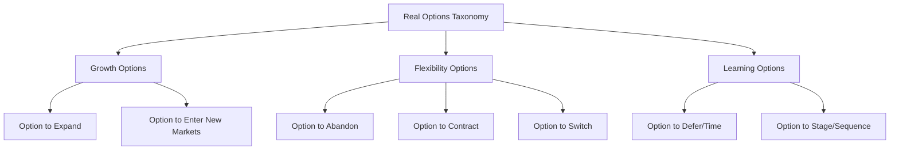
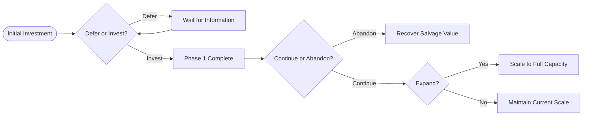

## Real Options Taxonomy: Expansion, Abandonment, and Timing

### Overview

Real options theory extends financial option pricing to corporate investment decisions under uncertainty, treating managerial flexibility as a valuable asset. Unlike static discounted cash flow (DCF) analysis, real options recognize that management can adapt decisions as uncertainty resolves over time. This section covers three foundational real option types: the option to expand, the option to abandon, and the option to time (defer) an investment.

### Conceptual Foundation

**Key Points**

- A real option confers the right, but not the obligation, to take a business action (expand, contract, defer, abandon) at a predetermined cost within a specified timeframe.
- Value arises from asymmetry: management captures upside when conditions are favorable while limiting downside exposure when they are not.
- Real options are typically valued using contingent claims analysis, adapting the Black-Scholes-Merton framework or binomial lattice methods originally designed for financial derivatives.
- The analogy maps as follows: underlying asset value = present value of project cash flows; strike price = investment cost; time to expiration = decision window; volatility = uncertainty in project value.

The general real options valuation framework decomposes total project value as:

$$V_{total} = NPV_{static} + Value_{flexibility}$$

This decomposition is standard: traditional NPV can understate a project's true value by ignoring the value embedded in managerial discretion, particularly for projects with long horizons, high uncertainty, or staged capital commitments.

### Taxonomy Structure

### Option to Expand

**Key Points**

- Grants the right to scale up operations, capacity, or output if initial conditions prove favorable, without obligating the firm to do so.
- Common in industries with modular capacity additions: pharmaceuticals (pilot plant to full-scale production), technology platforms (regional to global rollout), and natural resources (phased mine development).
- Modeled as a call option on the incremental project, where the firm pays an additional investment (the strike) to acquire a claim on the expanded operation's value.

**Valuation Structure**

The expansion option value using a Black-Scholes-type formulation:

$$C = S \cdot N(d_1) - K e^{-rT} \cdot N(d_2)$$

Where:

- $S$ = present value of expected cash flows from the expanded scale
- $K$ = additional investment required to expand
- $T$ = time until the expansion decision must be made
- $r$ = risk-free rate
- $N(\cdot)$ = cumulative standard normal distribution

with:

$$d_1 = \frac{\ln(S/K) + (r + \sigma^2/2)T}{\sigma\sqrt{T}}, \quad d_2 = d_1 - \sigma\sqrt{T}$$

**Example**

A mining company invests $50M in a mine with initial capacity of 10,000 tons/year. The contract grants the right to expand to 25,000 tons/year for an additional $80M investment within 5 years. If commodity prices rise, the present value of the expanded operation might reach $150M, making the expansion call option deep in-the-money. Using $\sigma = 35\%$ (commodity price volatility), $r = 4\%$, $T = 5$, the expansion option might be valued in the range of $40-60M — value that a static NPV analysis of the base 10,000-ton mine alone would completely omit.

**Practical Considerations**

- Expansion options are frequently embedded in a stepwise or "beachhead" strategy: initial market entry establishes the platform, and the expansion option is exercised contingent on demand signals.
- Competitive erosion matters: if competitors can also expand into the same opportunity, the exclusivity of the option (proprietary vs. shared) significantly affects its value. Shared options are typically valued lower due to competitive dissipation of rents. [Inference: the exact discount for competitive erosion is context-dependent and not derivable from a single closed-form adjustment.]

### Option to Abandon

**Key Points**

- Grants the right to terminate a project and recover a salvage or resale value if the project underperforms, functioning analogously to a put option on the project.
- Particularly relevant to capital-intensive projects with liquid secondary markets for assets (aircraft, real estate, standardized equipment) where abandonment value is meaningful and not merely scrap value.
- The abandonment decision converts an open-ended loss exposure into a bounded one, since management can exit rather than continuing to operate an unprofitable asset.

**Valuation Structure**

The option to abandon is modeled as a put option, where the "strike" is the salvage/resale value $A$ and the underlying is the ongoing project value $S$:

$$P = K e^{-rT} \cdot N(-d_2) - S \cdot N(-d_1)$$

Where $K$ is replaced conceptually by the abandonment (salvage) value $A$, and $S$ is the value of continuing operations.

In a multi-period framework, the project value at each node is:

$$V_t = \max(\text{Continuation Value}_t, \text{Abandonment Value}_t)$$

This recursive comparison is the essence of dynamic programming approaches to abandonment valuation, typically solved via binomial or trinomial lattices when early exercise (American-style) features are present.

**Example**

An airline purchases an aircraft for $40M with an operating value dependent on route profitability. If demand collapses, the aircraft retains a resale value of $25M in the used-aircraft market. Using a binomial lattice with annual steps over a 10-year horizon, $\sigma = 25\%$ for route profitability, and comparing continuation value against the $25M floor at each node, the abandonment option might add $3-6M of value relative to a "must operate" DCF baseline, since it eliminates tail-risk scenarios where the airline would otherwise be forced to operate at a sustained loss.

**Practical Considerations**

- Abandonment value is not static; it typically depreciates over time (equipment ages, resale markets shift), so $A$ should often be modeled as $A_t$, a declining function of time, rather than a constant strike.
- Partial abandonment (selling a portion of capacity or a business unit) can be modeled as a compound or fractional put option. [Inference: fractional abandonment valuation generally requires model customization beyond standard closed-form solutions.]
- Abandonment options interact with debt covenants and exit costs (severance, contract termination penalties, environmental remediation), which effectively reduce the realized strike price and must be netted out of $A$.

### Option to Time (Defer)

**Key Points**

- Grants the right to delay an irreversible investment decision to gather more information, resolve uncertainty, or wait for more favorable conditions — analogous to a call option on the investment opportunity itself.
- This is the foundational real option discussed in McDonald and Siegel (1986) and Dixit and Pindyck's investment-under-uncertainty framework; it explains why firms with positive NPV projects may rationally delay investment.
- The option to defer is most valuable when uncertainty is high, the investment is irreversible (sunk-cost heavy), and competitive preemption risk is low.

**Valuation Structure**

The timing option value:

$$C = V \cdot N(d_1) - I \cdot e^{-rT} \cdot N(d_2)$$

Where:

- $V$ = present value of the project if undertaken now
- $I$ = required investment outlay
- $T$ = maximum period over which the investment may be deferred (e.g., lease expiration, patent life, license window)

A central insight from this literature is the **investment trigger threshold**: the firm should not invest merely when $NPV > 0$ (i.e., $V > I$), but only when $V$ exceeds a higher threshold $V^*$:

$$V^* = \beta \cdot I, \quad \text{where } \beta = \frac{\beta_1}{\beta_1 - 1} > 1$$

and $\beta_1$ is derived from the fundamental quadratic equation of the underlying stochastic process (typically geometric Brownian motion):

$$\beta_1 = \frac{1}{2} - \frac{r-\delta}{\sigma^2} + \sqrt{\left(\frac{r-\delta}{\sigma^2} - \frac{1}{2}\right)^2 + \frac{2r}{\sigma^2}}$$

Here $\delta$ represents the "dividend yield" or opportunity cost of delay (e.g., cash flows foregone by not investing, or competitive erosion rate).

**Example**

A real estate developer holds land with development rights lasting 10 years. Building now yields an NPV of $5M ($V = \$55M$, $I = \$50M$). With $\sigma = 20\%$, $r = 5\%$, and no dividend yield ($\delta = 0$, meaning no cost to waiting), solving for the trigger multiple might yield $\beta \approx 1.4$, implying the developer should wait until $V^* \approx \$70M$ before breaking ground — even though current NPV is already positive. This formalizes the intuition that "positive NPV today" is an insufficient investment trigger under uncertainty and irreversibility.

**Practical Considerations**

- The option to defer erodes as $\delta$ (opportunity cost of waiting) rises — for instance, competitive entry risk, expiring exclusivity, or cash flows foregone during the deferral period all reduce the value of waiting.
- Deferral option value is a primary explanation for the "hurdle rate premium" observed empirically, where firms apply discount rates or NPV thresholds well above the theoretical cost of capital.
- In competitive settings, the deferral option can be destroyed by preemption: if a rival can capture the opportunity by moving first, the effective option value shrinks toward zero, and game-theoretic (option games) extensions become necessary. [Inference: quantifying preemption risk requires supplementary game-theoretic modeling, not captured by the standalone deferral formula.]

### Comparative Summary

| Option Type | Option Analogy | Underlying | Strike | Exercise Trigger |
| --- | --- | --- | --- | --- |
| Expansion | Call | Expanded project value | Expansion cost | Favorable demand/price signal |
| Abandonment | Put | Continuation value | Salvage/resale value | Deteriorating performance |
| Timing/Defer | Call | Project value if undertaken | Investment outlay | Value exceeds trigger threshold $V^*$ |

### Interaction Effects and Compound Options

**Key Points**

- Real-world projects rarely embed a single option in isolation. A staged investment (e.g., pharmaceutical R&D) may simultaneously carry the option to defer the next phase, the option to abandon at any stage gate, and the option to expand upon regulatory approval.
- These compound option structures generally cannot simply be valued by summing individual option values, because exercising one option can foreclose or alter the value of another (interaction effects), and standard practice in valuing them uses multi-stage binomial/trinomial lattices or Monte Carlo simulation with least-squares regression (e.g., Longstaff-Schwartz method) for American-style exercise features.

**Illustrative Compound Structure**

### Estimating Volatility for Real Options

**Key Points**

- Unlike financial options, the underlying asset (project value) is not traded, so volatility $\sigma$ cannot be observed directly from market prices and must be estimated.
- Common approaches include: (1) using volatility of comparable publicly traded firms or projects, (2) Monte Carlo simulation of the underlying cash flow drivers (price, volume, cost) to derive an implied project value volatility, and (3) the "consolidated" or "Marketed Asset Disclaimer" (MAD) approach proposed by Copeland and Antikarov, which assumes the project's static PV is the best unbiased estimate of the underlying's current value and derives volatility from the simulated distribution of that PV.
- Volatility estimation is widely regarded as the most contentious and assumption-sensitive input in real options valuation. [Speculation: some practitioners argue this sensitivity limits real options analysis to a supplementary/qualitative role rather than a primary valuation method in many corporate settings.]

### Limitations and Critiques

**Key Points**

- Real options models assume the underlying value follows a specifiable stochastic process (commonly geometric Brownian motion), which may not hold for project cash flows influenced by discrete, firm-specific events (regulatory approval, litigation outcomes) rather than continuous market-priced risk.
- The assumption of a complete market / replicable portfolio (needed for risk-neutral valuation) is often violated for idiosyncratic corporate assets, requiring the use of subjective or "shadow" pricing arguments (MAD approach) that introduce approximation error.
- Overuse of real options logic can be misapplied to rationalize speculative or empire-building investments by overstating flexibility value; disciplined use requires clearly specified triggers, exercise costs, and time windows rather than vague appeals to "strategic flexibility."

### Next Steps

**Related Topics**

- Binomial and trinomial lattice construction for American-style real options
- Longstaff-Schwartz least-squares Monte Carlo for compound real options
- Option games and competitive preemption in real options (Smit and Trigeorgis framework)
- Volatility estimation techniques: Marketed Asset Disclaimer (MAD) vs. comparable-firm approaches
- Staged R&D valuation in pharmaceuticals (phase-gate compound options)
- Natural resource valuation using real options (Brennan-Schwartz framework)
- Real options in capital budgeting policy and hurdle rate determination
- Switching options and operational flexibility (input/output mix flexibility)