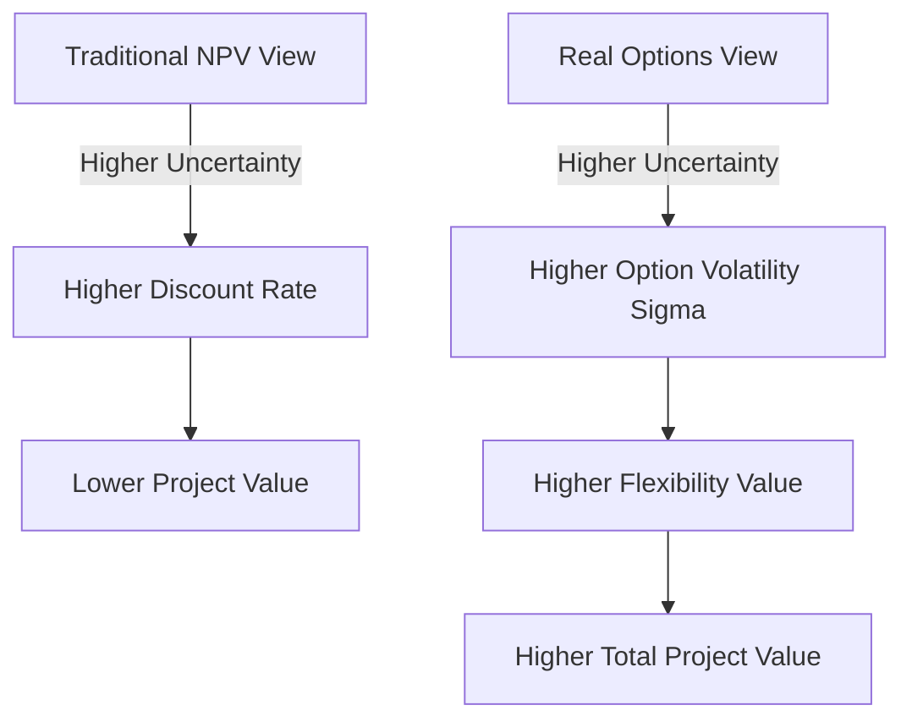
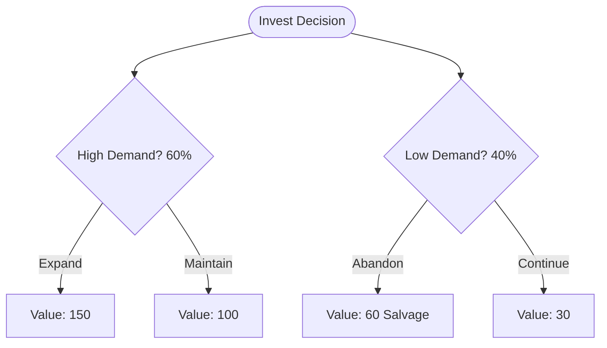

## Valuing Flexibility in Capital Budgeting

### Overview

Traditional capital budgeting relies on discounted cash flow (DCF) techniques—Net Present Value (NPV) and Internal Rate of Return (IRR)—that assume a static, "now-or-never" investment decision based on expected cash flows discounted at a fixed risk-adjusted rate. This approach systematically undervalues projects containing managerial flexibility, since it implicitly treats future decisions as fixed rather than contingent on how uncertainty resolves. Valuing flexibility integrates real options theory into the capital budgeting process, correcting this bias and providing a more complete measure of project value.

### The Core Deficiency of Static NPV

**Key Points**

- Static NPV assumes a single, irreversible commitment to a fixed operating plan, discounting expected cash flows without adjusting for the firm's ability to react to new information.
- This approach implicitly forces management to either accept a passive "average scenario" cash flow stream or to hand-adjust cash flows subjectively for flexibility—both of which fail to properly price optionality.
- The result is a systematic downward bias in valuing projects with significant uncertainty and embedded managerial discretion (staged investments, projects with expansion/exit potential, R&D pipelines).

The static NPV decision rule:

$$NPV = -I_0 + \sum_{t=1}^{n} \frac{E[CF_t]}{(1+r)^t}$$

fails to capture that management does not passively hold a fixed plan through $n$ periods; it can expand, contract, defer, or abandon as conditions evolve. The corrected framework is:

$$V_{expanded} = NPV_{static} + \sum_{i} Value(\text{Option}_i) - Value(\text{Interaction Effects})$$

The subtraction term reflects that flexibility values are not always simply additive, since exercising one embedded option can diminish or eliminate the value of another (see compound options below).

### Sources of Flexibility Value

**Key Points**

- Flexibility value increases with the degree of uncertainty in underlying project variables (demand, price, cost, technology), since option value is monotonically increasing in volatility $\sigma$ — a property with no analogue in static NPV, where higher uncertainty (via a higher discount rate) typically reduces value.
- Flexibility value increases with the length of the decision window ($T$), since a longer horizon over which management can observe new information and react is more valuable, all else equal.
- Flexibility value is inversely related to the degree of investment irreversibility; fully reversible investments carry little flexibility premium since exit is costless, while highly irreversible (sunk-cost heavy) investments carry the largest flexibility premiums.

This creates a counterintuitive but well-established result: **uncertainty can increase project value** when meaningful flexibility exists, reversing the traditional intuition that risk is uniformly penalized.

### A Structured Framework for Valuing Flexibility

**Key Points**

- Step 1: Compute the static/passive NPV using conventional DCF, ignoring flexibility, to establish the baseline.
- Step 2: Identify embedded real options within the project (expansion, abandonment, deferral, switching, staging) by mapping out decision points and contingent management actions.
- Step 3: Specify option parameters — underlying value $S$, strike/investment cost $K$, time to decision $T$, risk-free rate $r$, and volatility $\sigma$ — for each identified option.
- Step 4: Value each option using an appropriate method (closed-form Black-Scholes analogue for European-style options, binomial/trinomial lattices or Monte Carlo/Longstaff-Schwartz for American-style or path-dependent options).
- Step 5: Aggregate option values with the static NPV, adjusting for interaction effects among compound or overlapping options, to arrive at expanded (strategic) NPV.

**Example: Staged Manufacturing Investment**

A firm considers a $100M plant investment with static NPV of –$5M (marginally unattractive under conventional analysis). The project contains:

1. An option to expand output by 50% within 3 years for an additional $40M if demand proves strong.
2. An option to abandon and sell the facility for $60M if demand collapses within the first 2 years.

Using a binomial lattice with $\sigma = 30\%$ on project cash flow value, $r = 5\%$:

- Expansion option value ≈ $8M
- Abandonment option value ≈ $4M

Expanded NPV: $-5M + 8M + 4M = +7M$

The project shifts from apparently value-destroying to value-creating once flexibility is properly priced — illustrating why relying solely on static NPV can lead to the rejection of strategically valuable investments.

### Decision-Tree Analysis vs. Options-Based Valuation

**Key Points**

- Decision-tree analysis (DTA) is a related, more intuitive technique that maps sequential decisions and outcomes with assigned probabilities, discounting expected values back using a single risk-adjusted rate.
- DTA's key limitation is that it typically applies one discount rate across all branches regardless of how risk changes at each decision node, whereas options-based valuation (via risk-neutral probabilities) correctly adjusts the effective discount rate implicitly through the risk-free rate and replicating portfolio argument.
- In practice, DTA is often used as a complementary visualization and structuring tool, with the actual valuation of key contingent branches refined using options pricing once the decision structure is mapped out.

### Integrating Flexibility into Capital Budgeting Policy

**Key Points**

- Firms embedding real options analysis into capital budgeting typically require project sponsors to explicitly document contingent decision points (stage gates, kill criteria, expansion triggers) rather than presenting a single deterministic cash flow forecast.
- Hurdle rates set above the theoretical cost of capital are, in part, an informal (and often poorly calibrated) proxy for unpriced deferral option value; formal options valuation offers a more precise alternative to this heuristic adjustment.
- Capital budgeting systems that incorporate flexibility valuation often require cross-functional input (operations for switching costs, legal for contract-based exit costs, treasury for volatility estimation) beyond the finance function alone. [Inference: the degree of cross-functional involvement varies significantly by firm and industry, and is not a universal requirement of the method itself.]

### Common Analytical Techniques Compared

| Technique | Handles Uncertainty | Handles Flexibility | Complexity | Typical Use Case |
| --- | --- | --- | --- | --- |
| Static NPV/DCF | Via discount rate only | No | Low | Simple, low-optionality projects |
| Scenario/Sensitivity Analysis | Explicit scenarios | No | Low-Medium | Stress-testing assumptions |
| Decision Tree Analysis | Probabilistic branches | Partial (heuristic) | Medium | Sequential decisions, illustrative structuring |
| Real Options (closed-form) | Via volatility | Yes | Medium-High | Single, cleanly defined option |
| Real Options (lattice/Monte Carlo) | Via volatility, path-dependent | Yes | High | Compound, American-style, multi-stage options |

### Volatility and Discount Rate Estimation Challenges

**Key Points**

- The primary practical obstacle to adopting flexibility valuation in corporate capital budgeting is the estimation of $\sigma$ for a non-traded underlying asset, commonly addressed via the Marketed Asset Disclaimer (MAD) approach, Monte Carlo simulation of cash flow drivers, or proxy volatilities from comparable traded securities.
- Under risk-neutral valuation, the risk-free rate replaces the project-specific discount rate within the option pricing formula itself, which can be conceptually unfamiliar to practitioners accustomed to single-rate DCF discounting and requires careful communication to avoid misapplication.
- Sensitivity analysis on $\sigma$ is standard practice given estimation uncertainty; because option value is monotonically increasing in $\sigma$, presenting a value range across plausible volatility estimates is generally more defensible than reporting a single point estimate.

### Organizational and Behavioral Considerations

**Key Points**

- Adoption of flexibility-based valuation in corporate practice has historically lagged its theoretical development, in part due to the complexity of communicating options-pricing logic to non-specialist decision-makers and boards accustomed to single-number NPV outputs.
- A documented risk in application is "real options bias," where flexibility valuation is invoked selectively to justify pre-favored projects (post-hoc rationalization) rather than applied consistently across the capital budgeting portfolio.
- Best practice generally involves using flexibility valuation as a supplementary lens alongside static NPV, explicitly reporting both figures and the specific options driving the divergence, rather than presenting a single blended number that obscures the underlying assumptions.

### Next Steps

**Related Topics**

- Real options taxonomy: expansion, abandonment, and timing options (foundational option types)
- Binomial and trinomial lattice methods for American-style flexibility valuation
- Monte Carlo simulation and Longstaff-Schwartz methods for compound real options
- Marketed Asset Disclaimer (MAD) approach to volatility estimation
- Decision tree analysis and its integration with options-based methods
- Option games: competitive dynamics in flexibility valuation
- Capital budgeting policy design and hurdle rate calibration
- Case applications: R&D portfolio valuation, natural resource investment, technology platform rollouts