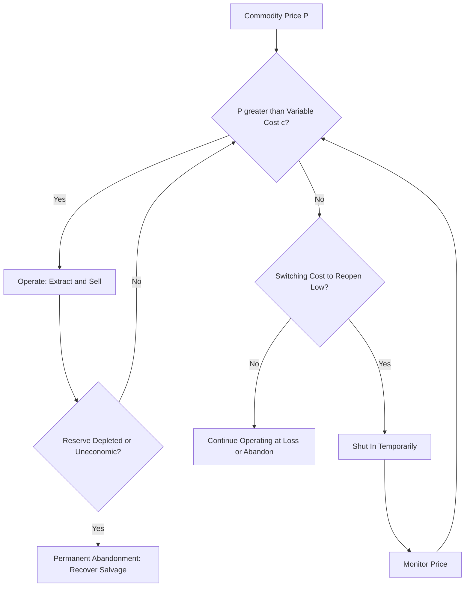
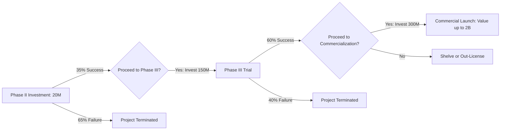

## Natural Resource and Research Development Options

### Overview

Natural resource extraction and R&D pipelines represent two of the most widely studied applications of real options theory, precisely because both involve large irreversible capital commitments, long time horizons, and cash flows driven by variables with observable or estimable volatility (commodity prices, technical/regulatory success probabilities). This section covers the Brennan-Schwartz framework for natural resource valuation and the compound-option structure characteristic of staged R&D investment.

### Natural Resource Options: Conceptual Foundation

**Key Points**

- Natural resource projects (mining, oil and gas, timber) are distinctive because the underlying source of uncertainty—commodity price—is frequently observable via liquid futures and spot markets, allowing volatility to be estimated directly rather than through proxy or simulation methods.
- The Brennan-Schwartz (1985) framework models the value of a natural resource reserve as a contingent claim on the commodity price, incorporating extraction costs, convenience yield, and the option to shut down and restart production.
- Resource projects typically embed multiple nested options: the option to defer initial development, the option to expand extraction capacity, the option to temporarily shut in production when prices fall below variable cost, and the option to permanently abandon when the reserve is exhausted or economically unviable.

### The Brennan-Schwartz Framework

**Key Points**

- The model treats the unextracted reserve as an asset whose value derives from the convenience yield-adjusted price process of the commodity, typically modeled with mean-reverting or geometric Brownian motion dynamics depending on the commodity's empirical price behavior.
- Convenience yield $\delta$ (the benefit of holding the physical commodity versus a futures contract) functions analogously to a dividend yield in equity option pricing, reducing the value of deferral by representing the opportunity cost of not extracting now.
- The operating decision at each point in time compares extraction profit against the shutdown alternative, creating a switching option structure rather than a simple one-time exercise decision.

The value of a producing (or dormant) resource unit under the risk-neutral price process:

$$dP = (r - \delta)P \, dt + \sigma P \, dz$$

Where $P$ is the commodity spot price, $r$ is the risk-free rate, $\delta$ is the convenience yield, and $\sigma$ is commodity price volatility.

The instantaneous operating profit per unit extracted, given variable extraction cost $c$:

$$\pi(P) = \max(P - c, 0)$$

This creates a "switching option" where the mine operates when $P > c$ and shuts down (avoiding variable losses) when $P < c$, with the shutdown/restart decision itself embedding hysteresis due to switching costs.

**Example**

An oil field has proven reserves of 10 million barrels, variable extraction cost of $35/barrel, and current oil price of $60/barrel. Using a mean-reverting price process with long-run price $55/barrel, $\sigma = 30\%$, and $\delta = 3\%$, a Brennan-Schwartz-style valuation via finite-difference PDE solution or lattice would value the reserve significantly above the naive static NPV computed at current price and extraction rate, because the model captures the value of curtailing production during low-price periods and expanding extraction during high-price periods — flexibility a fixed extraction schedule DCF cannot represent.

**Practical Considerations**

- Shut-down and restart decisions carry switching costs (workforce demobilization/remobilization, well maintenance, regulatory recommissioning), which must be explicitly parameterized; ignoring these costs overstates the value of operational flexibility.
- Reserve estimates themselves carry geological uncertainty distinct from price uncertainty; a complete model often incorporates both price volatility and reserve quantity/quality uncertainty, typically via a combined stochastic process or a two-factor model. [Inference: the appropriate treatment of combined price and quantity uncertainty depends heavily on the specific resource and data availability, and is not resolved by a single standard model.]
- Environmental and decommissioning liabilities function as a negative terminal value that reduces the effective abandonment/salvage value, and are increasingly material in valuation given regulatory trends. [Unverified: the magnitude of this effect varies substantially by jurisdiction and resource type and cannot be generalized.]

### Research and Development as Compound Options

**Key Points**

- R&D investment, particularly in pharmaceuticals, biotechnology, and technology development, is naturally structured as a sequential compound option: each stage of development (preclinical, Phase I, Phase II, Phase III, regulatory approval, commercialization) is an option to invest in the subsequent stage, contingent on the current stage's success.
- Unlike natural resource options (driven primarily by market price uncertainty), R&D options are driven substantially by technical/scientific uncertainty (probability of successful trial results, regulatory approval) rather than continuously observable market prices, which complicates the direct application of standard geometric Brownian motion assumptions.
- A compound option is "an option on an option": the value of the right to proceed to Phase III depends on both the (uncertain) outcome of Phase II and the (separately uncertain) value of the eventual commercialized product.

### Valuing Staged R&D: The Compound Option Structure

**Key Points**

- Each stage requires an investment $I_i$ to "purchase" the option to proceed to the next stage, and is only exercised if the expected value of proceeding exceeds $I_i$ given information available at that stage.
- Technical success probabilities $p_i$ at each stage are typically drawn from historical industry benchmarks (e.g., published clinical trial phase transition rates) and combined with the market-driven value of the eventual commercial product (itself modeled as an underlying asset with volatility $\sigma$, often derived from comparable publicly traded biotech/pharma firms or peak sales estimates).
- The compound option value is generally computed via a nested/recursive Black-Scholes-type approach (Geske, 1979 compound option framework) or, more commonly in practice, via decision-tree-weighted Monte Carlo simulation combining technical (binomial) success/failure branching with market (continuous) value uncertainty.

**Example: Pharmaceutical Development Pipeline**

A drug candidate requires:

- Phase II investment: $20M, success probability 35%, decision window 2 years
- Phase III investment: $150M (if Phase II succeeds), success probability 60%, decision window 3 years
- Commercialization investment: $300M (if Phase III succeeds), with expected peak commercial value $2B, $\sigma = 40\%$ (derived from comparable biotech equity volatility)

The compound option is valued by working backward: first valuing the commercialization-stage option (a standard call on the $2B commercial value with $300M strike), then valuing the Phase III option as a call on that computed value combined with the 60% success probability, and finally valuing the Phase II option as a call on the Phase III-stage value combined with the 35% success probability. This recursive, backward-induction structure is the defining feature of compound option valuation and is why sequential R&D investments are frequently valued far more favorably under real options analysis than under a single-pass expected-NPV calculation, which tends to multiply out all failure probabilities upfront and heavily penalize the early-stage investment.

**Practical Considerations**

- The choice of volatility proxy for the eventual commercial product is a significant source of valuation sensitivity; using comparable-firm equity volatility (typically 35-55% for clinical-stage biotech) versus product-specific cash flow volatility can produce materially different results. [Inference: the appropriate proxy depends on firm-specific capital structure and diversification, and no single convention is universally correct.]
- Technical success probabilities are frequently treated as independent of market value uncertainty in simplified models, but in practice may be correlated (e.g., a drug with a larger addressable market may also attract more rigorous trial design, affecting success probability). [Speculation: the direction and magnitude of this correlation is not well-established in the general literature and would require asset-specific analysis.]
- R&D compound options are particularly sensitive to the assumed decision window $T$ at each stage; regulatory or competitive pressure to accelerate timelines reduces the value of the embedded deferral flexibility within each stage.

### Comparative Framework: Natural Resource vs. R&D Options

| Dimension | Natural Resource Options | R&D Compound Options |
| --- | --- | --- |
| Primary uncertainty source | Commodity price (market-observable) | Technical/regulatory success (firm-specific) |
| Volatility estimation | Futures/spot market data | Comparable firm equity or peak sales estimates |
| Option structure | Simple + switching (operate/shut-in) | Sequential compound (option-on-option) |
| Typical valuation method | PDE/lattice on price process | Backward-induction compound option / decision-tree Monte Carlo |
| Key embedded options | Defer, expand, shut-in/restart, abandon | Stage-gate continue/abandon at each phase |

### Integration Considerations

**Key Points**

- Both applications share the core real options insight that uncertainty increases rather than uniformly decreases project value when meaningful flexibility to react exists, directly countering static DCF's treatment of uncertainty as a pure penalty via higher discount rates.
- Both require careful separation of the two distinct sources of uncertainty at play: market-priced/systematic uncertainty (typically valued using risk-neutral/no-arbitrage methods) and private/technical uncertainty (typically incorporated using actual, real-world probabilities within a decision-tree overlay), since conflating the two can lead to inconsistent discounting.
- Portfolio-level application (a firm managing multiple mines or multiple drug candidates simultaneously) introduces additional correlation and capital rationing considerations beyond the single-asset valuation frameworks presented here. [Inference: portfolio-level real options aggregation is an active area of extension beyond the standard single-project models and does not have one settled methodological standard.]

### Next Steps

**Related Topics**

- Compound option valuation (Geske 1979 framework) and nested option pricing
- Mean-reverting stochastic processes for commodity price modeling
- Switching options and hysteresis in operating decisions
- Real options in pharmaceutical portfolio management and licensing decisions
- Two-factor models combining price and quantity/reserve uncertainty
- Monte Carlo simulation with technical/market uncertainty overlays
- Option games and competitive dynamics in resource extraction timing
- Environmental liability and decommissioning cost integration in abandonment valuation