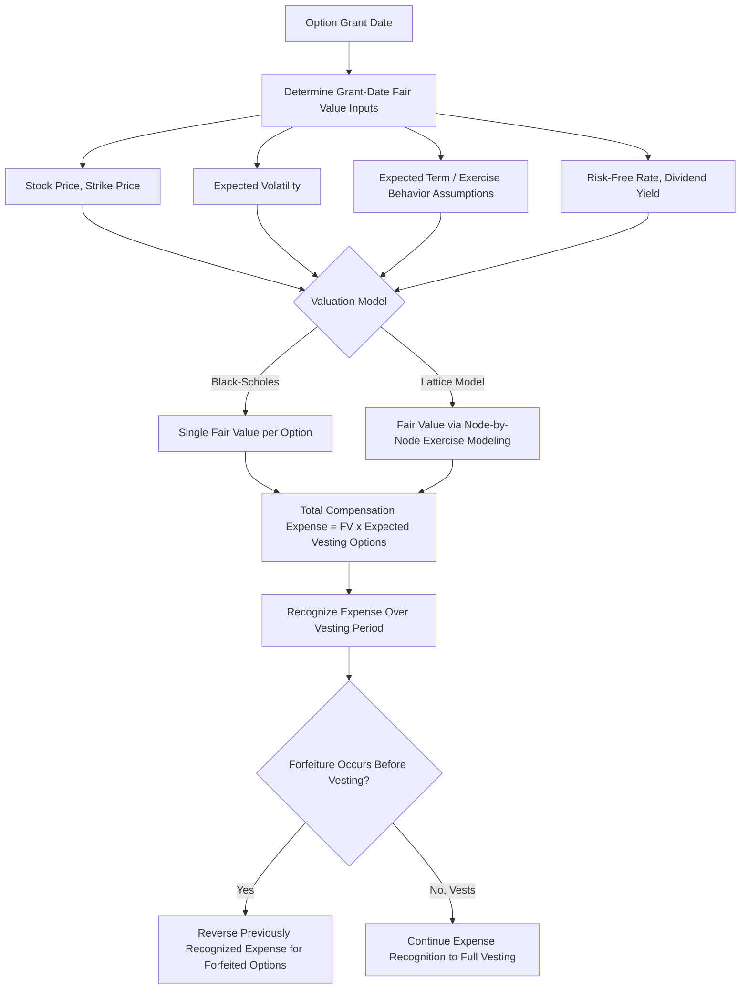

## Employee Stock Option Valuation and Expensing

### Overview

Employee stock option (ESO) valuation and expensing addresses the accounting and financial modeling challenges specific to options granted as employee compensation, which differ materially from standard exchange-traded or OTC options in exercise behavior, vesting mechanics, and forfeiture risk. This topic bridges corporate finance, accounting standards (primarily ASC 718 in the US and IFRS 2 internationally), and derivatives pricing theory, since ESOs must be valued using option-pricing frameworks adapted to account for their unique, non-standard features.

### Why ESOs Differ from Standard Exchange-Traded Options

**Key Points**

- **Vesting requirements**: ESOs typically cannot be exercised until a vesting period elapses (e.g., graded vesting over 4 years, often with a 1-year cliff), during which the employee has no ability to exercise regardless of the option's intrinsic value
- **Forfeiture risk**: If an employee leaves the company before vesting, unvested options are typically forfeited entirely — this forfeiture probability must be estimated and incorporated into the expense calculation
- **Non-transferability**: Unlike exchange-traded options, ESOs generally cannot be sold or transferred to a third party — the only ways to realize value are exercise (and subsequent sale of the underlying shares) or forfeiture, which affects early exercise behavior relative to a freely tradable American option
- **Long tenor**: ESOs frequently have contractual terms of 7-10 years, far longer than most exchange-traded equity options, which typically have terms of months to a few years at most
- **Early exercise behavior driven by employee-specific factors**: Employees frequently exercise ESOs well before contractual expiration for reasons unrelated to pure option-value maximization — liquidity needs, diversification desire, or tax planning — a behavior pattern that differs from the rational, value-maximizing early exercise assumptions embedded in standard American option pricing theory

### Accounting Framework: ASC 718 and IFRS 2

Since the mid-2000s, both US GAAP (ASC 718, formerly known as FAS 123R) and IFRS (IFRS 2) have required companies to recognize the **fair value of employee stock options as a compensation expense**, recognized over the vesting period, rather than using the earlier intrinsic-value method that generally resulted in minimal or no reported expense for at-the-money option grants.

$$\text{Total Compensation Expense} = \text{Fair Value per Option (at grant date)} \times \text{Number of Options Expected to Vest}$$

$$\text{Periodic Expense} = \frac{\text{Total Compensation Expense}}{\text{Vesting Period}} \text{ (typically straight-line, though graded vesting attribution methods also exist)}$$

**Key Points**

- Fair value is determined **at the grant date** and is generally **not subsequently remeasured** for changes in the underlying stock price under ASC 718's most common treatment for equity-classified awards — this is a critical distinction from mark-to-market accounting used elsewhere in derivatives
- The expense is recognized regardless of whether the options are ultimately exercised, in-the-money, or expire worthless — the grant-date fair value determination is what drives the accounting expense, not the eventual realized outcome
- Forfeitures (due to employee turnover before vesting) reduce the total expense recognized, either through an estimated forfeiture rate applied prospectively or (under certain accounting policy elections) recognized as they occur

### Valuation Models Used for ESOs

**Black-Scholes-Merton Model (adapted)**

The standard Black-Scholes formula, adapted with ESO-specific inputs:

$$C = S_0 N(d_1) - K e^{-rT} N(d_2)$$

$$d_1 = \frac{\ln(S_0/K) + (r - q + \sigma^2/2)T}{\sigma\sqrt{T}}, \quad d_2 = d_1 - \sigma\sqrt{T}$$

Where the critical ESO-specific adaptation is **$T$** — rather than using the full contractual term (e.g., 10 years), companies typically use an **expected term** (or "expected life") that is shorter than the contractual term, reflecting the empirical tendency of employees to exercise before contractual expiration.

**Key Points**

- **Expected term estimation** is one of the most consequential and judgment-dependent inputs in ESO valuation — companies may use historical exercise data, a "simplified method" permitted under certain SEC guidance for companies lacking sufficient historical data (which typically averages the vesting period and the contractual term), or more sophisticated behavioral models
- A shorter expected term generally reduces the calculated fair value (since it corresponds to less time value in the option), directly reducing reported compensation expense — this makes the expected term assumption a meaningful lever in the overall expense calculation
- Other Black-Scholes inputs require ESO-specific consideration: **volatility** is often estimated using a blend of historical stock volatility and, where available, implied volatility from traded options on the company's stock (though many companies, especially smaller or newly public ones, lack sufficiently liquid traded options); **dividend yield** uses the company's expected dividend policy over the option's expected life

**Lattice (Binomial/Trinomial) Models**

Lattice models are generally viewed as more flexible and theoretically appropriate for ESOs because they can directly incorporate:

- Variable/discrete vesting schedules
- Post-vesting termination/forfeiture assumptions at each node
- Employee-specific early exercise behavior modeled as a function of the stock price reaching certain multiples of the strike price (a common empirical calibration approach, sometimes called an exercise multiple or exercise factor)
- Blackout periods during which exercise is contractually restricted (e.g., around earnings announcements)

[Inference] Lattice models are generally considered more accurate for ESOs specifically because they can model path-dependent, employee-behavior-driven early exercise directly, rather than relying on a single expected-term proxy as in the Black-Scholes adaptation — however, lattice models require more inputs and greater modeling sophistication, which is likely why many companies, particularly those without extensive internal valuation resources, continue to use the Black-Scholes approach with an expected term adjustment as a reasonably accepted simplification under applicable accounting guidance.

### Valuation Model Comparison

| Feature | Black-Scholes (Adapted) | Binomial/Trinomial Lattice |
| --- | --- | --- |
| Expected term handling | Single input estimate | Modeled dynamically via exercise behavior assumptions |
| Vesting schedule flexibility | Limited, generally simplified | Can directly model graded/cliff vesting |
| Forfeiture modeling | Applied as an overall rate adjustment | Can be modeled at each node/period |
| Complexity | Lower, closed-form solution | Higher, requires more computational modeling |
| Common usage | Widely used, especially by smaller/simpler issuers | Used by larger companies and those with more complex grant structures |

### ESO Valuation and Expense Recognition Flow

### Key Valuation Input Sensitivities

- **Volatility**: Higher assumed volatility increases fair value and thus reported expense — companies have some latitude in volatility estimation methodology (historical lookback period, peer-group volatility for newly public companies, implied volatility blending), making this a scrutinized input in valuation and audit review
- **Expected term**: As noted, shorter expected term generally reduces fair value; the "simplified method" for expected term is available only under specific conditions (typically limited historical exercise data availability) per applicable accounting guidance
- **Dividend yield**: Higher expected dividends reduce call option value (since the option holder does not receive dividends during the holding period, unlike direct shareholders), reducing expense
- **Risk-free rate**: Higher rates generally increase call option value through the discounting mechanism in the Black-Scholes framework, though this is typically a smaller-magnitude sensitivity compared to volatility and expected term

### Restricted Stock Units (RSUs) as a Comparison Point

**Key Points**

- RSUs, an increasingly common alternative or complement to stock options in equity compensation packages, are valued far more simply — typically at the grant-date stock price itself (since RSUs generally have no strike price/exercise decision), without requiring an option-pricing model
- [Unverified] The relative prevalence of RSUs versus traditional stock options in corporate equity compensation packages has shifted over time and varies significantly by company stage, industry, and geography; current market practice should be verified against recent compensation survey data rather than assumed from general historical trends, since granting practices continue to evolve.
- The accounting expense mechanics (recognition over vesting period, forfeiture treatment) are broadly analogous between RSUs and options, but the absence of option-pricing model complexity for RSUs significantly simplifies the valuation and expense determination process

### Risk and Governance Considerations

- **Repricing and modification accounting**: If an out-of-the-money option grant is repriced (strike lowered) or otherwise modified, specific incremental fair value accounting is required, comparing the modified award's fair value to the original award's fair value immediately before modification — this can trigger additional expense recognition
- **Performance-based vesting conditions**: Options or RSUs with performance-based (rather than purely time-based) vesting conditions require additional judgment regarding the probability of achieving the performance condition, which affects the expense recognition pattern and timing
- **Dilution considerations**: Beyond the accounting expense, large ESO programs create potential share dilution for existing shareholders upon exercise, a separate but related consideration in corporate finance analysis of equity compensation programs

### Practical Implications for Analysis

- When evaluating a company's reported stock compensation expense, examine the disclosed valuation assumptions (volatility, expected term, dividend yield) in the footnotes, since these materially affect the reported figure and can vary meaningfully in reasonableness across companies
- Distinguish between grant-date fair value expense recognition (the standard treatment) and any liability-classified awards that may require ongoing remeasurement, as the accounting treatment differs
- For companies with limited trading history or illiquid options markets, scrutinize the volatility and expected term methodologies more closely, since these companies have fewer directly observable inputs and rely more heavily on peer comparisons or simplified methods
- Recognize that ESO expense is a real economic cost of compensation (diluting existing shareholders and representing foregone cash compensation alternatives) even though it is a non-cash charge to the income statement, relevant when adjusting reported earnings for analytical purposes

### Related Topics

- Black-Scholes-Merton model assumptions and adaptations
- Binomial and trinomial lattice option pricing models
- Volatility estimation methodologies (historical vs. implied)
- Restricted stock unit (RSU) compensation structures
- Dilution and share-based payment disclosure analysis
- Real options valuation in corporate capital budgeting