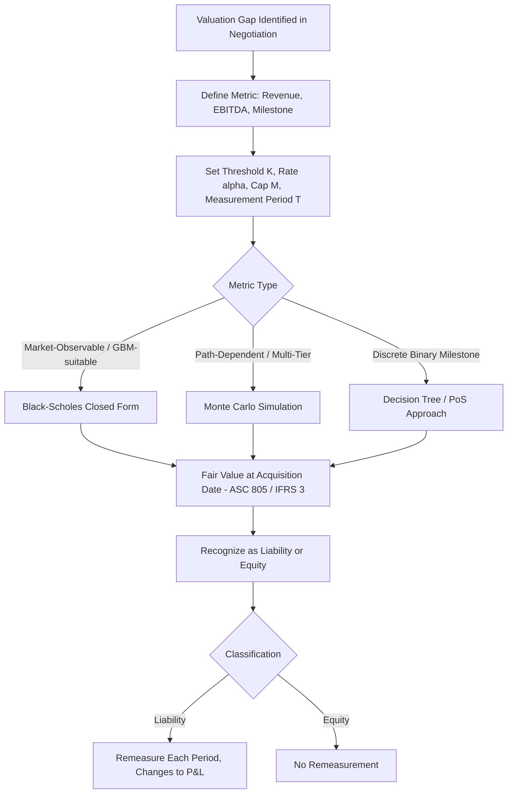

## Earnouts and Contingent Consideration as Options

### Overview and Economic Rationale

An earnout is a contractual mechanism in M&A transactions where a portion of the purchase price is deferred and made contingent on the target business achieving specified post-closing performance milestones. Contingent consideration is the broader accounting and legal term encompassing earnouts, contingent value rights (CVRs), milestone payments in licensing deals, and similar deferred, performance-linked payoffs.

Earnouts arise primarily to bridge valuation gaps between buyer and seller. When a seller believes the business will outperform the buyer's projections (often due to asymmetric information about pipeline, customer retention, or pending contracts) and the buyer is unwilling to pay for unproven future performance, an earnout allows the seller to be compensated later if their optimism proves correct. This shifts idiosyncratic performance risk from the buyer to the seller during the earnout period while allowing the deal to close at a fixed upfront price.

Because the payoff to the earnout holder (seller) is a **non-negative function of a future uncertain metric** (revenue, EBITDA, regulatory approval, FDA milestone, share price), the payoff structure is structurally equivalent to a portfolio of options. This makes option pricing theory directly applicable to earnout valuation, deal structuring, and financial reporting under fair value accounting.

### Standard Earnout Payoff Structures

**Binary/Digital Structure**

Pays a fixed amount $C$ if the metric $X$ exceeds threshold $K$ at time $T$, zero otherwise.

$$\text{Payoff} = C \cdot \mathbb{1}_{\{X_T \geq K\}}$$

This is economically a **cash-or-nothing binary call option** on the underlying metric.

**Linear/Proportional Structure (with cap and floor)**

Pays a percentage $\alpha$ of the amount by which the metric exceeds a threshold, subject to a maximum payout (cap) $M$.

$$\text{Payoff} = \min\left[\alpha \cdot \max(X_T - K, 0), \, M\right]$$

Decomposing this payoff:

- Long $\alpha$ units of a call struck at $K$
- Short $\alpha$ units of a call struck at $K + M/\alpha$

This is a **bull call spread**, scaled by $\alpha$. The cap effectively sells away the upside beyond a certain performance level, which is why capped earnouts are worth less to the seller than uncapped ones with identical $\alpha$ and $K$.

**Tiered/Ladder Structure**

Multiple thresholds $K_1 < K_2 < \dots < K_n$ each triggering incremental payments $C_1, C_2, \dots, C_n$. This decomposes into a **strip of digital call options** at each strike, or equivalently a strip of call spreads if payments scale linearly within each band.

**Milestone-Based (Binary, Non-Financial Metric)**

Common in biotech/pharma licensing: payment triggered by regulatory approval, successful clinical trial phase completion, or first commercial sale. The "underlying" is not a continuously traded price but a discrete event probability, so these are typically valued with a **decision-tree / probability-of-success (PoS)** approach rather than Black-Scholes, though the conceptual framing (contingent claim, optionality) is identical.

### Options Analogy: Seller's and Buyer's Positions

**Seller (earnout recipient):**

- Holds effectively a **long call** (or call spread) on the performance metric
- Benefits from volatility in the metric: higher uncertainty about future performance increases the value of the contingent payment, all else equal
- Has convex exposure — limited downside (earnout goes to zero) with (capped or uncapped) upside

**Buyer (obligor):**

- Is **short the call** the seller holds
- The earnout liability increases in value as the acquired business outperforms, which is intuitive: better performance means the buyer owes more
- Buyer's total acquisition cost = Fixed upfront payment + fair value of the embedded short option position

### Valuation Methodologies

**1. Black-Scholes-Merton Framework (for market-observable or GBM-modeled metrics)**

When the underlying metric (e.g., acquirer's stock price for a CVR, or an index-linked earnout) follows geometric Brownian motion, the standard closed-form applies. For a simple call-type earnout paying $\max(X_T - K, 0)$:

$$C = X_0 e^{-qT} N(d_1) - K e^{-rT} N(d_2)$$

$$d_1 = \frac{\ln(X_0/K) + (r - q + \sigma^2/2)T}{\sigma\sqrt{T}}, \quad d_2 = d_1 - \sigma\sqrt{T}$$

Where:

- $X_0$ = current value of the underlying metric
- $K$ = threshold/strike
- $\sigma$ = volatility of the metric
- $r$ = risk-free rate
- $q$ = "dividend yield" analog — for operating metrics like revenue or EBITDA, this often captures growth drag or the fact that cash flows are being paid out during the period
- $T$ = time to measurement date

For a **digital/binary call** paying $C$ if $X_T > K$:

$$V_{\text{digital}} = C \cdot e^{-rT} N(d_2)$$

**2. Monte Carlo Simulation (dominant method in practice)**

Most real-world earnouts are valued via Monte Carlo because:

- Metrics like revenue or EBITDA are not traded assets with clean market volatility inputs
- Payoffs are often path-dependent (e.g., "cumulative EBITDA over 3 years must exceed $X$")
- Multiple correlated milestones or tiers require joint simulation
- Measurement periods often involve multiple sub-periods with different thresholds

**Standard Monte Carlo procedure:**

1. Model the underlying metric's evolution, typically via GBM or a mean-reverting/Brownian-with-drift process calibrated to management projections and an estimated volatility (often proxied from comparable public company revenue/EBITDA volatility)
2. Simulate thousands of paths to the measurement date(s)
3. Apply the contractual payoff formula (cap, floor, tiers) to each simulated path
4. Discount each path's payoff back to present value
5. Average across all paths to get the expected fair value
6. Discount rate consideration: because the earnout carries the specific business's performance risk, many practitioners discount expected payoffs at a **credit-adjusted rate** reflecting counterparty/payment risk, separate from the risk-neutral drift used for the underlying's simulated evolution

**3. Real Options / Decision Tree (for discrete, binary milestones)**

For binary go/no-go outcomes such as regulatory approval:

$$V = \sum_{i} p_i \cdot PV(\text{payoff}_i)$$

Where $p_i$ is the probability of success (PoS) at each node, often sourced from historical base rates (e.g., industry-standard Phase II-to-approval transition probabilities in pharma) rather than derived from market-implied volatility.

### Worked Example: Capped Earnout via Black-Scholes

**Facts:** Buyer acquires a company. Earnout pays 50% of Year-3 EBITDA above $20M, capped at a total payout of $15M. Current expected Year-3 EBITDA (risk-neutral) $X_0 = \$18M$, volatility of EBITDA proxy $\sigma = 35\%$, $T = 3$ years, $r = 4\%$, no dividend-yield adjustment ($q=0$).

**Step 1 — Decompose the payoff:**

$$\text{Payoff} = 0.5 \cdot \max(X_T - 20, 0) - 0.5 \cdot \max(X_T - 50, 0)$$

(The cap of $15M ÷ 0.5 = $30M of EBITDA above the $20M threshold, i.e., upper strike = $20M + $30M = $50M)

**Step 2 — Price each call leg with Black-Scholes** ($X_0=18$, $r=4\%$, $\sigma=35\%$, $T=3$):

*Leg 1, Strike = 20:*

$$d_1 = \frac{\ln(18/20) + (0.04 + 0.35^2/2)(3)}{0.35\sqrt{3}} = \frac{-0.1054 + 0.3038}{0.6062} \approx 0.327$$

$$d_2 = 0.327 - 0.606 \approx -0.279$$

$$N(d_1) \approx 0.628, \quad N(d_2) \approx 0.390$$

$$C_{20} = 18(0.628) - 20e^{-0.12}(0.390) \approx 11.30 - 6.93 \approx \$4.37M$$

*Leg 2, Strike = 50:* Deep out-of-the-money; $d_1 \approx -1.34$, $N(d_1) \approx 0.090$; $d_2 \approx -1.95$, $N(d_2) \approx 0.026$

$$C_{50} = 18(0.090) - 50e^{-0.12}(0.026) \approx 1.62 - 1.15 \approx \$0.47M$$

**Step 3 — Combine:**

$$V_{\text{earnout}} = 0.5(4.37) - 0.5(0.47) = 0.5(3.90) \approx \$1.95M$$

The fair value of this capped, contingent earnout liability is approximately **$1.95M**, well below its undiscounted maximum of $15M, reflecting both the out-of-the-money nature of the lower strike and the cap suppressing upside. [Inference: exact figures are sensitive to the EBITDA volatility proxy chosen, which is rarely directly observable and typically estimated from a peer group of public comparables or historical business unit variability — this is the single largest source of valuation uncertainty in practice.]

### Key Sensitivities (Greeks Analogy)

| Parameter | Effect on Seller's Earnout Value | Options Intuition |
| --- | --- | --- |
| Higher metric volatility ($\sigma$) | Increases value | Vega — optionality benefits from uncertainty |
| Longer measurement period ($T$) | Generally increases value (absent heavy caps) | Positive time value |
| Higher current/expected metric level | Increases value | Positive delta |
| Wider cap or no cap | Increases value | Removing short call reduces spread drag |
| Higher discount/credit risk rate | Decreases value | Analogous to higher effective "cost of carry" |
| Higher correlation across tiers (multi-year) | Complex — affects the joint distribution of cumulative payoffs | Path-dependency effect |

### Accounting Treatment (ASC 805 / IFRS 3)

Under US GAAP (**ASC 805**) and IFRS (**IFRS 3**), contingent consideration is:

- Recognized at **acquisition-date fair value** as part of total consideration transferred
- Classified as either a **liability** (most earnouts, since payment is typically cash or variable shares) or **equity** (rare — fixed number of shares regardless of outcome)
- Liability-classified contingent consideration is **remeasured at fair value each reporting period**, with changes flowing through the income statement (not goodwill) — this creates real earnings volatility tied to option-value changes in the earnout
- Equity-classified contingent consideration is **not remeasured**

This remeasurement requirement is precisely why the options framework matters operationally: finance teams must re-run the Black-Scholes or Monte Carlo valuation at each reporting date as the underlying metric's trajectory, remaining time, and volatility assumptions evolve — analogous to marking an option book to market.

### Contingent Value Rights (CVRs) as a Special Case

CVRs are tradable or non-tradable instruments issued to target shareholders, most common in:

- **Pharma/biotech M&A**: CVR pays out upon FDA approval or a sales milestone for an in-development drug
- **Distressed/uncertain litigation situations**: CVR pays out based on resolution of a legal contingency or asset sale proceeds

CVRs are valued the same way as earnouts (digital or capped-call structures) but are sometimes **publicly traded** post-close, which provides a rare instance of **market-observed pricing for a real-world contingent claim**, useful for backing out implied probabilities or implied volatility.

### Diagram: Payoff Decomposition of a Capped Earnout (svg_diagram)

<svg xmlns="http://www.w3.org/2000/svg" viewBox="0 0 720 420">
<text x="360" y="25" text-anchor="middle" font-size="16" font-weight="bold" fill="#1a1a1a">Capped Earnout Payoff Decomposition (svg_diagram)</text>

<line x1="80" y1="360" x2="680" y2="360" stroke="#333" stroke-width="2" />
<line x1="80" y1="360" x2="80" y2="60" stroke="#333" stroke-width="2" />
<text x="680" y="380" font-size="12" fill="#333">EBITDA (X)</text>
<text x="40" y="60" font-size="12" fill="#333">Payoff</text>

<polyline points="80,360 260,360 620,140" fill="none" stroke="#2166ac" stroke-width="3" />
<text x="480" y="200" font-size="12" fill="#2166ac">Long Call, K=20 (slope 0.5)</text>

<polyline points="260,360 620,360 620,360" fill="none" stroke="#b2182b" stroke-width="2" stroke-dasharray="6,4" />
<polyline points="500,360 620,220" fill="none" stroke="#b2182b" stroke-width="3" stroke-dasharray="6,4" />
<text x="530" y="330" font-size="12" fill="#b2182b">Short Call, K=50</text>

<polyline points="80,360 260,360 500,220 620,220" fill="none" stroke="#1a9850" stroke-width="4" />
<text x="300" y="300" font-size="13" font-weight="bold" fill="#1a9850">Net Capped Earnout Payoff</text>

<line x1="260" y1="360" x2="260" y2="345" stroke="#333" stroke-width="1" />
<text x="250" y="378" font-size="11" fill="#333">K1=20</text>
<line x1="500" y1="360" x2="500" y2="345" stroke="#333" stroke-width="1" />
<text x="485" y="398" font-size="11" fill="#333">K2=50 (cap reached)</text>

<text x="90" y="80" font-size="12" fill="#555">Payoff = 0.5·max(X-20,0) - 0.5·max(X-50,0)</text>

</svg>

### Process Flow: Structuring and Valuing an Earnout

### Practical Structuring Considerations

- **Earnout length**: Typically 1–3 years; longer periods increase option value (more time value) but also increase disputes over post-closing operational control
- **Definitional disputes**: Ambiguity in defining "EBITDA" or "Revenue" post-close (e.g., treatment of acquirer corporate overhead allocations, transfer pricing) is a leading source of earnout litigation — economically equivalent to disputes over the settlement/strike price of an option
- **Buyer's control risk (moral hazard)**: Because the buyer controls the business post-close, the buyer has an incentive to suppress the metric (e.g., cut marketing spend, redirect sales) to avoid payout — analogous to the option writer having influence over the underlying, which is unusual relative to traded options markets and is often mitigated with **operating covenants** requiring the buyer to run the business in the ordinary course
- **Seller's moral hazard during pre-close/interim period**: Seller may pull forward revenue or cut costs opportunistically to hit near-term thresholds at the expense of long-term value

**Key Points**

- Earnouts and contingent consideration are structurally options (calls, call spreads, digitals) written on a performance metric
- Capped, tiered, and floored structures decompose cleanly into portfolios of vanilla and binary options
- Valuation method depends on whether the metric is continuously distributed (Black-Scholes/Monte Carlo) or a discrete binary event (decision tree/PoS)
- ASC 805/IFRS 3 mandate fair value at acquisition with ongoing remeasurement for liability-classified consideration, creating recurring option-repricing exercises
- Structuring terms (caps, definitions, operating covenants) materially affect fair value and must be modeled explicitly, not treated as boilerplate

**Related Topics**

- Contingent Value Rights (CVRs) in pharma M&A — deep dive on milestone-based valuation
- Real options in R&D and staged investment decisions
- Compound options (option on an option) — relevant for multi-stage earnouts
- ASC 805 business combination accounting mechanics
- Monte Carlo simulation techniques for path-dependent derivatives
- Employee stock options and management incentive alignment under earnout structures
- Litigation and dispute resolution mechanics in earnout post-closing adjustments
- Implied volatility extraction from traded CVR market prices