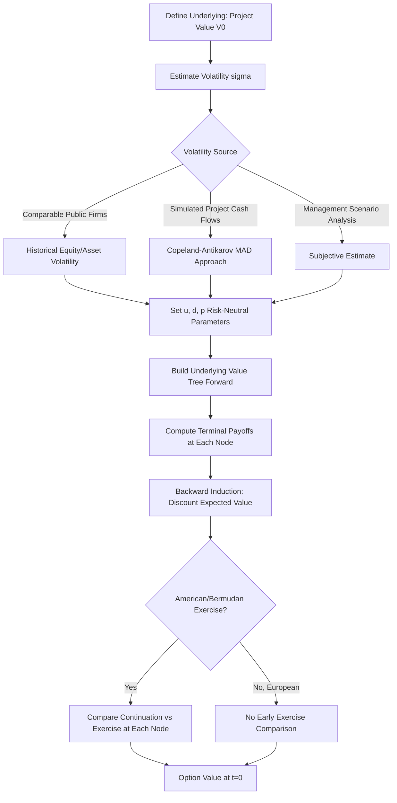

## Lattice Methods for Real Option Valuation

### Overview and Rationale

Lattice methods (binomial and trinomial trees) are discrete-time approximations of continuous stochastic processes used to value options where either (a) no closed-form solution exists, or (b) early exercise, path-dependency, or managerial flexibility must be modeled explicitly. In real options analysis, lattices are the dominant valuation technique because real options almost always feature **American-style exercise** (management can act at any time, not just at a fixed maturity), multiple interacting options (expand, contract, abandon, defer), and underlying assets (project NPV, commodity prices, reserves) that are not always cleanly consistent with Black-Scholes assumptions.

The lattice discretizes the life of the option into $N$ steps of length $\Delta t = T/N$, models the underlying value as moving up or down (or up/flat/down for trinomial) at each step, and works backward from terminal payoffs to the present, applying the optimal exercise decision at every node.

### Binomial Lattice: Construction (Cox-Ross-Rubinstein)

**Step 1 — Parameterize up/down moves:**

$$u = e^{\sigma\sqrt{\Delta t}}, \quad d = \frac{1}{u} = e^{-\sigma\sqrt{\Delta t}}$$

Where $\sigma$ is the volatility of the underlying (project value, commodity price, etc.) and $\Delta t = T/N$.

**Step 2 — Risk-neutral probability:**

$$p = \frac{e^{(r-q)\Delta t} - d}{u - d}$$

Where $r$ is the risk-free rate and $q$ is the "dividend yield" — in real options, $q$ often represents the **value leakage rate**: the opportunity cost of delaying exercise, such as cash flows or competitive erosion the project owner forgoes by not investing immediately (this is the real-options analog of dividend yield and is critical to get right, since it drives the incentive to exercise early).

**Step 3 — Build the underlying value tree:**

At node $(i,j)$ representing $j$ up-moves out of $i$ total steps:

$$V_{i,j} = V_0 \cdot u^j \cdot d^{i-j}$$

**Step 4 — Terminal payoffs**, then **backward induction**:

$$f_{i,j} = e^{-r\Delta t}\left[p \cdot f_{i+1,j+1} + (1-p)\cdot f_{i+1,j}\right]$$

**Step 5 — For American-style real options**, compare the continuation value against the immediate exercise value at every node:

$$f_{i,j} = \max\left(\text{Exercise Value}_{i,j}, \; e^{-r\Delta t}\left[p f_{i+1,j+1} + (1-p) f_{i+1,j}\right]\right)$$

This last step is the entire reason lattices dominate real options work: closed-form Black-Scholes cannot handle the "compare to immediate exercise at every point" logic that defines managerial flexibility.

### Worked Example: Option to Expand (American Call, Binomial)

**Facts:** A firm has a project currently worth $V_0 = \$100M$. Management holds a 3-year option to invest an additional $I = \$30M$ to double project scale (payoff = current project value at exercise, since doubling adds 100% of value, minus the additional investment). $\sigma = 30\%$, $r = 5\%$, $q = 0\%$ (no cash flow leakage assumed for simplicity), $N = 3$ steps ($\Delta t = 1$ year).

**Parameters:**

$$u = e^{0.30\sqrt{1}} = 1.3499, \quad d = 1/1.3499 = 0.7408$$

$$p = \frac{e^{0.05(1)} - 0.7408}{1.3499 - 0.7408} = \frac{1.0513 - 0.7408}{0.6091} = 0.5098$$

**Underlying value tree ($V_0=100$):**

| Step 0 | Step 1 | Step 2 | Step 3 |
| --- | --- | --- | --- |
| 100.00 | 134.99 / 74.08 | 182.21 / 100.00 / 54.88 | 245.96 / 134.99 / 74.08 / 40.66 |

**Terminal payoffs** (option to expand: pay $30M to receive value equal to underlying project value increment; here modeled simply as $\max(V_T - 30, 0)$ for illustration of a simple expansion call):

- $V=245.96 \to \max(245.96-30,0) = 215.96$
- $V=134.99 \to \max(134.99-30,0) = 104.99$
- $V=74.08 \to \max(74.08-30,0) = 44.08$
- $V=40.66 \to \max(40.66-30,0) = 10.66$

**Backward induction at Step 2** (discount factor $e^{-0.05} = 0.9512$):

Node (2, up-up), $V=182.21$: continuation $= 0.9512[0.5098(215.96) + 0.4902(104.99)] = 0.9512[110.09+51.47]=153.75$; exercise value $=182.21-30=152.21$. Take max: **153.75** (hold, don't exercise early)

Node (2, mid), $V=100.00$: continuation $=0.9512[0.5098(104.99)+0.4902(44.08)]=0.9512[53.53+21.61]=71.51$; exercise $=100-30=70$. Take max: **71.51**

Node (2, down-down), $V=54.88$: continuation $=0.9512[0.5098(44.08)+0.4902(10.66)]=0.9512[22.47+5.23]=26.35$; exercise $=54.88-30=24.88$. Take max: **26.35**

**Backward induction at Step 1:**

Node (1, up), $V=134.99$: continuation $=0.9512[0.5098(153.75)+0.4902(71.51)]=0.9512[78.38+35.06]=107.87$; exercise $=134.99-30=104.99$. Take max: **107.87**

Node (1, down), $V=74.08$: continuation $=0.9512[0.5098(71.51)+0.4902(26.35)]=0.9512[36.46+12.92]=46.85$; exercise $=74.08-30=44.08$. Take max: **46.85**

**Backward induction at Step 0:**

$$f_0 = 0.9512[0.5098(107.87) + 0.4902(46.85)] = 0.9512[54.99 + 22.97] = \$74.16M$$

The real option to expand is worth **≈$74.16M**. In every node here, continuation value exceeded immediate exercise value, meaning the optimal strategy is to **wait** — consistent with the standard real-options intuition that absent dividend-like leakage ($q=0$), it is never optimal to exercise an American call early, since holding preserves both the insurance value against downside and the upside participation.

### Trinomial Lattices

Trinomial trees add a "flat"/middle branch at each step (up, flat, down), improving convergence speed and numerical stability, particularly useful for:

- Options with **multiple state variables** or barriers (e.g., abandonment options with a floor value)
- Faster convergence to the continuous-time solution with fewer time steps than binomial

**Standard trinomial parameterization (one common convention):**

$$u = e^{\sigma\sqrt{3\Delta t}}, \quad d = 1/u, \quad m=1$$

$$p_u = \frac{1}{6} + \frac{(r-q-\sigma^2/2)\sqrt{\Delta t/(12\sigma^2)}}{1}, \quad p_d = \frac{1}{6} - \frac{(r-q-\sigma^2/2)\sqrt{\Delta t/(12\sigma^2)}}{1}, \quad p_m = \frac{2}{3}$$

[Inference: exact trinomial parameterizations vary across textbooks (Boyle 1986, Kamrad-Ritchken 1991 being common references); practitioners should confirm which convention a given software implementation uses, as the probabilities and step sizes are not universally standardized the way CRR binomial is.]

### Modeling Compound and Multiple Real Options

Real-world projects frequently embed **sequential or overlapping options** — e.g., an option to defer, which if exercised leads to an option to expand or abandon. Lattices handle this naturally because backward induction can apply **different decision rules at different nodes and different time layers**:

$$f_{i,j} = \max\left[\text{Defer (continuation)}, \; \text{Expand Payoff}, \; \text{Abandon (salvage value)}, \; \text{Contract Payoff}\right]$$

This is one of the strongest advantages of lattices over closed-form methods: multiple embedded real options can be layered into the *same* tree, with the optimal decision re-evaluated at each node.

### Convergence and Practical Implementation

- **Number of steps ($N$):** Binomial trees converge to the Black-Scholes value (in the European, no-early-exercise case) as $N \to \infty$, but converge somewhat irregularly (oscillating) for smaller $N$; practitioners commonly use $N \geq 50$–100 for reasonable accuracy, though real options analyses often use far fewer explicit steps (e.g., annual steps over a multi-year horizon) because inputs like $\sigma$ for a real project are themselves rough estimates, making excessive numerical precision unwarranted.
- **Volatility estimation** is the central practical challenge in real options lattices: unlike financial options, there is no market-traded underlying, so $\sigma$ must be estimated via (a) historical volatility of comparable public firms/projects, (b) Monte Carlo simulation of the project's own cash flow drivers (the "Consolidated Approach" / Copeland-Antikarov method, simulating cash flows and inferring an implied volatility of project value), or (c) management judgment/scenario analysis. [Speculation: the choice of volatility-estimation method is a well-known point of contention in the real options literature and can materially swing valuation outputs — the Copeland-Antikarov single-volatility-number approach in particular has been critiqued in academic literature for the "Marketed Asset Disclaimer" (MAD) assumption required to justify risk-neutral valuation of non-traded assets.]
- **Discretization of exercise dates:** Lattices naturally model **Bermudan-style** exercise (decisions available only at each step), which is often actually more realistic for real options than continuous American exercise, since management typically reviews projects at discrete intervals (quarterly board meetings, annual capital budget cycles) rather than continuously.

### Lattice vs. Closed-Form vs. Monte Carlo — When to Use Each

| Method | Best For | Limitation |
| --- | --- | --- |
| Black-Scholes / closed-form | Simple European-style real options, quick approximations | Cannot handle early exercise or path dependency |
| Binomial/trinomial lattice | American/Bermudan exercise, compound options, multiple embedded options | Computationally heavier; volatility input still required |
| Monte Carlo (with Longstaff-Schwartz for early exercise) | High-dimensional problems (multiple correlated state variables), path-dependent payoffs | Early exercise handling is more complex (regression-based); slower for low-dimensional problems |
| Decision tree (discrete probabilities, no risk-neutral pricing) | Binary/discrete managerial decisions without a clean continuous underlying | Requires subjective probability estimates; not strictly "option pricing" |

### Diagram: Binomial Lattice Structure for the Expansion Option Example

<svg xmlns="http://www.w3.org/2000/svg" viewBox="0 0 760 460">
<text x="380" y="25" text-anchor="middle" font-size="16" font-weight="bold" fill="#1a1a1a">Binomial Lattice — Expansion Option (svg_diagram)</text>

<circle cx="100" cy="230" r="26" fill="#e8f1fb" stroke="#2166ac" stroke-width="2" />
<text x="100" y="226" text-anchor="middle" font-size="10">V=100</text>
<text x="100" y="240" text-anchor="middle" font-size="10">f=74.16</text>

<circle cx="300" cy="130" r="26" fill="#e8f1fb" stroke="#2166ac" stroke-width="2" />
<text x="300" y="126" text-anchor="middle" font-size="10">V=134.99</text>
<text x="300" y="140" text-anchor="middle" font-size="10">f=107.87</text>
<circle cx="300" cy="330" r="26" fill="#e8f1fb" stroke="#2166ac" stroke-width="2" />
<text x="300" y="326" text-anchor="middle" font-size="10">V=74.08</text>
<text x="300" y="340" text-anchor="middle" font-size="10">f=46.85</text>

<circle cx="500" cy="80" r="26" fill="#e8f1fb" stroke="#2166ac" stroke-width="2" />
<text x="500" y="76" text-anchor="middle" font-size="9">V=182.21</text>
<text x="500" y="90" text-anchor="middle" font-size="9">f=153.75</text>
<circle cx="500" cy="230" r="26" fill="#e8f1fb" stroke="#2166ac" stroke-width="2" />
<text x="500" y="226" text-anchor="middle" font-size="9">V=100.00</text>
<text x="500" y="240" text-anchor="middle" font-size="9">f=71.51</text>
<circle cx="500" cy="380" r="26" fill="#e8f1fb" stroke="#2166ac" stroke-width="2" />
<text x="500" y="376" text-anchor="middle" font-size="9">V=54.88</text>
<text x="500" y="390" text-anchor="middle" font-size="9">f=26.35</text>

<circle cx="700" cy="50" r="24" fill="#fdecea" stroke="#b2182b" stroke-width="2" />
<text x="700" y="46" text-anchor="middle" font-size="8">V=245.96</text>
<text x="700" y="58" text-anchor="middle" font-size="8">pay=215.96</text>
<circle cx="700" cy="160" r="24" fill="#fdecea" stroke="#b2182b" stroke-width="2" />
<text x="700" y="156" text-anchor="middle" font-size="8">V=134.99</text>
<text x="700" y="168" text-anchor="middle" font-size="8">pay=104.99</text>
<circle cx="700" cy="300" r="24" fill="#fdecea" stroke="#b2182b" stroke-width="2" />
<text x="700" y="296" text-anchor="middle" font-size="8">V=74.08</text>
<text x="700" y="308" text-anchor="middle" font-size="8">pay=44.08</text>
<circle cx="700" cy="410" r="24" fill="#fdecea" stroke="#b2182b" stroke-width="2" />
<text x="700" y="406" text-anchor="middle" font-size="8">V=40.66</text>
<text x="700" y="418" text-anchor="middle" font-size="8">pay=10.66</text>

<line x1="126" y1="230" x2="274" y2="130" stroke="#888" stroke-width="1.5" />
<line x1="126" y1="230" x2="274" y2="330" stroke="#888" stroke-width="1.5" />
<line x1="326" y1="130" x2="474" y2="80" stroke="#888" stroke-width="1.5" />
<line x1="326" y1="130" x2="474" y2="230" stroke="#888" stroke-width="1.5" />
<line x1="326" y1="330" x2="474" y2="230" stroke="#888" stroke-width="1.5" />
<line x1="326" y1="330" x2="474" y2="380" stroke="#888" stroke-width="1.5" />
<line x1="526" y1="80" x2="676" y2="50" stroke="#888" stroke-width="1.5" />
<line x1="526" y1="80" x2="676" y2="160" stroke="#888" stroke-width="1.5" />
<line x1="526" y1="230" x2="676" y2="160" stroke="#888" stroke-width="1.5" />
<line x1="526" y1="230" x2="676" y2="300" stroke="#888" stroke-width="1.5" />
<line x1="526" y1="380" x2="676" y2="300" stroke="#888" stroke-width="1.5" />
<line x1="526" y1="380" x2="676" y2="410" stroke="#888" stroke-width="1.5" />

<text x="100" y="420" font-size="11" fill="#333">t=0</text>

<text x="300" y="420" font-size="11" fill="#333">t=1</text>

<text x="500" y="440" font-size="11" fill="#333">t=2</text>

<text x="700" y="440" font-size="11" fill="#333">t=3 (terminal)</text>

</svg>

### Process Flow: Building a Real Options Lattice

### Key Points

- Lattice methods discretize time and enable exact handling of American/Bermudan early-exercise decisions, which closed-form models cannot do
- CRR binomial parameterization ($u=e^{\sigma\sqrt{\Delta t}}$, risk-neutral $p$) is the standard starting point; trinomial trees improve convergence and handle additional complexity
- Backward induction with a $\max(\text{exercise}, \text{continuation})$ rule at each node is the mechanical core of American-style real option valuation
- Volatility estimation, not the tree mechanics themselves, is typically the dominant source of valuation uncertainty in real options applications
- Lattices naturally accommodate compound and multiple overlapping real options (defer, expand, contract, abandon) within a single tree structure

**Related Topics**

- Monte Carlo simulation with Longstaff-Schwartz regression for American-style path-dependent options
- Copeland-Antikarov "Marketed Asset Disclaimer" volatility estimation methodology
- Option to defer / option to abandon as standalone real option archetypes
- Compound options and sequential/staged investment decisions
- Trinomial tree parameterizations (Boyle, Kamrad-Ritchken)
- Comparison of risk-neutral vs. subjective (decision-tree) probability approaches in capital budgeting
- Convergence analysis and numerical stability of discrete-time option pricing models