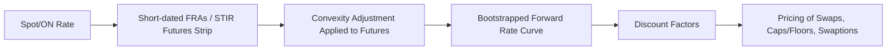

## Forward Rate Agreements and Rate Futures

### Overview

Forward Rate Agreements (FRAs) and interest rate futures are foundational instruments in interest rate derivatives markets, allowing counterparties to lock in a future borrowing or lending rate without exchanging principal. Both instruments derive their value from a reference interest rate observed at a future date, but they differ substantially in settlement mechanics, credit structure, and market venue (over-the-counter versus exchange-traded).

### Forward Rate Agreements (FRAs)

#### Definition and Mechanics

An FRA is a bilateral, cash-settled OTC contract in which two parties agree on an interest rate to be applied to a notional principal amount over a specified future period. No principal ever changes hands; only the difference between the contracted (fixed) rate and the prevailing reference rate at settlement is exchanged.

**Key Points**

- The **buyer** of an FRA (long the FRA) is protecting against rising rates — economically equivalent to being able to borrow at a fixed rate.
- The **seller** of an FRA (short the FRA) is protecting against falling rates — economically equivalent to being able to lend at a fixed rate.
- FRAs are quoted using notation such as "3x6," "6x9," or "1x4," where the first number is the number of months until the contract period begins, and the second number is the number of months until the contract period ends.

#### FRA Notation Example

A "3x6 FRA" means:

- The contract period begins in 3 months.
- The contract period ends in 6 months.
- The underlying reference period is therefore a 3-month rate, observed 3 months forward.

#### Settlement Mechanics

FRAs settle at the **start** of the contract period (not the end), which requires discounting the settlement amount. This is a critical distinction from a naive interest calculation, because the interest differential would normally be paid at the end of the period, but FRA convention pays it upfront.

The standard settlement amount formula (from the buyer's perspective) is:

$$\text{Settlement} = \frac{(R_{ref} - R_{fixed}) \times N \times \frac{d}{B}}{1 + R_{ref} \times \frac{d}{B}}$$

Where:

- $R_{ref}$ = the reference rate observed at fixing (e.g., a SOFR-based or, historically, LIBOR-based rate)
- $R_{fixed}$ = the contracted FRA rate
- $N$ = notional principal
- $d$ = number of days in the contract period
- $B$ = day count basis (360 or 365, depending on currency convention)

The denominator $\left(1 + R_{ref} \times \frac{d}{B}\right)$ discounts the raw interest differential back to the settlement date, since the payment occurs at the beginning of the reference period rather than at its end.

**Example**

Suppose a corporate treasurer buys a 3x6 FRA with:

- Notional $N = \$10{,}000{,}000$
- Fixed rate $R_{fixed} = 5.00\%$
- Reference period: 90 days, basis $B = 360$

At fixing, the reference rate is observed at $R_{ref} = 5.50\%$.

Raw interest differential:

$$(0.0550 - 0.0500) \times 10{,}000{,}000 \times \frac{90}{360} = 12{,}500$$

Discounted settlement (paid at start of period):

$$\frac{12{,}500}{1 + 0.0550 \times \frac{90}{360}} = \frac{12{,}500}{1.01375} \approx 12{,}330.80$$

Since $R_{ref} > R_{fixed}$, the FRA buyer receives approximately $12,330.80 from the seller, compensating for the higher-than-contracted borrowing cost they would face in the cash market.

#### Credit and Documentation

FRAs are typically documented under an ISDA Master Agreement with a Schedule and Credit Support Annex (CSA). Because they are bilateral OTC instruments, they carry counterparty credit risk, which is mitigated through:

- Collateral posting (variation margin) under a CSA
- Central clearing (increasingly common for standardized FRAs post-Dodd-Frank/EMIR)
- Netting arrangements across a counterparty's derivatives portfolio

[Inference] Since the 2021–2023 transition away from LIBOR, most newly traded FRAs in USD, GBP, and JPY reference overnight rate compounded-in-arrears conventions (SOFR, SONIA, TONA) rather than a forward-looking term rate, which changes how the "reference rate" in the settlement formula is actually constructed — often requiring an in-arrears compounding calculation rather than a simple fixing.

### Interest Rate Futures

#### Definition and Mechanics

Interest rate futures are exchange-traded, standardized contracts that also allow market participants to hedge or speculate on future interest rate levels. Unlike FRAs, futures are:

- Standardized in notional, expiry, and reference index by the exchange
- Marked-to-market daily with margin posted to a central clearinghouse
- Free of bilateral counterparty credit risk (the clearinghouse is the counterparty to every trade)

#### Short-Term Interest Rate (STIR) Futures

The most widely traded interest rate futures are short-term contracts referencing money market rates, such as:

- **SOFR futures** (CME) — replaced Eurodollar futures as the primary USD short-term rate benchmark following LIBOR cessation
- **SONIA futures** (ICE) — GBP short-term rate benchmark
- **Euribor futures** (ICE, Eurex) — EUR short-term rate benchmark

**Key Points**

- STIR futures are quoted on a price basis of $100 - \text{rate}$, so a quoted price of 95.00 implies an annualized rate of 5.00%.
- This price convention means the futures price moves inversely to interest rates: rising rates cause the futures price to fall.
- Tick value is standardized by the exchange (e.g., CME SOFR futures typically have a minimum price fluctuation of 0.0025 for the front quarterly contract, corresponding to a fixed dollar value per contract per basis point).

#### Pricing Relationship to FRAs

In theory, an interest rate future and the equivalent FRA on the same reference rate and period should have very similar implied rates, since both derive value from the same forward interest rate curve. In practice, a small but persistent difference exists, known as the **convexity adjustment**.

$$\text{Futures Rate} = \text{FRA Rate} + \text{Convexity Adjustment}$$

The convexity adjustment arises because:

- Futures are marked-to-market daily; gains and losses are settled in cash each day and can be reinvested or refinanced at the prevailing (uncertain) short-term rate.
- FRAs settle only once, at the start of the reference period.
- This difference in the timing and reinvestment characteristics of cash flows means a futures position has a slightly different convexity profile than the corresponding forward (FRA) position — even though both reference the same underlying rate.

[Unverified] The magnitude of the convexity adjustment is typically small for short-dated contracts (a fraction of a basis point) but grows approximately with the square of time to expiry, becoming more material for longer-dated futures (2+ years out), which is why traders constructing forward curves from a futures strip must apply this adjustment rather than treating futures rates and FRA rates as directly interchangeable.

#### Treasury and Government Bond Futures

Separately from STIR futures, longer-tenor interest rate exposure is often hedged using government bond futures (e.g., U.S. Treasury futures, German Bund futures), which reference a basket of deliverable bonds rather than a single money market rate.

**Key Points**

- These futures involve a **cheapest-to-deliver (CTD)** mechanism, where the short position can choose which eligible bond to deliver, typically selecting the one that is most economical given the futures' conversion factor system.
- The conversion factor normalizes different coupon/maturity bonds to a notional standardized bond (e.g., a 6% coupon notional bond), so that delivery of any eligible bond results in a comparable invoice price.
- Because bond futures pricing depends on both the interest rate curve and CTD dynamics, their behavior is more complex than the relatively direct rate-to-price mapping in STIR futures.

### Hedging Applications

#### Using FRAs to Hedge a Future Borrowing

A corporate borrower expecting to draw a floating-rate loan in 3 months for a 3-month term can buy a 3x6 FRA to lock in the effective borrowing rate today. If rates rise by the time the loan is drawn, the FRA payoff offsets the higher loan cost; if rates fall, the borrower forgoes the benefit of lower rates but has certainty over their cost of funds.

#### Using Futures Strips to Hedge a Longer Exposure

A series of consecutive STIR futures contracts (a "strip") can be combined to synthetically hedge exposure over a longer horizon than any single contract covers. For example, a bank hedging 12 months of floating-rate exposure might sell a strip of four consecutive 3-month SOFR futures contracts, each covering a successive quarter.

### FRA vs. Futures Comparison

| Feature | FRA | Interest Rate Future |
| --- | --- | --- |
| Venue | OTC, bilateral | Exchange-traded |
| Standardization | Customizable notional, dates, currency | Standardized by exchange |
| Settlement | Single cash settlement, discounted, at start of period | Daily mark-to-market via margin |
| Counterparty risk | Bilateral (mitigated by CSA/clearing) | Central clearinghouse (minimal) |
| Convexity | No convexity adjustment inherent to the instrument itself | Convexity adjustment vs. equivalent FRA rate |
| Liquidity | Deep in major currencies but less transparent pricing | Highly liquid, transparent order book pricing |

### Forward Rate Curve Construction (Illustration)

<svg xmlns="http://www.w3.org/2000/svg" viewBox="0 0 640 260">
<text x="20" y="20" font-size="13" font-weight="bold" fill="#222">FRA Settlement Timing (svg_diagram)</text>
<line x1="60" y1="140" x2="580" y2="140" stroke="#333" stroke-width="2" />
<circle cx="100" cy="140" r="5" fill="#1f6feb" />
<text x="80" y="165" font-size="11" fill="#333">Trade Date</text>
<circle cx="300" cy="140" r="5" fill="#d1242f" />
<text x="240" y="165" font-size="11" fill="#333">Settlement Date (3 months)</text>
<text x="240" y="120" font-size="11" fill="#333">Fixing occurs; discounted</text>
<text x="240" y="105" font-size="11" fill="#333">cash settlement paid here</text>
<circle cx="520" cy="140" r="5" fill="#2da44e" />
<text x="470" y="165" font-size="11" fill="#333">Period End (6 months)</text>
<text x="440" y="105" font-size="11" fill="#333">Reference period ends</text>
<text x="440" y="90" font-size="11" fill="#333">(no cash flow here)</text>
<line x1="300" y1="140" x2="520" y2="140" stroke="#888" stroke-width="4" />
<text x="370" y="185" font-size="11" fill="#555">3-month reference period</text>
</svg>

### Regulatory and Market Structure Notes

- Central clearing mandates under Dodd-Frank (US) and EMIR (EU) have pushed a substantial share of standardized FRA volume into cleared venues, narrowing (though not eliminating) some of the structural differences between OTC FRAs and exchange futures.
- [Inference] The post-LIBOR transition has generally increased the operational complexity of FRA settlement calculations, since compounded-in-arrears rates require the reference rate to be computed over the observation period rather than fixed once at the start, which was the simpler convention under term LIBOR.

**Related Topics**

- Interest Rate Swaps (fixed-for-floating) and swap curve bootstrapping
- SOFR compounding conventions (in-arrears vs. in-advance)
- Convexity adjustment derivation and Ho-Lee/Hull-White model applications
- Eurodollar futures legacy market structure and transition to SOFR futures
- Cheapest-to-deliver (CTD) analysis for government bond futures
- Interest rate caps, floors, and collars
- Basis risk between FRA/futures hedges and underlying floating-rate exposures
- Margin methodology (SPAN/VaR-based) for cleared interest rate derivatives