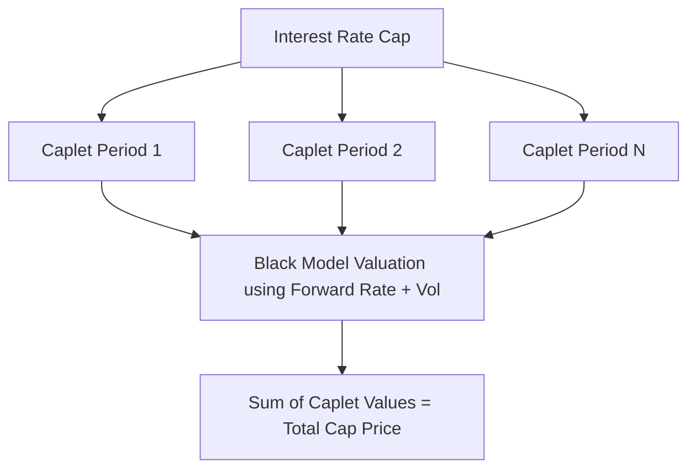

## Interest Rate Caps and Floors

### Overview

Interest rate caps and floors are OTC option-based instruments used to hedge exposure to floating interest rates while preserving upside participation. A cap protects a floating-rate borrower against rising rates, while a floor protects a floating-rate lender (or investor) against falling rates. Both instruments are constructed as portfolios of simpler options called caplets and floorlets, each corresponding to a single reset period.

### Structural Building Blocks

#### Caplets and Floorlets

A cap is not a single option but a **strip of caplets**, each of which is a European call option on a floating interest rate observed at a specific future reset date, with payoff realized (typically) at the end of the corresponding accrual period.

**Key Points**

- A **caplet** pays out when the reference rate exceeds the strike (cap rate) at the fixing date.
- A **floorlet** pays out when the reference rate falls below the strike (floor rate) at the fixing date.
- A cap with maturity of, say, 5 years and quarterly resets is effectively a strip of 19–20 caplets (excluding the first period, which is often already known/fixed at trade inception).

#### Payoff Formulas

For a single caplet covering accrual period $[T_1, T_2]$ with day count fraction $\tau$ and notional $N$:

$$\text{Caplet Payoff} = N \times \tau \times \max(R_{ref} - K, 0)$$

For a single floorlet over the same period:

$$\text{Floorlet Payoff} = N \times \tau \times \max(K - R_{ref}, 0)$$

Where:

- $R_{ref}$ = reference floating rate observed at the fixing date (e.g., compounded SOFR, or historically term LIBOR)
- $K$ = the strike (cap or floor rate)
- $\tau$ = accrual fraction (e.g., days/360 or days/365)

The payoff is generally paid in arrears, at the end of the accrual period, unlike an FRA's upfront discounted settlement.

**Example**

Consider a 3-month caplet with:

- Notional $N = \$5{,}000{,}000$
- Strike $K = 4.00\%$
- Accrual fraction $\tau = 0.25$ (approx. 90/360)

If the reference rate fixes at $R_{ref} = 4.75\%$:

$$\text{Payoff} = 5{,}000{,}000 \times 0.25 \times \max(0.0475 - 0.0400, 0) = 5{,}000{,}000 \times 0.25 \times 0.0075 = 9{,}375$$

The cap buyer receives $9,375 for that period, compensating for the extra interest cost above the 4.00% strike.

### Cap and Floor as Hedging Instruments

#### Cap: Protection for a Floating-Rate Borrower

A borrower with a floating-rate loan can buy a cap to place a ceiling on their effective borrowing cost while still benefiting if rates fall below the strike. This differs fundamentally from a swap-based hedge (paying fixed, receiving floating), which locks in a single rate regardless of direction.

**Key Points**

- Buying a cap costs an upfront premium, unlike an interest rate swap, which typically has zero upfront value at initiation.
- The premium reflects the market's expectation of rate volatility and the extent to which the reference rate is expected to exceed the strike over the life of the cap.

#### Floor: Protection for a Floating-Rate Lender/Investor

An investor holding a floating-rate note or a bank funding at a floating rate on the asset side can buy a floor to guarantee a minimum yield, while still benefiting from rates rising above the strike.

#### Collar: Combining a Cap and Floor

A **collar** combines a long cap position with a short floor position (or vice versa), narrowing the range of possible effective rates and typically reducing or eliminating the net premium paid.

$$\text{Collar Payoff (Borrower)} = \text{Long Cap Payoff} - \text{Short Floor Payoff}$$

**Key Points**

- A **zero-cost collar** is structured so that the premium received from selling the floor exactly offsets the premium paid for the cap.
- The tradeoff is that the borrower gives up the benefit of rates falling below the floor strike, in exchange for not paying an upfront premium.

### Valuation

#### Black Model for Caplets

Caplets and floorlets are conventionally valued using the **Black (1976) model**, treating the forward rate over the accrual period as a lognormally distributed underlying, analogous to a call/put option on a forward price.

For a caplet:

$$\text{Caplet Value} = N \times \tau \times P(0, T_2) \times \left[ F \times \Phi(d_1) - K \times \Phi(d_2) \right]$$

Where:

$$d_1 = \frac{\ln(F/K) + \frac{1}{2}\sigma^2 T_1}{\sigma \sqrt{T_1}}, \quad d_2 = d_1 - \sigma \sqrt{T_1}$$

- $F$ = forward rate for the period $[T_1, T_2]$, observed today
- $K$ = strike
- $P(0, T_2)$ = discount factor to the payment date
- $\sigma$ = volatility of the forward rate
- $\Phi(\cdot)$ = standard normal cumulative distribution function
- $T_1$ = time to the fixing/reset date

**Key Points**

- The total cap value is simply the sum of the individual caplet values, since each caplet is priced independently off its own forward rate and volatility.
- This additive property is a defining structural feature of caps/floors versus swaptions, where the underlying swap rate introduces correlation across the underlying forward rates that cannot be decomposed so simply.

#### Volatility: Cap Vol vs. Caplet Vol

Market-quoted cap volatilities are usually **flat volatilities** — a single volatility number that, when applied uniformly to every caplet in the strip via the Black formula, reproduces the market price of the entire cap.

**Key Points**

- Flat vols are a market quoting convention, not a statement that each caplet actually has the same instantaneous volatility.
- **Spot (forward) volatilities**, or caplet-specific vols, are extracted from a set of flat vols across different maturities via a bootstrapping procedure, since consecutive flat-vol cap quotes share overlapping caplets.
- [Inference] Because flat vols are averages across the underlying caplet vols within a given cap tenor, the bootstrapped forward vol curve often exhibits a distinctive "hump" shape, reflecting that short-dated forward rate volatility, medium-term vol, and long-dated vol do not decay uniformly with tenor. This shape is a common empirical feature of interest rate vol surfaces rather than a universal mathematical necessity.

#### The SABR / Volatility Smile Consideration

[Unverified] In practice, cap/floor markets exhibit a volatility smile or skew — implied volatility varies by strike, not just by tenor — which the basic Black model does not capture. Practitioners commonly extend pricing using stochastic volatility models such as SABR to fit the smile observed across different strikes for the same underlying tenor, though the specific parameterization and calibration approach can vary by desk and currency.

### Post-LIBOR Considerations

With the shift to overnight risk-free rates (SOFR, SONIA, €STR), caplets on these rates typically reference a **compounded-in-arrears** rate over the accrual period rather than a rate fixed at the start of the period (as was standard under term LIBOR).

**Key Points**

- This changes the payoff timing convention: since the compounded rate is only fully known at the end of the accrual period, both the fixing and the payment effectively occur close together, near $T_2$ rather than at $T_1$.
- Pricing models must adapt the discounting and forward-rate dynamics to reflect that the "rate" being optioned is now a backward-looking, path-dependent average rather than a single point-in-time observation, which introduces subtleties in the model's treatment of the relevant volatility and timing adjustments compared to the legacy term-rate framework.

### Greeks and Risk Sensitivities

**Key Points**

- **Delta**: sensitivity of the cap/floor value to changes in the underlying forward rate(s); a cap has positive delta with respect to rates (value increases as rates rise).
- **Vega**: sensitivity to changes in implied volatility; caps and floors, being option-based, carry meaningful vega exposure unlike swaps.
- **Theta**: time decay of option value as caplets approach their fixing dates.
- Hedging a cap book typically requires managing delta via the underlying rate curve (e.g., swaps or futures) and vega via the volatility surface, since these two risk dimensions do not move in lockstep.

### Cap/Floor vs. Swap vs. Swaption Comparison

| Feature | Cap/Floor | Interest Rate Swap | Swaption |
| --- | --- | --- | --- |
| Payoff type | Option (asymmetric) | Linear (symmetric) | Option on a swap |
| Upfront cost | Premium paid | Typically zero at initiation | Premium paid |
| Underlying | Strip of independent forward rates | Fixed vs. floating cash flows | Single forward swap rate |
| Decomposability | Sum of independent caplets/floorlets | N/A (single linear instrument) | Not decomposable into independent pieces |
| Typical use | Cap/floor on floating exposure while retaining upside/downside | Full rate conversion (fixed-for-floating) | Option to enter into a swap at a future date |

### Structural Diagram

<svg xmlns="http://www.w3.org/2000/svg" viewBox="0 0 640 260">
<text x="20" y="20" font-size="13" font-weight="bold" fill="#222">Cap Payoff vs. Floating Rate at Expiry (svg_diagram)</text>
<line x1="60" y1="220" x2="600" y2="220" stroke="#333" stroke-width="2" />
<line x1="60" y1="220" x2="60" y2="30" stroke="#333" stroke-width="2" />
<text x="580" y="235" font-size="11" fill="#333">Rate</text>
<text x="20" y="30" font-size="11" fill="#333">Payoff</text>
<line x1="60" y1="220" x2="300" y2="220" stroke="#d1242f" stroke-width="3" />
<line x1="300" y1="220" x2="560" y2="60" stroke="#d1242f" stroke-width="3" />
<line x1="300" y1="220" x2="300" y2="240" stroke="#555" stroke-width="1" stroke-dasharray="3,3" />
<text x="270" y="252" font-size="11" fill="#555">Strike (K)</text>
<text x="380" y="120" font-size="11" fill="#333">Payoff = max(R - K, 0)</text>
</svg>

**Related Topics**

- Black (1976) model derivation and assumptions
- SABR stochastic volatility model for interest rate options
- Swaptions and the swap-rate volatility surface
- Volatility surface bootstrapping (flat vol to forward vol)
- Compounded-in-arrears vs. compounded-in-advance rate conventions (SOFR/SONIA)
- Digital caps/floors and other exotic rate option structures
- Cap/floor Greeks hedging with delta-neutral and vega-neutral portfolios
- Bermudan swaptions and callable structured notes