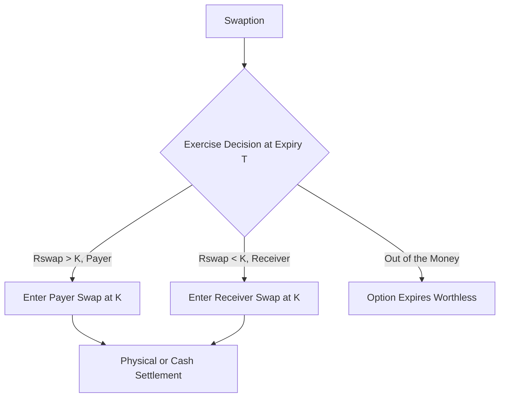

## Swaptions and Their Payoffs

### Overview

A swaption is an option that grants its holder the right, but not the obligation, to enter into an underlying interest rate swap at a predetermined fixed rate on (or by) a specified future date. Swaptions combine the optionality of caps/floors with the correlated, multi-period cash flow structure of swaps, making them structurally distinct from a simple strip of independent options.

### Basic Definitions

#### Payer and Receiver Swaptions

**Key Points**

- A **payer swaption** gives the holder the right to enter into a swap as the fixed-rate payer (and floating-rate receiver). It is exercised when rates rise, since the holder can then pay a below-market fixed rate.
- A **receiver swaption** gives the holder the right to enter into a swap as the fixed-rate receiver (and floating-rate payer). It is exercised when rates fall, since the holder can then receive an above-market fixed rate.
- The economic exposure of a payer swaption is analogous to a call option on interest rates (or a put option on bond prices), while a receiver swaption is analogous to a put option on interest rates (or a call option on bond prices).

#### Swaption Notation

Swaptions are typically described by two tenors: the option expiry and the underlying swap tenor. For example, a "2y5y payer swaption" (sometimes written 2Y into 5Y) is:

- An option expiring in 2 years
- Giving the right to enter a 5-year swap at that point

### Payoff Structure

#### Payoff at Exercise

At the expiry date $T$, the payer swaption is exercised if the prevailing market swap rate $R_{swap}$ exceeds the strike rate $K$. The value of exercising is the present value (as of $T$) of the difference between the strike and market rate, applied across the underlying swap's cash flows.

For a payer swaption with notional $N$, strike $K$, and an annuity factor $A(T)$ representing the present value (at $T$) of a stream of $1 payments on the underlying swap's fixed leg dates:

$$\text{Payer Swaption Payoff} = N \times A(T) \times \max(R_{swap}(T) - K, 0)$$

For a receiver swaption:

$$\text{Receiver Swaption Payoff} = N \times A(T) \times \max(K - R_{swap}(T), 0)$$

**Key Points**

- $A(T)$, often called the **PVBP** (present value of a basis point, scaled) or **annuity factor**, is the sum of discount factors to each fixed-leg payment date, weighted by the accrual fraction of each period.
- Because the payoff depends on a single swap rate applied across an entire annuity of cash flows (rather than on independent forward rates period-by-period), the swaption cannot be decomposed into a simple sum of independent options — unlike a cap or floor.

**Example**

Consider a 1y5y payer swaption with:

- Notional $N = \$10{,}000{,}000$
- Strike $K = 4.50\%$
- At expiry, the 5-year swap rate is observed at $R_{swap}(T) = 5.00\%$
- Annuity factor $A(T) = 4.55$ (i.e., the discounted sum of unit fixed-leg payments over the 5-year swap)

$$\text{Payoff} = 10{,}000{,}000 \times 4.55 \times \max(0.0500 - 0.0450, 0) = 10{,}000{,}000 \times 4.55 \times 0.0050 = 227{,}500$$

The holder receives $227,500, equivalent in value to entering a 5-year payer swap at 4.50% when the market rate is 5.00%.

#### Physical vs. Cash Settlement

**Key Points**

- **Physical settlement**: upon exercise, the holder actually enters into the underlying swap with the counterparty at the strike rate.
- **Cash settlement**: upon exercise, the counterparty pays the holder the cash equivalent value of the swap position, calculated using an agreed methodology (often based on a specified discounting curve and the observed swap rate), without either party entering an actual swap.
- Cash-settled swaptions are more common in markets where standardization and reduced operational burden are prioritized, while physically settled swaptions remain common particularly in USD markets.

### Valuation: Black Model for Swaptions

Swaptions are conventionally priced using the **Black (1976) model** applied to the forward swap rate, treating it as a single lognormally distributed underlying observed at the option expiry.

For a payer swaption:

$$\text{Payer Swaption Value} = N \times A(0) \times \left[ F \times \Phi(d_1) - K \times \Phi(d_2) \right]$$

For a receiver swaption:

$$\text{Receiver Swaption Value} = N \times A(0) \times \left[ K \times \Phi(-d_2) - F \times \Phi(-d_1) \right]$$

Where:

$$d_1 = \frac{\ln(F/K) + \frac{1}{2}\sigma^2 T}{\sigma \sqrt{T}}, \quad d_2 = d_1 - \sigma \sqrt{T}$$

- $F$ = the current forward swap rate for the underlying tenor, starting at the option expiry
- $A(0)$ = the annuity factor computed today (present value of the fixed-leg cash flow stream)
- $\sigma$ = the implied volatility of the forward swap rate
- $T$ = time to option expiry

**Key Points**

- Using $A(0)$ as the "numeraire" in this pricing approach reflects the **annuity measure** (or swap measure), under which the forward swap rate is a martingale, making the standard Black formula directly applicable.
- This is analogous to how the Black-Scholes formula for equity options uses the discount factor as numeraire, but here the numeraire is the annuity, since swaption payoffs scale with the swap's cash flow stream rather than a single discounted payment.

### Put-Call Parity for Swaptions

Payer and receiver swaptions with the same strike, notional, and underlying swap satisfy a parity relationship analogous to standard option put-call parity, but expressed through the underlying forward-starting swap:

$$\text{Payer Swaption} - \text{Receiver Swaption} = N \times A(0) \times (F - K)$$

**Key Points**

- This reflects that being long a payer swaption and short a receiver swaption (both at the same strike) is equivalent to holding a forward-starting swap outright, since the combined position always results in entering the swap regardless of which side is exercised.
- This relationship is used in practice to cross-check swaption pricing consistency and to construct synthetic forward-starting swap positions from the option market.

### The Swaption Volatility Cube

Unlike a cap/floor volatility surface (tenor × strike), swaptions require a three-dimensional **volatility cube**: option expiry × underlying swap tenor × strike.

**Key Points**

- The **at-the-money (ATM) volatility surface** is a two-dimensional slice of the cube (expiry × underlying tenor) at $K = F$.
- The full cube extends this with a smile/skew dimension across strikes for each expiry/tenor pair, typically parameterized via models such as SABR, and calibrated separately for each expiry-tenor point.
- [Inference] Because swaption expiries and underlying tenors span a wide combinatorial grid (e.g., 1m, 3m, 6m, 1y, 2y, ..., 30y expiries against 1y, 2y, ..., 30y underlying tenors), market-quoted liquidity is concentrated in a subset of standard grid points, with less liquid combinations typically interpolated from the more liquid ones rather than independently observed.

### Bermudan and American Swaptions

**Key Points**

- A **European swaption** can only be exercised on a single specified date.
- A **Bermudan swaption** can be exercised on any of several specified dates (often coinciding with the underlying swap's reset/payment dates), which is common in callable bond and structured note hedging.
- An **American swaption** can be exercised at any time up to expiry, though this style is less common in practice compared to Bermudan structures.
- Bermudan swaptions cannot be valued with the closed-form Black model alone, since the early-exercise feature introduces path dependency; they require numerical methods such as trees, PDE lattice methods, or Monte Carlo with regression-based exercise boundary estimation (e.g., the Longstaff-Schwartz approach), typically under a short-rate or LIBOR/SOFR market model framework.

### Applications

#### Hedging Callable Debt

An issuer of callable bonds is effectively short a Bermudan receiver swaption position to the bondholder (the call feature resembles the issuer's right to "call away" the bond, analogous to exercising an option to re-enter a lower fixed-rate swap). Issuers commonly hedge this exposure by selling a matching Bermudan swaption or by dynamically hedging the embedded optionality.

#### Speculating on Rate Volatility

Since swaption value is highly sensitive to implied volatility (vega), a straddle-like combination of a payer and receiver swaption at the same strike allows traders to take a view on future interest rate volatility largely independent of the direction of rate movements.

#### Hedging Anticipated Swap Entry

A corporation planning to enter a fixed-for-floating swap at a future date (e.g., tied to an anticipated bond issuance) can buy a payer swaption to cap the fixed rate it will pay, while retaining the ability to walk away and enter the swap at a better market rate if rates fall.

### Swaption vs. Cap/Floor Structural Comparison

| Feature | Swaption | Cap/Floor |
| --- | --- | --- |
| Underlying | Single forward swap rate | Strip of independent forward rates |
| Decomposability | Not decomposable (correlated cash flows) | Sum of independent caplets/floorlets |
| Numeraire (Black model) | Annuity (PVBP) | Discount factor to each caplet payment date |
| Volatility structure | 3D cube (expiry × tenor × strike) | 2D surface (tenor × strike) |
| Common exercise styles | European, Bermudan, American | European (each caplet exercises independently based on fixing) |

### Payoff Diagram

<svg xmlns="http://www.w3.org/2000/svg" viewBox="0 0 640 260">
<text x="20" y="20" font-size="13" font-weight="bold" fill="#222">Payer vs. Receiver Swaption Payoff (svg_diagram)</text>
<line x1="80" y1="220" x2="600" y2="220" stroke="#333" stroke-width="2" />
<line x1="340" y1="220" x2="340" y2="30" stroke="#333" stroke-width="2" />
<text x="590" y="235" font-size="11" fill="#333">Swap Rate</text>
<text x="345" y="30" font-size="11" fill="#333">Payoff</text>
<line x1="80" y1="220" x2="340" y2="220" stroke="#1f6feb" stroke-width="3" />
<line x1="340" y1="220" x2="600" y2="80" stroke="#1f6feb" stroke-width="3" />
<text x="420" y="100" font-size="11" fill="#1f6feb">Payer Swaption</text>
<line x1="80" y1="80" x2="340" y2="220" stroke="#d1242f" stroke-width="3" />
<line x1="340" y1="220" x2="600" y2="220" stroke="#d1242f" stroke-width="3" />
<text x="100" y="100" font-size="11" fill="#d1242f">Receiver Swaption</text>
<text x="300" y="240" font-size="11" fill="#555">K = F</text>
</svg>

### Structural Diagram

**Related Topics**

- Black (1976) model and the annuity/swap measure
- SABR model calibration for swaption smiles
- Bermudan swaption valuation via Longstaff-Schwartz Monte Carlo
- Callable bond hedging with embedded swaption replication
- Volatility cube construction and interpolation methods
- Constant maturity swaps (CMS) and CMS caps/floors
- Interest rate cap/floor volatility surfaces (comparison reference)
- SOFR-based swap curve construction post-LIBOR transition