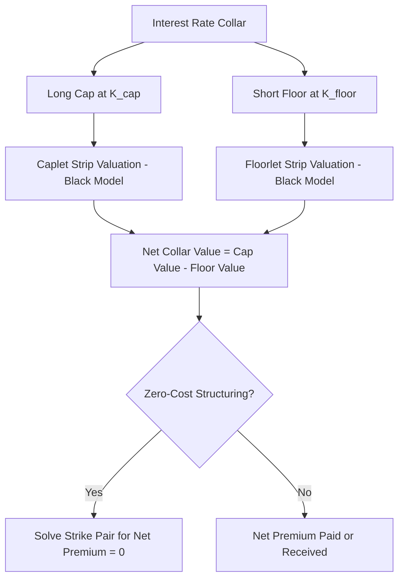

## Interest Rate Collars

### Overview

An interest rate collar is a hedging structure that combines a long position in one option (a cap or floor) with a short position in the opposite option (a floor or cap), constraining the effective interest rate paid or received within a defined band. Collars are widely used because they reduce or eliminate the upfront premium cost associated with a standalone cap or floor, at the expense of giving up some favorable-rate upside.

### Basic Structure

#### Borrower's Collar

A floating-rate borrower seeking to limit interest cost while reducing hedging cost can construct a collar by:

- **Buying a cap** at a strike $K_{cap}$ — protection against rates rising above $K_{cap}$
- **Selling a floor** at a strike $K_{floor}$ (where $K_{floor} < K_{cap}$) — giving up the benefit of rates falling below $K_{floor}$

**Key Points**

- The premium received from selling the floor offsets some or all of the premium paid for the cap.
- The borrower's effective rate is bounded between $K_{floor}$ and $K_{cap}$: if the reference rate falls below $K_{floor}$, the borrower must still effectively pay $K_{floor}$ (since the floor they sold is now in-the-money for the counterparty); if it rises above $K_{cap}$, the cap protects them; between the two strikes, they pay the prevailing floating rate.

#### Investor's Collar (Reverse Collar)

An investor or lender holding a floating-rate asset can construct the opposite structure to protect a minimum yield while giving up some upside:

- **Buying a floor** at $K_{floor}$ — protection against rates falling below $K_{floor}$
- **Selling a cap** at $K_{cap}$ (where $K_{cap} > K_{floor}$) — giving up the benefit of rates rising above $K_{cap}$

### Payoff Structure

#### Net Payoff Formula (Borrower's Collar)

For a borrower's collar with notional $N$, accrual fraction $\tau$, cap strike $K_{cap}$, and floor strike $K_{floor}$:

$$\text{Collar Net Payoff} = N \times \tau \times \left[\max(R_{ref} - K_{cap}, 0) - \max(K_{floor} - R_{ref}, 0)\right]$$

This can be decomposed into three effective rate regions:

$$\text{Effective Rate} =
\begin{cases}
K_{floor} & \text{if } R_{ref} < K_{floor} \\
R_{ref} & \text{if } K_{floor} \leq R_{ref} \leq K_{cap} \\
K_{cap} & \text{if } R_{ref} > K_{cap}
\end{cases}$$

**Example**

Consider a borrower with a floating-rate loan referencing a 3-month rate, notional $N = \$20{,}000{,}000$, and a collar with:

- Cap strike $K_{cap} = 5.50\%$
- Floor strike $K_{floor} = 3.50\%$
- Accrual fraction $\tau = 0.25$

**Scenario 1**: Reference rate fixes at $R_{ref} = 6.00\%$ (above cap)

$$\text{Payoff} = 20{,}000{,}000 \times 0.25 \times \left[\max(0.0600 - 0.0550, 0) - \max(0.0350 - 0.0600, 0)\right] = 20{,}000{,}000 \times 0.25 \times 0.0050 = 25{,}000$$

The borrower receives $25,000 from the collar, offsetting the excess interest above 5.50%, so their effective cost is capped at 5.50%.

**Scenario 2**: Reference rate fixes at $R_{ref} = 2.75\%$ (below floor)

$$\text{Payoff} = 20{,}000{,}000 \times 0.25 \times \left[\max(0.0275 - 0.0550, 0) - \max(0.0350 - 0.0275, 0)\right] = 20{,}000{,}000 \times 0.25 \times (-0.0075) = -37{,}500$$

The borrower pays $37,500 to the floor counterparty, since the floor they sold is now in the money, bringing their effective cost up to 3.50% despite market rates being lower.

**Scenario 3**: Reference rate fixes at $R_{ref} = 4.25\%$ (within the collar band)

Neither option is in the money, so no collar cash flow occurs, and the borrower simply pays the prevailing floating rate of 4.25%.

### Zero-Cost Collar

**Key Points**

- A **zero-cost collar** (or "costless collar") is structured so that the premium received from the sold option exactly offsets the premium paid for the purchased option, resulting in no net upfront cash outlay.
- Achieving zero cost requires solving for the appropriate combination of $K_{cap}$ and $K_{floor}$ given prevailing market volatility and the forward rate curve — there is not a unique solution, since many strike pairs can produce a net-zero premium, but each pair implies a different width and positioning of the effective rate band.
- [Inference] Widening the gap between the floor strike and the current forward rate curve to reduce the floor's premium generally requires setting a lower cap strike (closer to the forward curve) to keep the structure premium-neutral, so a wider "floor gap" and a "tighter cap" often move together in a zero-cost construction — though the specific tradeoff also depends on the volatility skew embedded in the market for each strike.

### Valuation

Since a collar is simply a linear combination of a long cap and a short floor (or vice versa), its value follows directly from the standard Black-model valuations of caps and floors:

$$\text{Collar Value} = \text{Cap Value}(K_{cap}) - \text{Floor Value}(K_{floor})$$

Each caplet and floorlet within the respective legs is valued independently using the Black (1976) model, as covered in the standard cap/floor pricing framework, with the collar's net value being the simple difference between the two aggregated option strips.

**Key Points**

- Because collars are decomposable into a cap and a floor, all cap/floor Greeks (delta, vega, theta) apply additively to the collar position, with the short-option leg contributing risk of the opposite sign to the long-option leg.
- Net vega exposure of a collar is typically smaller in magnitude than an outright cap or floor of the same notional, since the long and short option legs partially offset each other's sensitivity to implied volatility — though the degree of offset depends on how far apart the two strikes are and the shape of the volatility smile between them.

### Put-Call Parity View

A collar can also be understood through a put-call-parity-style relationship with the underlying floating-rate exposure. For the borrower's collar:

$$\text{Long Cap} - \text{Short Floor} = \text{Synthetic Fixed Rate Exposure (if } K_{cap} = K_{floor})$$

**Key Points**

- If the cap strike and floor strike are set equal ($K_{cap} = K_{floor} = K$), the collar collapses into a synthetic interest rate swap at fixed rate $K$ — the borrower effectively pays a fixed rate regardless of where the floating rate resets.
- This illustrates that a collar is a generalized structure spanning the full spectrum between "no hedge" (very wide collar) and "full fixed-rate swap" (zero-width collar), with the strike spread controlling how much rate variability the borrower retains.

### Participating Collars and Variations

**Key Points**

- A **participating collar** modifies the standard structure so the borrower only sells a floor on a fraction of the notional (e.g., 50%), allowing partial participation in rate declines below the floor strike while still capping the upside via a full-notional cap.
- This variation typically requires a small net premium (since less floor premium is generated to offset the cap cost) but provides more favorable treatment if rates fall significantly.
- Some collar variants also incorporate **knock-out** or **knock-in** barrier features on one or both legs, converting the structure into a barrier-collar, though these introduce path-dependency that requires more advanced valuation techniques than the vanilla Black model.

### Applications

#### Corporate Treasury Hedging

A corporation with floating-rate debt facing budget constraints may prefer a collar over an outright cap because it reduces or eliminates the hedging premium, at the cost of foregoing the full benefit of falling rates — a common tradeoff for treasury departments managing interest expense within a budgeted range.

#### Real Estate and Project Finance

Collars are frequently required as a condition of floating-rate project finance loans, where lenders mandate that the borrower hedge interest rate risk within an agreed band to protect debt service coverage ratios, without requiring the borrower to pay the potentially high premium of an outright cap.

### Collar vs. Cap vs. Swap Comparison

| Feature | Collar | Outright Cap | Interest Rate Swap |
| --- | --- | --- | --- |
| Upfront premium | Reduced or zero (net of two option legs) | Premium paid | Typically zero |
| Upside if rates fall | Retained down to floor strike | Fully retained | None (rate fixed) |
| Downside if rates rise | Capped at cap strike | Capped at cap strike | Fixed regardless of direction |
| Structural composition | Long option + short option | Single option strip | Linear swap |
| Vega exposure | Partially offsetting (net, smaller) | Full option vega | None (linear instrument) |

### Effective Rate Diagram

<svg xmlns="http://www.w3.org/2000/svg" viewBox="0 0 640 260">
<text x="20" y="20" font-size="13" font-weight="bold" fill="#222">Borrower's Collar Effective Rate (svg_diagram)</text>
<line x1="60" y1="220" x2="600" y2="220" stroke="#333" stroke-width="2" />
<line x1="60" y1="220" x2="60" y2="30" stroke="#333" stroke-width="2" />
<text x="580" y="235" font-size="11" fill="#333">Market Rate</text>
<text x="20" y="30" font-size="11" fill="#333">Effective Rate</text>
<line x1="60" y1="150" x2="220" y2="150" stroke="#2da44e" stroke-width="3" />
<line x1="220" y1="150" x2="420" y2="90" stroke="#2da44e" stroke-width="3" />
<line x1="420" y1="90" x2="580" y2="90" stroke="#2da44e" stroke-width="3" />
<line x1="220" y1="150" x2="220" y2="230" stroke="#555" stroke-width="1" stroke-dasharray="3,3" />
<text x="185" y="248" font-size="11" fill="#555">Floor (K_floor)</text>
<line x1="420" y1="90" x2="420" y2="230" stroke="#555" stroke-width="1" stroke-dasharray="3,3" />
<text x="390" y="248" font-size="11" fill="#555">Cap (K_cap)</text>
</svg>

### Structural Diagram

**Related Topics**

- Interest Rate Caps and Floors (component building blocks)
- Black (1976) model for caplet/floorlet valuation
- Participating and barrier collar variants
- Zero-cost structuring and strike selection methodology
- Volatility skew impact on asymmetric strike selection
- Project finance hedging covenants and mandatory collar requirements
- Synthetic swap replication via matched-strike collars
- Vega-neutral hedging of combined option structures