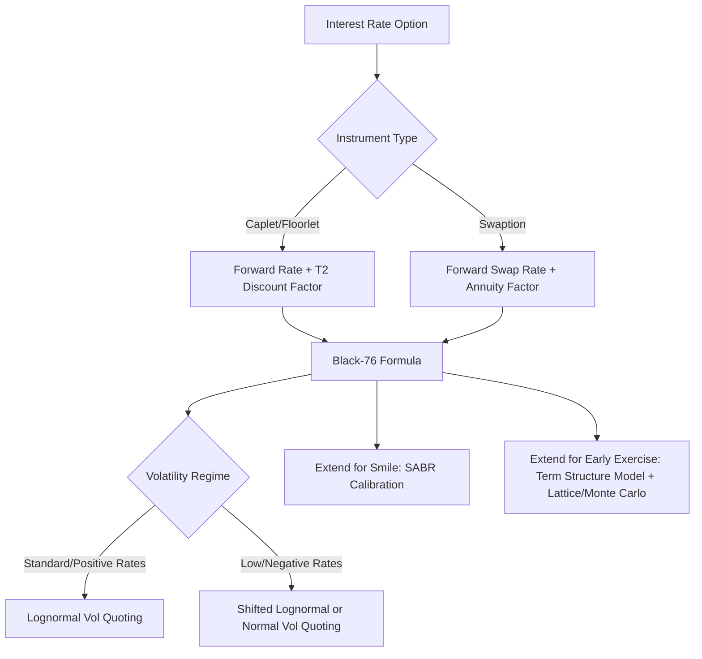

## The Black Model for Rate Options

### Overview

The Black model (also known as Black-76, originating from Fischer Black's 1976 paper on commodity futures options) is the standard market convention for pricing European-style interest rate options, including caps, floors, and swaptions. It adapts the Black-Scholes framework to price options on forward-based underlyings — forward rates, forward prices, or forward swap rates — rather than spot asset prices, making it suitable for instruments where the underlying is inherently forward-looking.

### Motivation: Why Not Black-Scholes Directly

**Key Points**

- Black-Scholes was originally derived for options on a spot asset (e.g., a stock) that can be continuously traded and held, with a well-defined cost of carry.
- Interest rate options are options on a **rate**, not a tradable spot asset — a forward rate or forward swap rate is not something an investor can directly buy and hold in the way they can hold a share of stock.
- Black's 1976 adaptation reframes the underlying as a forward price or forward rate observed at a single future date, sidestepping the need to model the spot-to-forward relationship explicitly, and instead directly modeling the forward's terminal distribution.

### The Black Model Formula

#### General Form

For a European call option on a forward price/rate $F$ with strike $K$, expiry $T$, and volatility $\sigma$:

$$C = P(0,T) \times \left[F \times \Phi(d_1) - K \times \Phi(d_2)\right]$$

For the corresponding put:

$$P = P(0,T) \times \left[K \times \Phi(-d_2) - F \times \Phi(-d_1)\right]$$

Where:

$$d_1 = \frac{\ln(F/K) + \frac{1}{2}\sigma^2 T}{\sigma \sqrt{T}}, \quad d_2 = d_1 - \sigma \sqrt{T}$$

- $F$ = the forward price or forward rate observed today for delivery/settlement at $T$
- $K$ = strike price/rate
- $P(0,T)$ = discount factor from today to the relevant payment date
- $\sigma$ = volatility of the forward (assumed lognormal)
- $\Phi(\cdot)$ = standard normal cumulative distribution function

**Key Points**

- Unlike Black-Scholes, there is no explicit risk-free rate drift term for the underlying itself — the forward $F$ is assumed to be a **martingale** under the appropriate forward (or annuity) measure, meaning its expected future value equals its current value under that measure.
- The discount factor $P(0,T)$ appears as a simple multiplicative term outside the bracket, rather than being embedded in a continuously compounded exponential as in the original Black-Scholes formula — reflecting the use of the $T$-forward measure as numeraire.

### Application to Caplets and Floorlets

For a caplet covering accrual period $[T_1, T_2]$ with notional $N$ and accrual fraction $\tau$:

$$\text{Caplet Value} = N \times \tau \times P(0, T_2) \times \left[F \times \Phi(d_1) - K \times \Phi(d_2)\right]$$

**Key Points**

- Here, $F$ is the forward rate for the specific accrual period $[T_1, T_2]$, and $T_1$ (the fixing date) is used as the time-to-expiry input in $d_1$ and $d_2$, while $T_2$ (the payment date) determines the discount factor applied.
- Each caplet in a cap is valued under its own $T_2$-forward measure, using its own forward rate and its own (possibly different) volatility input, then summed to obtain the total cap value — a direct consequence of caplets being independent, additively separable options.

### Application to Swaptions

For a payer swaption with notional $N$, strike $K$, and forward swap rate $F$:

$$\text{Payer Swaption Value} = N \times A(0) \times \left[F \times \Phi(d_1) - K \times \Phi(d_2)\right]$$

Where $A(0)$ is the annuity factor (present value of the fixed-leg cash flow stream of the underlying swap).

**Key Points**

- Here the relevant measure is the **annuity (or swap) measure**, under which the forward swap rate — rather than a single forward rate — is the martingale, and $A(0)$ replaces the simple discount factor $P(0,T)$ used for caplets.
- This distinction (forward measure for caplets vs. annuity measure for swaptions) is why caps/floors and swaptions, despite both using the Black formula, require conceptually different numeraires and cannot be priced with a literally identical formula substitution.

### Key Assumptions and Their Implications

**Key Points**

- **Lognormal distribution of the forward**: the Black model assumes $F_T$ is lognormally distributed at expiry, implying rates cannot go negative under the model's strict mathematical assumptions.
- **Constant volatility**: a single $\sigma$ is applied across the life of the option, whereas actual implied volatilities vary by strike (smile/skew) and by tenor (term structure of volatility).
- **No embedded optionality in the underlying itself**: the model prices a single European exercise decision; it does not natively accommodate early exercise (Bermudan/American features) or path-dependent payoffs.

[Inference] The lognormal assumption's implication that rates cannot go negative became a practical modeling concern during the periods of negative or near-zero interest rates in EUR, JPY, and CHF markets (particularly the 2010s through early 2020s), which is part of why many desks shifted to using **shifted lognormal** or **normal (Bachelier) models** for rate options in those currencies during that era — though the specific model choice and shift parameter conventions varied by institution and were not universally standardized.

### The Normal (Bachelier) Model Alternative

An alternative to the lognormal Black model is the **normal model** (Bachelier model), which assumes the forward rate itself (not its logarithm) is normally distributed:

$$C = P(0,T) \times \left[(F - K)\Phi(d) + \sigma\sqrt{T}\,\phi(d)\right]$$

$$d = \frac{F - K}{\sigma\sqrt{T}}$$

Where $\phi(\cdot)$ is the standard normal probability density function.

**Key Points**

- The normal model naturally accommodates negative rates and negative strikes, since it does not require taking the logarithm of the forward rate.
- Volatility under this convention is quoted in **basis points** (normal/absolute volatility) rather than as a percentage (lognormal/relative volatility), and the two are not directly comparable without a conversion that depends on the level of the forward rate.
- Many interest rate desks, especially in EUR and JPY markets, adopted normal-model quoting conventions for cap/floor and swaption volatilities as a practical response to the negative-rate environment, and it remains a common quoting convention in various markets even outside negative-rate regimes. [Unverified] The extent to which normal-vol quoting has been retained versus reverted to lognormal/shifted-lognormal conventions following the return to positive rates varies by currency and institution, and is not uniform across markets.

### Implied Volatility and Market Quoting

**Key Points**

- Cap/floor and swaption markets quote **implied volatility**, not price directly, since volatility is a more stable and comparable metric across different strikes, tenors, and notional sizes.
- **Flat volatility** (for caps): a single vol figure that, applied uniformly to every caplet in the Black formula, reproduces the market price of the full cap strip.
- **Spot/forward volatility**: the volatility applicable to an individual caplet, derived by bootstrapping across a term structure of flat-vol cap quotes.
- **ATM volatility** (for swaptions): the volatility quoted when the strike equals the current forward swap rate, forming the base level of the swaption volatility cube before the smile/skew dimension is layered on.

### Limitations Driving Model Extensions

**Key Points**

- **Volatility smile/skew**: the Black model's constant-volatility assumption fails to capture the observed variation of implied volatility across strikes; practitioners commonly extend to stochastic volatility models such as **SABR** to fit strike-dependent implied vols while retaining a Black-model-consistent quoting convention.
- **Early exercise features**: Bermudan and American swaptions require numerical term structure models (e.g., short-rate models like Hull-White, or market models like LIBOR Market Model / SOFR Market Model) combined with lattice, PDE, or Monte Carlo methods, since the Black model's closed-form solution only handles a single European exercise date.
- **Correlation across the curve**: the Black model treats each caplet or the single swap rate underlying a swaption independently of the broader curve dynamics; multi-factor term structure models are needed for products where the payoff depends on the joint behavior of multiple points on the curve (e.g., spread options, CMS products).

### Black Model vs. Black-Scholes vs. Normal Model Comparison

| Feature | Black-Scholes | Black (Black-76) | Normal (Bachelier) |
| --- | --- | --- | --- |
| Underlying | Spot asset price | Forward price/rate | Forward price/rate |
| Distribution assumption | Lognormal spot | Lognormal forward | Normal (arithmetic) forward |
| Negative values allowed | No | No | Yes |
| Volatility quoting | Percentage (relative) | Percentage (relative) | Basis points (absolute) |
| Typical use case | Equity/FX options | Commodity, rate caps/floors, swaptions | Rate options in low/negative-rate environments |

### Model Application Flow

<svg xmlns="http://www.w3.org/2000/svg" viewBox="0 0 640 260">
<text x="20" y="20" font-size="13" font-weight="bold" fill="#222">Lognormal vs. Normal Forward Distribution (svg_diagram)</text>
<line x1="60" y1="220" x2="600" y2="220" stroke="#333" stroke-width="2" />
<text x="580" y="235" font-size="11" fill="#333">Rate</text>
<path d="M 60 220 Q 150 220 220 100 Q 260 40 300 100 Q 340 200 420 218 Q 500 220 580 220" fill="none" stroke="#1f6feb" stroke-width="2" />
<text x="180" y="60" font-size="11" fill="#1f6feb">Lognormal (Black) — bounded at 0</text>
<path d="M 60 220 Q 180 60 340 60 Q 500 60 580 220" fill="none" stroke="#d1242f" stroke-width="2" />
<text x="380" y="45" font-size="11" fill="#d1242f">Normal (Bachelier) — symmetric, allows negative</text>
<line x1="60" y1="220" x2="60" y2="30" stroke="#888" stroke-width="1" stroke-dasharray="2,2" />
<text x="15" y="222" font-size="10" fill="#555">0</text>
</svg>

**Related Topics**

- SABR stochastic volatility model calibration
- Shifted lognormal model and shift parameter conventions
- Bootstrapping flat volatility to forward (spot) volatility
- Hull-White and LIBOR/SOFR Market Model for exotic rate derivatives
- Swaption annuity measure vs. caplet forward measure
- Volatility surface and volatility cube construction
- Bermudan swaption valuation via Monte Carlo with least-squares regression
- Negative interest rate policy (NIRP) impact on derivatives pricing conventions