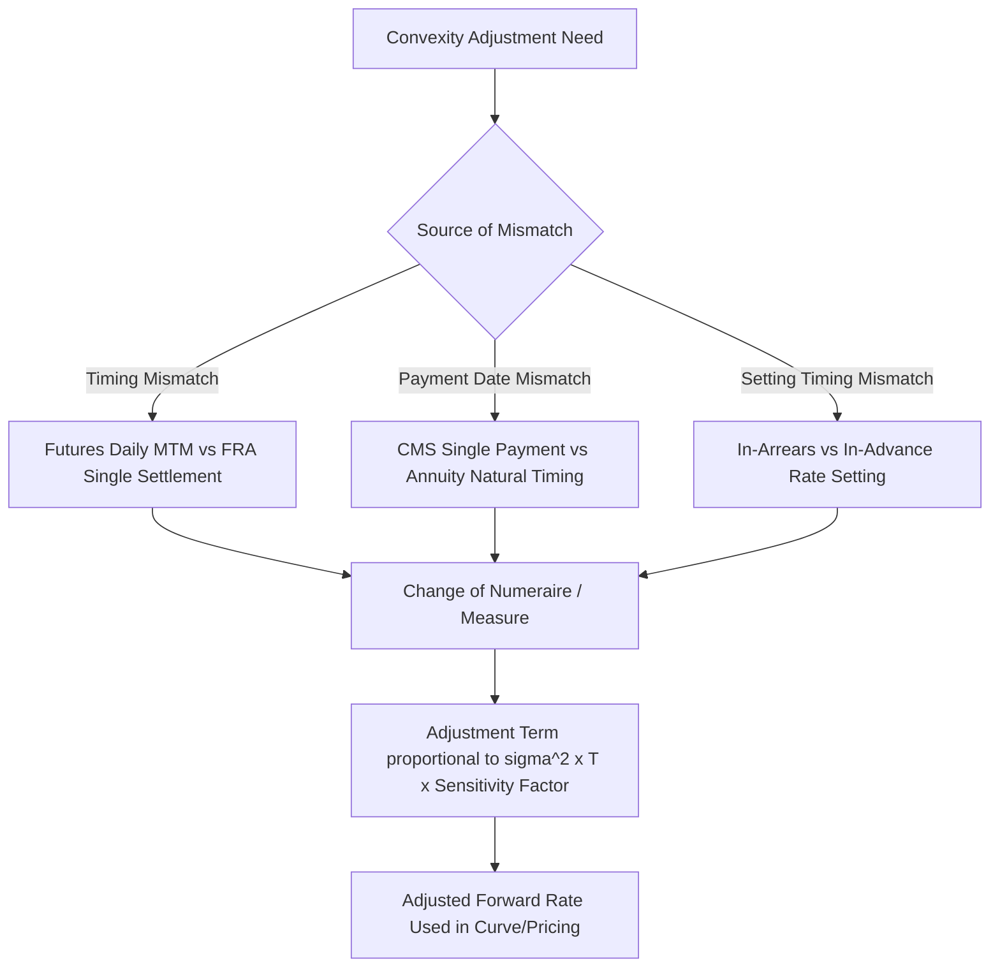

## Convexity Adjustments in Rate Derivatives

### Overview

A convexity adjustment is a correction applied to a naive expected value of a forward rate or forward-based quantity to account for the nonlinear (convex) relationship between the underlying rate and the value of the instrument that pays based on it. Convexity adjustments arise whenever a derivative's payoff is a nonlinear function of a rate, or when the timing of payment does not match the "natural" payment timing implied by the underlying instrument.

### Why Convexity Adjustments Arise

**Key Points**

- Under a given pricing measure, the **forward price or forward rate** of the natural underlying instrument is a martingale — its expected value under that measure equals its current forward value.
- When a derivative's payoff is based on that same rate but is paid at a *different* time, or is a *nonlinear* function of that rate, the relevant expectation must be taken under a different measure (or numeraire), and Jensen's inequality implies that this expectation generally differs from the simple forward rate.
- The convexity adjustment is precisely this correction term: the difference between the "naturally" expected forward rate and the adjusted expectation required for correct pricing under the mismatched timing or nonlinear payoff structure.

### Convexity Adjustment in Futures vs. FRAs

#### Source of the Discrepancy

Interest rate futures (e.g., SOFR futures) and FRAs reference the same underlying rate and period, yet their market-implied rates differ slightly. This difference is the classic **futures-FRA convexity adjustment**.

$$\text{Futures Rate} = \text{FRA Rate} + \text{Convexity Adjustment}$$

**Key Points**

- Futures contracts are **marked-to-market daily** — gains and losses are settled in cash each day and can be reinvested or refinanced at the (uncertain) short-term interest rate prevailing at that time.
- FRAs settle **once**, at the start of the reference period, with no interim cash flows.
- Because futures cash flows are received/paid and reinvested under uncertain future rates, while FRA cash flows are not, the two instruments have different sensitivities to the covariance between the underlying rate and the path of short-term reinvestment rates — this covariance effect is the source of the convexity adjustment.

#### Approximate Formula

A commonly used approximation for the futures-FRA convexity adjustment (under a Hull-White or similar short-rate model assumption) is:

$$\text{Convexity Adjustment} \approx \frac{1}{2}\sigma^2 t_1 t_2$$

Where:

- $\sigma$ = volatility of the short-term rate
- $t_1$ = time to the start of the futures reference period
- $t_2$ = time to the end of the futures reference period

**Key Points**

- The adjustment grows approximately with the **square of time to expiry**, meaning it is negligible for short-dated (front-month) contracts but becomes material for longer-dated futures (typically from around 2 years onward), which is why practitioners bootstrapping a forward curve from a futures strip must subtract this adjustment from far-dated futures rates before treating them as equivalent to FRA/forward rates.
- [Unverified] The exact magnitude of the adjustment depends on the specific short-rate model and volatility assumptions used; different desks may apply somewhat different parameterizations, so the adjustment is a modeled quantity rather than a directly market-observable one.

**Example**

Suppose a SOFR futures contract 3 years forward has an implied rate of 4.80%, and the model estimates a convexity adjustment of 8 basis points for that tenor (using $\sigma = 1.0\%$ and $t_1 t_2 \approx 9$, giving $\frac{1}{2}(0.01)^2 \times 9 \approx 0.00045$, i.e., roughly 4-5 bps under these illustrative inputs — the precise value depends on the calibrated volatility).

The corresponding FRA-equivalent (forward) rate would be approximately:

$$\text{FRA Rate} \approx 4.80\% - 0.08\% = 4.72\%$$

This lower FRA rate is the correct input for discounting and swap curve construction, since the futures rate alone would overstate the true forward rate.

### Convexity Adjustment in CMS (Constant Maturity Swap) Products

#### The CMS Convexity Problem

A **Constant Maturity Swap (CMS)** pays a floating leg based on a swap rate of a fixed tenor (e.g., the 10-year swap rate), reset periodically, rather than a short-term rate like SOFR. This creates a convexity adjustment because the natural payment timing for a swap rate's annuity-based value does not match the CMS's actual payment date.

**Key Points**

- Under the swap (annuity) measure, the forward swap rate is a martingale — but a CMS pays this rate at a single date, not spread across the full annuity of the underlying swap's cash flows.
- This mismatch between the "natural" payment timing (spread across the annuity) and the "actual" payment timing (a single date) requires a convexity/timing adjustment to correctly value the CMS cash flow under the appropriate forward measure for that single payment date.

#### CMS Convexity Adjustment Formula (Approximate)

A widely used approximation, derived from the annuity-to-forward-measure change of numeraire, is:

$$\text{CMS Rate} \approx F + \frac{1}{2} F^2 \sigma^2 T \times G'(F)/G(F) \times (\text{annuity-related correction term})$$

[Inference] The exact closed-form expression for the CMS convexity adjustment depends on the specific replication or approximation method used (e.g., linear swap rate model, or full replication via a strip of swaptions across strikes), and varies somewhat across market practitioners' implementations, so the formula above is illustrative of the structural form (a term involving $F^2 \sigma^2 T$ scaled by an annuity-sensitivity factor) rather than a single universally standardized closed-form equation.

**Key Points**

- In practice, CMS convexity adjustments are commonly computed via **static replication**, valuing the CMS payoff as a portfolio of European swaptions across a range of strikes, weighted according to the second derivative of the payoff function with respect to the swap rate — an approach that naturally incorporates the market's volatility smile rather than relying on a single flat-volatility approximation.
- The magnitude of the CMS convexity adjustment increases with the tenor of the underlying swap rate (longer tenors have larger annuity sensitivities) and with the time to the CMS payment date, similar in spirit to the futures-FRA case.

### Convexity Adjustment in Deferred/In-Arrears Rate Payments

#### In-Arrears vs. In-Advance Payment Timing

A standard floating-rate note or swap pays a rate that is *set* at the start of a period and *paid* at the end (in-advance setting, in-arrears payment, which is the conventional and "natural" timing). Some structures instead pay the rate **in arrears relative to its natural timing** — meaning the rate is both set and paid based on a period after the payment would naturally occur, or set right before the payment rather than at the start of the period.

**Key Points**

- A **LIBOR/SOFR-in-arrears swap** sets and pays the floating rate at the *end* of the accrual period (rather than the standard convention of setting at the start), which requires a convexity adjustment because the natural forward-measure valuation of that rate corresponds to a different payment date than the one actually used.
- The adjustment for a simple in-arrears rate payment has a well-known approximate form:

$$\text{Adjustment} \approx F \times \left(F \sigma^2 \tau_1 \tau_2 \text{ (approx.)}\right)$$

[Inference] The precise coefficient in this formula depends on the day count conventions and the specific derivation approach (e.g., whether a lognormal or normal rate model is assumed), so practitioners typically implement a specific, desk-standardized closed-form or numerically-integrated version rather than a single universal formula, and the expression above is illustrative of the general structural dependence on the forward rate, volatility, and the relevant time intervals.

### General Principle: Change of Measure and Convexity

**Key Points**

- All convexity adjustments in interest rate derivatives can be understood through the lens of a **change of numeraire** (change of pricing measure): the "natural" measure under which a given rate is a martingale is not always the correct measure for pricing a specific payoff, due to mismatched payment timing or nonlinearity in the payoff.
- The general technique for deriving a convexity adjustment involves computing the Radon-Nikodym derivative between the natural measure and the required payment measure, which introduces a correction term proportional to the covariance between the rate itself and the ratio of the two numeraires (annuity, discount factor, etc.).
- This unifying framework explains why futures-FRA, CMS, and in-arrears adjustments all share a similar mathematical structure (a term involving volatility squared, time, and a sensitivity factor), despite arising from different specific products.

### Practical Implications for Curve Construction

**Key Points**

- When bootstrapping a discount/forward curve from a mixture of futures and swap/FRA quotes, the futures rates in the far-dated portion of the strip must be convexity-adjusted downward before being spliced into the curve alongside FRA or swap-implied forward rates.
- Ignoring convexity adjustments in curve construction introduces a systematic bias that grows with tenor, potentially causing mispricing of longer-dated derivatives priced off that curve, since the curve itself would embed an internally inconsistent set of forward rates.
- Structured products referencing CMS rates (such as CMS-linked notes, CMS caps/floors, and CMS spread options) require convexity-adjusted CMS rates as a fundamental input; using the raw (unadjusted) forward swap rate would materially misprice these instruments, particularly for longer underlying tenors and longer time horizons.

### Convexity Adjustment Sources Comparison

| Source | Instrument | Cause | Adjustment Direction (typical) |
| --- | --- | --- | --- |
| Futures vs. FRA | SOFR/Eurodollar futures | Daily mark-to-market and reinvestment risk | Futures rate > FRA rate |
| CMS | CMS swaps, CMS caps/floors | Payment at single date vs. annuity-spread natural timing | CMS rate > forward swap rate |
| In-arrears rate setting | In-arrears swaps | Rate set/paid at period end vs. standard period-start setting | Adjusted rate > naive forward rate |

### Structural Diagram

<ns0:svg xmlns:ns0="[http://www.w3.org/2000/svg" viewBox="0 0 640 260">](http://www.w3.org/2000/svg%22%3E)

<ns0:text x="20" y="20" font-size="13" font-weight="bold" fill="#222">Convexity Adjustment Growth with Tenor (svg_diagram)</ns0:text>

<ns0:line x1="60" y1="220" x2="600" y2="220" stroke="#333" stroke-width="2" />

<ns0:line x1="60" y1="220" x2="60" y2="30" stroke="#333" stroke-width="2" />

<ns0:text x="580" y="235" font-size="11" fill="#333">Tenor (years)</ns0:text>

<ns0:text x="15" y="30" font-size="11" fill="#333">Adjustment (bps)</ns0:text>

<ns0:path d="M 60 218 Q 200 214 320 190 Q 440 150 580 60" fill="none" stroke="#d1242f" stroke-width="3" />

<ns0:text x="380" y="130" font-size="11" fill="#d1242f">~ proportional to T^2</ns0:text>

</ns0:svg>

**Related Topics**

- Change of numeraire and martingale pricing theory
- Constant Maturity Swaps (CMS) and static replication methodology
- SOFR futures curve construction and forward rate bootstrapping
- In-arrears vs. in-advance rate setting conventions
- Hull-White short-rate model for convexity adjustment derivation
- CMS caps, floors, and spread options
- Volatility smile impact on replication-based convexity adjustments
- Linear swap rate model (LSM) approximations for CMS pricing