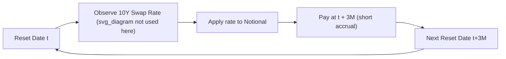
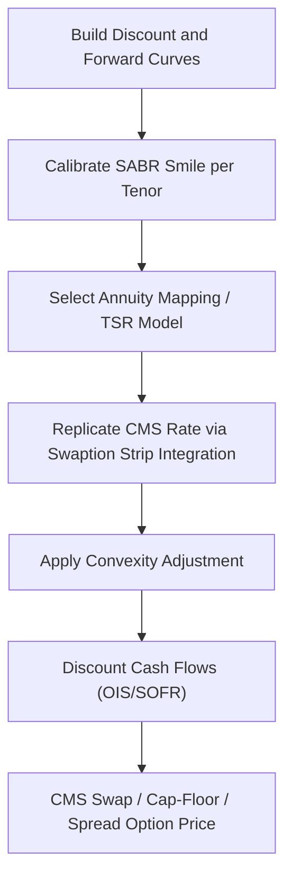

## Constant Maturity Swaps and CMS Products

### Definition and Overview

A Constant Maturity Swap (CMS) is an interest rate swap in which one leg periodically resets against the prevailing market rate for a swap of a fixed tenor (e.g., the 10-year swap rate), rather than against a standard money-market index such as SOFR or (historically) LIBOR. Where a vanilla swap exchanges a fixed rate for a floating short-term index, a CMS exchanges either a fixed rate or a short-term floating index for a periodically-reset long-tenor swap rate. The defining feature is that the floating leg's reference rate is itself a swap rate of constant maturity, observed and reset at each period, rather than a point on the short end of the curve.

CMS products isolate exposure to the shape of the yield curve rather than its level, making them core instruments for curve and convexity trading.

### Key Points

- **CMS leg**: pays a swap rate of fixed tenor (e.g., 10Y swap rate) observed periodically, typically quarterly or semi-annually
- **CMS rate fixing**: on each reset date, the relevant constant-maturity swap rate is observed (via a fixing source such as ICE Swap Rate) and applied for the subsequent accrual period
- **Convexity adjustment**: because the CMS payment is not paid at the natural payment date implied by the underlying swap rate's tenor, a convexity correction is required to properly price the leg — this is the central technical challenge of CMS valuation
- **CMS spread products**: pay the difference between two CMS rates of different tenors (e.g., CMS10Y − CMS2Y), used to trade curve steepening/flattening views
- **CMS caps/floors and CMS spread options**: options written on CMS rates or CMS spreads, requiring a full smile-consistent model of swaption volatilities

### Structure of a Plain CMS Swap

**Example**

A 5-year CMS swap, quarterly resets:

- Party A pays fixed 3.20% annually
- Party B pays the 10-year swap rate, reset quarterly, paid quarterly

At each quarterly reset date, the prevailing 10-year swap rate is observed and applied to the notional for that quarter's payment — the payment reflects a 10-year rate but is settled on a much shorter (quarterly) cycle. This mismatch between the tenor of the underlying rate and the tenor of the payment period is what generates the convexity effect.

### Why Convexity Adjustment Is Required

A standard swap rate is the fair fixed rate on a swap starting at the fixing date and running for its full tenor (e.g., 10 years). Its "natural" payment timing, in a replicating sense, is smeared across the life of that swap — it is not naturally a single cash flow paid three months later. When a CMS leg pays the 10-year swap rate as a single cash flow at a short-dated point, the value of that cash flow is **not** simply the discounted expected swap rate; it requires adjusting for:

1. **Timing risk**: the mismatch between the natural timing of the swap rate (spread over the underlying swap's life) and the actual payment date
2. **Convexity of the swap rate/annuity relationship**: swap rates are related non-linearly to the underlying discount factors via the annuity (PVBP), so $E[S_T]$ under the payment-date forward measure differs from the swap rate observed under its own natural (annuity) measure

The CMS convexity-adjusted rate is generally expressed as:

$$CMS_{adj} = F + CA$$

where $F$ is the forward swap rate and $CA$ is the convexity adjustment, which is positive for a standard receiver-side CMS payment and grows with tenor, volatility, and time to the fixing date.

### Convexity Adjustment — Replication Approach

The market-standard approach values CMS legs via **static replication** using a continuum of swaptions (a replication of the terminal payoff via receiver and payer swaption strips), rather than a single closed-form Black adjustment, because CMS payoffs depend on the entire smile of implied volatilities across strikes.

**Key Points**

- The CMS rate's convexity-adjusted expectation is written as an integral over swaption prices across all strikes:

$$E^{T}[S_T] = F + \int_{-\infty}^{F} P(K)\, g''(K)\, dK + \int_{F}^{\infty} C(K)\, g''(K)\, dK$$

where $g(K)$ is the payoff-transformation function linking the annuity measure to the payment-date (discount) measure, and $P(K)$, $C(K)$ are swaption prices (put/call on the swap rate) at strike $K$.

- $g(K)$ is derived from the relationship between the physical annuity (PVBP) of the underlying swap and the single discount factor at the CMS payment date — commonly modeled using a **linear swap rate model**, **annuity mapping**, or **replication under a specific numeraire change** (e.g., Hagan's CMS replication method)
- The choice of $g(K)$ (i.e., the annuity-mapping function) is model-dependent; common choices include the linear TSR (terminal swap rate) model and exponential/parametric mappings
- The replication requires a **full swaption smile** (SABR or another smile-consistent model is typically calibrated first), since the integral spans all strikes

### Hagan's Convexity Adjustment Formula (Simplified/Approximate Form)

A widely used approximate (single-strike, lognormal) convexity adjustment for a CMS rate paid at time $T_p$, referencing a swap of tenor $\tau$ with $n$ payments per year, is:

$$CA \approx F^2 \sigma^2 T \cdot \frac{ \left(1 - \dfrac{1}{(1+F/n)^{n\tau}}\right)}{n \left(1 - (1+F/n)^{-n\tau}\right)} \cdot \text{(timing adjustment term)}$$

[Inference] The exact closed-form expression varies across dealer conventions and textbook derivations (Hagan 2003, Hull, Brigo-Mercurio each present slightly different parameterizations); practitioners should treat this as an illustrative approximate formula rather than a single canonical equation, and use full replication for production pricing.

A commonly cited simplified lognormal approximation (single-period, ignoring timing adjustment) is:

$$CA \approx \frac{F^2 \sigma^2 T \cdot \tau \cdot n}{2(1 + F/n)} \cdot \left(\frac{n\tau}{1+F/n} - \frac{1}{1-(1+F/n)^{-n\tau}}\right)$$

- $F$ = forward swap rate
- $\sigma$ = implied (Black/lognormal) volatility of the swap rate
- $T$ = time to fixing
- $\tau$ = tenor of the underlying swap (e.g., 10 for 10Y CMS)
- $n$ = payment frequency of the underlying swap

The adjustment increases with: longer tenor $\tau$, higher volatility $\sigma$, longer time to fixing $T$, and higher rate levels $F$ (through the annuity convexity).

### CMS Spread Products

**Key Points**

- **CMS Spread**: $S_1 - S_2$ where $S_1, S_2$ are CMS rates of two different tenors (e.g., CMS30Y − CMS2Y)
- Used to express **curve views**: a steepener position gains value if the long-short spread widens; a flattener position gains if it narrows
- **CMS Spread Option**: pays $\max(S_1 - S_2 - K, 0)$ — requires modeling the **joint distribution** of two swap rates, introducing correlation risk between the two CMS legs in addition to each leg's individual smile
- **Range Accrual on CMS Spread**: coupon accrues only on days where the CMS spread stays within a defined range — common in structured note issuance
- Popular structured products historically include **CMS steepener notes**, which pay an above-market coupon linked to (CMS10Y − CMS2Y) as long as the curve remains upward sloping, exposing the investor to flattening/inversion risk

### CMS Caps and Floors

A CMS cap/floor is a strip of caplets/floorlets where each caplet pays:

$$\text{Caplet Payoff} = \max(CMS_T - K, 0) \times \text{Accrual} \times \text{Notional}$$

- Priced via the same replication framework as the CMS swap leg, but only integrating over the relevant strike region (i.e., a single swaption-strip valuation rather than the full continuum needed for the swap-rate expectation)
- Sensitive to the **entire implied volatility smile** at the relevant strikes, not just at-the-money volatility — smile-consistent models (SABR is the market standard for swaption smiles) are required

### Pricing Workflow (Practical)

1. Build the discount curve and forward swap-rate curve from the relevant swap market (OIS/SOFR discounting is standard post-LIBOR transition)
2. Calibrate a smile model (typically SABR) to the swaption volatility cube for the relevant underlying tenor
3. Choose (or take as a market convention) an annuity-mapping/terminal-swap-rate model to define $g(K)$
4. Compute the convexity-adjusted expected CMS rate via replication (numerical integration across strikes using calibrated swaption prices)
5. Discount the resulting adjusted cash flows using the appropriate OIS/collateral discount curve
6. For CMS spread products, additionally calibrate/assume a correlation between the two underlying swap rates (often via a copula or a joint SABR/LMM framework)

### Risk Sensitivities

- **Delta**: sensitivity to the underlying forward swap rate(s); larger than a vanilla swap due to the convexity term's own rate-dependence
- **Vega**: CMS legs and especially CMS options carry material vega exposure across the **entire volatility smile**, not just ATM — this is a key differentiator from vanilla swap risk
- **Correlation risk** (spread products only): CMS spread options and notes carry direct exposure to the correlation between the two reference swap rates; misestimating correlation is a major historical source of mismarking in steepener books
- **Model risk**: the choice of annuity-mapping function ($g(K)$) is not uniquely determined by the market and introduces genuine model dependency in the convexity adjustment — [Unverified] the magnitude of price differences across common model choices is not a fixed, universal number and depends on tenor, smile shape, and market regime

### Practical Applications

- **Curve view expression**: investors bullish on curve steepening use CMS spread notes/swaps rather than outright duration positions
- **Liability-driven hedging**: pension funds and insurers use long-dated CMS-linked structures to hedge liabilities sensitive to long-tenor rates
- **Structured note issuance**: retail and institutional structured notes frequently embed CMS-linked coupons (CMS-linked range accruals, steepener notes, CMS-cap-linked floaters) to offer enhanced yield tied to curve shape
- **Bermudan CMS swaptions**: option to enter a CMS swap at future exercise dates, combining CMS convexity effects with Bermudan optionality — priced typically with Libor Market Model (LMM) or Markov-functional frameworks extended to handle CMS payoffs

**Related Topics**

- Swaption Volatility Smile and the SABR Model
- Terminal Swap Rate (TSR) Models and Annuity Mapping Functions
- LIBOR Market Model (LMM) Extensions for CMS and Bermudan Products
- OIS Discounting and the Post-LIBOR Multi-Curve Framework
- Correlation Modeling for Spread Options (Copula Methods)
- Range Accrual Notes and Path-Dependent Structured Coupons
- Bermudan Swaptions and Callable Structured Notes