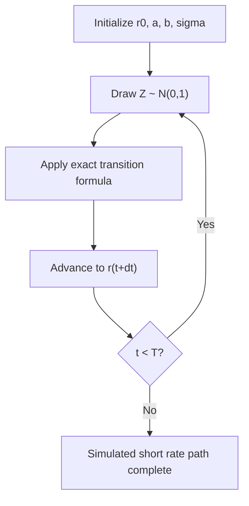

## The Vasicek Model

### Definition and Overview

The Vasicek model (Vasicek, 1977) is a one-factor short-rate model in which the instantaneous short rate follows a mean-reverting Ornstein-Uhlenbeck process under the risk-neutral measure. It was the first widely-adopted equilibrium term-structure model to incorporate mean reversion, and remains a foundational building block for understanding affine term-structure models, despite the practical limitation that it permits negative interest rates.

### Stochastic Differential Equation

$$dr_t = a(b - r_t)\,dt + \sigma\, dW_t$$

- $r_t$ = instantaneous short rate at time $t$
- $a$ = speed of mean reversion (also denoted $\kappa$)
- $b$ = long-run mean level of the short rate (also denoted $\theta$)
- $\sigma$ = instantaneous volatility of the short rate
- $W_t$ = standard Brownian motion under the risk-neutral measure $Q$

**Key Points**

- The drift term $a(b - r_t)$ pulls $r_t$ toward $b$ whenever it deviates — the further $r_t$ is from $b$, the stronger the pull
- $\sigma$ is constant (not a function of $r_t$), which is what makes the model analytically tractable but also what permits $r_t$ to go negative
- This is the continuous-time analogue of an AR(1) process in discrete time

### Distributional Properties

Because the SDE is linear (Gaussian), $r_t$ conditional on $r_s$ ($s < t$) is normally distributed:

$$E[r_t \mid r_s] = r_s e^{-a(t-s)} + b\left(1 - e^{-a(t-s)}\right)$$

$$\text{Var}[r_t \mid r_s] = \frac{\sigma^2}{2a}\left(1 - e^{-2a(t-s)}\right)$$

**Key Points**

- As $t \to \infty$, the conditional mean converges to $b$ and the conditional variance converges to $\sigma^2 / 2a$ — the process has a well-defined **stationary distribution**: $r_\infty \sim N\left(b, \dfrac{\sigma^2}{2a}\right)$
- Since $r_t$ is Gaussian with unbounded support, $r_t$ has strictly positive probability of being negative at any finite $t$ — the model's best-known drawback

### Bond Pricing under Vasicek

The Vasicek model belongs to the class of **affine term-structure models**, so zero-coupon bond prices have closed-form exponential-affine solutions in the short rate:

$$P(t,T) = A(t,T)\, e^{-B(t,T)\, r_t}$$

where, with $\tau = T - t$:

$$B(t,T) = \frac{1 - e^{-a\tau}}{a}$$

$$A(t,T) = \exp\left[ \left(b - \frac{\sigma^2}{2a^2}\right)\big(B(t,T) - \tau\big) - \frac{\sigma^2}{4a}B(t,T)^2 \right]$$

**Example**

For $a = 0.15$, $b = 0.04$, $\sigma = 0.01$, $r_t = 0.03$, and $\tau = 5$:

$$B(t,T) = \frac{1 - e^{-0.15 \times 5}}{0.15} = \frac{1 - e^{-0.75}}{0.15} \approx \frac{1 - 0.4724}{0.15} \approx 3.517$$

This $B(t,T)$ is then substituted into $A(t,T)$ and combined as $P(t,T) = A \cdot e^{-B \cdot 0.03}$ to obtain the 5-year discount factor. [Inference] Exact numerical output depends on precise rounding at each step; the formula structure itself is the standard, well-established result.

### Yield Curve Implied by the Model

The continuously-compounded yield for maturity $\tau$ is:

$$y(t,T) = -\frac{\ln P(t,T)}{\tau} = \frac{B(t,T)\, r_t - \ln A(t,T)}{\tau}$$

**Key Points**

- Because $B(t,T)$ and $A(t,T)$ depend only on $\tau$ (time-homogeneous model), the model generates yield curves whose **shape** is fully determined by just three parameters ($a$, $b$, $\sigma$) plus the current short rate $r_t$
- The model can produce upward-sloping, downward-sloping, or (to a limited extent) humped curves, but the range of achievable curve shapes is restricted compared to multi-factor models — a single Vasicek factor cannot simultaneously fit level, slope, and curvature of an observed market curve with high precision

### Calibration

**Key Points**

- **Historical/time-series estimation**: $a$, $b$, $\sigma$ can be estimated via OLS on the discretized AR(1) representation of the process, or via maximum likelihood using the known conditional Gaussian transition density
- **Risk-neutral/market calibration**: parameters are instead backed out by minimizing the pricing error between model bond prices (or cap/swaption prices, using the model's closed-form option formulas) and observed market prices — this is standard practice for pricing/hedging applications
- A well-known issue: the **market price of risk** connects the physical-measure parameters (estimated from historical short-rate data) to the risk-neutral parameters used for pricing; under the simplest Vasicek specification this is often assumed constant, which is a modeling simplification

### Discretized Simulation Scheme

Since the transition density is known exactly (Gaussian), Vasicek can be simulated **without discretization bias** using the exact transition:

$$r_{t+\Delta t} = r_t e^{-a\Delta t} + b\left(1 - e^{-a\Delta t}\right) + \sigma\sqrt{\frac{1 - e^{-2a\Delta t}}{2a}}\, Z$$

where $Z \sim N(0,1)$.

**Example**

This exact-simulation property is a notable advantage of Vasicek relative to models like CIR, which require an Euler scheme or a noncentral chi-squared exact scheme.

### Comparison with Related Models

**Key Points**

- **Vasicek vs. CIR (Cox-Ingersoll-Ross)**: CIR uses $\sigma\sqrt{r_t}\,dW_t$ instead of constant $\sigma\,dW_t$, which keeps $r_t \geq 0$ (under the Feller condition) but sacrifices the simple Gaussian transition density
- **Vasicek vs. Hull-White**: the Hull-White (extended Vasicek) model replaces the constant $b$ with a deterministic time-dependent function $\theta(t)$, allowing the model to be **exactly calibrated to the initial observed yield curve** — this is the primary practical reason Hull-White largely superseded plain Vasicek for market-consistent pricing
- **Vasicek vs. Ho-Lee**: Ho-Lee omits mean reversion entirely ($a = 0$), making it a special case structurally related to Vasicek/Hull-White but without the pull-back-to-mean dynamic

### Limitations

- Permits negative short rates with positive probability at any horizon
- Constant volatility $\sigma$ does not capture the empirically observed relationship between rate levels and rate volatility
- Single-factor structure implies **perfect instantaneous correlation** across all points on the yield curve — all rates move up or down together, which does not match observed decorrelation between short and long rates
- Cannot be calibrated exactly to today's observed yield curve without the Hull-White time-dependent extension
- [Speculation] In a persistently low- or negative-rate global environment, some practitioners historically viewed the negative-rate property as less of a drawback than in earlier eras, though this remains a matter of market-regime-dependent judgment rather than an established modeling consensus

### Practical Applications

- Pedagogical baseline for teaching affine term-structure modeling and closed-form bond pricing
- Building block conceptually underlying the Hull-White model, which is widely used in practice for pricing interest-rate derivatives (caps, swaptions, Bermudans) via trees or Monte Carlo
- Used in some risk-management and economic capital frameworks for simulating short-rate scenarios, particularly where the tractability of exact simulation and closed-form bond prices is valued
- Basis for closed-form pricing of zero-coupon bond options and, by extension, caps/floors under the model's Gaussian framework

**Related Topics**

- Hull-White (Extended Vasicek) Model and Exact Yield-Curve Fitting
- Cox-Ingersoll-Ross (CIR) Model and Positivity-Preserving Short-Rate Dynamics
- Affine Term-Structure Models: General Framework
- Ornstein-Uhlenbeck Processes in Finance
- Multi-Factor Short-Rate Models (G2++, Two-Factor Hull-White)
- Market Price of Risk and Change of Measure in Term-Structure Models
- Calibration of Short-Rate Models to Cap/Swaption Volatility Surfaces