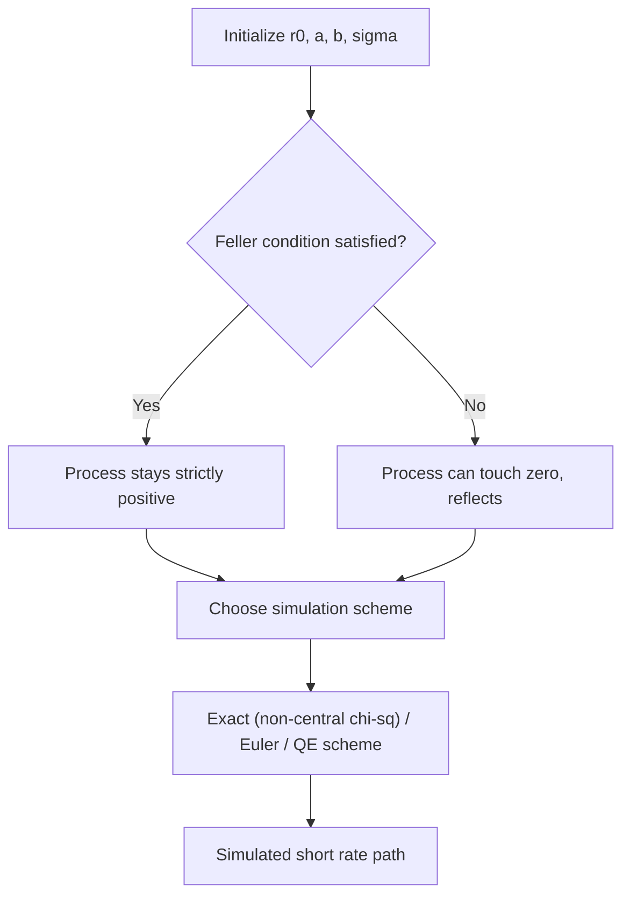

## The Cox-Ingersoll-Ross Model

### Definition and Overview

The Cox-Ingersoll-Ross (CIR) model (Cox, Ingersoll, and Ross, 1985) is a one-factor short-rate model in which the instantaneous short rate follows a mean-reverting square-root diffusion. It extends the Vasicek model by making the diffusion coefficient proportional to $\sqrt{r_t}$, which keeps the short rate non-negative and produces rate-dependent (heteroskedastic) volatility — a closer match to empirically observed short-rate behavior than the constant-volatility Vasicek specification.

### Stochastic Differential Equation

$$dr_t = a(b - r_t)\,dt + \sigma\sqrt{r_t}\, dW_t$$

- $r_t$ = instantaneous short rate at time $t$
- $a$ = speed of mean reversion
- $b$ = long-run mean level of the short rate
- $\sigma$ = volatility coefficient
- $W_t$ = standard Brownian motion under the risk-neutral measure $Q$

**Key Points**

- The drift term is identical in form to Vasicek's mean-reverting drift
- The diffusion term $\sigma\sqrt{r_t}$ shrinks toward zero as $r_t \to 0$, which dampens the process's ability to cross zero — this is the structural mechanism that (under a parameter condition) prevents negative rates
- Volatility of the short rate rises with the rate level itself, consistent with the empirical observation that rate volatility tends to be higher in high-rate regimes

### The Feller Condition

Non-negativity of $r_t$ is not automatic — it depends on the **Feller condition**:

$$2ab \geq \sigma^2$$

**Key Points**

- If $2ab \geq \sigma^2$ holds, $r_t$ remains strictly positive for all $t > 0$ (the origin is inaccessible)
- If $2ab < \sigma^2$, $r_t$ can reach zero, though it is instantaneously reflected back into positive territory (the process remains non-negative but can touch zero)
- In practice, market-calibrated CIR parameters frequently violate the Feller condition (especially in low-rate/low-volatility-of-level regimes), which is a well-documented practical limitation when using CIR for real fixed-income markets

### Distributional Properties

Unlike Vasicek, $r_t$ is **not** Gaussian. Conditional on $r_s$, $r_t$ follows a **non-central chi-squared distribution**:

$$r_t \mid r_s \sim \frac{\sigma^2(1 - e^{-a(t-s)})}{4a} \cdot \chi'^2_d(\lambda)$$

with degrees of freedom $d = \dfrac{4ab}{\sigma^2}$ and non-centrality parameter $\lambda = \dfrac{4a\, r_s\, e^{-a(t-s)}}{\sigma^2 (1 - e^{-a(t-s)})}$.

The conditional mean and variance are:

$$E[r_t \mid r_s] = r_s e^{-a(t-s)} + b\left(1 - e^{-a(t-s)}\right)$$

$$\text{Var}[r_t \mid r_s] = r_s \frac{\sigma^2}{a}\left(e^{-a(t-s)} - e^{-2a(t-s)}\right) + b\frac{\sigma^2}{2a}\left(1 - e^{-a(t-s)}\right)^2$$

**Key Points**

- The conditional mean formula is identical to Vasicek's — mean reversion dynamics are the same
- The conditional variance now depends on $r_s$ (state-dependent volatility), unlike Vasicek where variance is state-independent
- As $t \to \infty$, the stationary distribution is a **Gamma distribution** with shape $\dfrac{2ab}{\sigma^2}$ and scale $\dfrac{\sigma^2}{2a}$

### Bond Pricing under CIR

CIR is an affine term-structure model, so zero-coupon bond prices retain the exponential-affine form:

$$P(t,T) = A(t,T)\, e^{-B(t,T)\, r_t}$$

with, letting $\tau = T-t$ and $\gamma = \sqrt{a^2 + 2\sigma^2}$:

$$B(t,T) = \frac{2\left(e^{\gamma\tau} - 1\right)}{(\gamma + a)\left(e^{\gamma\tau} - 1\right) + 2\gamma}$$

$$A(t,T) = \left[ \frac{2\gamma\, e^{(a+\gamma)\tau/2}}{(\gamma+a)(e^{\gamma\tau}-1) + 2\gamma} \right]^{2ab/\sigma^2}$$

**Example**

For $a = 0.2$, $b = 0.045$, $\sigma = 0.08$, $r_t = 0.03$, $\tau = 5$:

$$\gamma = \sqrt{0.2^2 + 2(0.08)^2} = \sqrt{0.04 + 0.0128} = \sqrt{0.0528} \approx 0.2298$$

This $\gamma$ is substituted into $B(t,T)$ and $A(t,T)$ to obtain the discount factor $P(t,T) = A \cdot e^{-B \cdot 0.03}$. [Inference] The precise numerical output depends on carrying full precision through each exponential term; the formula itself is the standard closed-form CIR bond-pricing result.

### Bond Option Pricing

CIR also admits closed-form pricing for European options on zero-coupon bonds, expressed via the **non-central chi-squared cumulative distribution function** — this closed-form tractability (shared with Vasicek's Gaussian-based option formulas) is one of CIR's principal advantages over models lacking analytic solutions, and underlies closed-form CIR-based cap/floor pricing formulas.

### Simulation Schemes

Exact simulation of CIR uses the non-central chi-squared distribution directly, but this is computationally more expensive than Vasicek's simple Gaussian draw, so several discretization schemes are used in practice:

**Key Points**

- **Euler-Maruyama (naive)**: $r_{t+\Delta t} = r_t + a(b-r_t)\Delta t + \sigma\sqrt{\max(r_t,0)}\sqrt{\Delta t}\,Z$ — simple but can produce negative values requiring truncation/reflection, and converges slowly near zero
- **Exact simulation**: draws directly from the non-central chi-squared distribution at each step — unbiased but computationally heavier
- **Andersen's Quadratic-Exponential (QE) scheme**: a widely-used efficient approximation that matches moments of the true distribution while avoiding negative draws, commonly used in practice (particularly well known from the Heston model literature, which shares the same square-root diffusion structure)

### Comparison with Related Models

**Key Points**

- **CIR vs. Vasicek**: CIR trades Vasicek's simple Gaussian tractability for non-negativity and state-dependent volatility, at the cost of a more complex (non-central chi-squared) transition law and harder simulation
- **CIR vs. Hull-White**: like plain Vasicek, plain CIR cannot fit the initial observed yield curve exactly; a "CIR++" or shifted/extended CIR formulation (analogous to Hull-White's extension of Vasicek) is used in practice to achieve exact initial curve fit while preserving the square-root dynamics
- **CIR and the Heston model**: the CIR square-root process is the same mathematical structure used for the variance process in the Heston stochastic volatility model — CIR simulation techniques (including the QE scheme) are shared across both applications
- **CIR vs. Black-Karasinski**: Black-Karasinski models $\ln r_t$ as a mean-reverting process, guaranteeing positivity by construction but losing the affine (closed-form bond price) structure that CIR retains

### Limitations

- Single-factor structure implies perfect instantaneous correlation across all points on the yield curve, same limitation as Vasicek
- The Feller condition is frequently violated by market-calibrated parameters, undermining the "guaranteed positivity" property in practice
- Cannot fit the initial market yield curve exactly without extension (CIR++/shifted CIR)
- Discretization/simulation is materially more involved than for Gaussian short-rate models
- [Unverified] The extent to which state-dependent volatility materially improves hedging performance relative to Vasicek in any specific market environment depends on the prevailing volatility regime and is not a fixed, universal result

### Practical Applications

- Used where guaranteed (or near-guaranteed) non-negative short rates are a modeling requirement
- Forms the basis for CIR++ / shifted-CIR extensions used in some insurance and pension liability-modeling frameworks
- Underlies the variance-process specification in the Heston stochastic volatility model, extending CIR's practical relevance well beyond short-rate modeling into equity/FX derivatives pricing
- Used in academic and some practitioner credit-risk models (e.g., intensity-based default models) where the same square-root non-negativity property is desirable for hazard-rate processes

**Related Topics**

- Vasicek Model and Gaussian Short-Rate Dynamics
- CIR++ / Shifted CIR and Exact Yield-Curve Calibration
- Non-Central Chi-Squared Distribution in Finance
- Andersen's Quadratic-Exponential (QE) Simulation Scheme
- Heston Stochastic Volatility Model
- Black-Karasinski Model and Log-Normal Short-Rate Processes
- Affine Term-Structure Models: General Framework
- Intensity-Based (Reduced-Form) Credit Risk Models