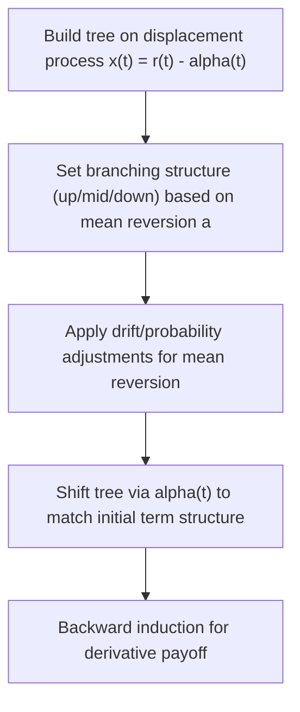

## The Hull-White Model

### Definition and Overview

The Hull-White model (Hull and White, 1990) is a one-factor short-rate model that extends the Vasicek model by allowing the long-run mean level to be a deterministic function of time, $\theta(t)$, rather than a constant. This time-dependent drift term gives the model enough flexibility to be **calibrated exactly to today's observed market yield curve**, while retaining Vasicek's Gaussian tractability, closed-form bond and option pricing formulas, and computational efficiency via trinomial trees. It is often referred to as the **Extended Vasicek model** and remains one of the most widely used short-rate models in practice for pricing interest-rate derivatives.

### Stochastic Differential Equation

$$dr_t = \left[\theta(t) - a\, r_t\right]dt + \sigma\, dW_t$$

equivalently written in mean-reverting form:

$$dr_t = a\left(\frac{\theta(t)}{a} - r_t\right)dt + \sigma\, dW_t$$

- $r_t$ = instantaneous short rate
- $a$ = constant mean-reversion speed
- $\theta(t)$ = time-dependent drift function, chosen to fit the initial term structure
- $\sigma$ = constant volatility
- $W_t$ = Brownian motion under the risk-neutral measure $Q$

**Key Points**

- Setting $\theta(t) = ab$ (constant) recovers the plain Vasicek model exactly — Hull-White is a strict generalization
- $\theta(t)$ is not a free parameter chosen by the modeler; it is **derived analytically** from the initial market forward curve, forcing the model to reprice today's observed zero-coupon bonds exactly
- The model can also be extended to time-dependent $a(t)$ and $\sigma(t)$, though the single-constant-$a$, constant-$\sigma$ specification is the most common practical implementation

### Fitting $\theta(t)$ to the Initial Term Structure

Given the initial instantaneous forward rate curve $f^M(0,t)$ observed in the market:

$$\theta(t) = \frac{\partial f^M(0,t)}{\partial t} + a\, f^M(0,t) + \frac{\sigma^2}{2a}\left(1 - e^{-2at}\right)$$

**Key Points**

- The first term captures the slope of today's forward curve
- The second term pulls the drift toward consistency with the observed forward level
- The third term is a convexity correction arising from the model's volatility structure
- This closed-form expression for $\theta(t)$ is what allows Hull-White to be a genuinely **arbitrage-free, market-consistent** model, in contrast to plain Vasicek's equilibrium (non-curve-fitting) design

### Bond Pricing

Hull-White retains the affine term-structure form:

$$P(t,T) = A(t,T)\, e^{-B(t,T)\, r_t}$$

$$B(t,T) = \frac{1 - e^{-a(T-t)}}{a}$$

$$A(t,T) = \frac{P^M(0,T)}{P^M(0,t)} \exp\left[ B(t,T) f^M(0,t) - \frac{\sigma^2}{4a}\left(1 - e^{-2at}\right)B(t,T)^2 \right]$$

**Key Points**

- $B(t,T)$ is identical in functional form to Vasicek's $B(t,T)$
- $A(t,T)$ is expressed directly in terms of **today's observed market discount factors** $P^M(0,T)$, $P^M(0,t)$ and forward rate $f^M(0,t)$ — this is the mechanism by which the model reproduces the initial curve exactly, by construction, without needing to solve for $\theta(t)$ explicitly in the bond price formula itself

**Example**

Given a market discount curve with $P^M(0,1) = 0.970$, $P^M(0,6) = 0.780$, $a = 0.10$, $\sigma = 0.012$, and a simulated short rate $r_1 = 0.028$ at $t=1$:

$$B(1,6) = \frac{1 - e^{-0.10 \times 5}}{0.10} = \frac{1 - e^{-0.5}}{0.10} \approx \frac{1 - 0.6065}{0.10} \approx 3.935$$

This $B(1,6)$ feeds into $A(1,6)$ using the market discount factor ratio $P^M(0,6)/P^M(0,1)$, giving the model-implied 5-year discount factor as seen from $t=1$. [Inference] The precise numeric output is sensitive to the exact forward rate $f^M(0,1)$ used, which itself must be bootstrapped from the market curve.

### Closed-Form Option Pricing (Caps, Floors, European Swaptions)

**Key Points**

- Zero-coupon bond option prices are available in closed form (Black-Scholes-type formula on bond prices), from which **caplet/floorlet** (equivalently, options on the short rate) prices follow directly
- **European swaption** prices under one-factor Hull-White can be obtained via Jamshidian's decomposition: a European swaption on a swap is decomposed into a portfolio of options on zero-coupon bonds, since in a one-factor model the swap's value is a monotonic function of the single short-rate state variable, allowing the multi-cash-flow option to be split into a sum of single-bond options at the critical rate
- This closed-form tractability for vanilla caps/floors/European swaptions is a major reason Hull-White remains in active use for **calibration to the vanilla volatility market** before pricing exotics

### Trinomial Tree Implementation

Hull-White is commonly implemented via a **trinomial tree** for pricing American/Bermudan-style and path-dependent interest-rate derivatives:

**Key Points**

- The standard construction (Hull and White, 1994) builds a tree first on a zero-drift auxiliary process, then shifts each time slice by a deterministic $\alpha(t)$ to match the market curve exactly — separating the "shape" of the tree (driven by $a$, $\sigma$) from the "level" (driven by $\alpha(t)$)
- Branching probabilities are adjusted (standard/up-branching/down-branching nodes) to keep probabilities valid while accommodating mean reversion
- This tree is the standard engine for pricing **Bermudan swaptions**, **callable bonds**, and other early-exercise interest-rate products under Hull-White

### Monte Carlo Simulation

Since $r_t$ remains Gaussian under Hull-White (same structural form as Vasicek, just with time-dependent drift), the exact transition is still available:

$$r_{t+\Delta t} = r_t e^{-a\Delta t} + \alpha(t+\Delta t) - \alpha(t)e^{-a\Delta t} + \sigma\sqrt{\frac{1-e^{-2a\Delta t}}{2a}}\, Z$$

[Inference] The precise form of the drift-shift terms depends on how $\alpha(t)$ is parameterized in a given implementation; the Gaussian conditional-variance term itself is standard and identical to Vasicek's.

### Comparison with Related Models

**Key Points**

- **Hull-White vs. Vasicek**: Hull-White is Vasicek with $\theta(t)$ freed to match the initial curve — Vasicek is the special case $\theta(t) = ab$
- **Hull-White vs. CIR/CIR++**: Hull-White permits negative rates (Gaussian), while CIR (under the Feller condition) does not; CIR++ is the curve-fitting analogue of Hull-White within the square-root framework
- **Hull-White vs. Black-Karasinski**: Black-Karasinski models $\ln r_t$ with Hull-White-style mean reversion, guaranteeing positive rates but losing the affine/closed-form bond-price structure that one-factor Hull-White retains
- **One-factor vs. Two-factor Hull-White (G2++)**: the single-factor version implies perfect instantaneous correlation across the curve; the two-factor extension (commonly parameterized as G2++) adds a second stochastic factor to allow richer, imperfectly correlated curve dynamics — used where decorrelation between short and long rates materially affects the product being priced (e.g., CMS spread options, certain Bermudans)

### Limitations

- Permits negative short rates, same structural issue as Vasicek (historically viewed as a drawback; less contentious during periods of observed negative policy rates)
- Single-factor version implies perfect correlation across all curve points, limiting its ability to capture decorrelation/curve-twist risk — a key motivation for the two-factor (G2++) extension
- Constant $a$ and $\sigma$ (in the standard specification) limit the model's ability to simultaneously fit the entire cap/swaption volatility **smile and term structure** — extensions with time-dependent $\sigma(t)$ partially address this at the cost of losing some closed-form simplicity
- [Unverified] The practical materiality of single-factor limitations depends heavily on the specific product being priced and its sensitivity to curve decorrelation; it is not uniformly significant across all interest-rate derivative types

### Practical Applications

- Industry-standard model for pricing and risk-managing **Bermudan swaptions**, **callable bonds**, and **mortgage-backed securities with embedded optionality**
- Widely used for **counterparty credit risk (CCR) and XVA** simulation of interest-rate exposure profiles, owing to its combination of curve-fitting accuracy and simulation tractability
- Common choice for **structured note hedging desks** needing a tractable, curve-consistent short-rate model for exotic interest-rate payoffs
- Frequently used as the interest-rate component within **hybrid models** (e.g., equity-rates hybrids) due to its Gaussian tractability, which simplifies correlation structures with other asset classes

**Related Topics**

- Vasicek Model and the Ornstein-Uhlenbeck Process
- Two-Factor Hull-White (G2++) Model
- Jamshidian's Decomposition for Swaption Pricing
- Trinomial Tree Construction for Short-Rate Models
- CIR++ / Shifted CIR Models
- Black-Karasinski Model
- Bermudan Swaption Pricing and Early-Exercise Methods
- LIBOR Market Model (LMM) as a Multi-Factor Alternative