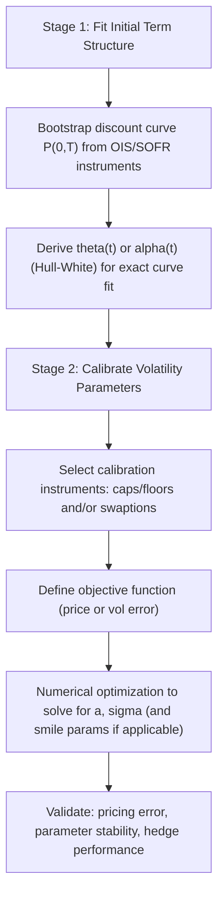

## Calibrating Short Rate Models

### Definition and Overview

Calibration is the process of determining a short-rate model's parameters so that the model's output prices are consistent with observed market data — typically the current discount/yield curve and a set of liquid interest-rate option prices (caps/floors, European swaptions). Calibration is distinct from **estimation**: estimation infers parameters from historical time-series data under the physical (real-world) measure, whereas calibration infers parameters under the risk-neutral measure so that the model reprices today's market instruments, which is the relevant objective for pricing and hedging derivatives.

### Calibration vs. Estimation

**Key Points**

- **Historical estimation** (physical measure $P$): uses time series of the short rate or yield curve, via OLS on the discretized SDE, maximum likelihood using the known transition density (Vasicek: Gaussian; CIR: non-central chi-squared), or Kalman filtering when the short rate is treated as a latent factor
- **Market calibration** (risk-neutral measure $Q$): uses current market prices — the discount curve and option volatilities — and searches for parameters that minimize pricing error against those instruments
- The link between the two measures is the **market price of risk**; under simplified affine specifications this is often assumed constant or of a specific parametric form, which is a modeling simplification rather than an empirically estimated quantity in most practical calibration workflows
- For pricing and hedging derivatives, market (risk-neutral) calibration is the standard approach; historical estimation is more relevant for scenario generation, economic capital, and physical-measure risk models

### Two-Stage Calibration Structure

Calibration of a short-rate model to the interest-rate derivatives market is generally performed in two conceptually separate stages:

**Key Points**

- **Stage 1 (curve fitting)**: for models like Hull-White or CIR++/shifted CIR, the initial term structure is matched **exactly and analytically** via the time-dependent drift function — this stage does not require numerical optimization
- **Stage 2 (volatility calibration)**: the mean-reversion speed $a$ (and volatility $\sigma$, and any smile parameters for models that support them) are solved via numerical optimization against a chosen set of market option prices or implied volatilities
- Plain Vasicek and plain CIR cannot achieve exact Stage-1 curve fitting without their respective extensions (Hull-White, CIR++), which is a primary reason those extensions dominate practical usage

### Choice of Calibration Instruments

**Key Points**

- **Caps/floors**: liquid across a range of strikes and maturities; calibrating to caps is standard when the derivative being priced is itself cap/floor-like or when a broad volatility-term-structure fit is needed
- **European swaptions**: calibrating to a **swaption matrix** (indexed by option expiry and underlying swap tenor) is standard when pricing swaption-like exotics (e.g., Bermudan swaptions), since it best matches the risk profile of the target instrument
- **Co-terminal vs. co-initial swaption selection**: for Bermudan swaption pricing specifically, a common practical convention is to calibrate to the **co-terminal swaption diagonal** (each underlying swap ending at the Bermudan's final maturity), since these are considered the most relevant hedging instruments for the exotic's risk
- Instrument choice should generally match the risk profile of the product being priced — calibrating to instruments unrelated to the target exotic's payoff structure is a common source of poor hedging performance even when in-sample pricing error is low

### Objective Function and Optimization

The calibration problem is typically formulated as a nonlinear least-squares minimization:

$$\min_{\Theta} \sum_{i=1}^{N} w_i \left( V_i^{model}(\Theta) - V_i^{market} \right)^2$$

where $\Theta$ is the parameter vector (e.g., $\{a, \sigma\}$ for one-factor Hull-White), $V_i$ are model vs. market prices or implied volatilities for instrument $i$, and $w_i$ are weights.

**Key Points**

- **Price-space vs. vol-space error**: minimizing squared **implied-volatility** differences (rather than raw price differences) is common practice, since it normalizes errors across instruments of very different vega/price sensitivity
- **Weighting scheme**: weights $w_i$ are often chosen to reflect instrument liquidity, vega, or business relevance to the target exotic (e.g., overweighting the co-terminal diagonal for a Bermudan calibration)
- **Optimization methods**: Levenberg-Marquardt and other gradient-based least-squares solvers are standard for smooth, low-dimensional parameter spaces (one- or two-factor short-rate models); global methods (differential evolution, simulated annealing) are sometimes used when the objective surface is suspected to have multiple local minima
- **Regularization**: a penalty term is sometimes added to discourage large jumps in time-dependent parameters (e.g., piecewise-constant $\sigma(t)$) between adjacent tenor buckets, improving parameter stability period-to-period

### Example Calibration Workflow (One-Factor Hull-White)

**Example**

1. Bootstrap $P^M(0,T)$ from the OIS/SOFR curve at all relevant maturities
2. Compute $\theta(t)$ analytically once $a$ and $\sigma$ are proposed (curve fit is automatic and does not enter the optimization loop)
3. Select the swaption calibration set — e.g., the co-terminal diagonal for a 10-non-call-2 Bermudan: $1Y\times9Y$, $2Y\times8Y$, ..., $9Y\times1Y$
4. For a trial $(a, \sigma)$, price each calibration swaption via Jamshidian's decomposition (closed form for one-factor Hull-White)
5. Compute the vol-space squared error against market swaption volatilities
6. Iterate $(a,\sigma)$ via a least-squares solver until convergence
7. Validate out-of-sample against nearby off-diagonal swaptions not included in the calibration set

[Inference] Exact convergence behavior and the number of iterations required depend on solver settings and starting values; the workflow structure above reflects standard industry practice rather than a single universally mandated procedure.

### Single-Factor vs. Multi-Factor Calibration Considerations

**Key Points**

- A **single-factor model** (Vasicek, CIR, one-factor Hull-White) has effectively only $a$ and $\sigma$ (beyond the curve-fitting function) available to match an entire swaption matrix — this typically means only a **subset** of market instruments (e.g., one diagonal) can be matched well, with off-diagonal or off-strike fit left as approximation error
- **Two-factor models** (G2++, two-factor Hull-White) add parameters (a second mean-reversion speed, volatility, and inter-factor correlation) that allow simultaneous fitting of more of the swaption matrix and better capture of curve decorrelation, at the cost of a higher-dimensional, harder optimization problem
- The decision to use one factor vs. multiple factors in calibration is a trade-off between **tractability/speed** and **fit quality/hedging accuracy**, and is generally driven by the specific product's sensitivity to curve-shape risk

### Calibration Stability and Validation

**Key Points**

- **Parameter stability**: recalibrating daily or weekly and observing whether $a$ and $\sigma$ jump erratically is a standard diagnostic — highly unstable parameters suggest either an unstable objective surface, insufficient/poorly chosen calibration instruments, or genuine market regime change
- **In-sample vs. out-of-sample fit**: checking pricing error on instruments **not** included in the calibration set is standard practice to detect overfitting to the chosen diagonal/strike set
- **Hedge performance backtesting**: ultimately, calibration quality is judged not only by pricing-error minimization but by how well the resulting Greeks (delta, vega) hedge the exotic's P&L over time — a well-calibrated model in a pricing sense can still produce poor hedge ratios if the calibration instrument set is mismatched to the exotic's actual risk drivers
- [Unverified] There is no universally agreed single metric for "calibration quality" across the industry; different desks weight pricing accuracy, parameter stability, and hedge performance differently depending on the specific book being managed

### Common Pitfalls

- Calibrating to instruments that do not reflect the risk profile of the target exotic (e.g., calibrating only to ATM caps when pricing a deeply out-of-the-money swaption-based structure)
- Over-relying on in-sample fit quality without out-of-sample or hedge-performance validation
- Ignoring the Feller condition when calibrating CIR/CIR++, leading to a technically "calibrated" model that violates its own positivity assumption
- Using a single-factor model to calibrate/price products with material sensitivity to curve decorrelation (e.g., CMS spread options), producing systematically mis-hedged correlation risk

### Practical Applications

- Daily/intraday recalibration workflows on interest-rate exotics desks to keep pricing and hedging models consistent with the live market
- Model validation and independent price verification (IPV) processes, where a control function recalibrates independently and compares parameter stability and pricing error against the front-office model
- Regulatory capital and XVA calculation engines, which require consistently calibrated short-rate models across the full trade population for exposure simulation

**Related Topics**

- The Hull-White Model and Analytical Curve Fitting
- Two-Factor Hull-White (G2++) Calibration
- Jamshidian's Decomposition for Swaption Pricing
- Swaption Volatility Surfaces and SABR Calibration
- Market Price of Risk and Measure Change
- Model Validation and Independent Price Verification (IPV)
- Bermudan Swaption Pricing and Calibration Instrument Selection