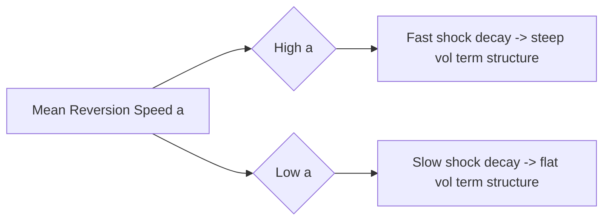

## Mean Reversion and Curve Fitting

### Definition and Overview

Mean reversion and curve fitting are two distinct but interacting properties of short-rate term-structure models. **Mean reversion** is the dynamical property whereby the short rate is pulled back toward some level over time, governing the model's volatility term structure and long-horizon behavior. **Curve fitting** is the calibration property whereby a model's parameters (typically a time-dependent drift function) are chosen so that model-implied zero-coupon bond prices exactly match today's observed market discount curve. Understanding how these two properties interact — and why a model needs specific structural features to achieve both simultaneously — is central to short-rate model design.

### Mean Reversion: Mechanism and Purpose

**Key Points**

- Mean reversion is introduced via a drift term of the form $a(\mu - r_t)$, where $a$ controls the **speed** of reversion and $\mu$ (constant or time-dependent) is the level being reverted to
- Economically, mean reversion reflects the empirical observation that interest rates do not diffuse without bound (unlike, say, a pure random walk) — central bank policy, economic cycles, and no-arbitrage bond-pricing constraints all impose a pull-back tendency on rates over long horizons
- The mean-reversion speed $a$ directly shapes the **volatility term structure**: higher $a$ causes shocks to decay faster, producing lower volatility for longer-dated forward rates relative to short-dated ones; lower $a$ produces a flatter (more persistent) volatility term structure
- In the Vasicek/Hull-White SDE $dr_t = a(\theta(t) - r_t)dt + \sigma\,dW_t$ (writing $\theta(t)/a$ absorbed into the level term), $a$ also directly controls the decay rate of the **discount bond volatility function** $B(t,T) = \frac{1-e^{-a(T-t)}}{a}$, which governs how much a given short-rate shock moves a bond of maturity $T$

### The Relationship Between $a$ and the Volatility Term Structure

**Example**

For $B(t,T) = \frac{1 - e^{-a(T-t)}}{a}$:

- As $a \to 0$: $B(t,T) \to (T-t)$ — shocks propagate almost undamped across the whole curve (long-end volatility close to short-end volatility)
- As $a \to \infty$: $B(t,T) \to 1/a \to 0$ — shocks to the short rate barely affect long-dated bonds, producing a steeply declining volatility term structure

This is why calibrated mean-reversion speed is often described as controlling the model's implied **volatility skew across tenor** — a single scalar $a$ determines how quickly the impact of short-rate shocks fades as maturity increases, which directly affects the shape of model-implied cap/swaption volatilities across expiries.

### Curve Fitting: Mechanism and Purpose

**Key Points**

- Curve fitting is achieved by allowing the model's drift level to vary **deterministically with time**, i.e. replacing a constant $\mu$ with $\theta(t)$ (Hull-White) or an equivalent time-dependent shift function (CIR++, shifted models)
- $\theta(t)$ is not a free calibration parameter in the usual sense — it is **derived analytically** from the observed initial forward curve $f^M(0,t)$, so that the model reproduces $P^M(0,T)$ for every observed maturity $T$ exactly
- Without this time-dependent drift, a model with only constant parameters (plain Vasicek, plain CIR) has too few degrees of freedom to match an entire observed curve — a constant $a$, $b$, $\sigma$ triple can only produce a limited family of curve shapes, and will generally **not** reproduce the specific curve observed on a given day
- Curve fitting is a **no-arbitrage requirement** for pricing: if a model does not reprice today's observed bonds exactly, then even the discount factors used to value a vanilla instrument will be internally inconsistent with the market, introducing artificial mispricing before any derivative-specific dynamics are even considered

### Why Both Properties Are Needed Simultaneously

**Key Points**

- Mean reversion (the constant part: $a$, $\sigma$) determines the model's **dynamics** — how rates move, and consequently how options on rates should be valued
- Curve fitting (the time-dependent part: $\theta(t)$) determines the model's **starting conditions** — ensuring the model's "today" is consistent with the market's "today"
- These two roles are **separable by construction** in affine one-factor models: $\theta(t)$ can be solved for analytically and independently of the values chosen for $a$ and $\sigma$, which is precisely the two-stage calibration structure standard in practice (curve fit first, analytically; volatility parameters second, via numerical optimization)
- A model that only fits the curve without appropriate mean reversion (e.g., Ho-Lee, which sets $a=0$) will exactly match today's curve but will imply an unrealistic (flat, non-decaying) volatility term structure, since there is no mechanism to differentiate short-end from long-end rate volatility
- A model with mean reversion but no time-dependent drift (plain Vasicek/CIR) will have realistic-shaped volatility dynamics but will **not** match today's curve exactly, introducing static arbitrage relative to the market's observed bond prices

### Curve-Fitting Formula in Hull-White (Illustrative)

$$\theta(t) = \frac{\partial f^M(0,t)}{\partial t} + a\, f^M(0,t) + \frac{\sigma^2}{2a}\left(1 - e^{-2at}\right)$$

**Key Points**

- The first term tracks the **slope** of today's observed forward curve
- The second term anchors the drift to the **level** of today's forward curve
- The third term is a **convexity correction** arising purely from the model's own volatility structure — it exists even when the forward curve is flat, and grows with $\sigma^2$ and with $t$
- This formula illustrates concretely how mean reversion ($a$) and curve fitting ($\theta(t)$) are structurally intertwined: the convexity term in $\theta(t)$ itself depends on $a$, even though the two roles (dynamics vs. initial-condition matching) are conceptually distinct

### Trade-offs and Practical Implications

**Key Points**

- **High mean reversion ($a$)**: produces a more "well-behaved," strongly pulled-back process — useful when long-horizon simulation stability is desired (e.g., XVA/CCR exposure simulation over 30+ year horizons), but can understate long-dated volatility if the true market exhibits more persistent rate shocks
- **Low mean reversion ($a$)**: produces more persistent shocks and a flatter volatility term structure, closer to a random walk — can better match markets where long-dated implied volatilities remain elevated relative to short-dated ones, but sacrifices some of the "settling down" behavior useful for very long-horizon simulation
- **Single time-dependent parameter vs. richer time structure**: some implementations also allow $\sigma(t)$ (piecewise-constant volatility) in addition to $\theta(t)$, giving the model more flexibility to fit the **volatility term structure** (not just the level curve) at the cost of a higher-dimensional calibration problem
- [Unverified] The "right" choice of $a$ is not a fixed, universally correct number — it depends on the calibration instrument set (e.g., co-terminal swaption diagonal for a specific Bermudan) and the specific risk profile of the product being priced, so different desks and different products can reasonably arrive at different calibrated values of $a$ from the same market data

### Interaction with Multi-Factor Extensions

**Key Points**

- A single mean-reversion speed $a$ implies that **all** points on the curve are driven by exactly one source of randomness, decaying at one rate — this is a structural limitation regardless of how well $\theta(t)$ fits the initial curve
- Two-factor models (e.g., G2++) introduce a **second** mean-reversion speed and a correlation parameter between the two factors, allowing the model to separately capture "short-end" and "long-end" dynamics with different decay speeds — this materially improves the model's ability to fit **both** the initial curve and a richer volatility term structure (including decorrelation effects) simultaneously
- The core two-stage principle (analytic curve fit + numerical dynamics fit) generalizes to multi-factor models, but the dynamics-fitting stage becomes higher-dimensional and typically requires calibration to a broader swaption matrix rather than a single diagonal

### Practical Applications

- Selecting $a$ (and $\sigma$) appropriately when calibrating Hull-White or G2++ for Bermudan swaption and callable bond pricing, where both the initial curve and the shape of the volatility term structure materially affect the option value
- Long-horizon exposure simulation (CCR/XVA), where mean-reversion speed directly affects the simulated distribution of future short rates and hence the exposure profile decades into the future
- Diagnosing model misspecification: persistent large out-of-sample pricing errors on off-diagonal swaptions, despite a good in-sample fit, often point to an underlying mean-reversion/volatility-structure mismatch that a single time-dependent drift function cannot fix

**Related Topics**

- The Hull-White Model and Analytical Theta(t) Derivation
- The Vasicek Model and Constant-Parameter Dynamics
- Two-Factor Hull-White (G2++) and Multi-Factor Mean Reversion
- Calibrating Short Rate Models
- Volatility Term Structure and Cap/Swaption Market Fitting
- Ho-Lee Model as the Zero-Mean-Reversion Limiting Case