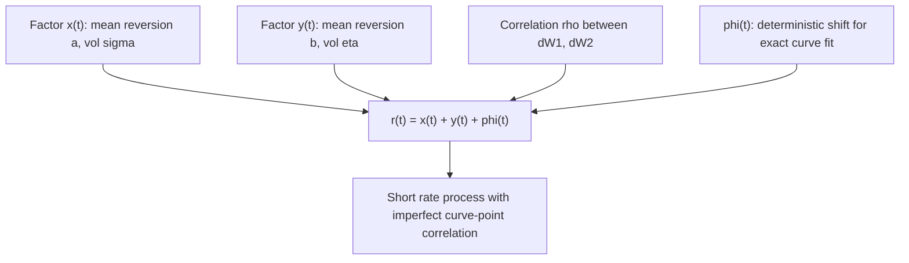

## Multi-Factor Short Rate Models

### Definition and Overview

Multi-factor short-rate models extend single-factor models (Vasicek, CIR, Hull-White) by driving the short rate — or the term structure more generally — with two or more stochastic factors instead of one. The central motivation is that a single-factor model forces **perfect instantaneous correlation** across every point on the yield curve: every maturity moves up or down together in lockstep, driven by the single Brownian motion. This is inconsistent with observed market behavior, where short and long rates frequently decorrelate (curve steepening, flattening, and twist movements). Multi-factor models introduce additional sources of randomness to capture this richer curve dynamics, at the cost of increased dimensionality in calibration and implementation.

### Motivation: The Single-Factor Correlation Problem

**Key Points**

- In a one-factor model, the entire yield curve at any time $t$ is a deterministic function of the single state variable $r_t$ — once $r_t$ is known, every bond price $P(t,T)$ for every $T$ is determined
- This implies **instantaneous correlation of 1 (or -1)** between rate changes at any two maturities, since all rates are driven by the same single Brownian shock
- Empirically, correlations between short-end and long-end rate movements are high but **not** equal to 1 — curve-shape risk (steepening/flattening trades, butterfly positions) is a real, tradeable, and hedgeable risk factor that a one-factor model structurally cannot represent
- Products whose value depends materially on the **relative** movement of different curve points — CMS spread options, steepener/flattener structured notes, certain Bermudan swaptions with strongly curve-shape-dependent optionality — are the primary drivers of demand for multi-factor modeling

### The Two-Factor Hull-White (G2++) Model

The most widely used multi-factor short-rate model in practice is the **two-factor Hull-White model**, commonly implemented in its **G2++** parameterization:

$$r_t = x_t + y_t + \varphi(t)$$

$$dx_t = -a\, x_t\, dt + \sigma\, dW_t^{1}$$

$$dy_t = -b\, y_t\, dt + \eta\, dW_t^{2}$$

$$dW_t^1\, dW_t^2 = \rho\, dt$$

- $x_t$, $y_t$ = two correlated Gaussian mean-reverting factors, each with its own mean-reversion speed and volatility
- $\varphi(t)$ = deterministic shift function, analogous to Hull-White's $\theta(t)$-derived term, used to fit the model exactly to the initial market curve
- $\rho$ = instantaneous correlation between the two driving Brownian motions

**Key Points**

- $x_t$ and $y_t$ are each individually Gaussian (Vasicek-type) processes with **zero long-run mean** by construction — all curve-fitting is absorbed into $\varphi(t)$, exactly mirroring the separation-of-roles principle from one-factor Hull-White
- Six parameters in total describe the dynamics: $a$, $b$, $\sigma$, $\eta$, $\rho$, plus the deterministic $\varphi(t)$ fit to the curve
- Typically $a \neq b$ (e.g., one factor with faster mean reversion, one slower), which allows the model to differentiate short-end from long-end volatility decay — this is the structural mechanism that produces imperfect correlation across the curve
- Because $r_t$ is a sum of two Gaussian processes, $r_t$ itself remains Gaussian, and the model retains **closed-form bond pricing** and (via an extended Jamshidian-type decomposition, though more involved than the one-factor case) tractable option pricing

### Bond Pricing under G2++

Zero-coupon bond prices retain closed-form structure:

$$P(t,T) = \frac{P^M(0,T)}{P^M(0,t)} \exp\left[ \frac{1}{2}\big(V(t,T) - V(0,T) + V(0,t)\big) - B_a(t,T)x_t - B_b(t,T)y_t \right]$$

where $B_a(t,T) = \frac{1-e^{-a(T-t)}}{a}$, $B_b(t,T) = \frac{1-e^{-b(T-t)}}{b}$, and $V(t,T)$ is a deterministic variance/covariance term involving $\sigma$, $\eta$, $\rho$, $a$, $b$.

[Inference] The exact expanded form of $V(t,T)$ is lengthy and varies slightly in presentation across textbook sources (Brigo-Mercurio is the most commonly cited reference); the structural point — that bond prices remain exponential-affine in the two state variables with a curve-consistent ratio term in front — is the standard, well-established result.

### Correlation Structure and Curve Decorrelation

**Key Points**

- The instantaneous correlation between changes in rates of two different maturities $T_1$, $T_2$ under G2++ is a function of $a$, $b$, $\rho$, and the maturities themselves — and is generically **less than 1** even when $\rho \to 1$, because $a \neq b$ already introduces differential decay
- Setting $\rho = 0$ and choosing $a \neq b$ still produces decorrelation, driven purely by the differing mean-reversion speeds; $\rho$ provides an additional, separately controllable degree of freedom
- This decorrelation capability is precisely what enables G2++ to price **CMS spread options**, **flattener/steepener notes**, and similar curve-shape-dependent products in a way that a one-factor model structurally cannot

### Simulation of Multi-Factor Models

**Key Points**

- $x_t$ and $y_t$ can each be simulated using the same **exact Gaussian transition** available for one-factor Vasicek/Hull-White, jointly drawn from a bivariate normal distribution respecting the correlation $\rho$
- Monte Carlo simulation is the standard pricing engine for path-dependent or high-dimensional multi-factor exotics, since tree-based methods become substantially more complex (though not impossible) to construct once a second stochastic dimension is introduced
- Variance reduction techniques (antithetic variates, control variates using the closed-form bond price as a control) are commonly used to manage the added computational cost of the second factor

### Calibration of Multi-Factor Models

**Key Points**

- **Stage 1 (curve fitting)**: $\varphi(t)$ is derived analytically from the initial curve, exactly as in one-factor Hull-White — this stage remains separable from the dynamics-fitting stage
- **Stage 2 (dynamics fitting)**: five parameters ($a$, $b$, $\sigma$, $\eta$, $\rho$) must be jointly calibrated, typically against a **broader swaption matrix** (multiple expiry/tenor combinations, not just a single diagonal) than would be used for a one-factor model, since the additional parameters are specifically intended to capture cross-maturity structure that a single diagonal cannot reveal
- The higher-dimensional optimization problem is more prone to **local minima and parameter instability** than one-factor calibration; regularization and stable starting-value strategies are more important in practice
- Some practitioners fix $\rho$ based on historically observed rate correlations (partially blending historical estimation into an otherwise market-calibrated framework) to reduce the dimensionality of the numerical search, given that $\rho$ is often less well-identified purely from vanilla option prices than $a$, $b$, $\sigma$, $\eta$

### Comparison with Other Multi-Factor Approaches

**Key Points**

- **G2++ vs. LIBOR Market Model (LMM)**: LMM directly models a full set of forward rates (one per tenor bucket) rather than a low-dimensional short-rate factor set, offering even richer curve dynamics and more natural compatibility with market-quoted cap/swaption volatilities at the cost of significantly higher dimensionality and the loss of short-rate-style closed-form bond pricing
- **G2++ vs. Principal Component Analysis (PCA)-motivated multi-factor models**: some multi-factor short-rate frameworks are explicitly parameterized so that the factors correspond to empirically observed principal components of curve movements (level, slope, curvature) rather than abstract mean-reverting processes — this can aid interpretability but is a distinct modeling choice from the G2++ structure
- **Two-factor vs. three-or-more-factor models**: three-factor extensions exist and can further improve fit (e.g., separately capturing level, slope, and curvature dynamics), but the marginal benefit typically diminishes relative to the added calibration and computational complexity, and two-factor models remain the dominant practical choice for short-rate-based exotic pricing

### Trade-offs

- **Improved fit and hedging accuracy** for curve-shape-sensitive products vs. **increased calibration complexity, computational cost, and parameter instability**
- **Richer dynamics** vs. **loss of some analytical tractability** relative to one-factor closed-form option pricing (though G2++ retains substantially more tractability than fully general multi-factor frameworks like LMM)
- [Unverified] The decision to move from one-factor to multi-factor modeling for a given trading book depends on the specific product mix and materiality of curve-decorrelation risk in that book; it is not a universal "better model" choice independent of context — one-factor Hull-White remains adequate and standard for many vanilla and moderately exotic interest-rate books

### Practical Applications

- Pricing and hedging **CMS spread options**, **steepener/flattener structured notes**, and other explicitly curve-shape-dependent payoffs
- Bermudan swaption books where the underlying swaptions being exercised into span a wide range of tenors, and single-diagonal calibration under a one-factor model leaves material off-diagonal mispricing
- Long-dated exotic interest-rate structures where curve-twist risk accumulates materially over the life of the trade
- Risk management and Greeks decomposition desks that need to separately report "level" risk vs. "slope/curve" risk, which a multi-factor model naturally decomposes via its distinct factors

**Related Topics**

- The Hull-White Model (One-Factor) and Its Extension to G2++
- CMS Spread Options and Curve-Shape Products
- LIBOR Market Model (LMM) as a Full-Curve Alternative
- Bermudan Swaption Pricing and Calibration Instrument Selection
- Principal Component Analysis of Yield Curve Movements
- Calibrating Short Rate Models