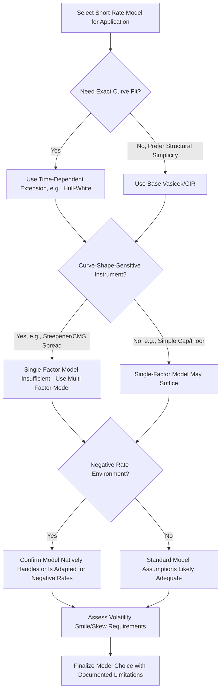

## Practical Limitations of Short Rate Models

### Overview

Short rate models (Vasicek, Cox-Ingersoll-Ross, Hull-White, Black-Karasinski, and their extensions) provide tractable mathematical frameworks for describing the evolution of the instantaneous interest rate and, by extension, the entire term structure. Despite their widespread use in fixed income derivative pricing and risk management, these models carry substantial practical limitations rooted in their simplifying assumptions, calibration challenges, and structural inability to fully capture observed market behavior. Understanding these limitations is essential for appropriately scoping when and how short rate models should be relied upon versus supplemented or replaced by alternative frameworks.

### Single-Factor Limitation

Many foundational short rate models (Vasicek, CIR, and their single-factor Hull-White variants) describe the entire term structure using a single stochastic driver — the instantaneous short rate itself.

$$dr_t = \kappa(\theta - r_t)dt + \sigma \, dW_t \quad \text{(Vasicek)}$$

**Key Points**

- A single-factor model implies that all points on the yield curve are **perfectly correlated** — a shock to the short rate propagates deterministically to every other maturity point through the model's own internal dynamics, meaning the model cannot generate genuine changes in curve **shape** (steepening, flattening, curve inversion dynamics) beyond what the single factor's mean-reversion structure permits
- Empirically, yield curves exhibit multiple, largely independent sources of variation — commonly decomposed via principal component analysis into "level," "slope," and "curvature" factors — that a single-factor model structurally cannot replicate
- This limitation directly constrains single-factor models' ability to accurately price instruments whose value depends on the relative movement between different points on the curve (e.g., curve steepener/flattener trades, certain swaption structures, CMS spread products) — multi-factor models (two-factor Hull-White, or fully separate multi-factor frameworks) are generally required for such instruments

### Negative Interest Rate Handling

- **Vasicek model**: Permits negative short rates with positive probability, which was historically viewed as a theoretical flaw (nominal rates were assumed non-negative pre-2008/2015) but became practically relevant once several major economies (Eurozone, Japan, Switzerland, and others) experienced sustained negative policy rates
- **CIR model**: Structurally prevents negative rates (given the Feller condition is satisfied) via its square-root diffusion term, which was historically viewed as an advantage — but this became a practical **limitation** once negative rate environments emerged, since CIR-based frameworks could not directly accommodate observed negative rates without modification
- **Black-Karasinski and other log-normal short rate models**: Also structurally preclude negative rates, facing the same practical challenge during negative-rate periods

[Inference] The negative-rate episodes observed in several major currencies through the mid-2010s and beyond required practitioners to either adapt CIR/log-normal-style models (e.g., via shifted variants that permit rates down to some negative lower bound) or shift toward models like Vasicek/Hull-White that natively accommodate negative rates — the specific adaptation approach used varies by institution and is not uniformly standardized, and reflects an ongoing evolution in market practice rather than a single settled methodology.

### Mean Reversion Assumption Limitations

Most short rate models assume a constant, time-invariant mean reversion speed ($\kappa$) and long-run mean level ($\theta$):

$$dr_t = \kappa(\theta - r_t)dt + \sigma(r_t, t)dW_t$$

**Key Points**

- Real-world interest rate dynamics exhibit regime-dependent behavior — mean reversion speed and long-run levels are not empirically constant over time, but shift with monetary policy regimes, economic cycles, and structural changes in the economy
- Calibrating a fixed $\kappa$ and $\theta$ to current market data provides a reasonable local fit but can produce increasingly poor forecasts or hedging performance the further the model is extrapolated from its calibration window, particularly across regime shifts (e.g., transitions between tightening and easing cycles, or structural breaks like the post-2008 near-zero-rate era)
- Time-dependent extensions (e.g., Hull-White's time-dependent $\theta(t)$, calibrated to fit the initial term structure exactly) address the term-structure-fitting problem but do not fully resolve the underlying assumption that the *dynamics* (volatility, mean reversion speed) remain structurally stable over the model's forecast horizon

### Calibration Challenges

- **Exact term structure fitting vs. dynamic realism trade-off**: Models like Hull-White can be calibrated to exactly match the initial observed yield curve (a desirable property for consistency with current market prices) by allowing time-dependent parameters, but this flexibility can come at the cost of less economically interpretable or stable dynamics going forward
- **Volatility calibration to derivative prices**: Short rate model volatility parameters are often calibrated to match observed prices of liquid interest rate derivatives (caps, floors, swaptions) — however, this calibration is itself model-dependent, and different short rate models calibrated to the same market instruments can produce materially different prices and hedge ratios for less liquid or more complex, path-dependent instruments
- **Parameter instability over time**: Recalibrating a short rate model's parameters on a rolling basis (e.g., daily or weekly) often reveals significant parameter instability, undermining confidence in the model's structural interpretation and raising questions about whether the "constant" parameters truly represent stable economic quantities or are merely curve-fitting artifacts

### Volatility Structure Limitations

**Key Points**

- Most basic short rate models assume either constant volatility (Vasicek) or volatility proportional to the square root of the rate level (CIR) — neither fully captures the empirically observed **volatility smile/skew** in interest rate options markets, where implied volatility varies systematically across strikes for the same underlying rate and tenor
- Extensions incorporating stochastic volatility (e.g., SABR-style approaches applied to rates, or specific stochastic-volatility short rate model variants) can better capture skew/smile dynamics but introduce additional parameters, complexity, and calibration burden
- Term structure of volatility (how volatility varies by option tenor and underlying rate tenor) is another dimension that simple short rate models often struggle to capture fully without additional model extensions

### Limitations Summary Table

| Limitation Category | Affected Models | Practical Consequence |
| --- | --- | --- |
| Single-factor correlation | Vasicek, CIR, single-factor Hull-White | Cannot price curve-shape-dependent instruments accurately |
| Negative rate handling | CIR, Black-Karasinski, log-normal models | Required adaptation during negative-rate regimes |
| Constant mean reversion/volatility assumption | Most basic short rate models | Degraded forecast/hedging accuracy across regime shifts |
| Volatility smile/skew | Most basic short rate models | Mispricing of away-from-the-money interest rate options |
| Calibration instability | All short rate models to varying degrees | Reduced confidence in structural parameter interpretation |

### Model Selection Trade-Off Flow

### Practical Consequences for Risk Management and Pricing

- **Hedge ratio inaccuracy**: Since short rate models impose specific (and potentially incorrect) correlation structures across the curve, computed hedge ratios (deltas with respect to different curve points) can be systematically biased, particularly for complex path-dependent or curve-shape-sensitive instruments
- **Model risk in exotic instrument pricing**: For instruments with significant optionality on interest rate volatility or curve shape (Bermudan swaptions, CMS-linked products, complex structured notes with rate-linked payoffs), the choice of short rate model can produce materially different prices, requiring practitioners to understand and disclose model risk explicitly
- **Backtesting and model validation challenges**: Because interest rate regimes persist for extended periods (years to decades), backtesting a short rate model's forecasting or hedging performance across a genuinely representative range of regimes is difficult within any single practitioner's available historical dataset, complicating robust model validation

### Practical Implications for Analysis

- Match model choice to the specific instrument's sensitivity profile — single-factor models may be adequate for simple, curve-level-dependent instruments but are structurally inadequate for curve-shape-sensitive products
- Explicitly verify whether a chosen model can accommodate the current rate environment (particularly negative-rate handling) before relying on its output, especially for models with structural non-negativity constraints
- Treat calibrated parameters as locally valid curve-fitting outputs rather than stable, economically meaningful constants, particularly when extrapolating model behavior across different market regimes than the calibration window
- Recognize that no single short rate model resolves all limitations simultaneously — practitioners typically select or extend models based on which limitations are most consequential for the specific application at hand, accepting residual model risk in dimensions less critical to that application

### Related Topics

- Multi-factor short rate models (two-factor Hull-White and beyond)
- Volatility smile and skew in interest rate derivatives
- Negative rate model adaptations (shifted CIR, displaced diffusion approaches)
- Bermudan swaption and CMS-linked product pricing
- Model risk management and validation frameworks
- Principal component analysis of yield curve dynamics