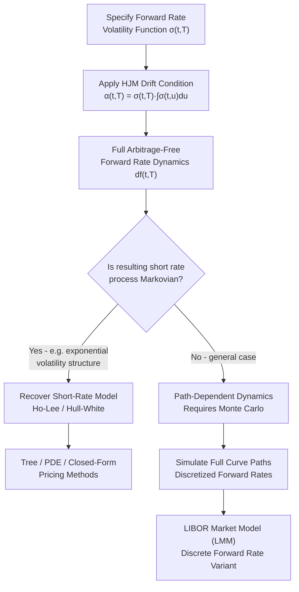

## The Heath-Jarrow-Morton Framework

### Overview

The Heath-Jarrow-Morton (HJM) framework, introduced by David Heath, Robert Jarrow, and Andrew Morton in 1992, is a general methodology for modeling the evolution of the entire forward interest rate curve under no-arbitrage conditions. Rather than modeling a single short rate process (as in Vasicek, CIR, or Hull-White) and deriving the rest of the curve from it, HJM directly specifies the stochastic dynamics of instantaneous forward rates across all maturities simultaneously.

The central insight of the framework is the **HJM drift condition**: once the volatility structure of forward rates is specified, the drift of each forward rate under the risk-neutral measure is *fully determined* — it cannot be chosen independently. This eliminates arbitrage by construction, and it is the defining structural feature that distinguishes HJM from earlier short-rate approaches.

**Key Points**

- HJM models the full forward rate curve $f(t,T)$, not just the short rate $r(t)$
- Volatility specification determines drift — no free choice of drift under $Q$
- Short-rate models (Vasicek, CIR, Hull-White, Ho-Lee) can be recovered as special cases of HJM under specific volatility structures
- The framework is generally **non-Markovian** in its raw form, which historically limited computational tractability
- LIBOR Market Model (LMM) and Swap Market Model are discretized, market-observable-rate variants built on HJM's no-arbitrage logic

### Mathematical Setup

**Forward Rate Definition**

The instantaneous forward rate $f(t,T)$ is the rate, agreed at time $t$, that applies to an infinitesimal period starting at future time $T$. It relates to the zero-coupon bond price $P(t,T)$ by:

$$f(t,T) = -\frac{\partial \ln P(t,T)}{\partial T}$$

Equivalently, the bond price is recovered by integrating forward rates:

$$P(t,T) = \exp\left(-\int_t^T f(t,u)\, du\right)$$

The short rate is the limiting case as maturity approaches the current time:

$$r(t) = f(t,t)$$

**HJM Dynamics**

Under the real-world (physical) measure, HJM posits that each forward rate $f(t,T)$ follows an Itô process:

$$df(t,T) = \alpha(t,T)\, dt + \sigma(t,T)\, dW(t)$$

where:

- $\alpha(t,T)$ is the drift of the forward rate
- $\sigma(t,T)$ is the (possibly vector-valued, if multiple factors) volatility
- $W(t)$ is a (possibly multi-dimensional) Brownian motion

Both $\alpha$ and $\sigma$ may depend on the entire path of rates up to time $t$, not just the current curve — this is a key source of the model's generality and its potential non-Markovian behavior.

### The HJM Drift Condition

This is the core theoretical result of the framework. Under the risk-neutral measure $Q$ (with the money-market account as numéraire), no-arbitrage forces the drift of the forward rate to satisfy:

$$\alpha(t,T) = \sigma(t,T) \int_t^T \sigma(t,u)\, du$$

For the multi-factor case with $n$ independent Brownian motions:

$$\alpha(t,T) = \sum_{i=1}^{n} \sigma_i(t,T) \int_t^T \sigma_i(t,u)\, du$$

**Derivation Sketch**

The condition follows from requiring that discounted zero-coupon bond prices $P(t,T)/B(t)$ be martingales under $Q$, where $B(t) = \exp\left(\int_0^t r(s)\,ds\right)$ is the money-market account. Applying Itô's lemma to $\ln P(t,T)$ (expressed via the integral of forward rates) and setting the drift of the discounted bond price to zero yields the constraint above. The mechanics: since $P(t,T) = \exp(-\int_t^T f(t,u)\,du)$, the dynamics of $\ln P(t,T)$ inherit both a drift term (integrating $\alpha$) and a volatility term (integrating $\sigma$). The martingale requirement under $Q$ forces a precise cancellation, which resolves into the drift condition relating $\alpha$ to $\sigma$.

**Practical Implication**: A modeler only needs to specify the volatility function $\sigma(t,T)$. The entire drift structure — and therefore the full arbitrage-free evolution of the curve — is then mechanically determined. This is fundamentally different from short-rate models, where drift and volatility of $r(t)$ are typically specified independently (subject to separate calibration).

### Risk-Neutral Dynamics and the Market Price of Risk

Under the physical measure $\mathbb{P}$, the drift is not pinned down by no-arbitrage alone; it is:

$$\alpha(t,T) = \sigma(t,T)\int_t^T \sigma(t,u)\,du + \sigma(t,T)\lambda(t)$$

where $\lambda(t)$ is the market price of risk vector. Moving to $Q$ via Girsanov's theorem absorbs the $\lambda(t)$ term into the change of measure, leaving the clean drift condition shown above. Since derivatives pricing under the risk-neutral measure does not require estimating $\lambda(t)$, most practical HJM implementations work directly under $Q$.

### The Markovian Problem

In its general form, HJM dynamics are **path-dependent**: the drift at time $t$ depends on an integral involving the volatility function evaluated over $[t,T]$, and because $\sigma(t,T)$ can itself depend on the current level of rates or on history, the resulting short-rate process $r(t) = f(t,t)$ is typically not Markovian. This has significant practical consequences:

- Non-Markovian short rate processes generally cannot be priced using simple recombining trees or low-dimensional PDEs
- Monte Carlo simulation becomes the default numerical method, which is computationally expensive, particularly for early-exercise (American/Bermudan) instruments
- The entire *history* of the forward curve's evolution may be needed to evaluate the current drift, not just its current state

**Markovian Special Cases**

Specific choices of $\sigma(t,T)$ restore Markovian dynamics, recovering familiar short-rate models:

| Volatility Specification | Resulting Model |
| --- | --- |
| $\sigma(t,T) = \sigma$ (constant) | Ho-Lee |
| $\sigma(t,T) = \sigma e^{-a(T-t)}$ | Hull-White (extended Vasicek) |
| $\sigma(t,T) = \sigma(t)e^{-a(T-t)}$ | Generalized Hull-White |

[Inference] The Ritchken-Sankarasubramanian (RS) framework and related work established broader conditions under which HJM models admit low-dimensional Markovian representations (typically requiring separable, exponential-type volatility structures), which is the standard route practitioners use to retain HJM's no-arbitrage generality while regaining computational tractability.

### One-Factor vs. Multi-Factor HJM

**Single-Factor HJM**: A single Brownian motion drives all forward rates. This implies that forward rates across all maturities are perfectly (instantaneously) correlated — a well-known limitation, since real yield curves exhibit imperfect correlation between short and long maturities (curve steepening/flattening, twists).

**Multi-Factor HJM**: Uses $n > 1$ independent Brownian motions, typically interpreted via principal component analysis of historical yield curve changes:

- Factor 1: parallel shift (level)
- Factor 2: slope (steepening/flattening)
- Factor 3: curvature (butterfly)

[Inference] Empirically, three factors typically explain the large majority of historical yield curve variance in most developed rates markets, though the exact proportion is time-period- and market-dependent and should not be treated as a fixed constant.

Multi-factor models better capture realistic curve dynamics and de-correlated hedging behavior, at the cost of higher dimensionality in simulation and calibration.

### Diagram: HJM Framework Structure

### Discretization: From HJM to the LIBOR Market Model

Instantaneous forward rates are not directly observable in markets — traded instruments reference discrete rates (e.g., 3-month LIBOR/SOFR-based forwards, swap rates). The **LIBOR Market Model (LMM)**, also called the BGM model (Brace-Gatarek-Musiela), reformulates HJM in terms of discretely-compounded forward rates $L_i(t)$ over fixed tenor structures.

The LMM inherits HJM's no-arbitrage drift-from-volatility logic but applies it to simple (not continuously-compounded) forward rates, which allows:

- Direct calibration to observable caplet/floorlet and swaption volatilities (via Black-like formulas)
- Lognormal (or displaced-diffusion/SABR-extended) dynamics for each forward rate, making market volatility quoting conventions directly usable
- Practical simulation via Monte Carlo with drift terms computed numerically at each time step (the drift for each forward rate under a given numéraire measure depends on other forward rates in the curve)

$$dL_i(t) = \mu_i(t)\, L_i(t)\, dt + \sigma_i(t)\, L_i(t)\, dW_i(t)$$

where $\mu_i(t)$ is determined by the no-arbitrage drift condition analogous to HJM's, specific to the chosen numéraire (e.g., terminal measure vs. spot LIBOR measure).

### Numerical Implementation Considerations

**Monte Carlo Simulation of HJM**

Since general HJM dynamics are path-dependent, simulation typically proceeds via:

1. Discretize the forward curve into a finite set of maturities/tenors
2. Discretize time into small steps $\Delta t$
3. At each step, compute the drift for each forward rate bucket using the (numerically integrated) HJM drift condition
4. Evolve all forward rates simultaneously using correlated Brownian increments (for multi-factor models)
5. Reconstruct bond prices / discount factors from the simulated forward curve at each time step for discounting and payoff evaluation

**Key Practical Challenges**

- Computational cost scales with the number of factors and the granularity of the tenor discretization
- Drift calculation at each time step requires integrating (or summing) volatility contributions across the entire forward curve, which is $O(n^2)$ in the number of tenor buckets per time step in naive implementations
- Calibrating $\sigma(t,T)$ to match market-observed volatility surfaces (cap/floor, swaption) while maintaining a parsimonious, stable factor structure is a nontrivial inverse problem
- [Inference] In practice, quants typically favor Markovian HJM restrictions (e.g., separable volatility structures per Ritchken-Sankarasubramanian) or move to the LMM specifically to avoid the full computational burden of general path-dependent HJM simulation

### Worked Example: One-Factor Ho-Lee as an HJM Special Case

Let $\sigma(t,T) = \sigma_0$ (a constant, independent of $t$ and $T$). Applying the HJM drift condition:

$$\alpha(t,T) = \sigma_0 \int_t^T \sigma_0\, du = \sigma_0^2 (T-t)$$

So the forward rate dynamics become:

$$df(t,T) = \sigma_0^2(T-t)\, dt + \sigma_0\, dW(t)$$

Setting $T = t$ recovers the short-rate SDE:

$$dr(t) = \theta(t)\, dt + \sigma_0\, dW(t)$$

which is exactly the **Ho-Lee model**, where $\theta(t)$ is chosen to fit the initial term structure. This demonstrates concretely how a simple volatility assumption within HJM mechanically reproduces a known short-rate model, with the drift condition doing all the work of enforcing no-arbitrage.

### Applications and Practical Use

- **Interest rate derivatives pricing**: caps, floors, swaptions, and exotic structured rate products where the full curve dynamics (not just the short rate) matter
- **Curve risk management**: multi-factor HJM/LMM implementations provide realistic sensitivities (delta ladders) across the curve, useful for hedging books with exposure at multiple tenors
- **Foundation for market models**: LMM/BGM (and the related Swap Market Model, which models forward swap rates instead of forward LIBOR rates) are the industry-standard practical descendants of HJM, particularly for calibrating to liquid cap/swaption markets
- **Benchmark/reference in academic and quant literature**: HJM is often the theoretical reference point used to check that a proposed short-rate or market model is arbitrage-free

### Limitations

- Historically criticized for lack of Markovian tractability in its general form
- Requires careful, often high-dimensional, calibration of the volatility function/surface
- Single-factor versions are widely regarded as inadequate for realistic curve risk management due to perfect rate correlation across maturities
- Computationally intensive relative to simpler short-rate models when general (non-Markovian) specifications are used
- [Speculation] Some practitioners consider the added complexity of full HJM/LMM implementations unnecessary for products that are insensitive to the fine structure of curve decorrelation, favoring simpler short-rate models where the extra degrees of freedom don't materially change hedging or pricing outcomes.

**Related Topics**

- Short-rate models: Vasicek, Cox-Ingersoll-Ross (CIR), Hull-White
- The LIBOR Market Model (LMM/BGM) and its calibration to caps/swaptions
- The Swap Market Model
- Ritchken-Sankarasubramanian Markovian restrictions of HJM
- Principal Component Analysis of yield curve factors
- Martingale pricing theory and Girsanov's theorem
- SABR model and volatility smile extensions to LMM
- Monte Carlo methods for path-dependent interest rate derivatives