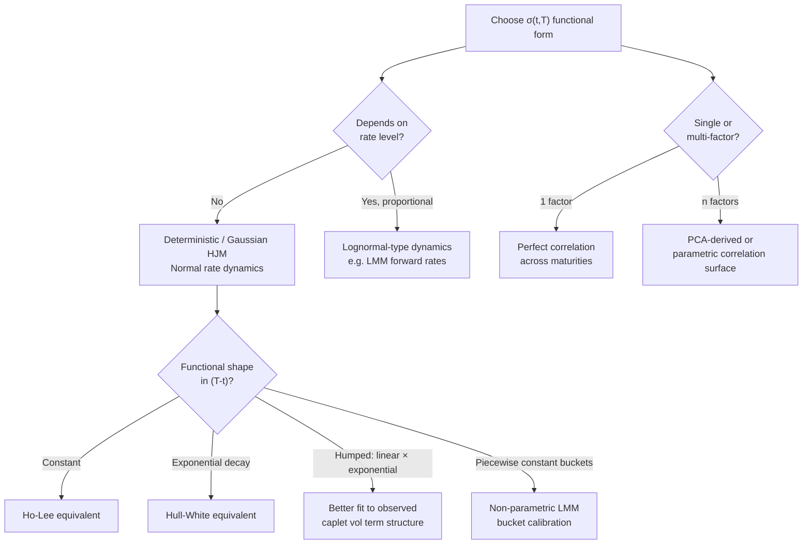

## Forward Rate Volatility Structures

### Overview

Within the HJM framework, the volatility function $\sigma(t,T)$ is the single object a modeler must specify — it fully determines the drift via the HJM drift condition, and therefore determines the entire arbitrage-free evolution of the forward curve. The choice of volatility structure is not a minor calibration detail; it dictates the model's Markovian properties, the shape of implied caplet/swaption volatilities, the correlation between rates at different maturities, and the computational tractability of the resulting model. This topic surveys the standard families of forward rate volatility specifications, their implications, and how they map onto known short-rate and market models.

**Key Points**

- $\sigma(t,T)$ can depend on calendar time $t$, maturity $T$, the time-to-maturity $(T-t)$, and/or the current level of rates
- The functional form chosen determines whether the resulting short-rate process is Markovian
- Volatility structures directly shape the model-implied term structure of volatility (e.g., humped vs. monotonically decaying caplet vol)
- Multi-factor structures determine the correlation surface between forward rates of different maturities
- Calibration to market instruments (caps, swaptions) effectively means fitting $\sigma(t,T)$

### Classifying Volatility Structures

Forward rate volatility functions are generally classified along several dimensions:

**1. Dependence structure**

- **Deterministic**: $\sigma(t,T)$ depends only on $t$ and $T$ (or equivalently $t$ and $\tau = T-t$), not on the level of rates. Produces Gaussian (normal) forward rate dynamics.
- **State-dependent (proportional)**: $\sigma(t,T) = \sigma(t,T) \cdot f(t,T)$ or similar, where volatility scales with the current forward rate level. Produces lognormal-type dynamics, avoiding negative rates in the classical formulation.
- **CEV / local volatility type**: $\sigma(t,T) \propto f(t,T)^\gamma$ for $0 \le \gamma \le 1$, interpolating between normal ($\gamma=0$) and lognormal ($\gamma=1$) behavior.

**2. Number of factors**

- **One-factor**: single $\sigma(t,T)$, single Brownian motion — implies perfect instantaneous correlation across all maturities
- **Multi-factor**: $\sigma_i(t,T)$ for $i=1,\dots,n$, each driven by an independent Brownian motion — allows imperfect correlation and richer curve dynamics (level, slope, curvature)

**3. Time-homogeneity**

- **Time-homogeneous**: $\sigma(t,T) = \sigma(T-t)$, depending only on time-to-maturity, not calendar time. Produces stationary dynamics and is generally preferred for stable model behavior over time.
- **Time-inhomogeneous**: $\sigma(t,T)$ depends on calendar time explicitly, often used to fit a full initial volatility surface at a point in time but can produce unstable/non-stationary forward volatility term structures as time passes.

### Standard Volatility Function Families

**Constant Volatility**

$$\sigma(t,T) = \sigma_0$$

The simplest specification. Every forward rate has the same, constant instantaneous volatility regardless of time or maturity. Via the HJM drift condition, this produces the **Ho-Lee model**:

$$dr(t) = \theta(t)\,dt + \sigma_0\,dW(t)$$

**Limitations**: Implies volatility of the short rate never decays with time-to-maturity, which is empirically unrealistic — long-dated forward rates typically exhibit lower volatility than short-dated ones (the term structure of volatility is usually downward-sloping, not flat).

**Exponentially Decaying (Hull-White type)**

$$\sigma(t,T) = \sigma_0\, e^{-a(T-t)}$$

Volatility decays exponentially with time-to-maturity at rate $a$ (mean-reversion speed). This is time-homogeneous and Markovian, recovering the **Hull-White (extended Vasicek)** short-rate model:

$$dr(t) = [\theta(t) - a\,r(t)]\,dt + \sigma_0\,dW(t)$$

**Key Points**

- $a > 0$ implies short-dated forward rate volatility exceeds long-dated volatility, consistent with typical market behavior
- $a$ also controls the speed of mean reversion in the equivalent short-rate representation
- This is one of the most widely used specifications in practice due to its balance of realism and tractability (admits closed-form bond and option prices)

**Generalized/Time-Dependent Exponential**

$$\sigma(t,T) = \sigma(t)\, e^{-a(T-t)}$$

Allows the volatility scale $\sigma(t)$ to vary over calendar time, giving additional degrees of freedom to fit a term structure of at-the-money volatilities (e.g., caplet volatilities across different expiries) while retaining the exponential maturity-decay shape. Still Markovian under the Ritchken-Sankarasubramanian conditions provided the separable structure $\sigma(t,T) = g(t)h(T)$ is preserved.

**Humped Volatility Structures**

$$\sigma(t,T) = [\sigma_0 + \sigma_1(T-t)]\, e^{-a(T-t)}$$

Many markets exhibit a **humped** term structure of volatility: instantaneous forward rate volatility rises initially with time-to-maturity (short-dated rates, e.g. under 1-2 years, are often less volatile due to central bank anchoring / monetary policy predictability) before decaying at longer maturities. The linear-times-exponential form above (sometimes attributed to Mercurio-Moraleda or similar parametric families) captures this hump shape with a small number of parameters ($\sigma_0, \sigma_1, a$).

[Inference] The humped shape is widely cited in practitioner literature as a better empirical fit to caplet volatility term structures than monotonic decay, particularly in markets where short-end rates are heavily influenced by central bank policy expectations, though the precise hump location and magnitude vary by market and time period.

**Piecewise-Constant / Bucketed Volatility**

$$\sigma(t,T) = \sigma_{i} \quad \text{for } T \in [T_i, T_{i+1})$$

Common in practical LIBOR Market Model implementations: volatility is assumed constant within discrete maturity buckets (matching the tenor structure of quoted caplets/swaptions) and calibrated bucket-by-bucket to match market quotes exactly (or in a least-squares sense). This is a non-parametric, flexible approach at the cost of more parameters and potential overfitting/instability.

### Multi-Factor Volatility Structures

For $n$-factor models, the volatility is a vector $\sigma(t,T) = (\sigma_1(t,T), \ldots, \sigma_n(t,T))$, and the instantaneous correlation between forward rates $f(t,T_1)$ and $f(t,T_2)$ is:

$$\rho(T_1, T_2) = \frac{\sum_i \sigma_i(t,T_1)\sigma_i(t,T_2)}{\|\sigma(t,T_1)\| \cdot \|\sigma(t,T_2)\|}$$

**Principal Component-Based Construction**

A standard practical approach derives factor loadings directly from PCA of historical daily/weekly changes in the forward or zero curve:

1. Compute the historical covariance matrix of forward rate changes across a grid of maturities
2. Perform eigendecomposition; the top eigenvectors become factor loading shapes
3. Typically the first 3 factors are interpreted as:
   - **Factor 1 (Level)**: roughly parallel shift across the curve
   - **Factor 2 (Slope)**: opposite-signed loadings at short vs. long end (steepening/flattening)
   - **Factor 3 (Curvature)**: humped loading shape (butterfly movements)

Each factor's loading, scaled by its eigenvalue-derived volatility, becomes $\sigma_i(t,T)$ as a function of maturity.

**Angle/Correlation Parametrization**

An alternative construction directly parametrizes a target correlation surface $\rho(T_1,T_2)$ (e.g., using a two-parameter exponential decay in $|T_1-T_2|$) and factorizes it to obtain $\sigma_i(t,T)$ components consistent with that correlation structure — common in LMM implementations calibrating jointly to caplets and swaptions, since swaption prices are sensitive to the full correlation surface while caplets are not.

### Diagram: Volatility Structure Decision Tree

### Calibration Considerations

**Implied vs. Historical Calibration**

- **Risk-neutral (implied) calibration**: fit $\sigma(t,T)$ so that model-implied prices of caps, floors, and swaptions match observed market prices (typically via Black or normal implied volatilities). This is standard for pricing and hedging desks since it ensures consistency with the market's current risk-neutral view.
- **Historical (statistical) calibration**: estimate $\sigma(t,T)$ from realized historical forward rate volatility and covariance (e.g., via PCA as above). More common for risk management, scenario generation, and real-world (physical measure) simulation (e.g., VaR, economic capital).

**Practical Trade-offs**

| Approach | Pros | Cons |
| --- | --- | --- |
| Parametric (e.g., exponential, humped) | Few parameters, stable, smooth extrapolation | May not fit all market quotes exactly |
| Piecewise/bucketed | Exact fit to quoted instruments | Overfitting risk, can be unstable day-to-day, more parameters to manage |
| PCA/historical | Captures realistic real-world correlation | Not automatically consistent with current implied vol surface; requires separate risk-neutral drift adjustment |

**Calibration Instability**

[Inference] Volatility structures fit to closely track a snapshot of market quotes (particularly highly flexible bucketed specifications) tend to exhibit day-to-day parameter instability as the market surface moves, which can create artificial P&L noise in risk management systems even when the underlying market view has not meaningfully changed; parametric structures with fewer degrees of freedom are generally more stable but at the cost of a looser fit.

### Worked Example: Comparing Two Specifications

Consider pricing a 5-year cap under two volatility structures, both calibrated to match the same at-the-money 5-year cap price:

1. **Constant volatility** $\sigma(t,T) = \sigma_0$: implies flat term structure of forward rate volatility. Will misprice the term structure of caplet volatilities that make up the cap (e.g., 1x2, 2x3, ..., 4x5 caplets) even if the aggregate cap price matches, because it forces every caplet to imply the same volatility level.
2. **Exponential decay** $\sigma(t,T) = \sigma_0 e^{-a(T-t)}$: can be calibrated so that both the overall cap price *and* the relative pattern of individual caplet volatilities (typically decreasing with longer expiry, all else equal) are closer to what's observed in the market, because the decay parameter $a$ gives an extra degree of freedom to match the *shape*, not just the level.

This illustrates why the *specific functional form* of $\sigma(t,T)$ matters even when calibration targets (e.g., a single cap price) can be matched by multiple different structures — the structure determines fit quality across the full range of related instruments (individual caplets, swaptions of different tenors) and affects hedging behavior (how sensitivities move as the curve evolves).

### Applications and Practical Use

- **Cap/floor and swaption pricing**: the primary calibration targets for fitting $\sigma(t,T)$ in practice
- **Exotic interest rate derivatives**: volatility structure choice materially affects pricing of path-dependent or correlation-sensitive products (e.g., CMS spread options, callable structured notes, Bermudan swaptions)
- **Hedging (Greeks)**: the shape of $\sigma(t,T)$ determines how DV01/vega bucket sensitivities are distributed across the curve, directly affecting hedge ratios
- **Risk management / scenario generation**: historically-calibrated multi-factor structures underpin VaR models and economic scenario generators for interest rate risk

### Limitations

- Deterministic volatility structures cannot capture the volatility smile/skew observed in cap and swaption markets (out-of-the-money vs. at-the-money implied vols differing) — this generally requires extensions such as displaced diffusion, CEV, or full stochastic volatility (e.g., SABR-LMM hybrids)
- One-factor structures, regardless of their maturity-dependence shape, cannot reproduce realistic decorrelation between short and long rates
- Historically-fit structures may not be arbitrage-consistent with current market prices unless explicitly reconciled with risk-neutral calibration
- [Speculation] Highly flexible bucketed volatility calibrations, while achieving excellent fit to a single day's market data, may in practice generalize poorly to pricing off-market-quote instruments or produce unstable hedges, leading some practitioners to prefer smoother parametric forms even at the cost of exact fit.

**Related Topics**

- The HJM drift condition and its dependence on volatility specification
- LIBOR Market Model (LMM) calibration to caps and swaptions
- SABR model and volatility smile/skew extensions
- Principal Component Analysis (PCA) of yield curve dynamics
- Displaced diffusion and CEV processes for interest rates
- Correlation surface parametrization in multi-factor rate models
- Hull-White and Ho-Lee short-rate models as HJM special cases
- Bermudan swaption pricing and volatility structure sensitivity