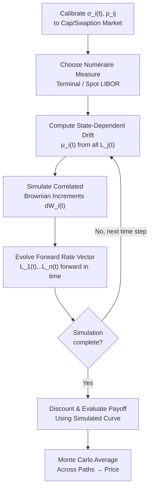
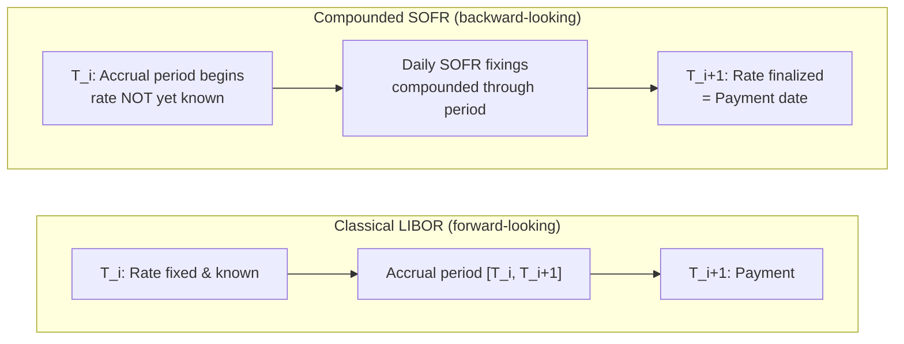

## The LIBOR Market Model and Its Successors

### Overview

The LIBOR Market Model (LMM), also known as the BGM model (Brace-Gatarek-Musiela, 1997), is the market-standard practical implementation of HJM-consistent, no-arbitrage dynamics for discretely-compounded, market-observable forward rates. Where HJM specifies instantaneous forward rates that are not directly traded, LMM works directly with simple forward rates matching real market tenor structures (e.g., 3-month, 6-month LIBOR forwards), and assumes lognormal dynamics for each, making it directly compatible with Black's formula for caps and swaptions — the market's standard quoting convention.

With the global transition away from LIBOR to overnight risk-free rates (RFRs) — SOFR (US), SONIA (UK), €STR (Eurozone), SARON (Switzerland), TONA (Japan) — the LMM framework has required substantial reformulation. This item covers both the classical LMM and its "successor" frameworks adapted for backward-looking, compounded-in-arrears risk-free rates.

**Key Points**

- LMM (BGM) models discrete forward rates directly, calibrated to observable cap/swaption markets
- USD LIBOR ceased publication for most tenors after June 2023, driving industry-wide adoption of SOFR-based conventions

  SOFR futures replaced the Eurodollar futures market that previously referenced 3-month USD LIBOR, with existing contracts switched to compounded SOFR plus a fixed spread adjustment [arxiv](https://arxiv.org/pdf/2401.15728)
- The key modeling complication of RFRs is that they are **backward-looking**: SOFR is a backward-looking overnight rate, in contrast to LIBOR's forward-looking term structure across multiple tenors [arXiv](https://arxiv.org/pdf/2112.14033)
- Successor frameworks (Forward Market Model / FMM, backward-looking extensions of LMM) unify forward-looking and backward-looking rate dynamics under a common stochastic framework

### Classical LMM (BGM) Framework

**Setup**

Let $T_0 < T_1 < \cdots < T_n$ define a tenor structure (e.g., quarterly dates). The forward rate $L_i(t)$ for the accrual period $[T_i, T_{i+1}]$, observed at time $t \le T_i$, relates to zero-coupon bond prices by:

$$L_i(t) = \frac{1}{\delta_i}\left(\frac{P(t,T_i)}{P(t,T_{i+1})} - 1\right)$$

where $\delta_i = T_{i+1} - T_i$ is the day-count fraction (accrual period length).

**Lognormal Dynamics**

Under its own natural payment-date forward measure $Q^{T_{i+1}}$ (with $P(t,T_{i+1})$ as numéraire), each forward rate is a martingale with driftless lognormal dynamics:

$$dL_i(t) = \sigma_i(t)\, L_i(t)\, dW_i^{T_{i+1}}(t)$$

This is precisely why LMM is compatible with Black's formula: under its own forward measure, each $L_i(t)$ behaves like a lognormal asset price, so caplet prices reduce to the standard Black caplet formula, with $\sigma_i(t)$ interpretable directly as market-quoted implied volatility.

**Drift Under a Common Measure**

Since derivatives typically involve cash flows across multiple tenor dates, all forward rates must be simulated under a single common measure (e.g., the terminal measure $Q^{T_n}$ or the spot LIBOR measure). Under a common measure, forward rates acquire non-trivial, state-dependent drifts:

$$dL_i(t) = \mu_i(t)\, L_i(t)\,dt + \sigma_i(t)\, L_i(t)\, dW_i(t)$$

$$\mu_i(t) = -\sum_{j=i+1}^{n-1} \frac{\delta_j \rho_{ij}\, \sigma_i(t)\sigma_j(t)\, L_j(t)}{1 + \delta_j L_j(t)} \quad \text{(terminal measure, } i < n-1\text{)}$$

where $\rho_{ij}$ is the instantaneous correlation between $L_i$ and $L_j$. This drift has no closed form in general (it depends on the full vector of forward rates), which is why LMM is almost universally implemented via **Monte Carlo simulation**.

### Diagram: LMM Simulation Architecture

### Calibration of Classical LMM

**Two Target Markets**

- **Caplets/floorlets**: price depends only on the marginal (own) volatility $\sigma_i(t)$ of each forward rate — insensitive to correlation $\rho_{ij}$
- **Swaptions**: price depends on the *joint* distribution of multiple forward rates within the underlying swap, so it is sensitive to both volatilities and the full correlation matrix $\rho_{ij}$

This means caplet markets alone are insufficient to pin down $\rho_{ij}$; correlation is typically calibrated jointly using swaption prices, historical data (PCA-based), or parametric correlation forms (e.g., $\rho_{ij} = e^{-\beta|T_i - T_j|}$).

**Volatility Smile Extensions**

Standard lognormal LMM cannot reproduce the volatility smile/skew observed in cap and swaption markets. Common extensions:

- **Displaced-diffusion LMM**: $d(L_i(t) + \alpha) = \sigma_i(t)(L_i(t)+\alpha)\,dW_i(t)$, shifting the process to allow a mix of normal/lognormal behavior and generate skew
- **SABR-LMM / Stochastic volatility LMM**: adds a separate stochastic process for $\sigma_i(t)$ itself, capturing smile curvature in addition to skew
- **CEV-LMM**: $dL_i(t) = \sigma_i(t)\,L_i(t)^\beta\,dW_i(t)$, generalizing the power of $L_i$

### Successor Frameworks: Backward-Looking Rate Models

**Why LMM Needed Reformulation**

SOFR is an overnight rate, unlike LIBOR which spans a range of tenors from overnight to 12 months; since SOFR has no directly observable long-term maturities, forward interest rates must be inferred from the overnight rate and derivative instruments such as futures. Furthermore, the SOFR Average is a backward-looking compound overnight rate over a past period, whereas LIBOR was a forward-looking term rate known at the start of the accrual period. This structurally changes the payoff and fixing timeline: in a SOFR-referencing swap, the accrual period fixing coincides with the payment date because the rate is only known at the end of the period, unlike a classical LIBOR swap where the rate was known in advance. [arXiv:2112.14033v2 [q-fin.MF] 15 Mar 2025 +2](https://arxiv.org/pdf/2112.14033)

**Two Market Conventions**

Regulators and ISDA developed two main approaches: a compounded backward-looking setting-in-arrears rate known only at the end of the accrual period, and a forward-looking term rate. Term SOFR, published based on SOFR futures and OIS transactions, is a forward-looking rate reflecting derivative market expectations, in contrast to backward-looking overnight SOFR which reflects what actually happened. However, forward-looking term rates like CME and ICE Term SOFR are not supported by the ARRC for general derivatives use and are restricted to hedging cash products referencing term SOFR, with backward-looking compounded rates instead adopted as the standard LIBOR fallback. [Looking forward to backward-looking rates: a modeling framework for term rates replacing LIBOR | Insights | Bloomberg Professional Services +2](https://www.bloomberg.com/professional/insights/data/looking-forward-backward-looking-rates-modeling-framework-term-rates-replacing-libor/)

**Forward Market Model (FMM) — Lyashenko-Mercurio Framework**

The extension of the LIBOR Market Model to backward-looking rates completes the model by providing additional information about rate dynamics not accessible in the classical LMM. This generalized Forward Market Model (FMM) allows both forward-looking, IBOR-like rates and backward-looking, setting-in-arrears rates to be simulated using a single stochastic process, providing additional information about rate dynamics between fixing and payment times — something the classical LMM, built purely around forward-looking tenor structures, cannot natively represent. [SSRN](https://papers.ssrn.com/sol3/papers.cfm?abstract_id=3330240)[Bloomberg](https://www.bloomberg.com/professional/insights/data/looking-forward-backward-looking-rates-modeling-framework-term-rates-replacing-libor/)

**Key structural differences from classical LMM:**

| Aspect | Classical LMM (LIBOR) | FMM / Backward-Looking Extension |
| --- | --- | --- |
| Rate observability | Known at start of accrual period | Not observed until end of accrual period (fixing date coincides with payment date) |
| Underlying rate type | Forward-looking term rate | Overnight rate compounded over the accrual period, without a native term structure |
| Model state variable | Forward rate $L_i(t)$ | Requires modeling the evolving distribution of the compounded-in-arrears rate throughout the accrual window |
| Credit risk component | Embeds bank credit/liquidity risk premium | Nearly risk-free, no embedded credit risk component |

**Multi-Curve Framework**

The transition from LIBOR to nearly risk-free overnight rates required moving from a classical single-curve modeling framework to a multi-curve, arbitrage-free framework for pricing and hedging both collateralized and uncollateralized SOFR-linked swaps. In practice, this means separate curves are typically bootstrapped and modeled for discounting (usually OIS/SOFR-based, tied to collateral remuneration) versus forecasting the relevant floating rate — a structural feature that predates the LIBOR transition (arising after the 2008 financial crisis) but which becomes the *only* framework once IBOR-based forecast curves disappear entirely. [ResearchGate](https://www.researchgate.net/publication/331554423_Looking_Forward_to_Backward-Looking_Rates_A_Modeling_Framework_for_Term_Rates_Replacing_LIBOR)

**Convexity Adjustments for Backward-Looking Futures**

Because SOFR futures settle on a backward- rather than forward-looking fixing, additional convexity considerations apply beyond the standard futures-versus-forward-rate adjustment familiar from LIBOR-based Eurodollar futures. This is an active area of quant modeling, since the compounding convention interacts with the futures margining mechanics in a way that has no direct LIBOR-era analogue. [arxiv](https://arxiv.org/pdf/2401.15728)

### Diagram: Forward vs. Backward-Looking Rate Timeline

### Market Evolution: Volumes and Adoption

SOFR cap/floor trading volume reached 926.9 USD bn in the first nine months of 2022, up sharply from 85.6 USD bn for all of 2021; SONIA cap/floor volume reached 210.9 USD bn over the same nine-month period in 2022, versus 72.5 USD bn for all of 2021, reflecting rapid liquidity migration into RFR-referencing non-linear derivatives following the LIBOR cessation timeline. [Inference] Given this trajectory, backward-looking compounded-rate derivatives are now the dominant convention in USD and GBP non-linear rates markets, though forward-looking term rate products persist in specific cash-market-linked use cases as noted above. [arxiv](https://arxiv.org/pdf/2202.09116)

### Worked Example: Caplet Payoff Comparison

**Classical LIBOR caplet** on notional $N$, strike $K$, accrual $[T_i, T_{i+1}]$, fixed at $T_i$:

$$\text{Payoff} = N \delta_i \max(L_i(T_i) - K, 0), \quad \text{paid at } T_{i+1}$$

Priced directly via Black's formula since $L_i(T_i)$ is known exactly at the fixing date $T_i$, prior to the accrual period beginning in economic effect (rate is set in advance).

**SOFR-based (backward-looking) caplet**: the floating rate is the **compounded SOFR** over $[T_i, T_{i+1}]$:

$$R_{i} = \frac{1}{\delta_i}\left(\prod_{k} (1 + \delta_k\, \text{SOFR}_k) - 1\right)$$

which is only fully known at $T_{i+1}$. The payoff is determined by this compounded in-arrears risk-free rate rather than a rate fixed in advance, meaning the caplet payoff, strike comparison, and Black-formula-style pricing must all account for a rate whose realized value is a path-dependent function of daily overnight fixings across the entire accrual window — not a single point-in-time forward rate lognormal under its own measure in the classical LMM sense. [arxiv](https://arxiv.org/pdf/2202.09116)

### Applications and Practical Use

- **Cap, floor, and swaption pricing**: LMM (and its RFR successors) remain the standard framework for calibrated pricing of vanilla and moderately exotic rate optionality
- **Structured note and callable products**: Bermudan swaptions, callable range accruals, and similar structures rely on LMM-style simulation for accurate exercise-boundary modeling
- **Cross-currency and basis products**: multi-curve frameworks with RFR-based curves are used to price and hedge collateralized and uncollateralized cross-currency basis swaps [ResearchGate](https://www.researchgate.net/publication/331554423_Looking_Forward_to_Backward-Looking_Rates_A_Modeling_Framework_for_Term_Rates_Replacing_LIBOR)
- **Legacy contract fallbacks**: existing LIBOR-referencing contracts without maturity before cessation required fallback language and spread adjustments, with a fixed spread of 26.161bp applied when converting 3M USD LIBOR exposures to compounded SOFR under the agreed fallback procedure [arxiv](https://arxiv.org/pdf/2401.15728)

### Limitations

- Classical LMM's lognormal assumption cannot capture smile/skew without extension (displaced-diffusion, SABR-LMM, CEV)
- State-dependent drift under a common measure has no closed form, forcing reliance on Monte Carlo — computationally expensive relative to short-rate PDE/tree methods, especially for early-exercise products
- Backward-looking rate frameworks are structurally newer and less standardized across the industry than the mature classical LMM literature; conventions can still vary by currency and trading desk
- [Speculation] Given the relative recency of widespread backward-looking derivative liquidity, some model risk practitioners regard FMM-style frameworks as less battle-tested than classical LMM, which had roughly two decades of live market calibration and stress-testing before the LIBOR transition accelerated.

**Related Topics**

- The HJM Framework and the drift condition underlying LMM's no-arbitrage construction
- Multi-curve discounting and OIS-based collateral discounting
- SABR-LMM and volatility smile modeling for RFR caps/swaptions
- Convexity adjustments for SOFR futures and forward-rate agreements
- Bermudan swaption pricing under LMM/FMM simulation
- Credit spread adjustments and ISDA IBOR fallback protocols
- Compounded-in-arrears rate conventions (SOFR, SONIA, €STR, SARON, TONA)
- Term SOFR and its restricted derivatives use cases