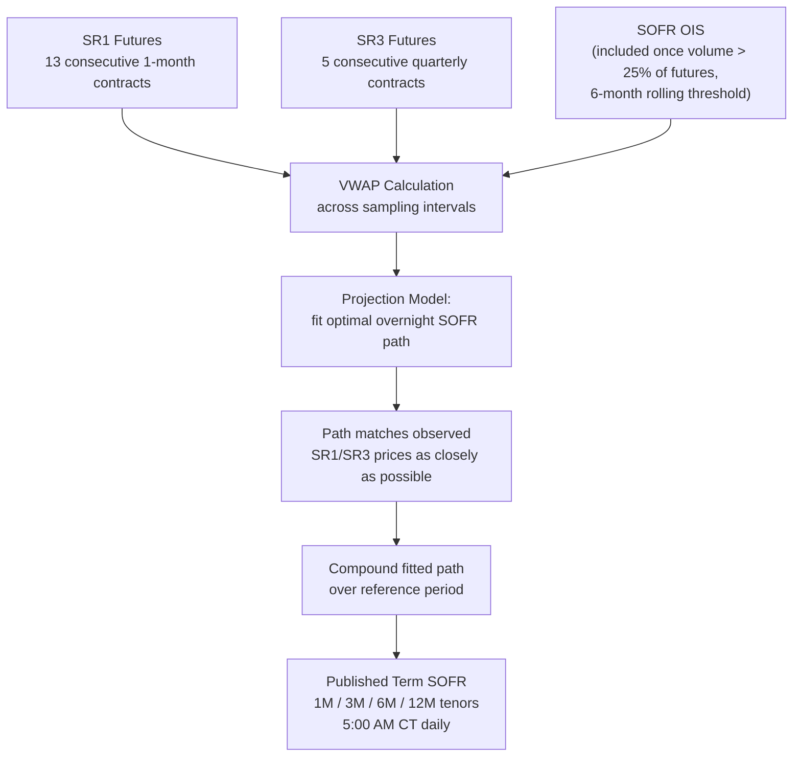
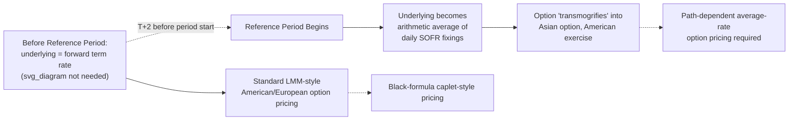

## The SOFR Term Rate Market Model

### Overview

CME Term SOFR Reference Rates are forward-looking interest rate estimates of overnight SOFR, calculated and published for 1-month, 3-month, 6-month, and (since September 2021) 12-month tenors, intended to provide a robust measure of market expectations derived from SOFR derivatives markets. Term SOFR occupies a specific niche in the post-LIBOR landscape: it restores a forward-looking, IBOR-like term rate — structurally familiar to legacy LIBOR-based systems and contracts — while being derived entirely from transactions in nearly risk-free overnight SOFR derivatives, rather than interbank credit-sensitive lending.

This item covers Term SOFR's construction methodology, its relationship to the classical LIBOR Market Model framework, the market model implications of its restricted use case, and how it is priced and risked relative to both classical LMM and the backward-looking compounded-SOFR successor frameworks.

**Key Points**

- Term SOFR is administered by CME Group Benchmark Administration Limited, registered under UK BMR and regulated by the FCA, selected by the ARRC through a formal RFP process in 2020
- Construction methodology relies primarily on SOFR futures (SR1 1-month, SR3 3-month contracts), with SOFR OIS data incorporated once its volume exceeds a defined threshold relative to futures volume
- Term SOFR is forward-looking and known at the start of the accrual period — structurally compatible with classical LMM machinery, unlike backward-looking compounded SOFR
- Its use in derivatives is **deliberately restricted** by ARRC guidance to hedging cash-market exposure, not general-purpose derivatives trading
- Options on SOFR futures exhibit a distinctive behavioral shift once the reference period begins, transitioning from standard American-style options to Asian-style options

### Construction Methodology

**Data Sources**

The CME Term SOFR methodology uses a combination of SOFR Overnight Indexed Swaps (OIS) and 1-month and 3-month SOFR futures contracts, with futures data based on executed and executable bids/offers. In practice, the calculation currently draws on transaction data from thirteen consecutive SR1 (1-month) futures contracts and five consecutive quarterly SR3 (3-month) futures contracts.

SOFR OIS is incorporated into the calculation only once transacted monthly OIS volumes exceed 25% of SOFR futures volumes over a consecutive six-month rolling period, monitored by the Administrator and reported to Oversight Committees for approval. This threshold-based design reflects a historical fact about the SOFR transition: futures liquidity built up faster than OTC OIS liquidity in the early stages of the transition, requiring the methodology to lean primarily on futures data initially, with room to shift weight toward OIS as that market matures. The underlying rationale, per the Heitfield-Park (2019) methodology referenced in academic literature, was that liquidity in SOFR OIS was not initially deemed sufficient, whereas SOFR futures traded in much larger volumes.

**Calculation Process**

A set of Volume-Weighted Average Prices (VWAP) is calculated from transaction prices observed across multiple sampling intervals throughout the trading day, feeding into a projection model to determine the published Term SOFR Reference Rates. The optimal path for overnight SOFR rates is determined such that the implied value of the selected SR1 and SR3 contracts under that path matches observed market prices as closely as possible, with final term rates constructed by compounding the fitted overnight SOFR path over the relevant reference period. Term SOFR Reference Rates are calculated for each day the New York Fed publishes SOFR (excluding SIFMA US holidays), with publication occurring at 5:00 AM CT.

**Diagram: Term SOFR Construction Pipeline**

### Relationship to the LIBOR Market Model

**Structural Compatibility**

Because Term SOFR is forward-looking and known before the reference period begins (published for reference periods starting T+2 from the publication date), it is structurally compatible with the classical LMM/BGM machinery covered previously: each Term SOFR forward rate $L_i(t)$ for accrual period $[T_i, T_{i+1}]$ can, in principle, be modeled with the same lognormal (or displaced-diffusion/SABR-extended) dynamics under its own payment-date forward measure as a classical LIBOR forward rate. This is a key practical advantage of Term SOFR over compounded-in-arrears SOFR: legacy LMM implementations, caplet/swaption pricing engines, and risk systems built around forward-looking rate structures require comparatively less re-architecture to accommodate Term SOFR than they do to accommodate genuinely backward-looking rates.

**Where It Diverges from Classical LIBOR Dynamics**

Despite the structural similarity, Term SOFR differs from LIBOR in its construction and risk content:

- **No embedded credit/liquidity premium**: SOFR is a secured, nearly risk-free rate based on Treasury repo transactions, unlike LIBOR's embedded interbank credit risk component
- **Derived, not directly quoted**: Term SOFR is a model-dependent construct fitted from futures and OIS prices, whereas LIBOR panel submissions were direct (if imperfect) representations of interbank borrowing costs; using futures prices to compute forward rates is a model-dependent procedure that also introduces convexity adjustment considerations
- **Restricted derivatives eligibility**: this is the most consequential divergence for market model purposes, discussed below

### The ARRC Use-Case Restriction and Its Market Model Implications

Unlike classical LIBOR, Term SOFR is not intended for general-purpose derivatives trading. Permitted derivative uses are narrowly scoped: hedging end-user exposure from cash market financial products that reference Term SOFR, swapping fixed-rate debt to Term SOFR only when hedging existing Term SOFR exposure, and Term-SOFR-versus-SOFR-OIS basis swaps.

**Practical Consequence for Market Modeling**

This restriction means Term SOFR cannot simply replace LIBOR as the universal underlying for a general LMM-style cap/swaption market in the way LIBOR once was. The **liquid, general-purpose derivatives market** underlying most cap/floor and swaption trading has instead migrated to instruments referencing **compounded-in-arrears SOFR** (the backward-looking convention), not Term SOFR. As a result:

- The bulk of vanilla SOFR cap/floor and swaption liquidity — and therefore the natural calibration targets for a SOFR-based market model — reference backward-looking compounded SOFR, not Term SOFR
- A "Term SOFR Market Model" in the LMM sense is consequently a narrower, more specialized construct than classical LMM was for LIBOR: it is most directly applicable to the restricted basis-swap and cash-product-hedging use cases where Term SOFR is permitted, and to Term-SOFR-vs-SOFR-OIS basis products specifically
- Basis swaps between Term SOFR and SOFR OIS (compounded SOFR) require the market model to jointly represent both a forward-looking Term SOFR leg and a backward-looking compounded SOFR leg — effectively requiring the generalized Forward Market Model (FMM) framework discussed in the LMM successors topic, applied specifically to the Term-SOFR/compounded-SOFR basis

### SOFR Futures and the Asian-Option Behavior of Term Rate Derivatives

**Futures-Options Transition**

Before entering its reference period, an option on a SOFR future has a forward term rate as its underlying, behaving similarly to a standard American-style option on a Eurodollar futures contract. However, once the reference period begins, the underlying is computed as an arithmetic average of daily SOFR rates during that period, meaning the option transitions in character from a standard option on a forward term rate into an **Asian option** with American exercise style — since it now depends on the *path* of daily SOFR fixings rather than a single forward-looking value.

This "transmogrification," as described in the quant literature, has direct implications for the market model used to price such options:

- Pre-reference-period: standard LMM-style lognormal (or smile-extended) dynamics on the forward term rate are appropriate, consistent with classical Black-formula-based caplet pricing
- Within the reference period: the model must switch to path-dependent, average-rate option pricing techniques (analogous to Asian option pricing under a compounded-rate diffusion), since the terminal payoff now depends on the realized compounding of daily SOFR fixings rather than a single lognormal forward rate observed at a fixing date

**Diagram: Term Rate Option Behavior Across Contract Life**

### Historical Forecasting Performance

Academic estimation of futures-implied term rates found they closely tracked federal funds OIS rates over the sample period studied, and that such forward-looking term rates are generally good predictors of realized compounded overnight rates during most periods — though, consistent with the behavior of other forward-looking rates including LIBOR and OIS, they were slower to adjust during periods of rapid overnight rate declines such as the early stages of the 2008 financial crisis. [Inference] This lag characteristic is a structural feature of any forward-looking term rate construction (since it embeds market expectations rather than realized values) and is therefore relevant to consider when evaluating the reliability of a Term SOFR-based market model during periods of rapid central bank policy shifts, not a flaw unique to the SOFR-specific methodology.

### Applications and Practical Use

- **Legacy system continuity**: lenders and borrowers transitioning cash products (business loans, floating-rate notes) from LIBOR often adopted Term SOFR specifically because its forward-looking, known-in-advance structure minimizes operational disruption relative to backward-looking alternatives
- **Term SOFR vs. SOFR OIS basis swaps**: one of the few genuinely permitted derivatives use cases, requiring a joint forward-looking/backward-looking market model
- **Hedging cash-market Term SOFR exposure**: swaps, caps, and other derivatives explicitly hedging an existing Term-SOFR-referencing loan or bond
- **Curve construction**: Term SOFR rates and CME SOFR Strip Rates are also used as indicative forward curve data points, illustrating market expectations for SOFR beyond the directly observable overnight rate

### Limitations

- Term SOFR's restricted derivatives eligibility means it cannot serve as the general-purpose underlying for a broad cap/swaption market model the way LIBOR once did — most vanilla derivatives liquidity resides in compounded SOFR instead
- The methodology is inherently model-dependent (fitting an overnight rate path to match futures prices), introducing convexity adjustment considerations not present in a directly-quoted panel rate like classical LIBOR
- OIS data inclusion is conditional on a volume threshold, meaning the effective data inputs to the calculation can shift over time as market structure evolves, a source of methodological non-stationarity for long-run backtesting or historical calibration
- The Asian-option-like behavior of SOFR futures options during the reference period adds material pricing and risk-management complexity relative to the simpler forward-rate-option behavior of legacy Eurodollar options
- [Speculation] Given the narrow, RFP-defined scope of permitted Term SOFR derivatives use, some market participants may view the "Term SOFR Market Model" as a transitional or niche construct relative to the broader compounded-SOFR-based market model that has become the primary liquidity pool for USD rates derivatives, though this remains an evolving area of market structure.

**Related Topics**

- The LIBOR Market Model and Its Successors (compounded-in-arrears / FMM frameworks)
- SOFR futures contract mechanics (SR1, SR3) and convexity adjustments
- Asian option pricing techniques for average-rate derivatives
- Multi-curve discounting frameworks (OIS discounting vs. forecast curves)
- ARRC recommended conventions and fallback language for legacy LIBOR contracts
- Basis swap pricing between forward-looking and backward-looking rate conventions
- SABR and smile modeling applied to SOFR futures options