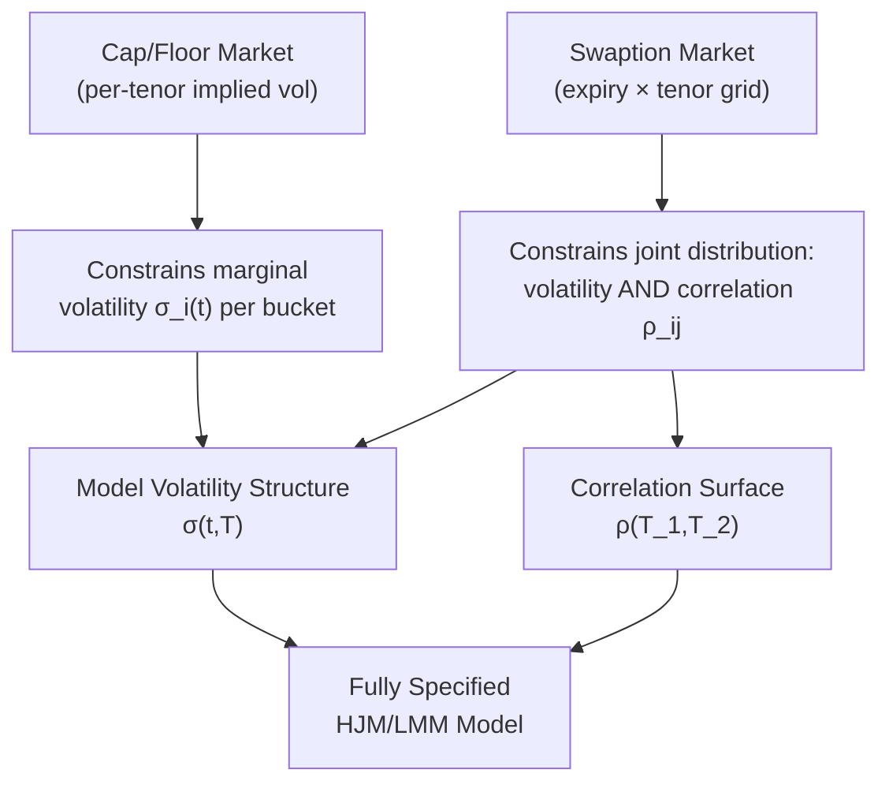
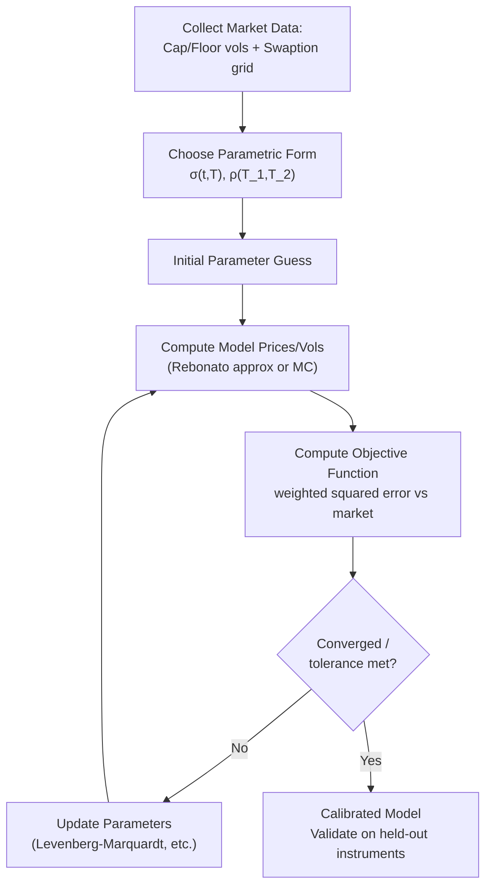

## Calibrating to Caps Floors and Swaptions

### Overview

Calibration is the process of choosing the free parameters of an interest rate model — the volatility structure $\sigma(t,T)$ in HJM/LMM, mean-reversion and volatility parameters in short-rate models — so that model-implied prices of liquid, actively-traded instruments match observed market prices as closely as possible. Caps, floors, and swaptions are the standard calibration instruments for rate models because they are the most liquid volatility-sensitive rate derivatives, and their market-quoted implied volatilities directly constrain the model's volatility structure. This topic covers the calibration instruments themselves, their information content, and the practical methodology for fitting HJM/LMM-family models to them.

**Key Points**

- Caps/floors constrain marginal (own) forward rate volatilities; swaptions additionally constrain the correlation structure between forward rates
- Calibration is fundamentally an inverse problem: choosing model parameters to minimize the distance between model and market prices (or implied volatilities)
- The choice of calibration instrument set, error metric, and parametrization jointly determine calibration quality, stability, and out-of-sample pricing behavior
- Perfect fit to all instruments simultaneously is generally unattainable with low-dimensional parametric models; some form of least-squares/approximate fit is standard practice

### Calibration Instruments

**Caps and Floors**

A cap is a strip of caplets, each a call option on a forward rate (LIBOR/Term SOFR) over a single accrual period, paying $N\delta_i \max(L_i(T_i)-K,0)$ at $T_{i+1}$. A floor is the analogous strip of put options (floorlets). Cap/floor prices are quoted in the market via **Black implied volatilities** (or normal/Bachelier implied volatilities, increasingly standard in low- or negative-rate environments), using the standard Black caplet formula:

$$\text{Caplet}_i = N\delta_i P(0,T_{i+1})\left[L_i(0)\Phi(d_1) - K\Phi(d_2)\right]$$

$$d_{1,2} = \frac{\ln(L_i(0)/K) \pm \tfrac{1}{2}\sigma_i^2 T_i}{\sigma_i\sqrt{T_i}}$$

Since each caplet's price depends only on its own forward rate's marginal volatility $\sigma_i$, caps/floors provide direct, per-tenor-bucket information about the **term structure of volatility** — but no information about the correlation between different forward rates.

**Swaptions**

A swaption is an option to enter a fixed-for-floating interest rate swap at a future date. A payer swaption gives the right to pay fixed/receive floating; a receiver swaption the reverse. Swaption prices are also quoted via Black (or normal) implied volatility, using the analogous Black swaption formula referencing the forward swap rate. Because a swap rate is a weighted combination of multiple underlying forward rates across the swap's tenor, swaption prices depend on the **joint distribution** of those forward rates — specifically, on both their individual volatilities and their pairwise correlations. This is the critical complementary information source to caps/floors: swaptions are what allow a multi-factor model's correlation structure to be pinned down.

**The Swaption Grid**

Swaptions are quoted across a two-dimensional grid: **option expiry** (time until the swaption can be exercised) and **swap tenor** (length of the underlying swap once entered). A "$2Y \times 10Y$" swaption, for example, is a 2-year option on a 10-year swap. This grid is the standard calibration target for correlation-sensitive model parameters, since different points on the grid probe different segments and spans of the forward curve.

### Diagram: Information Content of Calibration Instruments

### The Calibration Problem as Optimization

Formally, calibration seeks parameters $\theta$ (e.g., the coefficients of a parametric $\sigma(t,T)$ and correlation function) minimizing an objective function over the set of calibration instruments $\{i\}$:

$$\theta^* = \arg\min_\theta \sum_i w_i \left(V_i^{\text{model}}(\theta) - V_i^{\text{market}}\right)^2$$

where $V_i$ may be a price or, more commonly in practice, an implied volatility (since volatility-space errors are more uniformly scaled across strikes/maturities than price-space errors, which can vary by orders of magnitude across deep ITM/OTM instruments). $w_i$ are weights reflecting instrument liquidity, bid-ask spread tightness, or strategic importance to the trading book being priced/hedged.

**Choice of Error Metric**

| Metric | Characteristics |
| --- | --- |
| Price-space least squares | Directly matches what matters for P&L, but errors dominated by high-price (typically ATM, long-dated) instruments |
| Implied-vol-space least squares | More balanced across the instrument grid; standard choice for most desks |
| Weighted by vega | Emphasizes instruments where volatility mismatches have the largest price impact — often preferred for hedging-focused calibration |
| Relative (percentage) error | Useful when instrument prices/vols span multiple orders of magnitude (e.g., very short-dated vs. very long-dated) |

### Calibration Strategies

**Sequential (Bootstrap-Style) Calibration**

For models with a piecewise-constant or bucketed volatility structure, it is often possible to calibrate sequentially: fit the shortest-maturity caplet volatility first (using only market data for that bucket), then the next, and so on, each step taking previously-calibrated buckets as given. This is computationally efficient and produces an exact fit to the input caplet strip, but:

- Can produce unstable or oscillating forward volatilities if market quotes are noisy, since each bucket's fit depends on subtracting out the (already-fit) contribution of earlier buckets
- Does not naturally incorporate swaption information unless combined with a second calibration stage

**Global (Joint) Calibration**

All parameters are calibrated simultaneously via numerical optimization (e.g., Levenberg-Marquardt, differential evolution, or gradient-based methods) against the full instrument set (caps + swaptions together). This:

- Produces a globally consistent parametrization respecting both marginal volatility and correlation information
- Is more computationally expensive, particularly for LMM-style models where swaption prices require either an approximation formula (e.g., Rebonato's swaption volatility approximation) or Monte Carlo pricing within the optimization loop
- Is generally more stable against calibration noise than pure bootstrap approaches, since the objective function averages out inconsistencies across the whole instrument set rather than propagating bucket-by-bucket errors

**Rebonato's Approximate Swaption Volatility Formula**

To avoid full Monte Carlo simulation inside every iteration of a calibration optimizer, a widely-used analytical approximation for the swaption's Black volatility under LMM, expressed in terms of the underlying forward rate volatilities and correlations, is commonly employed:

$$(\sigma^{\text{swaption}})^2 T_\alpha \approx \sum_{i,j} w_i(0) w_j(0) L_i(0) L_j(0) \rho_{ij} \int_0^{T_\alpha} \sigma_i(t)\sigma_j(t)\,dt \Big/ S_{\alpha,\beta}(0)^2$$

where $w_i(0)$ are the (approximately frozen) weights expressing the swap rate as a linear combination of forward rates, and $S_{\alpha,\beta}(0)$ is the current forward swap rate. This "frozen weights" approximation trades some accuracy for dramatically faster calibration, and remains standard in practitioner desks for calibration speed, with full Monte Carlo reserved for final validation or pricing of the actual exotic product once the model is calibrated.

### Diagram: Global Calibration Workflow

### Practical Calibration Challenges

**Overfitting vs. Underfitting**

A highly flexible, high-dimensional parametrization (e.g., fully independent piecewise-constant volatility per bucket, per expiry) can achieve near-exact fit to every quoted instrument, but:

- May produce erratic, economically implausible forward volatility shapes between quoted points
- Tends to be unstable day-to-day as market quotes move, generating spurious P&L in risk systems even without genuine market moves
- Can generalize poorly when pricing off-market-grid or exotic instruments

A parsimonious parametric form (e.g., a small number of humped-volatility or exponential-decay parameters) is more stable and interpretable but will generally leave some residual pricing error against the full instrument set. The practical trade-off is a recurring theme across all HJM/LMM implementations: model flexibility versus calibration stability.

**Smile and Skew Calibration**

At-the-money calibration alone (matching only ATM cap/swaption volatilities) ignores the volatility smile/skew observed across strikes. A model calibrated only to ATM instruments will typically misprice away-from-the-money products (e.g., out-of-the-money caps, skewed structured notes). Extensions such as displaced-diffusion LMM, SABR-LMM, or local volatility overlays require calibrating additional smile-shape parameters (e.g., the SABR $\beta$, $\rho$, $\nu$ parameters) per expiry/tenor bucket, using the full strike-dependent volatility surface rather than just the ATM slice.

**Cross-Instrument Consistency**

A model calibrated well to caps but poorly to swaptions (or vice versa) signals that the model's correlation assumption (in the multi-factor case) or its volatility term structure is misspecified relative to what the joint cap/swaption market is implying. Persistent, systematic calibration residuals of this kind are often diagnostic of a structural model limitation (e.g., a one-factor model attempting to fit a swaption surface that reflects genuine multi-factor decorrelation) rather than a numerical optimization failure, and are one of the standard diagnostic signals used to justify moving to a richer (more factors, richer smile dynamics) model specification.

**Recalibration Frequency and Stability**

Models are typically recalibrated on a regular basis (daily, for actively-traded books) as market quotes move. [Inference] Desks generally monitor the stability of calibrated parameters over time as a model-risk indicator — large day-to-day jumps in calibrated volatility or correlation parameters, absent a correspondingly large market move, are commonly treated as a signal of calibration instability requiring investigation, though specific thresholds and monitoring practices vary by institution.

### Worked Example: Calibrating a One-Factor Hull-White-Type LMM Volatility

Given a target set of market caplet volatilities $\{\hat\sigma_1, \ldots, \hat\sigma_n\}$ across tenors $T_1 < \cdots < T_n$, and the parametric form $\sigma(t,T) = \sigma_0 e^{-a(T-t)}$:

1. Compute each model-implied caplet volatility as a function of $(\sigma_0, a)$: for a deterministic volatility HJM-consistent LMM approximation, the effective caplet volatility for tenor $T_i$ is approximately $\sigma_i^{\text{model}} = \sigma_0\sqrt{\frac{1 - e^{-2aT_i}}{2aT_i}}$
2. Minimize $\sum_i \left(\sigma_i^{\text{model}}(\sigma_0,a) - \hat\sigma_i\right)^2$ over $(\sigma_0, a)$ using a two-parameter numerical search
3. Examine residuals: if the fitted exponential-decay shape systematically under- or over-shoots at particular tenors (e.g., failing to capture a hump near the 2-3 year point), this signals that a richer parametrization (e.g., the humped form covered in the volatility structures topic) is needed to adequately fit the observed term structure

This example illustrates the general calibration pattern: parametrize, compute model-implied instrument values, minimize weighted squared error, then examine residual structure to judge whether the chosen parametric family is adequate for the market being modeled.

### Applications and Practical Use

- **Pricing exotic derivatives**: a calibrated model is the prerequisite for pricing any instrument not directly observable in the liquid cap/swaption market (Bermudan swaptions, callable notes, CMS products)
- **Hedging**: calibrated model sensitivities (vega buckets, correlation sensitivities) drive hedge ratios for exotic books against the liquid cap/swaption market
- **Model risk / independent price verification**: calibration quality (residual error magnitude and pattern) is a standard model validation metric reviewed by risk and model validation functions
- **Cross-desk consistency**: shared calibration methodology and instrument sets help ensure consistent pricing of related products across trading desks within an institution

### Limitations

- No low-dimensional parametric model can generally achieve an exact, stable fit to the entire cap and swaption surface simultaneously across all strikes, expiries, and tenors — some residual error or instability is an inherent trade-off, not a solvable numerical issue
- The Rebonato-style frozen-weights swaption approximation introduces model risk relative to full Monte Carlo pricing, particularly for longer-dated or more skewed swap rate distributions
- Calibration to current market prices (risk-neutral calibration) does not guarantee realistic real-world dynamics for risk management purposes — a separate historical/statistical calibration is typically needed for VaR-type applications
- [Speculation] Some practitioners argue that excessive focus on minimizing calibration error against the full liquid grid can lead to overfitting that degrades pricing consistency for exotic, off-grid products, favoring a more judgmentally-smoothed calibration even at the cost of small residual mismatches on liquid instruments — though this remains a matter of desk-specific practice rather than settled consensus.

**Related Topics**

- Forward Rate Volatility Structures (the parametric forms being calibrated)
- The LIBOR Market Model and Its Successors (the model family most commonly calibrated this way)
- SABR model and volatility smile/skew calibration
- Rebonato's swaption volatility approximation formula
- Principal Component Analysis for correlation structure estimation
- Bermudan swaption pricing and its dependence on calibration quality
- Model validation and model risk management practices