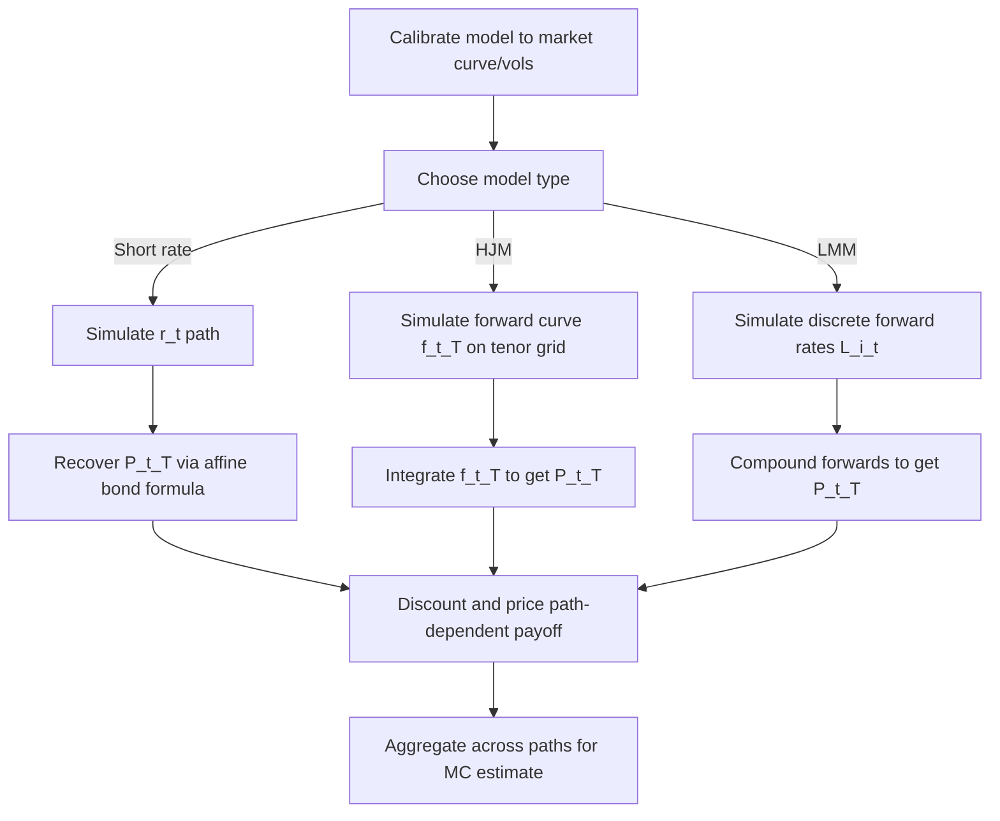

## Simulating Term Structure Models


### Overview

Simulating term structure models means generating Monte Carlo paths for the evolution of the entire yield curve (or forward curve) through time, consistent with a chosen interest rate model's dynamics. This is distinct from simulating a single short rate: term structure simulation must produce, at every time step, a full curve of discount factors, forward rates, or zero rates that can be used to price path-dependent derivatives, compute exposures, or run risk simulations (e.g., CVA, PFE).

The two dominant paradigms are:

- **Short-rate models** (Vasicek, CIR, Hull-White, Black-Karasinski): simulate a single state variable (or a small number of factors) and derive the full curve algebraically or via bond-price formulas at each step.
- **HJM / Market Models** (HJM forward-rate framework, LMM/BGM): simulate the entire forward curve (or a set of forward rates) directly, since the model's state space is inherently high-dimensional (infinite-dimensional in continuous HJM).

---

### Why Term Structure Simulation Is Harder Than Short-Rate Simulation

**Key Points**

- A short-rate model needs only $r_t$ simulated; the curve $P(t,T)$ is then recovered via a closed-form or quasi-closed-form bond price formula.
- An HJM-consistent model requires simulating the full forward rate curve $f(t,T)$ for all $T \geq t$, which is a stochastic process in an infinite-dimensional space (a curve evolving over time).
- Market models (LMM) reduce this to a finite but still large set of correlated forward rates (e.g., one per accrual period), each following its own SDE with model-implied drift.
- Discretization error compounds across both time steps and tenor points, requiring care with drift approximations, especially under multiple curves (OIS discounting vs. LIBOR/RFR projection curves).

---

### Simulating Short-Rate Models

For one-factor short-rate models, simulation is comparatively simple because the entire curve is a deterministic function of $r_t$ (and calendar time) via the model's affine bond-pricing formula.

#### Vasicek Model

$$dr_t = \kappa(\theta - r_t)\,dt + \sigma\,dW_t$$

This has an exact discretization (no discretization bias) because $r_t$ is Gaussian:

$$r_{t+\Delta t} = r_t e^{-\kappa \Delta t} + \theta(1 - e^{-\kappa \Delta t}) + \sigma\sqrt{\frac{1 - e^{-2\kappa \Delta t}}{2\kappa}}\, Z$$

where $Z \sim N(0,1)$.

Bond prices are then recovered using the affine formula:

$$P(t,T) = A(t,T)e^{-B(t,T) r_t}$$

with $A, B$ known closed-form functions of $\kappa, \theta, \sigma$.

#### CIR Model

$$dr_t = \kappa(\theta - r_t)\,dt + \sigma\sqrt{r_t}\,dW_t$$

No simple exact Gaussian discretization exists; common choices:

- **Exact simulation** via the non-central chi-squared distribution of $r_{t+\Delta t} \mid r_t$ (exact but computationally heavier).
- **Euler-Maruyama with full truncation** (Lord, Koekkoek, van Dijk scheme) to prevent negative rates from destabilizing the square-root diffusion term.
- **Milstein scheme** for improved weak convergence order.

#### Hull-White (Extended Vasicek)

$$dr_t = \left(\theta(t) - \kappa r_t\right)dt + \sigma\,dW_t$$

$\theta(t)$ is calibrated to fit the initial term structure exactly. Simulation follows the same exact-transition approach as Vasicek, but $\theta(t)$ is time-dependent and precomputed from the initial curve.

**Example**

```python
import numpy as np

def simulate_hull_white(r0, kappa, sigma, theta_t, dt, n_steps, n_paths, seed=42):
    rng = np.random.default_rng(seed)
    rates = np.zeros((n_paths, n_steps + 1))
    rates[:, 0] = r0
    for i in range(n_steps):
        t = i * dt
        mean_rev = theta_t(t) - kappa * rates[:, i]
        z = rng.standard_normal(n_paths)
        rates[:, i+1] = rates[:, i] + mean_rev * dt + sigma * np.sqrt(dt) * z
    return rates
```

This uses a simple Euler scheme; an exact scheme is preferable for production use since Hull-White admits closed-form transition moments.

---

### Simulating the HJM Framework

The HJM framework specifies the dynamics of instantaneous forward rates directly:

$$df(t,T) = \alpha(t,T)\,dt + \sigma(t,T)\,dW_t$$

The **HJM drift condition** (no-arbitrage constraint) forces the drift to be determined entirely by the volatility structure:

$$\alpha(t,T) = \sigma(t,T)\int_t^T \sigma(t,u)\,du$$

(for a single factor; a matrix/vector generalization applies under multiple factors).

#### Simulation Steps

1. **Discretize the tenor grid**: choose a fixed set of maturities $T_1, \dots, T_n$ (e.g., quarterly or semi-annual points out to 30 or 50 years).
2. **Specify $\sigma(t,T)$**: a chosen volatility function (constant, exponentially decaying, humped, or driven by PCA factors from historical cap/swaption vols).
3. **Compute the drift** $\alpha(t,T_i)$ at each grid point using numerical integration of $\sigma(t,T)$ over $[t, T_i]$.
4. **Evolve the forward curve**:


   $$f(t+\Delta t, T_i) = f(t,T_i) + \alpha(t,T_i)\Delta t + \sigma(t,T_i)\sqrt{\Delta t}\,Z$$
5. **Roll the grid or interpolate** as $t$ increases and the shortest maturities roll off (since $T_i \geq t$ must be maintained).
6. **Recover discount factors**:


   $$P(t,T) = \exp\left(-\int_t^T f(t,u)\,du\right)$$

   approximated via numerical integration (trapezoidal rule) across the tenor grid.

**Key Points**

- Multi-factor HJM (2–3 factors) is standard in practice to capture level, slope, and curvature movements; factors are typically derived from PCA of historical forward-rate covariances.
- The non-Markovian nature of general HJM models (drift depends on the full path history through the volatility structure) can make simulation computationally expensive unless volatility is chosen to yield a Markovian reduction (e.g., separable/exponential volatility functions collapsing to Hull-White-equivalent dynamics).

---

### Simulating the LIBOR Market Model (LMM / BGM)

The LMM parametrizes the curve via a discrete set of forward rates $L_i(t) = L(t; T_i, T_{i+1})$, each following:

$$dL_i(t) = \mu_i(t)\,L_i(t)\,dt + \sigma_i(t)\,L_i(t)\,dW_i(t)$$

under a chosen numeraire (commonly the terminal or spot LIBOR measure), where correlations $\rho_{ij}$ between forward rates are modeled explicitly.

#### Drift Under the Spot Measure

$$\mu_i(t) = \sigma_i(t)\sum_{j=\eta(t)}^{i} \frac{\tau_j \rho_{ij}\sigma_j(t) L_j(t)}{1 + \tau_j L_j(t)}$$

where $\eta(t)$ is the index of the next reset date and $\tau_j$ are accrual fractions.

#### Simulation Steps

1. **Calibrate instantaneous volatilities** $\sigma_i(t)$ to match cap/floor and swaption market implied volatilities.
2. **Specify a correlation structure** $\rho_{ij}$ (e.g., exponential parametric form $\rho_{ij} = e^{-\beta|T_i - T_j|}$).
3. **Discretize via log-Euler scheme** to preserve positivity of rates:


   $$\ln L_i(t+\Delta t) = \ln L_i(t) + \left(\mu_i(t) - \tfrac{1}{2}\sigma_i(t)^2\right)\Delta t + \sigma_i(t)\sqrt{\Delta t}\,Z_i$$
4. **Generate correlated Brownian increments** via Cholesky decomposition of the correlation matrix $\rho$.
5. **Freeze drift** at each time step (predictor-corrector or "frozen drift" approximation) since the exact drift is path-dependent within the step; higher-order schemes (Glasserman-Zhao, predictor-corrector) reduce this bias.

**Example**

```python
import numpy as np

def simulate_lmm(L0, sigma, corr, tau, dt, n_steps, n_paths, seed=1):
    rng = np.random.default_rng(seed)
    n_rates = len(L0)
    L = np.factor = np.zeros((n_paths, n_steps + 1, n_rates))
    L[:, 0, :] = L0
    chol = np.linalg.cholesky(corr)

    for step in range(n_steps):
        Lc = L[:, step, :]
        dW = rng.standard_normal((n_paths, n_rates)) @ chol.T * np.sqrt(dt)
        for i in range(n_rates):
            drift = 0.0
            for j in range(i + 1):
                drift += (tau[j] * corr[i, j] * sigma[j] * Lc[:, j]) / (1 + tau[j] * Lc[:, j])
            drift *= sigma[i]
            L[:, step+1, i] = Lc[:, i] * np.exp(
                (drift - 0.5 * sigma[i]**2) * dt + sigma[i] * dW[:, i]
            )
    return L
```

This is a simplified frozen-drift log-Euler LMM simulator for illustration; production implementations vectorize the drift summation and often use predictor-corrector steps for accuracy.

---

### Discretization Schemes Comparison

| Scheme | Bias | Cost | Positivity Preserved | Typical Use |
| --- | --- | --- | --- | --- |
| Euler-Maruyama | O($\Delta t$) weak | Low | No (Gaussian models) | Vasicek, Hull-White |
| Log-Euler | O($\Delta t$) weak | Low | Yes | LMM, Black-Karasinski |
| Milstein | O($\Delta t$) improved | Medium | Model-dependent | CIR, SABR-LMM |
| Predictor-Corrector | Reduced drift bias | Medium-High | Yes | LMM |
| Exact/Transition-density | None (exact) | Higher (special functions) | Yes | CIR, Vasicek, Hull-White |

---

### Curve Construction and Numeraire Consistency

**Key Points**

- Simulated forward or short rates must be converted consistently into discount factors under the same measure/numeraire used for pricing.
- Under the risk-neutral (money-market) measure, discounting uses the simulated short-rate path:


  $$P(0,T) = \mathbb{E}\left[\exp\left(-\int_0^T r_s\,ds\right)\right]$$

  approximated via a Riemann sum of the simulated short-rate path.
- Under the terminal measure (common in LMM), discounting is done via the terminal bond $P(t,T_n)$, and intermediate cash flows are re-expressed relative to that numeraire, then converted back.
- Multi-curve environments (post-2008, and RFR/SOFR-based curves) require separate simulation or joint calibration of a discounting curve (OIS/SOFR) and a forward-projection curve (term SOFR, credit-sensitive rates), with a spread process linking them — often modeled as a separate stochastic basis spread.

---

### Diagram: Term Structure Simulation Workflow (svg_diagram)



---

### Variance Reduction and Numerical Considerations

**Key Points**

- **Antithetic variates**: pair each path with its mirror ($-Z$) to reduce Monte Carlo variance at negligible extra cost.
- **Moment matching**: rescale simulated increments so sample mean/variance match theoretical values exactly at each step.
- **Control variates**: use a related model with a closed-form price (e.g., Hull-White analog) as a control for LMM swaption pricing.
- **Brownian bridge construction**: useful for path-dependent payoffs (barriers, American-style exercise) to improve accuracy of extreme-path sampling.
- **Number of factors vs. computational cost**: each additional factor in HJM/LMM roughly multiplies simulation cost by the number of random draws per step; 2–3 factors are typically sufficient to capture 90%+ of historical yield curve variance (via PCA).

---

### Practical Pitfalls

- **Negative rates**: Gaussian short-rate models (Vasicek, Hull-White) can produce negative rates, which is not necessarily a defect (real markets have seen negative rates) but must be handled explicitly if the downstream product logic assumes positivity.
- **Drift freezing bias in LMM**: freezing the drift at the start of each step introduces bias that grows with step size; shortening the time step or using predictor-corrector schemes mitigates this. [Inference: the specific bias magnitude is implementation- and parameter-dependent and should be validated via convergence testing against smaller step sizes.]
- **Tenor grid mismatches**: HJM/LMM simulation on a fixed tenor grid can require interpolation when pricing products with cash flow dates that fall between grid points, introducing an additional source of approximation error.
- **Calibration instability**: highly parametrized volatility/correlation structures can overfit to a snapshot of market data, leading to unstable simulated dynamics; regularization or parametric (rather than fully non-parametric) forms are commonly preferred for robustness.

---

**Next Steps**

- HJM No-Arbitrage Drift Condition (derivation and multi-factor extension)
- Volatility Structures in the LIBOR Market Model (calibration to caps/swaptions)
- PCA-Based Factor Reduction for Yield Curve Models
- Multi-Curve Framework (OIS Discounting and RFR Transition)
- Predictor-Corrector Schemes for LMM
- Bermudan Swaption Pricing via LMM and Least-Squares Monte Carlo
- SABR-LMM and Stochastic Volatility Extensions to Market Models