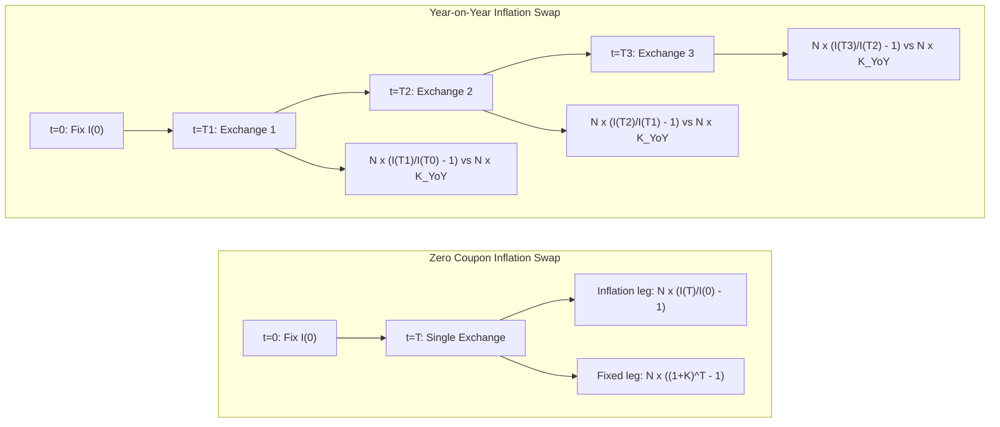

## Zero Coupon and Year on Year Inflation Swaps

### Overview

Inflation swaps are the foundational linear derivatives of the inflation market, exchanging a fixed rate for realized inflation (typically measured by a CPI-type index such as US CPI-U, UK RPI/CPIH, or Eurozone HICP ex-tobacco). The two dominant conventions — Zero Coupon Inflation Swaps (ZCIS) and Year-on-Year Inflation Swaps (YoY) — differ fundamentally in payoff timing and risk profile, and together form the primary instruments used to bootstrap the inflation term structure and calibrate inflation volatility models.

### Inflation Index Mechanics

**Key Points**

- The reference index $I(t)$ tracks a published CPI level, typically with a **publication lag** (2-3 months) since current-month CPI is not known until after the fact
- Market convention interpolates the index for value dates falling between publication dates, commonly via linear interpolation between the index values lagged by 3 months (the "3-month lag convention")
- The **Reference Index** for a date $t$ is often defined as:

  $$I(t) = I_{m-3} + \frac{d-1}{D_m}\left(I_{m-2} - I_{m-3}\right)$$

  where $d$ is the day of month, $D_m$ the number of days in that month, and $I_{m-k}$ the published index $k$ months prior
- Different currencies use different lag conventions: 3-month lag is standard for EUR HICP and USD CPI; UK historically used both 3-month and other lag conventions depending on the instrument (e.g., RPI-linked gilts vs. swaps)

### Zero Coupon Inflation Swaps (ZCIS)

**Structure**

A single exchange at maturity $T$:

- **Inflation leg (payer receives)**: $N \left[\dfrac{I(T)}{I(0)} - 1\right]$
- **Fixed leg (payer pays)**: $N\left[(1+K)^T - 1\right]$

where $K$ is the annually compounded fixed swap rate (the "breakeven inflation rate"), $N$ is notional, $I(0)$ is the base index level fixed at trade inception (subject to the lag convention), and $I(T)$ is the reference index at maturity.

At initiation, $K$ is set so the swap has zero value:

$$1 + K = \left(\mathbb{E}^{T}\left[\frac{I(T)}{I(0)}\right]\right)^{1/T}$$

Under no-arbitrage and assuming no convexity/risk premium distortions, this is closely linked to the ratio of nominal to real discount factors:

$$\frac{I(0)}{I(T)} \cdot P_{real}(0,T)^{-1} \approx P_{nom}(0,T)^{-1}$$

leading to the standard relation:

$$(1+K)^T \approx \frac{P_{real}(0,T)}{P_{nom}(0,T)} \quad \Longleftrightarrow \quad (1+K) \approx \frac{(1+y_{nom})}{(1+y_{real})}$$

i.e., the ZCIS fixed rate is (approximately, ignoring risk premia and convexity) the **breakeven inflation rate** implied by nominal minus real yields — the market-implied analogue of the Fisher equation.

**[Inference]** This decomposition is a first-order approximation; in practice breakeven rates embed an inflation risk premium and liquidity premium that can diverge meaningfully from "true" expected inflation, particularly at longer tenors.

**Key Characteristics**

- Single cash flow at maturity — no periodic netting, so no path-dependence on intermediate index fixings
- Directly gives a clean, single-point breakeven inflation rate per maturity — ideal for bootstrapping a **zero-coupon inflation curve**
- The dominant instrument in EUR and USD inflation markets for curve construction
- Since there's no compounding of periodic inflation prints, ZCIS pricing does not require any model of inflation volatility or year-on-year correlation — it is purely a function of the terminal index ratio expectation

### Year-on-Year Inflation Swaps (YoY)

**Structure**

A series of periodic (typically annual) exchanges, at each payment date $T_i$:

- **Inflation leg**: $N \left[\dfrac{I(T_i)}{I(T_{i-1})} - 1\right]$
- **Fixed leg**: $N \cdot K_{YoY}$

where $K_{YoY}$ is a single fixed rate applied uniformly across all periods (a "swap rate," analogous to a fixed leg in an interest rate swap), and each floating payment resets based on the year-over-year change in the index over that specific period.

**Key Characteristics**

- Cash-flow profile resembles a standard fixed-for-floating IRS, with floating payments linked to realized YoY inflation for each sub-period
- Requires modeling the **forward YoY inflation rate** for each period — i.e., $\mathbb{E}\left[\dfrac{I(T_i)}{I(T_{i-1})} - 1\right]$ under the appropriate measure — which is generally **not** simply derivable from the ZCIS curve without additional assumptions, because:

$$\mathbb{E}\left[\frac{I(T_i)}{I(T_{i-1})}\right] \neq \frac{\mathbb{E}[I(T_i)]}{\mathbb{E}[I(T_{i-1})]}$$

by Jensen's inequality / convexity, when $I(T_i)/I(T_{i-1})$ is stochastic and correlated with discounting

- Pricing YoY swaps consistently with the ZCIS/breakeven curve therefore requires an explicit model of inflation dynamics (e.g., Jarrow-Yildirim) to compute the **convexity adjustment** between the "naive" YoY forward (derived from consecutive ZC breakevens) and the true YoY expectation

### ZCIS vs. YoY: Structural Comparison

| Feature | Zero Coupon (ZCIS) | Year-on-Year (YoY) |
| --- | --- | --- |
| Cash flow timing | Single payment at maturity | Periodic (typically annual) |
| Floating reference | $I(T)/I(0)$ | $I(T_i)/I(T_{i-1})$ each period |
| Path dependence | None | Yes (each period's realized inflation) |
| Curve bootstrapping role | Primary instrument | Secondary / requires convexity model |
| Requires volatility model to price at par | No | Yes, for the convexity adjustment |
| Dominant markets | EUR, USD | Historically more common in GBP/older markets; used for granular YoY views |
| Risk profile | Pure terminal inflation exposure | Inflation "carry"/seasonality exposure per period |

### The Convexity Adjustment (YoY vs. ZC-Implied Forward)

Define the "naive" forward YoY rate implied by two consecutive zero-coupon breakevens:

$$f_i^{naive} = \frac{(1+K_i)^{T_i}}{(1+K_{i-1})^{T_{i-1}}} - 1$$

The true YoY floating leg expectation differs from this naive forward by a convexity term driven by:

1. The volatility of the inflation index itself
2. The volatility of nominal (or real) interest rates over the period
3. The correlation between inflation index growth and interest rate movements (via the change of measure from the $T_i$-forward measure needed for each ratio)

Under a model such as Jarrow-Yildirim (a foreign-currency analogy where real rates are treated like a "foreign" short rate and the inflation index like an FX rate), the adjustment can be derived in closed form under lognormal/Gaussian assumptions, broadly of the form:

$$f_i^{true} \approx f_i^{naive} + \text{Cov terms}(\sigma_I, \sigma_{r_{nom}}, \sigma_{r_{real}}, \rho_{\cdot,\cdot})(T_i - T_{i-1})$$

**[Inference]** The magnitude of this convexity adjustment is typically small (a few basis points) for short-dated YoY swaps but grows with maturity and inflation volatility, and becomes material for longer-dated YoY books or when inflation volatility spikes (as observed in 2021-2022 inflation regimes).

### The Jarrow-Yildirim Model (Foreign-Currency Analogy)

The standard HJM-consistent framework for jointly modeling nominal rates, real rates, and the inflation index treats:

- Nominal short rate $r_n(t)$: standard HJM/Hull-White-type dynamics
- Real short rate $r_r(t)$: analogous HJM/Hull-White-type dynamics, treated as a "foreign" short rate
- Inflation index $I(t)$: treated as the "FX rate" converting real to nominal, following:

$$\frac{dI(t)}{I(t)} = \left(r_n(t) - r_r(t)\right)dt + \sigma_I(t)\, dW_I(t)$$

with correlations $\rho_{n,r}$, $\rho_{n,I}$, $\rho_{r,I}$ specified between the three Brownian drivers. Under this three-factor Gaussian (Hull-White-Hull-White-Black-Scholes-type) setup:

- ZCIS prices have closed-form solutions (since $I(T)/I(0)$ is lognormal under the $T$-forward nominal measure)
- YoY swap prices have closed-form solutions incorporating the convexity adjustment explicitly, since each ratio $I(T_i)/I(T_{i-1})$ can be computed under the appropriate forward measure with the standard HJM change-of-measure machinery

This model connects directly to the HJM framework covered in this course: the nominal and real curves are each standard HJM (or reduced to Hull-White for tractability) term structures, with the inflation index playing the role analogous to a spot FX rate bridging two economies' term structures — hence "foreign-currency analogy."

### Curve Bootstrapping Workflow

1. Collect market ZCIS quotes across standard maturities (1Y, 2Y, ..., 10Y, 15Y, 20Y, 30Y)
2. Solve for the zero-coupon breakeven rate $K(T)$ at each maturity, using nominal discount factors from the separately-bootstrapped nominal (OIS/SOFR or LIBOR-based, depending on era/currency) curve
3. Construct the implied **real discount curve**: $P_{real}(0,T) = P_{nom}(0,T) \cdot (1+K(T))^T$
4. Interpolate the real curve (log-linear on real discount factors, or on real zero rates, per desk convention) for off-market tenors
5. Derive **forward inflation rates** for arbitrary sub-periods from the real curve, applying the JY (or similar) convexity adjustment for YoY-style forward-starting exposures
6. Calibrate volatility parameters ($\sigma_I$, correlations) to market YoY swap quotes and inflation cap/floor volatilities where available, to pin down the convexity adjustment and support pricing of inflation options

### Seasonality Adjustment

**Key Points**

- CPI indices exhibit strong intra-year seasonal patterns (e.g., energy/food price cycles, index-specific quirks like UK RPI's housing components)
- ZCIS pricing (terminal ratio only) is largely insensitive to seasonality when maturities fall on the same calendar month, but is sensitive when the swap's start/end dates don't align seasonally
- YoY swaps are more exposed since each period's payoff depends on the specific months spanned; a seasonality curve/adjustment factor $s(m)$ per calendar month is typically overlaid on the smooth interpolated index curve:

$$I_{adj}(t) = I_{smooth}(t) \times s(\text{month}(t))$$

normalized so that $\prod_{m=1}^{12} s(m) = 1$ over a full year, preserving the annual breakeven while redistributing monthly index growth realistically

### Diagram: ZCIS vs. YoY Cash Flow Structure

### Risk Sensitivities

**Key Points**

- **Inflation delta**: sensitivity to parallel/bucketed shifts in the breakeven inflation curve; ZCIS books hedge this directly with offsetting ZCIS trades bucketed by maturity
- **Real rate duration**: since ZCIS/YoY value depends on both nominal and real discount curves, positions carry real-rate duration distinct from nominal-rate duration — a common hedging error is treating inflation swaps as pure inflation bets without hedging the embedded real-rate exposure
- **YoY-specific convexity risk**: sensitivity to inflation volatility and nominal/real rate volatility via the convexity adjustment; only material for YoY books, priced/hedged using inflation caps/floors and the calibrated JY-type volatility surface
- **Seasonality risk**: YoY swaps with non-annual-aligned start dates carry residual seasonality exposure not present in same-month ZCIS trades

### Worked Example: ZCIS Breakeven from Nominal and Real Yields

Given: 10Y nominal zero yield $y_{nom} = 4.20\%$, 10Y real zero yield (from TIPS/index-linked gilts or the bootstrapped real curve) $y_{real} = 1.80\%$.

Approximate Fisher relation:

$$1 + K \approx \frac{1+y_{nom}}{1+y_{real}} = \frac{1.0420}{1.0180} \approx 1.02357$$

$$K \approx 2.357\%$$

This is the approximate 10Y ZCIS breakeven rate before adjusting for inflation risk premium and any liquidity/convexity effects specific to the swap versus the cash-bond-implied breakeven (which can differ due to TIPS-specific asset swap spreads, repo specialness, and indexation lag differences between swaps and bonds).

**[Inference]** In practice, swap-implied breakevens and bond-implied (cash) breakevens can diverge by tens of basis points due to these technical/liquidity factors, and relative-value desks actively trade this "inflation basis."

### Related Topics

- Jarrow-Yildirim model: full derivation and closed-form ZCIS/YoY pricing formulas
- Inflation caps and floors, and the inflation smile
- Real rate curve construction from TIPS/index-linked gilts vs. swap-implied real curves
- Inflation-linked bond asset swaps and the swap-bond breakeven basis
- Seasonality adjustment methodologies across currencies (US CPI vs. UK RPI vs. EUR HICP)
- Limited Price Indexation (LPI) swaps and floors (UK pension-driven structures)
- Cross-currency inflation basis and multi-currency inflation curve construction