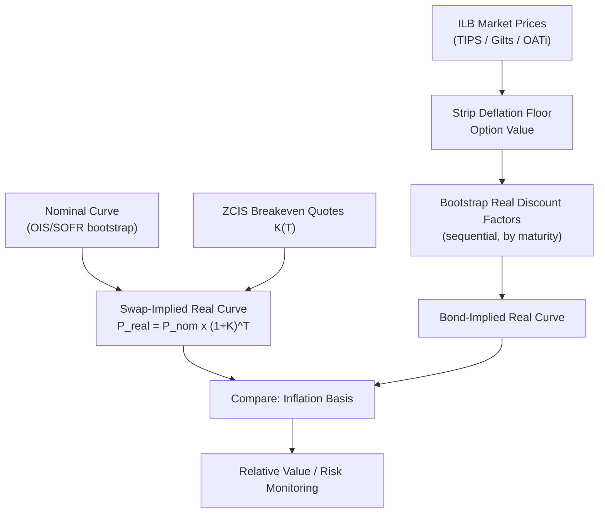

## Real Rate Curve Construction

### Overview

The real rate curve — the term structure of discount factors and zero rates applicable to inflation-linked cash flows — is the foundational input underlying every inflation derivative pricing model covered in this chapter (ZCIS, YoY swaps, ILBs, inflation caps/floors). Unlike the nominal curve, the real curve cannot be observed directly from a single homogeneous instrument set; it must be constructed either from inflation-linked bond prices or backed out synthetically from nominal curves combined with inflation swap breakevens, and the two approaches do not necessarily agree (the inflation basis, covered in the prior ILB item). This item details the construction methodologies, bootstrapping mechanics, and the practical challenges specific to real curves.

### Two Construction Routes

**Route 1: Bond-Implied Real Curve**

Bootstrapped directly from a set of liquid inflation-linked bonds (TIPS, index-linked gilts, OATi/OAT€i), analogous to standard nominal curve bootstrapping from coupon-bearing government bonds.

**Route 2: Swap-Implied Real Curve**

Derived synthetically by combining the nominal discount curve with the ZCIS breakeven curve:

$$P_{real}(0,T) = P_{nom}(0,T) \times (1+K(T))^T$$

where $K(T)$ is the ZC inflation swap breakeven rate at maturity $T$. This route requires no ILB market at all — only nominal rates and ZCIS quotes — and is the standard approach when a liquid, granular ILB market is unavailable at the desired maturity or when internal consistency with the swap derivatives book is required.

**[Inference]** In practice, trading desks typically maintain both curves and monitor the divergence (inflation basis) as an active risk/relative-value signal, using the swap-implied curve as the primary pricing curve for swap-based derivatives books and the bond-implied curve for ILB relative value and asset-swap desks.

### Route 1: Bootstrapping from Inflation-Linked Bonds

**Step-by-Step Process**

1. **Instrument selection**: gather a set of liquid ILBs spanning the maturity spectrum (e.g., TIPS across 5Y, 10Y, 20Y, 30Y benchmark points), prioritizing on-the-run or most-liquid issues per bucket
2. **Clean price extraction**: obtain quoted real clean prices; convert to real yields via standard yield-to-maturity solving on the *real* (index-ratio-normalized) cash flow schedule
3. **Deflation floor stripping** (where applicable, e.g., TIPS): the deflation floor is an embedded option with positive value; for curve-construction purposes this optionality is typically stripped out (option-adjusted yield) so the resulting curve reflects a "clean" linear real-rate term structure rather than being distorted by floor optionality, which is priced separately
4. **Bootstrap sequentially by maturity**: starting from the shortest-maturity bond, solve for the real discount factor(s) consistent with each bond's real price given previously-solved shorter discount factors, exactly as in standard nominal curve stripping:

   $$P_{clean,real}(0,T_N) = \sum_{i=1}^{N} c \cdot DF_{real}(0,T_i) + DF_{real}(0,T_N)$$

   solving iteratively for each new $DF_{real}(0,T_i)$ as each successive bond is added
5. **Interpolate between bootstrapped nodes**: commonly log-linear on real discount factors, or a smoother method (cubic spline on zero real rates, monotone convex) to avoid forward-rate artifacts between sparse ILB maturity points

**Key Challenges Specific to Bond-Implied Construction**

- **Sparse maturity grid**: most sovereign ILB markets have far fewer outstanding issues than nominal government bond markets, leaving significant gaps (e.g., TIPS typically issued at 5Y, 10Y, 30Y tenors with reopenings, creating an irregular and sparse maturity ladder relative to the dense nominal Treasury curve)
- **Liquidity heterogeneity**: older, off-the-run ILB issues can be significantly less liquid than on-the-run nominal bonds, introducing noise into yield quotes used for bootstrapping
- **Indexation lag inconsistency**: not all ILBs in a given market use identical lag conventions across vintages (e.g., UK gilts pre/post-2005), complicating direct comparison within a single bootstrap
- **Coupon/seasoning effects**: since coupons are paid on the inflation-accreted principal, the effective duration and cash-flow timing differ subtly from a nominal bond with the same coupon rate and maturity, requiring real-cash-flow-specific bootstrapping rather than reusing nominal bond math naively

### Route 2: Swap-Implied Real Curve Construction

**Step-by-Step Process**

1. Bootstrap the nominal discount curve $P_{nom}(0,T)$ from the standard nominal instrument set (OIS/SOFR swaps, or historically LIBOR swaps — per the interest rate curve construction methodology covered elsewhere in the course)
2. Collect ZCIS market quotes $K(T)$ across standard maturities
3. Compute $P_{real}(0,T) = P_{nom}(0,T)\times(1+K(T))^T$ directly at each quoted ZCIS maturity — no iterative bootstrap is needed in the simple case since ZCIS quotes are already zero-coupon (single cash flow) instruments, unlike coupon bonds
4. Interpolate between the resulting real discount factor nodes using the same interpolation conventions as the nominal curve (for internal consistency of forward real rate calculations)

**Advantages over Bond Route**

- ZCIS quotes are inherently zero-coupon, so no iterative coupon-stripping bootstrap is required — construction is direct, point-by-point
- Swap markets often have denser maturity coverage (annual points out to 30Y or more in liquid currencies) than the sparse ILB issuance ladder
- Directly consistent with the pricing of other swap-based inflation derivatives (YoY swaps, inflation caps/floors), avoiding basis mismatches within a swaps trading book

**Limitations**

- Embeds swap-market-specific technical factors (CSA/discounting conventions, counterparty credit considerations, swap market liquidity premia) that differ from the "pure" government-credit real curve
- Diverges from the bond-implied curve by the inflation basis, meaning the "real rate" obtained is specifically a swap-implied real rate, not a claim about government bond market real yields

### Real Forward Rates

Once a real discount curve is constructed (via either route), the real forward rate between $T_1$ and $T_2$ follows standard forward-rate mechanics:

$$1 + f_{real}(T_1,T_2) \cdot (T_2-T_1) = \frac{P_{real}(0,T_1)}{P_{real}(0,T_2)}$$

or in continuously-compounded form:

$$f_{real}(T_1,T_2) = \frac{\ln P_{real}(0,T_1) - \ln P_{real}(0,T_2)}{T_2 - T_1}$$

These real forwards, combined with corresponding nominal forwards, imply **forward breakeven inflation rates**:

$$1 + BEI(T_1,T_2) \approx \frac{1+f_{nom}(T_1,T_2)}{1+f_{real}(T_1,T_2)}$$

used to express market-implied inflation expectations for specific future periods (e.g., the widely-quoted "5Y5Y forward breakeven," a standard central-bank-watched gauge of medium-term inflation expectations, constructed as the forward breakeven between years 5 and 10).

### Interpolation Method Considerations

**Key Points**

- Log-linear interpolation on discount factors is simplest and arbitrage-free (non-negative forward rates by construction) but produces discontinuous (sawtooth) instantaneous forward rate curves
- Monotone convex or cubic spline methods on zero real rates produce smoother forwards but require more careful implementation to guarantee no negative discount factor artifacts, particularly important in the real curve context since real forward rates can legitimately be negative (unlike nominal rates historically), removing a natural sanity check that sometimes aids nominal curve interpolation diagnostics
- **[Inference]** Given the sparser bond-market maturity grid relative to nominal curves, interpolation choice tends to have proportionally larger impact on the bond-implied real curve than on the (denser) swap-implied curve; this is a general structural observation rather than a claim about any specific market's current interpolation methodology, which varies by desk

### Real Rates Can Be Negative

**Key Points**

- Unlike nominal rates (historically viewed as bounded near zero, though negative nominal rates did occur in EUR/JPY/CHF post-2014), real rates have frequently been negative across multiple developed markets — reflecting nominal yields below expected inflation
- This has direct modeling implications: any real-rate model component (e.g., the $r_r(t)$ process in Jarrow-Yildirim) must naturally accommodate negative values — Gaussian/Hull-White-type dynamics for the real short rate are therefore standard and preferred over models with a positivity constraint (e.g., naive CIR) for the real-rate leg
- **[Inference]** This is a key structural reason the JY framework typically uses Gaussian (Hull-White-type) dynamics for both nominal and real short rates rather than square-root/CIR-type processes, despite CIR's popularity elsewhere for ensuring positive rates — positivity is not a desirable constraint for the real-rate factor

### Diagram: Real Curve Construction Routes

### Cross-Currency and Multi-Curve Considerations

**Key Points**

- Real curves are inherently currency- and index-specific (a USD CPI-U real curve is distinct from a EUR HICP real curve), unlike nominal curves where cross-currency basis links different currency curves
- Since 2008, nominal curve construction itself has bifurcated into multi-curve frameworks (separate discounting curves — OIS/SOFR — versus forecasting curves per tenor); real curve construction inherits this complexity, requiring careful specification of which nominal curve (OIS-discounted vs. legacy LIBOR-discounted) underlies the swap-implied real curve computation, particularly for legacy trades priced under older discounting conventions
- **[Unverified]** The precise current market convention for real curve discounting (fully OIS/SOFR-consistent across all currencies) should be verified against current desk/market practice, as multi-curve transition details vary by currency and have evolved significantly since the 2008-2013 period

### Curve Validation and Consistency Checks

1. **Arbitrage check**: verify real discount factors are monotonically decreasing (no negative real forward rate that would itself be suspicious relative to market context, though negative real rates per se are not an error)
2. **Cross-check against BEI curve shape**: implied breakeven curve should be smooth and consistent with independently observed inflation expectations proxies (survey-based measures, central bank targets) as a sanity check, not a hard constraint
3. **Basis monitoring**: track bond-implied vs. swap-implied real curve divergence over time; sudden basis jumps often signal data quality issues (stale ILB quotes) rather than genuine market moves
4. **Seasonality-adjusted vs. unadjusted consistency**: ensure forward real rates and forward breakevens used for YoY-related pricing are computed from the appropriately seasonality-adjusted or unadjusted index curve, consistent with the specific instrument's payoff convention

### Worked Example: Swap-Implied Real Discount Factor

Given: 7Y nominal discount factor $P_{nom}(0,7) = 0.7614$ (implying a nominal zero yield of approximately 4.05% continuously compounded), 7Y ZCIS breakeven $K(7) = 2.25\%$.

$$P_{real}(0,7) = 0.7614 \times (1.0225)^7$$

Computing $(1.0225)^7 \approx 1.1706$:

$$P_{real}(0,7) \approx 0.7614 \times 1.1706 \approx 0.8912$$

This implies a real zero yield of approximately:

$$y_{real} = -\frac{\ln(0.8912)}{7} \approx \frac{0.1152}{7} \approx 1.646\%$$

consistent (as expected by construction) with $y_{nom} - y_{real} \approx BEI$ under the continuously-compounded approximation.

### Related Topics

- Jarrow-Yildirim model: real short rate dynamics and joint calibration
- Zero Coupon and Year-on-Year Inflation Swaps — primary swap-implied curve inputs
- Inflation Linked Bonds and Breakeven Rates — bond-implied curve inputs and the inflation basis
- Nominal multi-curve construction (OIS/SOFR discounting vs. forecasting curves)
- 5Y5Y forward breakeven as a central bank inflation expectations gauge
- Interpolation methodology for term structure curves (monotone convex, cubic spline)