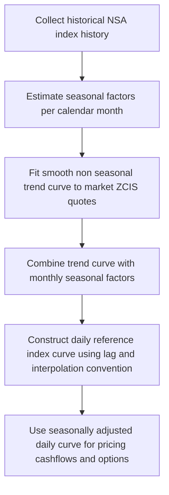

## Seasonality and Indexation Lag Effects

### Overview

Inflation-linked derivatives and bonds reference a published price index (e.g., CPI, RPI, HICP ex-tobacco) that is released with a delay and exhibits predictable within-year patterns. Two structural features — **indexation lag** and **seasonality** — must be modeled explicitly because they create systematic, non-arbitrary deviations between a naive "smooth inflation" assumption and actual cash flows on inflation swaps, zero-coupon inflation swaps (ZCIS), and inflation-linked bonds (linkers).

---

### Indexation Lag

**Key Points**

- Inflation-linked bonds and swaps cannot reference the *current* month's index because that value is not yet published; instead, they reference an index value from **2 or 3 months prior** to the relevant date.
- This lag is a **contractual convention**, not a market friction — it is fixed at issuance/trade and does not change over the life of the instrument.
- Common lag conventions:
  - **3-month lag**: standard for most sovereign linkers referencing monthly CPI (e.g., US TIPS, UK index-linked gilts issued after 2005, French OATi).
  - **2-month lag**: used in some markets and by convention on standard euro HICP zero-coupon swaps.
  - **8-month lag**: was used on pre-2005 UK gilts (older convention, now largely legacy).

#### Reference Index Interpolation

Because coupon/principal dates typically fall mid-month while the CPI index is published as a single monthly value (often dated to the first of the month), the **Daily Reference Index** is constructed by linear interpolation between two published monthly index values:

$$\text{Ref CPI}(t) = \text{CPI}_{m-\text{lag}} + \frac{d-1}{D}\left(\text{CPI}_{m-\text{lag}+1} - \text{CPI}_{m-\text{lag}}\right)$$

where $d$ is the calendar day of the settlement/coupon date, $D$ is the number of days in that month, and $m$ denotes the month of the date in question (before applying the lag).

**Example**

For a US TIPS bond with a 3-month lag, the reference CPI for a coupon date of June 15 uses the published CPI-U index values for **March** and **April**, interpolated according to the day-count position of June 15 within June.

**Key Points**

- The interpolation convention (linear, actual/actual within month) is standardized within each market but differs slightly (e.g., UK vs. US conventions on which day-count basis and which day of the month anchors the index value).
- The lag creates a **timing mismatch**: an inflation swap or linker's "current" cash flow is economically tied to inflation realized 2–3 months earlier, not contemporaneous inflation. This must be accounted for when hedging cross-market inflation exposure or comparing a lagged product to unlagged economic inflation data.

---

### Seasonality in Price Indices

**Key Points**

- Non-seasonally-adjusted (NSA) price indices — which is what nearly all inflation derivatives and linkers reference — exhibit a **recurring, predictable pattern within the calendar year** driven by factors such as:
  - Utility bill resets (January in the UK, for example)
  - Sales periods and discounting cycles (January sales, summer sales)
  - Seasonal food and energy price patterns
  - Academic year effects (school fees, university tuition resets)
  - Holiday-driven travel and leisure price spikes
- This creates a systematic **sawtooth pattern** in month-on-month index changes that repeats with high consistency year over year, even though the year-on-year inflation rate can vary substantially.
- Seasonality is a **known, quantifiable bias** — not noise — and must be modeled explicitly for:
  - Pricing inflation caps/floors and other **non-linear** inflation payoffs whose value depends on the path/timing of index fixings, not just the terminal level.
  - Pricing **short-dated** inflation swaps or index-linked cash flows referencing specific calendar months (e.g., a coupon fixing in April vs. October will systematically differ due to seasonality, independent of the underlying inflation trend).
  - Constructing a smooth, arbitrage-consistent **seasonally-adjusted forward index curve** used as an input to option pricing models.

#### Seasonal Adjustment Factor Construction

A standard approach decomposes the year-on-year forward inflation curve into a smooth trend component and a repeating monthly seasonal factor:

$$\ln I(T_i) = \ln I_{\text{trend}}(T_i) + s(m_i)$$

where $s(m)$ is a seasonal adjustment specific to calendar month $m$, typically constrained so that the seasonal factors sum to (approximately) zero over a full 12-month cycle:

$$\sum_{m=1}^{12} s(m) = 0$$

This constraint ensures seasonality affects the *path* of the index but not the *annual* level implied by the smooth trend curve — i.e., seasonality is a zero-sum reallocation of inflation across months within the year.

**Key Points**

- Seasonal factors are typically estimated from **historical index data** using techniques such as:
  - X-12-ARIMA / X-13ARIMA-SEATS (official statistical agency methodologies)
  - Simple historical average month-on-month seasonal ratios (a common market-practitioner shortcut)
  - Regression against monthly dummy variables with a trend component
- Because seasonal patterns can shift slowly (structural changes in consumption patterns, VAT/tax timing changes, changes to the index methodology), seasonal adjustment models require periodic re-estimation and are inherently **model risk**–bearing. [Inference: the degree of parameter stability depends on the specific index and jurisdiction, and should be validated empirically rather than assumed.]

---

### Impact on Zero-Coupon Inflation Swaps (ZCIS)

For a standard ZCIS with maturity $T$, the payoff at maturity is based on the ratio of the reference index at maturity to the reference index at trade inception:

$$\text{Payoff} = N\left[\left(\frac{\text{Ref CPI}(T)}{\text{Ref CPI}(0)}\right) - (1+K)^T\right]$$

**Key Points**

- Because both the numerator and denominator use the *same* lag convention, and the ratio spans a full number of years (or the swap is structured to align on anniversary dates), seasonality **largely cancels** for a "clean" annual-tenor ZCIS struck on standard IMM-style seasonal-neutral dates.
- Seasonality does **not** cancel for:
  - **Off-cycle** or **fractional-year** trades (e.g., a swap maturing 18 months from now, where the reference months at start and end fall in different parts of the seasonal cycle).
  - **Forward-starting** swaps where the seasonal effect embedded in the start-date fixing differs from that of the end-date fixing.
  - **Inflation caps and floors**, which have optionality on the actual path of the index — seasonality shifts the effective volatility smile and the moneyness of the option in a way that a pure trend curve does not capture.

---

### Seasonally-Adjusted Forward Curve Construction Workflow

---

### Modeling Approaches

**Key Points**

- **Deterministic seasonality overlay**: the most common practitioner approach — fit a smooth stochastic model (e.g., a Jarrow-Yildirim-style model or a simple lognormal forward index model) to the *trend* curve, then apply a deterministic monthly seasonal multiplier on top for cash-flow-date-specific pricing. This treats seasonality as a known, non-stochastic function of calendar month.
- **Jarrow-Yildirim (foreign-currency analogy) framework**: models the inflation index as a "foreign currency" and applies HJM-style dynamics to nominal and real rate curves, with inflation index growth analogous to an FX rate; seasonality is layered on as a deterministic adjustment to the forward index curve, not part of the stochastic dynamics itself.
- **Market Model approaches** (inflation-analog of LMM): model forward CPI-linked "inflation forward rates" per period directly, with seasonality embedded in the initial forward curve construction rather than the volatility/correlation structure.

**Key Points**

- Regardless of the stochastic model chosen for the trend, **seasonality is almost universally treated as a deterministic, calendar-based adjustment** layered onto the smooth trend, since seasonal patterns are driven by recurring calendar/institutional effects rather than genuine market uncertainty.
- The choice of *how many years of historical data* to use for seasonal factor estimation is a key practical judgment: too few years risks fitting noise; too many years risks including structurally stale seasonal patterns (e.g., pre-VAT-change behavior). [Inference: the optimal lookback window is index- and jurisdiction-specific and is typically determined via out-of-sample backtesting by practitioners rather than a universal rule.]

---

### Practical Pitfalls

- **Ignoring seasonality on short-dated or odd-tenor trades**: pricing a sub-annual or off-cycle inflation cash flow using only the smooth trend curve (ignoring the seasonal factor for the specific fixing month) produces a systematic mispricing that is exploitable by counterparties who do model seasonality.
- **Double-counting the lag and seasonality effects**: since the reference index used is already lagged by 2–3 months, the seasonal factor applied must correspond to the *lagged* reference month, not the nominal cash-flow date's calendar month — a common implementation error.
- **Stale seasonal factors**: using seasonal adjustment factors estimated years ago without periodic re-fitting, especially after methodology changes to the underlying index (e.g., basket reweighting, changes in statistical agency treatment of owner-occupied housing costs).
- **Interpolation convention mismatches**: different markets (UK RPI/CPI vs. US CPI-U vs. Eurozone HICP) use different day-count and interpolation conventions for the daily reference index; applying the wrong convention when hedging cross-market inflation exposure introduces basis risk.

---

**Next Steps**

- The Jarrow-Yildirim Model for Inflation Derivatives
- Real Rate Curve Construction from Inflation Swaps and TIPS
- Pricing Inflation Caps and Floors (Black-76 vs. SABR-style smile models)
- Inflation-Linked Bond Analytics: Real Yield, BEI, and Carry
- Cross-Market Inflation Basis (UK RPI vs. CPI, US CPI vs. Core CPI)
- Convexity Adjustments in Year-on-Year Inflation Swaps