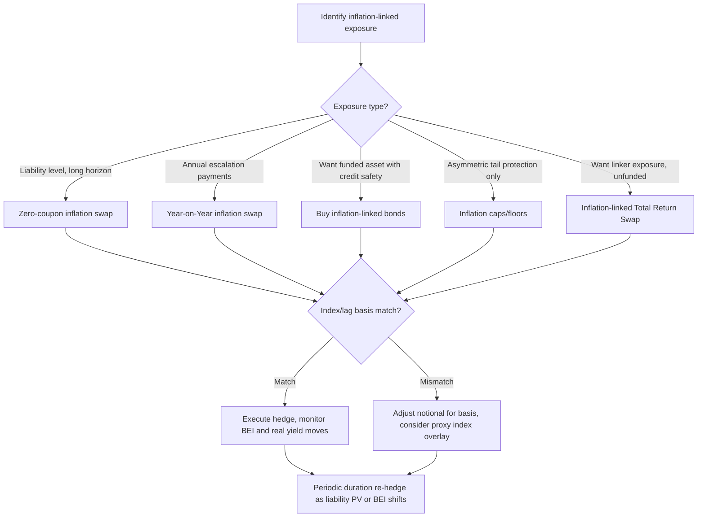

## Hedging Inflation Exposure

### Overview

Hedging inflation exposure involves using financial instruments to offset the risk that unexpected changes in inflation will erode real returns, increase real liabilities, or distort the economics of a contract, portfolio, or corporate balance sheet. Inflation risk is asymmetric in nature for different agents: borrowers with fixed-rate liabilities benefit from unexpected inflation, while lenders and holders of nominal fixed-income assets suffer erosion of real value. Pension funds, insurers, corporates with inflation-linked revenues or costs, and sovereign debt managers are the primary hedgers.

**Key Points**

- Inflation exposure arises whenever cash flows are fixed in nominal terms but the underlying economic obligation is real (e.g., pension payouts indexed to CPI, long-dated fixed-rate debt, real wage costs).
- The core hedging instruments are inflation swaps, inflation-linked bonds (linkers), inflation caps/floors, and inflation-linked total return swaps.
- Hedge design depends on whether the exposure is to the *level* of inflation, the *rate* of inflation, or *convexity* in inflation outcomes (tail scenarios).

---

### Sources of Inflation Exposure

**1. Liability-side exposure (pension funds, insurers)**

Defined-benefit pension schemes with inflation-linked benefit escalation (e.g., UK RPI/CPI-linked pensions) have real liabilities. If assets are nominal bonds, a rise in realized inflation increases the present value of liabilities without a corresponding asset increase, widening the deficit.

**2. Asset-side exposure (fixed income investors)**

Holders of nominal bonds see the real value of coupons and principal eroded by inflation. [Verified] This is the classic case for real-rate hedging via linkers or swaps.

**3. Corporate exposure**

- Revenue-linked: utilities, toll roads, and regulated industries often have explicitly CPI-linked revenues, creating a natural *long* inflation position.
- Cost-linked: labor-intensive businesses with wage costs tied to inflation indices have a *short* inflation position (rising inflation increases costs).

**4. Sovereign and macro exposure**

Governments issuing inflation-linked debt (TIPS, UK Gilts, OATi) have direct inflation-linked liabilities on the fiscal balance sheet.

---

### Primary Hedging Instruments

#### 1. Inflation-Linked Bonds (Linkers)

Linkers (e.g., US TIPS, UK Index-Linked Gilts, French OATi/OAT€i, German Bund index-linked) pay coupons and/or principal indexed to a reference inflation index (CPI, RPI, HICP ex-tobacco).

For TIPS, the principal is adjusted daily by the Index Ratio:

$$IR_t = \frac{CPI_t}{CPI_{base}}$$

The adjusted principal at time $t$ is:

$$P_t = P_0 \times IR_t$$

Coupon payments are computed on the inflation-adjusted principal:

$$C_t = c \times P_t$$

where $c$ is the fixed real coupon rate.

**Example:**

A TIPS with $P_0 = \$1{,}000{,}000$ face value and a 1% real coupon, with $CPI_{base} = 250$ and $CPI_t = 262.5$:

$$IR_t = \frac{262.5}{250} = 1.05$$

$$P_t = 1{,}000{,}000 \times 1.05 = \$1{,}050{,}000$$

$$C_t = 0.01 \times 1{,}050{,}000 = \$10{,}500$$

Holding linkers to maturity directly hedges an inflation-linked liability of matching maturity and reference index, since both cash flows scale with the same index.

**Limitation:** [Unverified — varies by jurisdiction] Deflation floors differ by structure. US TIPS have a principal floor at par at maturity (the redemption value is the greater of the inflation-adjusted principal or original par), while some other sovereign linkers (e.g., certain UK gilts, depending on series) may not carry this floor, exposing holders to downside on cumulative deflation.

#### 2. Inflation (Zero-Coupon) Swaps

The zero-coupon inflation swap (ZCIS) is the most liquid pure inflation hedging instrument. At maturity $T$, one counterparty pays a fixed compounded rate, the other pays realized inflation compounded over the period, with no interim cash flows.

Payoff to the fixed-rate payer (receives inflation, i.e., "long inflation"):

$$\text{Payoff} = N \times \left[\left(\frac{CPI_T}{CPI_0}\right) - (1 + K)^T\right]$$

where:

- $N$ = notional
- $K$ = fixed breakeven inflation rate agreed at inception
- $CPI_T / CPI_0$ = realized inflation index ratio over the swap tenor
- $T$ = tenor in years

A liability holder facing inflation-linked payouts hedges by **receiving inflation** (paying fixed $K$): if realized inflation exceeds $K$, the swap pays out and offsets the higher-than-expected liability.

**Example:**

A pension fund has a €100mm liability indexed to Eurozone HICP due in 10 years. It enters a 10-year ZCIS receiving HICP inflation, paying a fixed rate of 2.20% (compounded). If realized inflation compounds to 2.80% p.a. over the period:

Fixed leg (paid): $100mm \times [(1.0220)^{10} - 1] \approx 100mm \times 0.2434 = €24.34mm$

Inflation leg (received): $100mm \times [(1.0280)^{10} - 1] \approx 100mm \times 0.3193 = €31.93mm$

Net receipt: $€31.93mm - €24.34mm = €7.59mm$, which approximately offsets the increased real cost of the liability.

**Year-on-Year Inflation Swaps (YoY):** Instead of one compounded payment, YoY swaps exchange fixed vs. floating inflation on an annual basis throughout the life of the swap, better matching liabilities with annual escalation clauses (e.g., annually-adjusted pension payments or lease escalations) rather than a single terminal cash flow.

#### 3. Inflation Caps and Floors

Inflation caps provide asymmetric protection against high inflation without giving up upside if inflation stays low — useful for corporates hedging cost inflation without paying away benefit if inflation remains benign.

An inflation cap payoff (per period, notional $N$, strike $K$):

$$\text{Payoff} = N \times \max\left(\pi_t - K, 0\right)$$

where $\pi_t$ is the realized annual inflation rate for the period. A portfolio of such caplets across the hedge horizon forms a full cap. Inflation floors have the mirrored payoff, $\max(K - \pi_t, 0)$, used by inflation-linked revenue holders to protect against low/deflationary environments eroding indexed revenue growth.

**Volatility considerations:** [Unverified — market-dependent] Inflation option markets are considerably less liquid than nominal or even inflation swap markets; implied inflation volatility surfaces are sparsely quoted and skew/smile dynamics can be unstable, particularly for deep out-of-the-money deflation floors.

#### 4. Inflation-Linked Total Return Swaps

Used to gain linker-like exposure without funding the bond purchase — swap the total return of a specific inflation-linked bond (coupon + inflation accrual + price return) against a floating funding rate (e.g., SOFR + spread). This isolates real yield and inflation exposure while managing balance sheet usage and repo considerations separately.

---

### Constructing a Hedge: Breakeven Inflation and Real Yields

The nominal yield can be decomposed (approximately, via the Fisher relation) as:

$$(1 + y_{nominal}) \approx (1 + y_{real}) \times (1 + \pi_e) \times (1 + RP)$$

commonly simplified to:

$$y_{nominal} \approx y_{real} + \pi_e + RP$$

where $\pi_e$ is expected inflation and $RP$ is the inflation risk premium. The market-implied **breakeven inflation rate** (BEI) is:

$$BEI = y_{nominal} - y_{real}$$

derived by comparing a nominal bond's yield to a linker of matching maturity. BEI serves as the reference "fixed leg" pricing input for inflation swaps and is the key metric for assessing whether inflation protection is cheap or expensive relative to market expectations.

**Example:**

A 10-year nominal Treasury yields 4.30%; a 10-year TIPS yields 1.90% real. BEI = 4.30% − 1.90% = 2.40%. If a hedger believes realized CPI will average above 2.40% over 10 years, receiving inflation via a swap or buying TIPS versus nominals is an attractive hedge/carry trade; if below, the hedge is "expensive" relative to expectations (though still valid as pure risk mitigation rather than a view trade).

---

### Hedge Ratio and Duration Matching

Effective inflation hedging requires matching not just notional exposure but also the **inflation duration** (sensitivity of PV to changes in breakeven inflation) and **real rate duration** (sensitivity to real yield changes) of the liability.

$$\Delta PV_{liability} \approx -D_{real} \times \Delta y_{real} \times PV - D_{inflation} \times \Delta BEI \times PV$$

A hedge portfolio combining nominal bonds, linkers, and inflation swaps can be constructed to zero out both sensitivities simultaneously by solving a two-instrument system (since a single linker conflates both real rate and inflation exposure, while swaps isolate inflation more cleanly, especially when paired with nominal duration hedges via swaps or futures).

**Example (simplified 2-instrument hedge):**

A liability has real duration of 12 and inflation duration of 12 (both roughly equal for a simple CPI-linked annuity stream). Hedging with:

- A ZCIS (pure inflation duration, ~zero real rate sensitivity)
- A nominal interest rate swap (pure real/nominal rate sensitivity once inflation is stripped out)

allows independent calibration of each notional to match the liability's two duration exposures, rather than being constrained to the fixed real/inflation duration ratio embedded in a single linker.

---

### Basis Risk in Inflation Hedging

**Index basis:** The hedge instrument's reference index may not match the liability's index (e.g., hedging a national CPI-linked liability with a swap referencing a regional or different CPI vintage, or RPI vs. CPI in the UK, which have structurally diverged due to differing calculation methodologies).

**Lag basis:** Most inflation-linked instruments use a lagged reference index (commonly a 2–3 month lag) to allow for known-in-advance coupon calculation. If the liability uses a different lag convention, seasonal patterns in the index can create timing mismatches (interpolated index values, e.g., the 3-month lag convention used in UK linkers and swaps, are constructed via linear interpolation between monthly CPI prints).

**Asymmetric convexity basis:** Bonds carry an embedded deflation floor (in some structures) that swaps do not replicate unless a matching floor is explicitly purchased, creating a convexity mismatch between a linker-based hedge and a swap-based hedge of nominally identical notional.

---

### Diagram: Inflation Swap Hedge Structure (svg_diagram)

<svg xmlns="http://www.w3.org/2000/svg" viewBox="0 0 760 420" font-family="Arial, sans-serif">
<text x="380" y="30" font-size="18" font-weight="bold" text-anchor="middle">Zero-Coupon Inflation Swap Hedge (svg_diagram)</text>
<rect x="40" y="80" width="180" height="90" rx="8" fill="#e8f0fe" stroke="#1a56db" stroke-width="2" />
<text x="130" y="115" font-size="14" text-anchor="middle" font-weight="bold">Pension Fund</text>
<text x="130" y="135" font-size="12" text-anchor="middle">(CPI-linked liability)</text>
<text x="130" y="153" font-size="12" text-anchor="middle">Pays fixed rate K</text>
<rect x="540" y="80" width="180" height="90" rx="8" fill="#fdecea" stroke="#c0392b" stroke-width="2" />
<text x="630" y="115" font-size="14" text-anchor="middle" font-weight="bold">Swap Dealer</text>
<text x="630" y="135" font-size="12" text-anchor="middle">Pays realized CPI</text>
<text x="630" y="153" font-size="12" text-anchor="middle">growth over tenor T</text>
<line x1="220" y1="105" x2="540" y2="105" stroke="#1a56db" stroke-width="2" marker-end="url(#arrow1)" />
<text x="380" y="98" font-size="12" text-anchor="middle" fill="#1a56db">Fixed: N x [(1+K)^T - 1]</text>
<line x1="540" y1="145" x2="220" y2="145" stroke="#c0392b" stroke-width="2" marker-end="url(#arrow2)" />
<text x="380" y="163" font-size="12" text-anchor="middle" fill="#c0392b">Floating: N x [CPI_T/CPI_0 - 1]</text>
<line x1="380" y1="200" x2="380" y2="230" stroke="#555" stroke-width="1" stroke-dasharray="4,4" />
<text x="380" y="250" font-size="13" text-anchor="middle" font-style="italic">Net effect on Pension Fund</text>
<rect x="180" y="270" width="400" height="110" rx="8" fill="#f4f4f4" stroke="#555" stroke-width="1.5" />
<text x="380" y="295" font-size="12" text-anchor="middle" font-weight="bold">If realized CPI &gt; K:</text>
<text x="380" y="315" font-size="12" text-anchor="middle">Fund receives net inflation payoff,</text>
<text x="380" y="333" font-size="12" text-anchor="middle">offsetting higher-than-expected</text>
<text x="380" y="351" font-size="12" text-anchor="middle">real value of CPI-linked liability</text>
</svg>

---

### Hedge Selection Decision Flow

---

### Practical Considerations

- **Accounting treatment:** [Unverified — jurisdiction/standard dependent] Under IFRS 9 or US GAAP hedge accounting rules, inflation swaps used as liability hedges may or may not qualify for hedge accounting treatment depending on whether the hedged risk (inflation component of a liability) is deemed separately identifiable and reliably measurable; this determines whether swap fair value changes flow through P&L or OCI.
- **Collateral/CSA terms:** Inflation swaps, like other OTC derivatives, are subject to variation margin under standard ISDA/CSA agreements post-Dodd-Frank/EMIR, meaning mark-to-market moves in breakeven inflation generate margin calls, requiring liquidity buffers even for economically matched hedges.
- **Liquidity concentration:** Inflation swap liquidity concentrates around benchmark tenors (5Y, 10Y, 30Y) and standard indices (e.g., US CPI-U NSA, UK RPI/CPI, Eurozone HICP ex-tobacco); off-the-run tenors and niche regional indices carry wider bid-offer and greater basis risk.

**Related Topics**

- Breakeven Inflation Trading Strategies
- Real Yield Curve Construction and Interpolation
- Inflation Volatility Surfaces and Skew Dynamics
- Liability-Driven Investment (LDI) Frameworks
- TIPS vs. Nominal Treasury Relative Value
- Deflation Floor Pricing and Embedded Optionality
- RPI/CPI Basis Trading (UK Market Specifics)
- Seasonality Adjustments in Inflation Index Construction