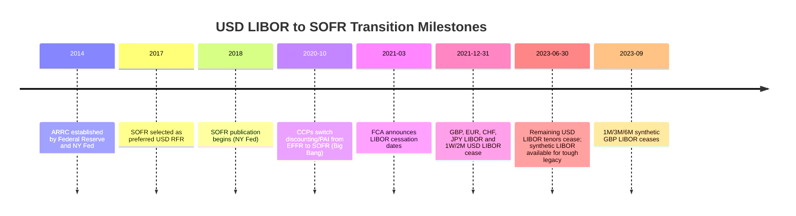

## The Transition From LIBOR to Risk-Free Rates

### Overview

The LIBOR-to-RFR transition refers to the global benchmark reform that replaced the London Interbank Offered Rate (LIBOR) — a forward-looking, credit-sensitive, panel-bank-submitted rate — with near-risk-free overnight rates (RFRs) administered from actual, observable transactions. The reform was triggered by the 2012 LIBOR manipulation scandal and the structural decline in unsecured interbank lending volumes that made LIBOR increasingly a matter of "expert judgment" rather than transaction-based fact. [Verified] LIBOR ceased to be published or became non-representative across all currency panels by mid-2023, with USD LIBOR being the last major panel to cease (most tenors ended June 30, 2023, following a partial cessation in 2021 for less-used tenors).

**Key Points**

- LIBOR was forward-looking (term rates fixed at the start of a period) and credit-sensitive (embedded bank credit risk); RFRs are backward-looking overnight rates that are nearly risk-free (predominantly secured, e.g., SOFR).
- Each currency jurisdiction selected its own RFR: SOFR (USD), SONIA (GBP), €STR (EUR), TONA (JPY), SARON (CHF).
- The transition required new conventions for interest accrual (compounding in arrears), fallback language in legacy contracts, and new derivative and cash product infrastructure.

---

### Why LIBOR Was Discontinued

**Structural decline in underlying market:** [Verified] LIBOR was meant to reflect the rate at which panel banks could borrow unsecured funds from one another in the interbank market. Post-2008, unsecured interbank lending volumes shrank dramatically as banks shifted to secured funding (repo) and other funding sources, meaning submissions increasingly relied on "expert judgment" rather than actual transactions.

**Manipulation scandal:** The 2012 revelations that traders at panel banks had colluded to manipulate LIBOR submissions to benefit derivatives trading positions and to make banks appear more creditworthy during the financial crisis eroded regulatory and market confidence in the benchmark's integrity.

**Regulatory response:** The UK Financial Conduct Authority (FCA), which regulated LIBOR's administrator (ICE Benchmark Administration), announced in 2017 that it would no longer compel panel banks to submit LIBOR quotes after end-2021, effectively setting a discontinuation timeline. This catalyzed global regulatory and industry working groups (ARRC in the US, Working Group on Sterling Risk-Free Reference Rates in the UK, etc.) to identify and promote adoption of replacement RFRs.

---

### The Selected Risk-Free Rates by Currency

| Currency | LIBOR (legacy) | RFR Replacement | Administrator | Underlying Market |
| --- | --- | --- | --- | --- |
| USD | USD LIBOR | SOFR (Secured Overnight Financing Rate) | Federal Reserve Bank of New York | Overnight Treasury repo |
| GBP | GBP LIBOR | SONIA (Sterling Overnight Index Average) | Bank of England | Overnight unsecured interbank |
| EUR | EURIBOR (retained, reformed) / EONIA (discontinued) | €STR (Euro Short-Term Rate) | European Central Bank | Overnight unsecured wholesale |
| JPY | JPY LIBOR | TONA (Tokyo Overnight Average Rate) | Bank of Japan | Overnight uncollateralized call market |
| CHF | CHF LIBOR | SARON (Swiss Average Rate Overnight) | SIX Swiss Exchange | Overnight repo |

[Verified] Note that EURIBOR was not fully discontinued — it was reformed to comply with the EU Benchmarks Regulation and continues to coexist alongside €STR, unlike the other currencies where LIBOR was fully retired.

**Key structural differences from LIBOR:**

- **Secured vs. unsecured:** SOFR and SARON are secured (repo-based) rates; SONIA, €STR, and TONA remain unsecured overnight rates, closer in spirit to the old LIBOR concept but without the term and credit-risk premium.
- **No credit spread / no term premium:** Because RFRs are overnight and (mostly) collateralized, they sit below LIBOR by a margin reflecting LIBOR's embedded bank credit risk and term liquidity premium — this gap is known as the **LIBOR-RFR spread** and had to be explicitly compensated for in the transition (see Fallback Spread Adjustment below).

---

### Forward-Looking Term Rate vs. Backward-Looking Overnight Compounding

LIBOR was quoted for specific forward-looking tenors (1M, 3M, 6M, 12M), fixed at the start of the interest period — a borrower knew their interest cost in advance. RFRs are overnight rates; to construct a rate over a period (e.g., 3 months), the market adopted two primary conventions:

**1. Compounded in Arrears (the dominant convention)**

$$\left(1 + r_{compound}\right) = \prod_{i=1}^{n} \left(1 + \frac{r_i \times d_i}{360 \text{ or } 365}\right)$$

where $r_i$ is the overnight RFR fixing on day $i$, $d_i$ is the number of calendar days that rate applies (accounting for weekends/holidays), and $n$ is the number of business days in the period. The compounded rate is only known at (or very near) the end of the interest period, since it depends on the full realized path of overnight rates.

**Example (SOFR compounding, simplified 5-day period):**

| Day | SOFR (overnight) | Days Applied |
| --- | --- | --- |
| 1 | 5.30% | 1 |
| 2 | 5.31% | 1 |
| 3 | 5.29% | 3 (Fri rate applies over weekend) |
| 4 | 5.32% | 1 |

$$\prod \left(1 + \frac{0.0530 \times 1}{360}\right)\left(1 + \frac{0.0531 \times 1}{360}\right)\left(1 + \frac{0.0529 \times 3}{360}\right)\left(1 + \frac{0.0532 \times 1}{360}\right) - 1$$

This compounded factor, annualized, gives the effective interest rate applied to the loan for that period — known only after the period has substantially elapsed.

**2. Simple Average / Compounded in Advance (less common conventions)**

Some cash products (particularly certain loan markets) adopted a "lookback," "lockout," or "payment delay" mechanism to give borrowers advance knowledge of their payment, using the compounded RFR from a prior, shifted observation period rather than the true concurrent period. This addresses the operational problem of borrowers not knowing their payment amount until days before it is due.

**Common mechanisms:**

- **Lookback:** Observe the RFR $n$ days (commonly 5) *before* the actual interest period, applying that historical rate path to the current period's day-count.
- **Lockout (Suspension Period):** Use actual daily rates but freeze the rate for the final few days of the period at the last observed value, to allow time for payment calculation and notification.
- **Payment Delay:** Calculate using the true concurrent period's rates, but delay the actual cash payment date by a few business days after period end.

---

### Term SOFR and Other Forward-Looking Term Rates

To ease transition for products that structurally require a forward-looking, known-in-advance rate (notably certain loan markets, trade finance, and some corporate treasury applications), the CME Group, endorsed by the ARRC, publishes **Term SOFR** — a forward-looking term rate derived from SOFR futures and OIS market pricing, published for 1M, 3M, 6M, and 12M tenors.

[Verified] The ARRC's recommended use of Term SOFR is scoped primarily to business loans, particularly multi-lender facilities, trade finance, and securitizations backed by such loans — the ARRC explicitly discouraged broad use of Term SOFR in the derivatives market to avoid fragmenting liquidity away from compounded-in-arrears SOFR, which remains the dominant convention for swaps and other derivatives.

---

### Fallback Language and the ISDA Protocol

Legacy contracts referencing LIBOR (loans, bonds, derivatives) needed "fallback" provisions specifying what rate applies if LIBOR ceased to exist. Since most legacy contracts either lacked robust fallback language or referenced fallbacks that assumed LIBOR would only be temporarily unavailable (e.g., "use the last published LIBOR rate," which becomes economically nonsensical for a permanent cessation), industry-wide contractual remediation was required.

**ISDA 2020 IBOR Fallbacks Protocol:** Published by ISDA, this protocol amended derivatives contracts (upon adherence by both counterparties) to automatically fall back from LIBOR to the relevant RFR compounded in arrears, plus a fixed spread adjustment, upon LIBOR's cessation or non-representativeness.

**Spread Adjustment Methodology:**

$$\text{Fallback Rate} = \text{RFR}_{\text{compounded in arrears}} + \text{Spread Adjustment}$$

The spread adjustment was calculated as the **historical median** of the difference between LIBOR and the compounded RFR over a **5-year lookback period**, fixed as a static, tenor-specific value at the time ISDA/Bloomberg published it (Bloomberg served as the calculation and publication agent):

$$\text{Spread}_{tenor} = \text{median}\left(\text{LIBOR}_{tenor,t} - \text{RFR}_{compounded,t}\right) \text{ over trailing 5 years}$$

Using the median (rather than mean) was deliberate — [Verified] ISDA and the working groups selected the median specifically because it is more robust to outliers and less susceptible to manipulation or gaming than a mean-based calculation, and it avoids giving asymmetric incentive to parties near the fallback trigger date.

**Example:**

If the 5-year historical median spread between 3M USD LIBOR and compounded-in-arrears SOFR was 26.161 basis points (the actual published ISDA value for 3M USD LIBOR), then upon LIBOR's cessation, all legacy derivatives referencing 3M USD LIBOR that had adhered to the protocol (or were otherwise subject to equivalent legislative fallbacks) transitioned to:

$$\text{Rate} = \text{Compounded SOFR in arrears} + 0.26161\%$$

**Legislative solutions:** For contracts that could not be amended by protocol adherence (so-called "tough legacy" contracts with no workable fallback and no practical way to obtain consent, e.g., some legacy bonds), legislative fixes were enacted:

- **US:** The Adjustable Interest Rate (LIBOR) Act (federal legislation, 2022) and New York State LIBOR legislation provided a statutory replacement rate (Fed-selected SOFR-based rate plus spread adjustment) for USD LIBOR contracts governed by NY law with no adequate fallback.
- **UK:** The FCA used its powers under the UK Benchmarks Regulation to require IBA to publish "synthetic LIBOR" for GBP and JPY LIBOR for a limited wind-down period, using the same compounded RFR + ISDA spread adjustment methodology, allowing tough legacy contracts to continue referencing "LIBOR" operationally while it economically tracked the RFR-based rate.

---

### Impact on Derivatives Products

**Interest Rate Swaps:** The market shifted from LIBOR-referencing floating legs to SOFR (or respective RFR) compounded-in-arrears floating legs as the new market standard, formalized by the **"Big Bang" transition** on the interdealer market, coordinated by CCPs (LCH and CME) switching the price alignment interest (PAI) and discounting curve for cleared USD swaps from Fed Funds Effective Rate to SOFR on October 16, 2020 — well ahead of LIBOR's actual cessation, to front-run the operational and valuation transition.

**Discounting curve transition:** [Verified] This CCP discounting switch from EFFR (Effective Federal Funds Rate) to SOFR for cleared swaps required a substantial valuation adjustment across the market, since even swaps referencing other indices (or LIBOR, pre-cessation) needed to be discounted using the new SOFR OIS curve, creating a one-time valuation shift compensated for via cash compensation mechanisms managed by the CCPs.

**Basis swaps:** LIBOR-SOFR basis swaps emerged as a transitional product, allowing market participants to exchange exposure between the two rate regimes during the multi-year transition period, and to hedge or restructure legacy LIBOR exposure into RFR exposure ahead of cessation deadlines.

**Caps, floors, and swaptions:** Volatility surfaces and pricing models had to be rebuilt for SOFR-based underlyings, given the different volatility dynamics of a compounded backward-looking rate versus a forward-looking term rate (compounded-in-arrears rates exhibit convexity and averaging effects not present in simple LIBOR-referencing options).

---

### Transition Timeline (Illustrative, USD Focus)

---

### Diagram: LIBOR vs. RFR Rate-Setting Mechanics (svg_diagram)

<svg xmlns="http://www.w3.org/2000/svg" viewBox="0 0 780 380" font-family="Arial, sans-serif">

<text x="390" y="28" font-size="18" font-weight="bold" text-anchor="middle">LIBOR vs. RFR Rate-Setting Mechanics (svg_diagram)</text>

<line x1="60" y1="90" x2="720" y2="90" stroke="#333" stroke-width="2" />

<text x="60" y="75" font-size="13" font-weight="bold">LIBOR (forward-looking)</text>

<circle cx="100" cy="90" r="5" fill="#1a56db" />

<text x="100" y="115" font-size="11" text-anchor="middle">Rate fixed here</text>

<line x1="100" y1="90" x2="680" y2="90" stroke="#1a56db" stroke-width="4" />

<text x="390" y="112" font-size="11" text-anchor="middle" fill="#1a56db">Known rate applies for full 3M period</text>

<polygon points="675,85 690,90 675,95" fill="#1a56db" />

<line x1="60" y1="220" x2="720" y2="220" stroke="#333" stroke-width="2" />

<text x="60" y="205" font-size="13" font-weight="bold">RFR Compounded in Arrears (backward-looking)</text>

<g>

<rect x="100" y="212" width="30" height="16" fill="#c0392b" opacity="0.6" />

<rect x="135" y="212" width="30" height="16" fill="#c0392b" opacity="0.7" />

<rect x="170" y="212" width="30" height="16" fill="#c0392b" opacity="0.5" />

<rect x="205" y="212" width="30" height="16" fill="#c0392b" opacity="0.8" />

<rect x="240" y="212" width="30" height="16" fill="#c0392b" opacity="0.6" />

<text x="170" y="250" font-size="11" text-anchor="middle">Daily overnight fixings compounded day-by-day</text>

</g>

<line x1="680" y1="212" x2="680" y2="228" stroke="#c0392b" stroke-width="2" />

<text x="680" y="245" font-size="11" text-anchor="middle" fill="#c0392b">Final compounded rate</text>

<text x="680" y="260" font-size="11" text-anchor="middle" fill="#c0392b">known only at period end</text>

<line x1="100" y1="220" x2="670" y2="220" stroke="#c0392b" stroke-width="1" stroke-dasharray="3,3" />

<rect x="90" y="300" width="600" height="60" rx="8" fill="#f4f4f4" stroke="#555" />

<text x="390" y="325" font-size="12" text-anchor="middle" font-weight="bold">Key contrast:</text>

<text x="390" y="345" font-size="12" text-anchor="middle">LIBOR: known in advance, credit-sensitive term rate</text>

<text x="390" y="358" font-size="11" text-anchor="middle">RFR: known in arrears, near risk-free overnight rate</text>

</svg>

---

### Legacy Product Impact Summary

| Product Type | Pre-Transition | Post-Transition |
| --- | --- | --- |
| Cleared IRS | LIBOR floating leg, EFFR discounting | SOFR (or RFR) compounded-in-arrears floating leg, SOFR discounting |
| FRNs / Bonds | LIBOR + spread coupon | Compounded RFR + spread coupon (new issuance); RFR + ISDA spread adjustment (fallback on legacy) |
| Syndicated Loans | LIBOR + margin, forward-set | Term SOFR (or daily simple SOFR) + margin + credit spread adjustment (CSA) |
| Legacy "tough" contracts | LIBOR, no workable fallback | Synthetic LIBOR (UK) or statutory replacement rate (US) during wind-down |

---

### Practical Considerations

- **Operational systems risk:** [Unverified — institution-dependent] Firms had to rebuild loan servicing, treasury, and risk systems to handle daily-compounding interest calculations rather than a single rate fixed at period start, which for some institutions required significant technology remediation given legacy systems were architected around forward-known rates.
- **Conduct risk:** Regulators emphasized fair treatment of legacy contract holders during the fallback transition, particularly around communication of rate changes and avoiding value transfer disputes between counterparties.
- **Residual credit sensitivity demand:** Some market participants (particularly regional/community banks in the US funding themselves at spreads to unsecured benchmarks) advocated for credit-sensitive alternatives to pure SOFR (e.g., AMERIBOR, BSBY — though BSBY was discontinued in 2023) to better match their funding cost dynamics, reflecting continued demand for a credit-sensitive component that pure secured RFRs do not capture.

**Related Topics**

- SOFR Futures and the Term Rate Construction Methodology
- Overnight Index Swaps (OIS) Mechanics and Curve Building
- Credit Sensitive Rate Alternatives (BSBY, AMERIBOR, Ameribor)
- CCP Discounting Switch and the "Big Bang" Valuation Adjustment
- Legacy Contract Remediation and Tough Legacy Legislation
- RFR-Based Cap/Floor and Swaption Pricing Adjustments
- Cross-Currency Basis Swaps in a Multi-RFR World