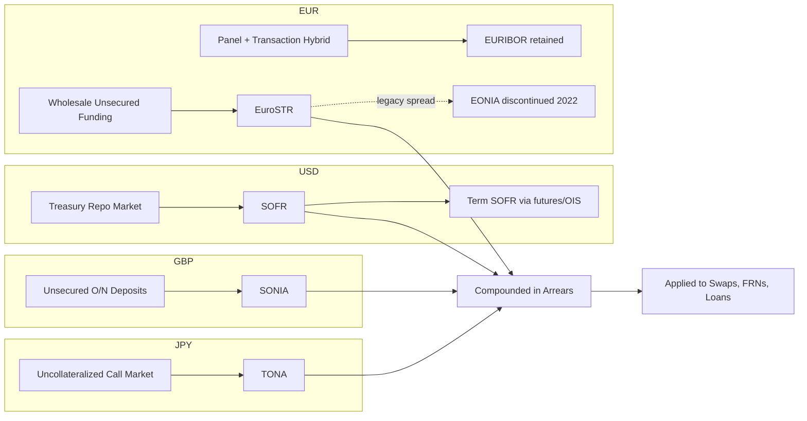

## SOFR, SONIA, €STR and TONA Mechanics

### Overview

SOFR, SONIA, €STR, and TONA are the four principal near-risk-free reference rates (RFRs) that replaced LIBOR across USD, GBP, EUR, and JPY markets respectively. While they share the common design goal of being transaction-based, backward-looking overnight rates, they differ meaningfully in underlying market (secured vs. unsecured), administering institution, calculation methodology, publication timing, and volatility behavior — differences that matter directly for derivatives pricing, curve construction, and cross-currency basis.

**Key Points**

- SOFR and SARON are **secured** (repo-based) rates; SONIA, €STR, and TONA are **unsecured** overnight rates.
- All four are administered by central banks or central-bank-affiliated bodies, not private panels — removing the "expert judgment" submission risk that undermined LIBOR.
- Each rate has distinct publication timing, trimming/winsorization methodology, and data source composition, which drives differences in day-to-day volatility and suitability for different product types.

---

### SOFR (Secured Overnight Financing Rate) — USD

**Administrator:** Federal Reserve Bank of New York (calculated using data from the Office of Financial Research, OFR)

**Underlying market:** SOFR is a broad measure of the cost of borrowing cash overnight, collateralized by Treasury securities, covering three segments of the repo market:

1. Tri-party repo (cleared through BNY Mellon)
2. General Collateral Finance (GCF) repo (cleared through FICC)
3. Bilateral Treasury repo cleared through FICC's DVP service

**Calculation methodology:** SOFR is calculated as a **volume-weighted median** of transaction-level tri-party repo data, GCF repo data, and bilateral Treasury repo transactions cleared through FICC. [Verified] The NY Fed applies data quality controls, including the removal of a subset of bilateral repo transactions considered "specials" (trades where the specific collateral, rather than general funding needs, drives the rate) to avoid the rate being skewed by idiosyncratic collateral scarcity premia.

$$SOFR_t = \text{Volume-weighted median of eligible overnight Treasury repo transactions on day } t$$

**Publication:** Published each business day at approximately 8:00 AM ET by the NY Fed, reflecting transactions from the previous business day.

**Scale:** [Verified] SOFR is underpinned by one of the deepest and most liquid funding markets in the world, with underlying daily transaction volumes in the several-hundred-billion-dollar to over one-trillion-dollar range, making it materially more transaction-rich than LIBOR ever was, which was often based on a handful of estimated submissions per bank.

**Volatility characteristics:** SOFR is subject to occasional spikes around quarter-end and year-end dates due to balance sheet constraints on repo dealers (regulatory reporting dates causing temporary collateral/funding supply-demand imbalances), most notably the September 2019 repo market spike (which predated but informed the Fed's subsequent standing repo facility design). This "specialness" and periodic volatility is a structural feature of secured funding markets tied to collateral supply dynamics, distinct from unsecured rate behavior.

**Term SOFR:** As covered in benchmark transition material, CME Group publishes a forward-looking Term SOFR (1M, 3M, 6M, 12M) derived from SOFR futures/OIS pricing, used primarily in loan markets per ARRC scope recommendations, not the derivatives market.

---

### SONIA (Sterling Overnight Index Average) — GBP

**Administrator:** Bank of England (took over administration from the Wholesale Markets Brokers' Association in April 2016, as part of the reform process)

**Underlying market:** Unsecured overnight funding — specifically overnight deposits, unsecured, arranged directly between eligible institutions (banks, building societies, broker-dealers) and reported by eligible reporters under the Bank of England's data collection framework.

**Calculation methodology:** SONIA is a **volume-weighted trimmed mean** of interest rates paid on eligible sterling overnight deposit transactions, executed between 00:00 and 18:30 (bulk of the trading day), excluding a trim of the highest and lowest volumes by rate (a standard trimmed-mean approach used to reduce sensitivity to outlier transactions at either tail).

$$SONIA_t = \text{Volume-weighted trimmed mean of eligible unsecured overnight deposit transactions on day } t$$

**Publication:** Published on the next London business day at approximately 9:00 AM (i.e., a one-day publication lag relative to the transaction date, consistent with most RFRs given end-of-day data collection needs).

**Historical continuity:** [Verified] SONIA existed prior to LIBOR reform (having been administered by WMBA/BBA since 1997) as an overnight unsecured reference rate used primarily in the OIS market, meaning its reformed post-2018 version (with expanded data sources and BoE administration) represented an evolution of an already-established benchmark rather than an entirely new rate construction, unlike SOFR and €STR which were newly created for this purpose.

**Volatility characteristics:** [Unverified — relative comparison] SONIA is generally considered to exhibit somewhat lower day-to-day volatility than SOFR, reflecting the absence of the collateral-specific and quarter-end balance-sheet dynamics that affect secured repo markets, though it remains subject to its own liquidity and monetary policy operational effects around Bank of England rate decisions and reserve maintenance periods.

---

### €STR (Euro Short-Term Rate) — EUR

**Administrator:** European Central Bank

**Underlying market:** Unsecured overnight borrowing by euro area banks from wholesale market counterparties, including banks, money market funds, insurance corporations, pension funds, other financial institutions, and (in a defined scope) non-financial corporations.

**Calculation methodology:** €STR is calculated as a **volume-weighted trimmed mean**, using the data reported under the ECB's Money Market Statistical Reporting (MMSR) regulation, trimming the top and bottom 25% of volume by transaction rate before computing the weighted average of the remaining (middle 50%) — a heavier trim than SONIA's methodology.

$$\text{€STR}_t = \text{Volume-weighted mean of the interquartile (25th–75th percentile) volume of eligible transactions}$$

**Publication:** Published on the next TARGET2 business day at 8:00 AM CET (with a preliminary publication at 7:00 AM CET, subject to revision, to allow for early operational use before the final rate is confirmed).

**Relationship to EONIA:** [Verified] €STR replaced EONIA (Euro OverNight Index Average) as the primary euro unsecured overnight benchmark; EONIA was discontinued on January 3, 2022, after a transition period during which EONIA was calculated as €STR plus a fixed spread (8.5 basis points) to provide continuity for legacy EONIA-referencing contracts during their wind-down.

**Relationship to EURIBOR:** Unlike other jurisdictions where LIBOR was fully retired, the Euro market retains EURIBOR (a forward-looking, panel-based term rate for interbank unsecured lending) alongside €STR, since EURIBOR was reformed to comply with the EU Benchmarks Regulation's requirements (hybrid methodology combining transactions, weighted averages of transactions in related markets, and, as a last resort, expert judgment) rather than discontinued.

---

### TONA (Tokyo Overnight Average Rate) — JPY

**Administrator:** Bank of Japan

**Underlying market:** Uncollateralized (unsecured) overnight call market — the Japanese interbank market for very short-term unsecured lending between financial institutions.

**Calculation methodology:** TONA is calculated as a rate based on the uncollateralized overnight call rate, compiled from data reported by financial institutions active in the call market, published as part of the Bank of Japan's existing short-term money market rate publication framework (TONA predates the post-LIBOR reform process by many years, having been used as a benchmark in Japan's money markets historically, similar to SONIA's legacy status).

**Publication:** Published each business day by the Bank of Japan.

**Volatility characteristics:** [Unverified — market structure dependent] The Japanese uncollateralized call market has historically had a smaller and more concentrated set of active participants compared to the US repo market or European unsecured deposit market, which market participants have noted can be a factor in period-specific liquidity conditions, particularly around the Bank of Japan's monetary policy operations and reserve requirement maintenance periods.

---

### Comparative Summary Table

| Feature | SOFR (USD) | SONIA (GBP) | €STR (EUR) | TONA (JPY) |
| --- | --- | --- | --- | --- |
| Administrator | Federal Reserve Bank of NY | Bank of England | European Central Bank | Bank of Japan |
| Market type | Secured (Treasury repo) | Unsecured (deposits) | Unsecured (wholesale) | Unsecured (call market) |
| Calculation | Volume-weighted median | Volume-weighted trimmed mean | Volume-weighted trimmed mean (IQR) | Uncollateralized call rate average |
| Trim methodology | Removal of certain "specials" | Trim outlier volumes | Trim top/bottom 25% | N/A (established methodology) |
| Publication timing | ~8:00 AM ET, T+1 | ~9:00 AM, T+1 | 7:00 AM (prelim) / 8:00 AM (final) CET, T+1 | Same-day/T+1 per BoJ schedule |
| Predecessor overnight rate | Fed Funds Effective Rate (distinct rate, still published) | Legacy SONIA (pre-reform) | EONIA (discontinued 2022) | Legacy TONA (pre-reform) |
| Retained forward-looking IBOR? | No (USD LIBOR fully ceased) | No (GBP LIBOR fully ceased) | Yes — EURIBOR retained | No (JPY LIBOR fully ceased) |

---

### Compounding Convention Applied Uniformly

Regardless of the underlying market structure, all four rates are typically applied to term exposures via the same backward-looking compounding-in-arrears formula:

$$\left(1 + r_{compound}\right) = \prod_{i=1}^{n} \left(1 + \frac{r_i \times d_i}{\text{Day Count Basis}}\right)$$

where the day count basis is Actual/360 for SOFR (following USD money market convention) and Actual/365 for SONIA and €STR (following GBP and EUR conventions respectively), and TONA generally follows Actual/365 per Japanese market convention. [Unverified — confirm against specific contractual documentation] The exact day count basis can vary by product and governing ISDA definitions booklet edition, so contractual confirmation of the applicable convention remains necessary for any specific trade.

---

### Diagram: RFR Market Structure Comparison (svg_diagram)

<svg xmlns="http://www.w3.org/2000/svg" viewBox="0 0 780 400" font-family="Arial, sans-serif">
<text x="390" y="28" font-size="18" font-weight="bold" text-anchor="middle">RFR Underlying Market Structure (svg_diagram)</text>
<rect x="40" y="60" width="160" height="80" rx="8" fill="#e8f0fe" stroke="#1a56db" stroke-width="2" />
<text x="120" y="90" font-size="14" text-anchor="middle" font-weight="bold">SOFR</text>
<text x="120" y="108" font-size="11" text-anchor="middle">Secured</text>
<text x="120" y="124" font-size="11" text-anchor="middle">Treasury Repo</text>
<rect x="220" y="60" width="160" height="80" rx="8" fill="#fdecea" stroke="#c0392b" stroke-width="2" />
<text x="300" y="90" font-size="14" text-anchor="middle" font-weight="bold">SONIA</text>
<text x="300" y="108" font-size="11" text-anchor="middle">Unsecured</text>
<text x="300" y="124" font-size="11" text-anchor="middle">Overnight Deposits</text>
<rect x="400" y="60" width="160" height="80" rx="8" fill="#fdecea" stroke="#c0392b" stroke-width="2" />
<text x="480" y="90" font-size="14" text-anchor="middle" font-weight="bold">€STR</text>
<text x="480" y="108" font-size="11" text-anchor="middle">Unsecured</text>
<text x="480" y="124" font-size="11" text-anchor="middle">Wholesale Funding</text>
<rect x="580" y="60" width="160" height="80" rx="8" fill="#fdecea" stroke="#c0392b" stroke-width="2" />
<text x="660" y="90" font-size="14" text-anchor="middle" font-weight="bold">TONA</text>
<text x="660" y="108" font-size="11" text-anchor="middle">Unsecured</text>
<text x="660" y="124" font-size="11" text-anchor="middle">Call Market</text>
<line x1="120" y1="140" x2="120" y2="180" stroke="#1a56db" stroke-width="1.5" />
<line x1="300" y1="140" x2="300" y2="180" stroke="#c0392b" stroke-width="1.5" />
<line x1="480" y1="140" x2="480" y2="180" stroke="#c0392b" stroke-width="1.5" />
<line x1="660" y1="140" x2="660" y2="180" stroke="#c0392b" stroke-width="1.5" />
<rect x="40" y="180" width="700" height="70" rx="8" fill="#f4f4f4" stroke="#555" />
<text x="390" y="205" font-size="12" text-anchor="middle" font-weight="bold">All rates: administered by central bank / central-bank body</text>
<text x="390" y="225" font-size="12" text-anchor="middle">Transaction-based, backward-looking, overnight tenor</text>
<text x="390" y="242" font-size="11" text-anchor="middle" fill="#555">Applied to term exposure via compounding-in-arrears convention</text>
<line x1="390" y1="250" x2="390" y2="280" stroke="#555" stroke-width="1" stroke-dasharray="4,4" />
<rect x="140" y="280" width="500" height="90" rx="8" fill="#fff8e1" stroke="#b8860b" stroke-width="1.5" />
<text x="390" y="305" font-size="12" text-anchor="middle" font-weight="bold">Divergent behavior:</text>
<text x="390" y="325" font-size="11" text-anchor="middle">SOFR: quarter-end/collateral-driven volatility spikes</text>
<text x="390" y="343" font-size="11" text-anchor="middle">Unsecured rates: driven by counterparty credit &amp; liquidity conditions</text>
<text x="390" y="360" font-size="11" text-anchor="middle">rather than collateral scarcity dynamics</text>
</svg>

---

### Rate Relationships Flow

---

### Practical Considerations for Derivatives Pricing

- **Curve construction:** Each RFR requires its own OIS discount curve, built from OIS swaps referencing that specific overnight rate; cross-currency swap curves must now bridge SOFR-based USD discounting with SONIA, €STR, or TONA-based discounting on the other leg, replacing the former LIBOR-vs-LIBOR cross-currency basis framework.
- **Basis differentials:** Because SOFR is secured and the others are unsecured, a structural basis can exist between SOFR-implied short rates and unsecured RFRs after adjusting for currency basis — [Unverified — model and regime dependent] the magnitude and stability of any residual secured/unsecured basis effect embedded in cross-currency pricing can vary with funding market conditions and is not a fixed constant.
- **Multi-currency netting/CSA considerations:** For collateral agreements (CSAs) referencing different currencies, the choice of RFR for the collateral remuneration rate (replacing the old Fed Funds/EONIA-based PAI conventions) affects daily margin interest calculations and requires updated CSA documentation aligned to each currency's RFR.

**Related Topics**

- OIS Curve Construction and Discounting Methodology
- Cross-Currency Basis Swaps in a Multi-RFR Environment
- Term SOFR Construction from Futures and OIS Markets
- EURIBOR Hybrid Methodology and Coexistence with €STR
- Repo Market Dynamics and SOFR Volatility Spikes
- Compounded-in-Arrears vs. Compounded-in-Advance Conventions
- CSA Remuneration Rate Transition and Collateral Interest Mechanics