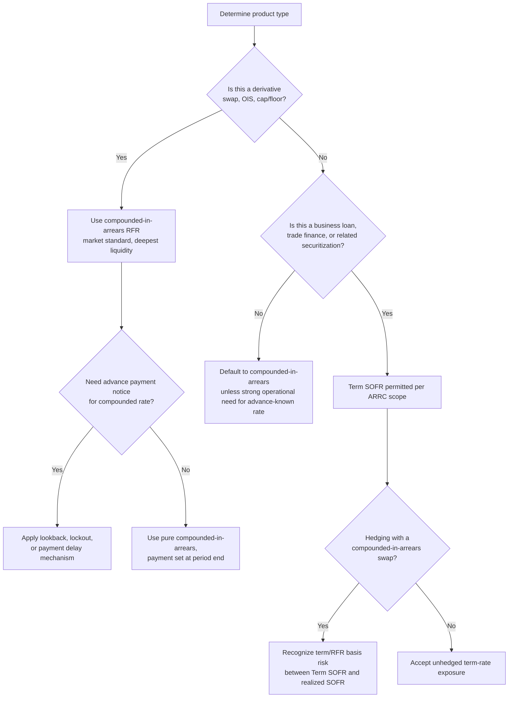

## Compounded in Arrears Versus Term Rate Conventions

### Overview

The shift from LIBOR to risk-free rates (RFRs) forced the market to choose between two fundamentally different mechanisms for converting an overnight rate into a rate applicable to a term interest period: **compounding in arrears** (the dominant convention for derivatives) and **forward-looking term rates** (used selectively in cash products). These conventions differ in when the rate is known, how convexity and averaging effects manifest, and their suitability for different product types. Understanding the mechanics, trade-offs, and appropriate use cases of each is central to post-reform derivatives pricing, risk management, and operational infrastructure.

**Key Points**

- Compounded in arrears uses the realized daily path of the overnight rate over the interest period itself, so the final rate is only fully known at (or very near) period end.
- Term rates (e.g., Term SOFR) are forward-looking, derived from futures/OIS markets, and known at the start of the period — structurally similar to LIBOR's timing but without LIBOR's credit-sensitivity and underlying transaction concerns.
- Regulatory guidance (notably from the ARRC) explicitly scoped Term SOFR usage away from the derivatives market to preserve liquidity concentration in compounded-in-arrears SOFR.

---

### Compounded in Arrears: Mechanics

The compounded-in-arrears rate for a period of $n$ business days is:

$$\left(1 + R_{compound}\right) = \prod_{i=1}^{n} \left(1 + \frac{r_i \times d_i}{\text{Basis}}\right)$$

$$R_{compound} = \left[\prod_{i=1}^{n} \left(1 + \frac{r_i \times d_i}{\text{Basis}}\right) - 1\right] \times \frac{\text{Basis}}{D}$$

where:

- $r_i$ = the overnight RFR fixing applicable on business day $i$
- $d_i$ = number of calendar days that fixing applies (1 for a standard business day, 3 over a weekend when the Friday fixing carries through Saturday/Sunday)
- $\text{Basis}$ = day count convention denominator (360 for SOFR, 365 for SONIA/€STR)
- $D$ = total calendar days in the period (used to annualize back to a period rate)

**Worked Example (SOFR, 5-business-day period spanning a weekend):**

| Day | Date | SOFR Fixing | Days Applied ($d_i$) |
| --- | --- | --- | --- |
| 1 | Mon | 5.30% | 1 |
| 2 | Tue | 5.31% | 1 |
| 3 | Wed | 5.29% | 1 |
| 4 | Thu | 5.32% | 1 |
| 5 | Fri | 5.30% | 3 (covers Fri, Sat, Sun) |

$$\prod = \left(1+\frac{0.0530}{360}\right)\left(1+\frac{0.0531}{360}\right)\left(1+\frac{0.0529}{360}\right)\left(1+\frac{0.0532\times1}{360}\right)\left(1+\frac{0.0530\times3}{360}\right)$$

Each daily factor is tiny (on the order of $1.00015$), and the product minus 1, scaled by $360/D$, gives the effective period rate — in this example, very close to the simple average of the daily fixings, since the compounding effect over such short periods is a second-order effect.

**Key mechanical properties:**

- **Rate is unknown until the period (nearly) ends** — this is the defining operational challenge. Since most of the compounding path occurs before the final day's fixing is known, market participants use **lookback**, **lockout**, or **payment delay** mechanisms (see prior benchmark transition material) to give borrowers/payers advance notice of the payment amount.
- **Convexity is minimal but non-zero:** [Verified] Because interest-on-interest (compounding) accrues within the period, the compounded rate is technically a nonlinear function of the daily fixings, though for typical short tenors (up to 3 months) and normal rate levels, the difference between the compounded rate and the simple arithmetic average of daily fixings is small — typically a few tenths of a basis point to low single-digit basis points, growing with tenor length and rate level.
- **Path-dependency:** The realized compounded rate depends on the exact sequence and weighting of daily fixings, not just the average level, meaning volatility of the daily rate (e.g., quarter-end SOFR spikes) can have an outsized effect on the period's realized rate if the spike coincides with a heavily weighted day (e.g., a Friday fixing carrying 3 days' weight).

---

### Term Rate Conventions: Mechanics

A term rate is fixed once, at the start of the interest period, and applies unchanged for the full period — replicating LIBOR's operational timing.

**Term SOFR construction:** [Verified] CME Group's Term SOFR Reference Rates are calculated using volumes and traded prices from the SOFR futures market (particularly 1-month and 3-month SOFR futures), using a model that infers the market's expectation of average daily SOFR over the relevant forward period.

$$\text{Term SOFR}_{T} \approx f\left(\text{SOFR futures prices for contracts spanning period } T\right)$$

This is fundamentally an expectations-based, market-implied construction — it reflects what the market currently expects compounded SOFR to average over the future period, not a guaranteed realized outcome. If realized SOFR over that period differs from what futures implied at the start, Term SOFR and the eventual realized compounded SOFR for the same period will diverge.

**Publication:** Term SOFR is published each business day for 1M, 3M, 6M, and 12M tenors, licensed and administered by CME Group Benchmark Administration Limited, endorsed by the ARRC as the recommended forward-looking term rate for scoped use cases.

**Scoped use cases (per ARRC recommendation):** [Verified] The ARRC's recommended scope for Term SOFR usage centers on business loans (particularly multi-lender syndicated facilities, middle-market loans, and trade finance), and securitizations of assets that reference such loans — explicitly *not* the broad derivatives market, in order to prevent liquidity fragmentation away from compounded-in-arrears SOFR, which the official sector wanted to remain the primary derivatives benchmark to preserve deep, liquid OIS and swap markets.

---

### Comparative Mechanics Table

| Dimension | Compounded in Arrears | Term Rate (e.g., Term SOFR) |
| --- | --- | --- |
| Timing of rate certainty | Known at/near period end | Known at period start |
| Construction basis | Actual realized daily overnight fixings | Market-implied expectation from futures/OIS |
| Convexity/path dependency | Present (small, tenor/level dependent) | Not applicable (single fixed rate for period) |
| Primary use case | Derivatives (swaps, OIS), most FRNs | Business loans, trade finance, some securitizations |
| Operational complexity for payer | Higher (requires lookback/lockout for advance notice) | Lower (payment known in advance, like legacy LIBOR) |
| Liquidity depth (post-transition) | Very deep (core derivatives market convention) | Narrower, concentrated in loan-referencing use cases |
| Basis risk to underlying RFR | None (rate directly derived from realized RFR path) | Present (term rate can diverge from realized compounded RFR) |

---

### Basis Risk Between the Two Conventions

Because Term SOFR is a forward-looking market expectation while compounded-in-arrears SOFR is the realized outcome, a **basis** exists between the two, particularly in periods of unexpected monetary policy moves.

$$\text{Term Basis}_T = \text{Term SOFR}_{T} - \text{Realized Compounded SOFR}_{T}$$

**Example:** If Term SOFR for a 3-month period is fixed at 5.25% based on futures pricing that anticipated stable Fed policy, but the Fed unexpectedly cuts rates mid-period, realized compounded SOFR over that same period might average only 5.05% (as daily fixings drift lower following the cut). A borrower on a Term SOFR loan pays the higher, pre-fixed 5.25% regardless, while a counterparty on a compounded-in-arrears swap for the same notional period would have paid/received based on the lower realized 5.05% — creating a mismatch for any entity attempting to hedge a Term SOFR loan with a compounded-in-arrears swap (a common hedging structure for corporate borrowers), known as **term/RFR basis risk**.

This basis risk is a key reason many corporate borrowers with Term SOFR loans and compounded-SOFR-based hedges must accept some degree of unhedgeable timing/convexity mismatch, or seek increasingly available Term SOFR-referencing swaps from dealers (at a cost/spread reflecting the dealer's own basis risk in warehousing that mismatch).

---

### Convexity Adjustment in Compounded Rates

For longer tenors or higher rate environments, the difference between the true compounded rate and the simple average of daily fixings becomes more material, requiring what practitioners term a convexity adjustment when approximating compounded rates using simpler averaging methods for risk or pricing shortcuts.

$$R_{compound} \approx \bar{r} + \frac{1}{2}\text{Var}(r) \times \text{Basis} \times (\text{approx. adjustment factor})$$

where $\bar{r}$ is the simple average of daily fixings. [Unverified — approximation, not exact formula] This is a first-order approximation; exact treatment requires computing the full compounding product, and the materiality of the adjustment depends on both the level of rates and their day-to-day volatility over the period — it is generally negligible for short tenors in low-volatility rate environments but can matter more for longer periods or during periods of significant rate volatility (e.g., around monetary policy inflection points).

---

### Diagram: Rate Timing Comparison (svg_diagram)

<svg xmlns="http://www.w3.org/2000/svg" viewBox="0 0 780 360" font-family="Arial, sans-serif">
<text x="390" y="26" font-size="18" font-weight="bold" text-anchor="middle">Rate Timing: Term Rate vs. Compounded in Arrears (svg_diagram)</text>

<text x="60" y="65" font-size="13" font-weight="bold">Term Rate (e.g., Term SOFR)</text>

<line x1="60" y1="90" x2="700" y2="90" stroke="#333" stroke-width="1.5" />

<circle cx="80" cy="90" r="6" fill="`#1a56db`" />

<text x="80" y="112" font-size="11" text-anchor="middle">Period Start:</text>

<text x="80" y="126" font-size="11" text-anchor="middle">Rate FIXED here</text>

<line x1="80" y1="90" x2="680" y2="90" stroke="`#1a56db`" stroke-width="5" />

<text x="380" y="112" font-size="11" text-anchor="middle" fill="`#1a56db`">Fixed rate applies unchanged for full period</text>

<polygon points="675,84 690,90 675,96" fill="`#1a56db`" />

<text x="60" y="180" font-size="13" font-weight="bold">Compounded in Arrears (e.g., SOFR)</text>

<line x1="60" y1="205" x2="700" y2="205" stroke="#333" stroke-width="1.5" />

<g>

<rect x="80" y="197" width="34" height="16" fill="`#c0392b`" opacity="0.55" />

<rect x="118" y="197" width="34" height="16" fill="`#c0392b`" opacity="0.65" />

<rect x="156" y="197" width="34" height="16" fill="`#c0392b`" opacity="0.5" />

<rect x="194" y="197" width="34" height="16" fill="`#c0392b`" opacity="0.75" />

<rect x="232" y="197" width="34" height="16" fill="`#c0392b`" opacity="0.6" />

<rect x="270" y="197" width="34" height="16" fill="`#c0392b`" opacity="0.7" />

<text x="192" y="235" font-size="11" text-anchor="middle">Each day's fixing compounds progressively</text>

</g>

<circle cx="680" cy="205" r="6" fill="`#c0392b`" />

<text x="680" y="225" font-size="11" text-anchor="middle" fill="`#c0392b`">Period End:</text>

<text x="680" y="239" font-size="11" text-anchor="middle" fill="`#c0392b`">Rate finally KNOWN</text>

<rect x="80" y="270" width="600" height="70" rx="8" fill="#f4f4f4" stroke="#555" />
<text x="380" y="293" font-size="12" text-anchor="middle" font-weight="bold">Practical consequence:</text>
<text x="380" y="313" font-size="11" text-anchor="middle">Term rate borrowers know payment in advance;</text>
<text x="380" y="328" font-size="11" text-anchor="middle">compounded-in-arrears payers need lookback/lockout for advance notice</text>
</svg>

---

### Convention Selection Decision Flow

---

### Practical Considerations

- **Documentation impact:** ISDA's published definitions (the 2021 ISDA Interest Rate Derivatives Definitions) formalized standard compounded-in-arrears calculation mechanics, including specified lookback periods and business day conventions, providing the legal and operational template the market converged on for RFR-referencing derivatives.
- **Systems requirements:** [Unverified — institution-dependent] Firms operating compounded-in-arrears products generally need daily rate-capture and running-compounding calculation capability integrated into treasury/loan servicing systems, a materially different operational build compared to the single-fixing-per-period model that sufficed under LIBOR or Term SOFR.
- **Regulatory monitoring of Term Rate scope creep:** [Verified] The ARRC and other official sector bodies have continued to monitor and discourage expansion of Term SOFR usage beyond its recommended scope, given concerns that broader adoption in derivatives markets could undermine the liquidity and robustness of the compounded-in-arrears SOFR derivatives market that underpins Term SOFR's own construction (a circularity concern, since Term SOFR is derived from SOFR futures/OIS, which themselves depend on a liquid compounded-in-arrears-referencing derivatives market).

**Related Topics**

- Lookback, Lockout, and Payment Delay Mechanisms in RFR Products
- ISDA 2021 Interest Rate Derivatives Definitions
- SOFR Futures Market Structure and Term Rate Derivation
- Convexity Adjustments in Backward-Looking Rate Products
- Term/RFR Basis Risk in Loan-Swap Hedging Structures
- Credit Sensitive Rate Alternatives and Term Rate Demand Drivers