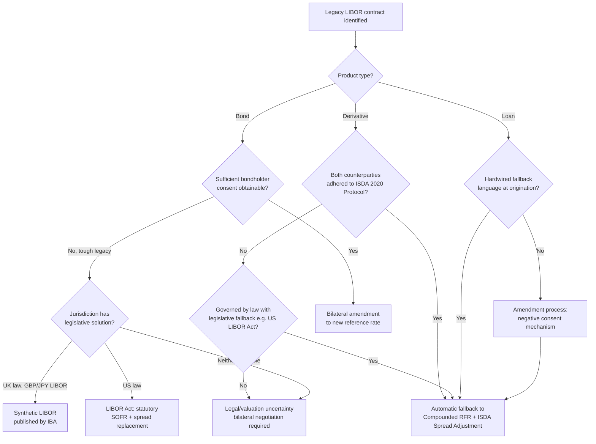

## Legacy Contract Fallback Language

### Overview

Legacy contract fallback language refers to the contractual provisions specifying what interest rate benchmark applies if the originally referenced rate (LIBOR) becomes unavailable, is discontinued, or is deemed non-representative. Because the vast majority of pre-2018 LIBOR-referencing contracts — derivatives, loans, bonds, and securitizations — were drafted under the assumption that LIBOR was a permanent fixture, most fallback provisions were either absent, poorly specified, or designed only for temporary disruptions rather than permanent cessation. Remediating this "fallback gap" across trillions of dollars of legacy exposure required a coordinated, multi-track industry and legislative effort spanning derivatives (via ISDA), loans (via LSTA/LMA-style amendments), bonds, and, for intractable cases, statutory intervention.

**Key Points**

- Pre-reform fallback language typically referenced either "the last published LIBOR rate" (economically nonsensical for permanent cessation) or a polling/survey mechanism among reference banks that was operationally unworkable at scale.
- The market response bifurcated into three remediation tracks: (1) bilateral/multilateral contractual amendment (protocols), (2) new issuance with robust pre-drafted fallback language (ARRC/ISDA recommended language), and (3) legislative solutions for "tough legacy" contracts with no amendment path.
- The core technical mechanism across nearly all tracks was: replace the IBOR with the applicable RFR compounded in arrears, plus a fixed historical median spread adjustment.

---

### The Fallback Gap Problem

**Original (pre-reform) fallback language typically fell into two flawed categories:**

1. **"Last published rate" fallbacks:** Many legacy contracts specified that if LIBOR were unavailable on a given day, the calculation agent should use the last available published LIBOR rate. [Verified] This mechanism was designed for short, temporary disruptions (e.g., a single day's publication failure), and applying it to a permanent cessation would effectively convert a floating-rate instrument into a fixed-rate instrument frozen at whatever the last published LIBOR level happened to be — an outcome inconsistent with the original economic intent of either counterparty.
2. **Reference bank polling fallbacks:** Some contracts specified that if LIBOR ceased, the calculation or fiscal agent should survey a panel of reference banks for indicative interbank lending rates and use the resulting rate. This mechanism assumed that banks would continue to be willing and able to provide indicative quotes in a market where actual interbank lending had structurally declined — the same underlying problem that made LIBOR unreliable in the first place — rendering it operationally unworkable for large-scale, permanent replacement.
3. **No fallback language at all:** A substantial population of legacy contracts, particularly older bonds and structured notes, contained no explicit fallback mechanism whatsoever, leaving resolution to interpretation, litigation risk, or the intervention of an agent acting under general contractual discretion clauses (where such clauses existed).

**Scale of the problem:** [Verified] At the time LIBOR transition planning accelerated, market estimates placed total USD LIBOR-referencing exposure alone in the hundreds of trillions of dollars of notional across derivatives, loans, bonds, securitizations, and mortgages, with a meaningful subset — commonly termed "tough legacy" contracts — having no practicable means of being amended before LIBOR's cessation, due to the sheer number of dispersed bondholders, absence of consent mechanisms, or contracts governed by law that made unilateral amendment impossible.

---

### Track 1: The ISDA 2020 IBOR Fallbacks Protocol (Derivatives)

**Purpose:** To amend the fallback provisions of legacy derivatives contracts referencing LIBOR and other IBORs (across currencies) to point to the compounded RFR plus a spread adjustment, upon a defined trigger event.

**Mechanism:** [Verified] Rather than requiring bilateral renegotiation of each individual contract, ISDA published a multilateral protocol that market participants could adhere to once; upon two counterparties both adhering, all existing derivatives contracts governed by the relevant ISDA Definitions between them were deemed amended to incorporate the new fallback provisions, without needing to renegotiate each trade individually.

**Trigger events for fallback activation:**

1. **Permanent cessation:** A public statement by the regulatory supervisor of the benchmark administrator, the administrator itself, or an insolvency/resolution authority announcing that the benchmark has ceased or will cease permanently, with no successor administrator.
2. **Non-representativeness ("pre-cessation" trigger):** A public statement by the relevant regulatory supervisor (e.g., the FCA for LIBOR) that the benchmark is no longer representative of the underlying market it is intended to measure, even if still technically published (this addressed the specific situation of "synthetic LIBOR," which continued to be published for legacy contracts but was explicitly declared non-representative).

**Fallback formula upon trigger:**

$$\text{Fallback Rate} = \text{Adjusted RFR}_{\text{compounded in arrears}} + \text{Spread Adjustment}$$

**Spread Adjustment methodology:** As detailed in benchmark transition material, the spread adjustment for each currency/tenor combination was fixed as the historical **median** of the difference between the relevant IBOR and the compounded RFR over a trailing 5-year lookback period, calculated and published by Bloomberg (acting as ISDA's designated vendor) once the relevant cessation/non-representativeness trigger was confirmed, becoming a permanently fixed value from that point forward (not a floating or re-calculated spread).

$$\text{Spread}_{ccy,tenor} = \text{median}\left(\text{IBOR}_{t} - \text{RFR}_{compounded,t}\right)_{t \in [\text{trigger date} - 5\text{y}, \text{trigger date}]}$$

**Adoption mechanics:** Adherence to the protocol was opt-in but strongly encouraged by regulators; [Verified] a substantial majority of active derivatives market participants, including virtually all major dealers, adhered to the protocol ahead of the relevant LIBOR cessation dates, given that non-adherence risked significant valuation and legal uncertainty on affected legacy trades. For counterparties that did not adhere bilaterally, many jurisdictions' legislative fallback provisions were designed to produce an economically equivalent outcome by statute.

---

### Track 2: Loan Market Fallback Language (LSTA / LMA)

**Cash market complexity:** Loan market fallback remediation was more operationally complex than derivatives, since syndicated loans typically require **lender consent** (often majority or supermajority lender consent, sometimes unanimous, depending on the specific amendment provision) to change the reference rate — a structurally harder coordination problem than a bilateral ISDA protocol adherence.

**ARRC "Hardwired" vs. "Amendment" approach:**

- **Hardwired approach:** New loan agreements were drafted with pre-specified fallback language identifying the exact successor rate (Term SOFR, then compounded SOFR in arrears as a further fallback, then a final fallback to a rate selected by the administrative agent) and spread adjustment (using the same ISDA-published spread adjustment values) built directly into the loan documentation at origination — meaning no further amendment or consent process would be needed when LIBOR ceased, since the mechanism was already contractually specified.
- **Amendment approach:** Older loan agreements without hardwired fallback language required an active amendment process, typically permitting the administrative agent and borrower to select a replacement rate (subject to a negative consent mechanism, where lenders had a set period to object, rather than requiring affirmative majority approval) — a mechanism designed by LSTA/ARRC specifically to overcome collective action problems in getting explicit consent from large, dispersed syndicate groups.

**LMA (Loan Market Association) — UK/European loan market:** Adopted broadly analogous rate switch mechanisms tailored to SONIA and other applicable RFRs, similarly moving from earlier "screen rate replacement" clauses (designed for temporary unavailability) toward more robust, purpose-built RFR transition clauses in template loan documentation.

---

### Track 3: Bond Market Fallback Language

**New issuance:** Post-reform bond issuance (FRNs, structured notes) incorporated standardized fallback language, generally modeled on ARRC-recommended provisions, specifying an unambiguous waterfall: attempt to use a replacement rate selected by a relevant governmental body (e.g., the Federal Reserve or NY Fed for USD), failing that, a rate recommended by the ARRC, failing that, a rate determined by an ISDA-based fallback methodology, with an appropriate spread adjustment applied at each step.

**Legacy bonds — the core "tough legacy" problem:** [Verified] Many legacy bonds and structured notes, particularly older securitizations and retail structured products, had bondholder bases too large and dispersed to feasibly obtain the contractually required consent threshold (often requiring unanimous or supermajority bondholder consent under the bond's governing indenture) to amend the reference rate before LIBOR's cessation — this population became the primary target of subsequent legislative intervention.

---

### Track 4: Legislative Solutions for Tough Legacy Contracts

**United States — the Adjustable Interest Rate (LIBOR) Act:** [Verified] Enacted as federal legislation in March 2022, the LIBOR Act provided that for contracts governed by US law that referenced USD LIBOR and either had no fallback provision or had a fallback provision that would result in a rate determined by reference banks or by LIBOR itself (an unworkable fallback), such contracts would, by operation of law, transition to a Board of Governors of the Federal Reserve-selected benchmark replacement — namely, compounded SOFR in arrears plus the applicable ISDA-published spread adjustment — without requiring any further consent, amendment, or affirmative action by the contracting parties.

**New York State legislation:** Prior to the federal LIBOR Act, New York enacted its own state-level legislation with a substantially similar mechanism, applicable to New York law-governed contracts, which the subsequent federal legislation was designed to complement and, in relevant respects, supersede/harmonize with at the national level.

**United Kingdom — Synthetic LIBOR:** [Verified] Rather than a direct legislative override of contract terms, the UK's FCA used its powers under the UK Benchmarks Regulation (as amended by the Financial Services Act 2021) to compel the LIBOR administrator (ICE Benchmark Administration) to continue publishing a "synthetic" version of certain LIBOR settings (GBP and JPY, for specified tenors) for a defined wind-down period, calculated using the same compounded RFR-plus-spread-adjustment methodology as the ISDA fallback. This allowed tough legacy contracts that literally referenced "LIBOR" by name to continue functioning operationally — the contract still technically referenced LIBOR, but the published value of "LIBOR" itself had been administratively redefined to track the RFR-based replacement economically.

**Key distinction between the two legislative approaches:** [Unverified — comparative legal characterization] The US approach operates by legislatively replacing the reference rate in the contract itself, while the UK approach operates by redefining what the published benchmark called "LIBOR" actually represents — both are designed to produce an economically similar outcome (an RFR-plus-spread-based rate) but via different legal mechanisms, which may carry different implications in cross-border disputes or under differing governing law analyses.

---

### The Bloomberg Fallback Rate Publication Infrastructure

Bloomberg Index Services Limited was designated by ISDA to calculate and publish, on an ongoing daily basis (once triggered), the values needed to operationalize fallbacks:

- **Fallback Rate (compounded RFR component)** for each currency/tenor
- **Spread Adjustment** (fixed, one-time value per currency/tenor, published upon the relevant trigger event)
- **Adjusted Fallback Rate** (the sum of the two — the actual all-in rate legacy contracts fall back to)

This infrastructure is what allows legacy contracts, upon triggering their fallback provisions (whether via ISDA protocol adherence, hardwired loan language, or legislative mandate), to reference a single, consistently calculated, publicly available fallback rate rather than each calculation agent needing to independently compute compounded RFR paths and apply spread adjustments themselves.

---

### Fallback Remediation Flow

---

### Diagram: Fallback Waterfall Structure (svg_diagram)

<svg xmlns="http://www.w3.org/2000/svg" viewBox="0 0 760 400" font-family="Arial, sans-serif">
<text x="380" y="28" font-size="18" font-weight="bold" text-anchor="middle">Typical Fallback Waterfall (svg_diagram)</text>
<rect x="60" y="55" width="640" height="55" rx="8" fill="#e8f0fe" stroke="#1a56db" stroke-width="2" />
<text x="380" y="88" font-size="13" text-anchor="middle" font-weight="bold">Step 1: Government-selected replacement rate (if designated)</text>
<line x1="380" y1="110" x2="380" y2="130" stroke="#555" stroke-width="1.5" marker-end="url(#arrowdown)" />
<rect x="60" y="130" width="640" height="55" rx="8" fill="#eaf4ea" stroke="#2e7d32" stroke-width="2" />
<text x="380" y="163" font-size="13" text-anchor="middle" font-weight="bold">Step 2: ARRC/Industry body-recommended rate</text>
<line x1="380" y1="185" x2="380" y2="205" stroke="#555" stroke-width="1.5" marker-end="url(#arrowdown)" />
<rect x="60" y="205" width="640" height="55" rx="8" fill="#fff8e1" stroke="#b8860b" stroke-width="2" />
<text x="380" y="238" font-size="13" text-anchor="middle" font-weight="bold">Step 3: ISDA fallback — Compounded RFR + Spread Adjustment</text>
<line x1="380" y1="260" x2="380" y2="280" stroke="#555" stroke-width="1.5" marker-end="url(#arrowdown)" />
<rect x="60" y="280" width="640" height="55" rx="8" fill="#fdecea" stroke="#c0392b" stroke-width="2" />
<text x="380" y="313" font-size="13" text-anchor="middle" font-weight="bold">Step 4: Calculation/Determining Agent discretion (last resort)</text>
<text x="380" y="365" font-size="11" text-anchor="middle" font-style="italic">Actual step order and inclusion vary by product type and governing documentation</text>

</svg>

---

### Practical Considerations

- **Cross-default and netting implications:** [Unverified — documentation-specific] Because derivatives are frequently subject to cross-default and close-out netting provisions across an entire ISDA Master Agreement relationship, ensuring consistent fallback treatment across all trades with a given counterparty was important to avoid inadvertent triggering of default-related provisions due to rate calculation disputes — a key reason for the strong regulatory push toward broad, early protocol adherence rather than a patchwork of bilateral outcomes.
- **Valuation impact at trigger:** The point at which a legacy contract's fallback provision actually triggers (whether via protocol, hardwired language, or legislation) can create a one-time valuation shift, since the replacement rate (RFR + fixed historical spread) will generally not exactly match the market's forward-looking expectation of what LIBOR would have been, requiring careful documentation of amendment effective dates and, in some derivatives cases, cash compensation mechanisms.
- **Ongoing monitoring for residual tough legacy contracts:** Even after the primary legislative and protocol mechanisms took effect, certain jurisdictions and product types continued (and in some cases continue) to require monitoring for edge cases not clearly captured by existing legislative or protocol frameworks, particularly contracts governed by non-US, non-UK law with no equivalent legislative fallback mechanism.

**Related Topics**

- ISDA 2020 IBOR Fallbacks Protocol Adherence Mechanics
- ARRC Hardwired vs. Amendment Approach in Syndicated Loans
- Synthetic LIBOR Publication and Wind-Down Timeline
- Bloomberg Fallback Rate and Spread Adjustment Publication
- Cross-Default and Netting Provisions in ISDA Master Agreements
- Tough Legacy Contract Identification and Remediation Strategy
- Comparative Legislative Approaches: US LIBOR Act vs. UK Synthetic LIBOR