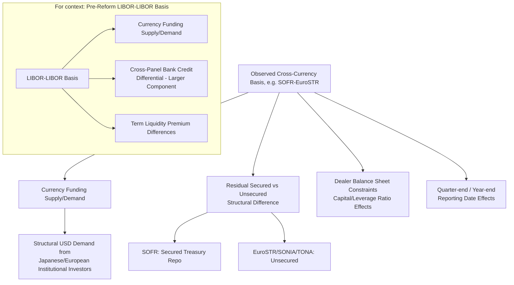

## Cross-Currency Basis After Benchmark Reform

### Overview

Cross-currency basis refers to the spread that must be added to one leg of a cross-currency swap to equate the value of borrowing in one currency versus another, reflecting deviations from covered interest rate parity driven by supply/demand imbalances in currency funding markets rather than pure interest rate differentials. The transition from LIBOR to RFRs fundamentally altered the plumbing of cross-currency basis swaps: the floating legs that were once benchmarked to credit-sensitive, forward-looking LIBOR rates in each currency are now benchmarked to near-risk-free, backward-looking overnight rates (SOFR, SONIA, €STR, TONA, SARON), changing both the economic content of the basis and the operational mechanics of computing and hedging it.

**Key Points**

- Pre-reform cross-currency basis (the "LIBOR-LIBOR basis") embedded a mix of pure funding/liquidity basis and relative bank credit risk differentials across currency panels.
- Post-reform cross-currency basis (the "RFR-RFR basis," e.g., SOFR-SONIA basis) strips out most cross-currency bank credit differentials, since RFRs are (mostly) near risk-free, leaving a basis driven predominantly by structural currency funding supply/demand (e.g., FX hedging demand from Japanese life insurers, European bank USD funding needs).
- The mechanics of exchanging compounded-in-arrears floating legs in a cross-currency swap introduce additional structuring considerations (payment timing, compounding period alignment) not present in the LIBOR-LIBOR swap era.

---

### What Cross-Currency Basis Represents

Under covered interest rate parity (CIP), the forward FX rate should be fully determined by the spot rate and the interest rate differential between two currencies, with no arbitrage opportunity. In practice, CIP has persistently failed to hold exactly since the 2008 financial crisis, and the cross-currency basis swap market exists precisely to price this deviation.

$$\text{Cross-Currency Basis} = r_{foreign,floating} - \left(r_{domestic,floating} - \text{implied FX forward premium/discount}\right)$$

More concretely, in a standard cross-currency basis swap (e.g., EUR/USD), one party pays €STR (or EURIBOR, pre-reform) flat, and the other pays SOFR (or USD LIBOR, pre-reform) plus or minus a basis spread, with an exchange of notional at inception and maturity at the prevailing spot FX rate.

$$\text{USD leg: } SOFR + b$$

$$\text{EUR leg: } \text{€STR (flat)}$$

where $b$ is the cross-currency basis spread (commonly quoted in basis points), which can be positive or negative depending on relative currency funding demand.

**Example:** If the 5-year EUR/USD cross-currency basis is quoted at -20bps (meaning USD is more expensive to borrow via the FX-swap-implied route than via direct USD funding, a common post-2008 pattern reflecting persistent USD funding demand from non-US banks), a European bank swapping EUR funding into USD via a cross-currency basis swap would pay SOFR minus 20bps... [Verified] the specific sign convention (which currency's leg carries the spread and in which direction) varies by market convention and dealer quoting practice, but the economic principle is that a more negative basis reflects greater relative demand to borrow the currency on the "flat" side of the quote.

---

### Pre-Reform vs. Post-Reform Basis Composition

**Pre-reform (LIBOR-LIBOR basis):** The LIBOR-LIBOR cross-currency basis embedded multiple overlapping effects:

1. Pure currency funding supply/demand (the "true" CIP deviation)
2. Relative credit risk differentials between the LIBOR panel banks of each currency (e.g., if USD LIBOR panel banks were perceived as relatively riskier than JPY LIBOR panel banks at a point in time, this would show up partially embedded in the LIBOR-LIBOR basis)
3. Term liquidity premium differences between currencies' interbank markets

**Post-reform (RFR-RFR basis):** Because RFRs are, by design, close to risk-free and largely reflect either secured (SOFR, SARON) or broad, well-collateralized unsecured (SONIA, €STR, TONA) overnight funding markets, [Unverified — decomposition is a market interpretation, not a directly observable split] the RFR-RFR basis is generally understood by market participants to more purely reflect currency funding supply/demand dynamics, with a substantially reduced (though not necessarily zero) credit-differential component compared to the legacy LIBOR-LIBOR basis, since even RFRs are not perfectly identical in credit character (SOFR is secured, while SONIA/€STR/TONA remain unsecured, meaning some residual secured-vs-unsecured effect persists in the cross-currency comparison).

---

### The Two-Layer Basis Problem: IBOR Basis + Cross-Currency Basis

During the multi-year transition period, and to a lesser extent in ongoing legacy contract management, market participants had to think about cross-currency exposure as involving two distinct, stackable basis effects:

1. **Intra-currency IBOR-to-RFR basis:** The LIBOR-SOFR basis swap (within USD), or EURIBOR-€STR basis (within EUR), reflecting the spread between the legacy IBOR and the new RFR within the same currency.
2. **Cross-currency RFR-RFR basis:** The SOFR-SONIA, SOFR-€STR, SOFR-TONA basis reflecting the currency funding differential between RFRs across currencies.

A market participant needing to convert a legacy EURIBOR-referencing EUR exposure into a SOFR-referencing USD exposure during the transition period might have needed to combine both an EURIBOR-€STR basis swap and a €STR-SOFR cross-currency basis swap (or transact a combined structure), rather than a single direct instrument, since liquid, directly quoted EURIBOR-SOFR cross-currency swaps were less standard than the RFR-RFR combination.

---

### CCP Discounting Transition and Its Effect on Cross-Currency Basis

The CCP (LCH, CME) switch of price alignment interest (PAI) and discounting from Fed Funds Effective Rate to SOFR for cleared USD swaps (October 2020), and analogous discounting curve changes in other currencies as their own RFR-based OIS markets matured, required a full re-basing of cross-currency swap valuation curves.

[Verified] This discounting transition was managed by the CCPs as a one-time valuation event with associated cash compensation mechanisms, since a change in discounting curve for a large book of existing cross-currency and single-currency swaps produces an immediate, mechanical shift in present value even though the actual contractual cash flows of the underlying trades were unchanged — the market coordinated this as a "big bang" style conversion specifically to avoid ongoing, cumulative valuation disputes between counterparties using inconsistent discounting curves for the same cleared trade population.

---

### Compounding Timing Alignment in Cross-Currency Swaps

A structural nuance introduced by the shift to compounded-in-arrears RFRs on both legs of a cross-currency swap is the need to align (or explicitly manage misalignment of) the compounding periods, lookback conventions, and payment dates across two different currencies, each potentially following different market-standard lookback/lockout conventions and holiday calendars.

**Example of the alignment challenge:** A USD/JPY cross-currency swap exchanging compounded SOFR (in arrears, with a standard US lookback convention and USD holiday calendar) against compounded TONA (in arrears, with a Japanese lookback convention and JPY holiday calendar) requires careful specification of:

- Whether the two legs' interest periods start/end on the same calendar dates (a non-trivial question when US and Japanese holiday calendars diverge)
- How each leg's respective lookback period is defined relative to that leg's own payment date
- Reset and payment date conventions when one currency's business day calendar has a holiday that the other does not

[Unverified — documentation-specific] The 2021 ISDA Interest Rate Derivatives Definitions provide standardized templates for handling these cross-currency compounding alignment issues, though specific trade confirmations may still require bespoke negotiation for unusual currency pairs or non-standard tenors.

---

### Basis Behavior and Drivers Post-Reform

**Persistent structural demand drivers for cross-currency basis (largely unchanged by benchmark reform, since these reflect balance-sheet and regulatory-driven behavior rather than benchmark mechanics):**

- Japanese and European institutional investors (life insurers, pension funds) with USD-denominated asset portfolios and domestic-currency liabilities generate structural demand to swap domestic currency into USD via FX swaps and cross-currency basis swaps, a long-standing driver of the negative USD cross-currency basis versus JPY and EUR.
- Post-crisis bank regulatory capital and leverage ratio constraints affect dealer balance sheet capacity to intermediate cross-currency basis trades, contributing to basis volatility particularly around quarter-end and year-end reporting dates.

**Reform-specific new considerations:**

- [Unverified — evolving market structure] With SOFR's secured nature (repo-based) differing from the unsecured character of SONIA, €STR, and TONA, some market participants and analysts have discussed whether this asymmetry in underlying market structure introduces a modest, structurally distinct component into RFR-RFR cross-currency basis relative to what a fully "like-for-like" unsecured-to-unsecured basis would show, though isolating and quantifying this effect precisely from the dominant funding-supply-demand drivers is analytically difficult and not a settled, universally quantified market view.

---

### Diagram: Cross-Currency Basis Swap Structure Post-Reform (svg_diagram)

<svg xmlns="http://www.w3.org/2000/svg" viewBox="0 0 780 400" font-family="Arial, sans-serif">
<text x="390" y="28" font-size="18" font-weight="bold" text-anchor="middle">EUR/USD Cross-Currency Basis Swap, Post-Reform (svg_diagram)</text>
<rect x="40" y="70" width="180" height="90" rx="8" fill="#e8f0fe" stroke="#1a56db" stroke-width="2" />
<text x="130" y="105" font-size="14" text-anchor="middle" font-weight="bold">European Bank</text>
<text x="130" y="125" font-size="12" text-anchor="middle">Funds in EUR</text>
<text x="130" y="143" font-size="12" text-anchor="middle">Needs USD funding</text>
<rect x="540" y="70" width="180" height="90" rx="8" fill="#fdecea" stroke="#c0392b" stroke-width="2" />
<text x="630" y="105" font-size="14" text-anchor="middle" font-weight="bold">USD Counterparty</text>
<text x="630" y="125" font-size="12" text-anchor="middle">Funds in USD</text>
<text x="630" y="143" font-size="12" text-anchor="middle">Needs EUR funding</text>

<text x="380" y="60" font-size="12" text-anchor="middle" font-style="italic">Notional exchange at inception (spot FX) and maturity</text>

<line x1="220" y1="95" x2="540" y2="95" stroke="#1a56db" stroke-width="2" marker-end="url(#a1)" />
<text x="380" y="88" font-size="11" text-anchor="middle" fill="#1a56db">Pays compounded EuroSTR (flat)</text>
<line x1="540" y1="140" x2="220" y2="140" stroke="#c0392b" stroke-width="2" marker-end="url(#a2)" />
<text x="380" y="158" font-size="11" text-anchor="middle" fill="#c0392b">Pays compounded SOFR + basis spread b</text>
<rect x="150" y="200" width="460" height="130" rx="8" fill="#f4f4f4" stroke="#555" stroke-width="1.5" />
<text x="380" y="225" font-size="12" text-anchor="middle" font-weight="bold">Post-reform structural change vs. LIBOR-LIBOR era:</text>
<text x="380" y="248" font-size="11" text-anchor="middle">Both legs now compounded-in-arrears RFRs</text>
<text x="380" y="266" font-size="11" text-anchor="middle">Basis spread b reflects funding supply/demand,</text>
<text x="380" y="284" font-size="11" text-anchor="middle">with reduced (not eliminated) cross-currency</text>
<text x="380" y="302" font-size="11" text-anchor="middle">bank credit differential vs. legacy LIBOR-LIBOR basis</text>
<text x="380" y="320" font-size="10" text-anchor="middle" font-style="italic">Compounding period alignment across currencies required</text>
</svg>

---

### Basis Decomposition Flow

---

### Practical Considerations

- **Hedge effectiveness re-assessment:** [Unverified — portfolio-specific] Institutions that had historically hedged cross-currency exposure using LIBOR-LIBOR basis swaps needed to reassess hedge effectiveness and potentially restructure hedge portfolios as legacy positions rolled off or were amended into RFR-RFR referencing structures, since the risk factors driving basis P&L shifted in composition even if the notional hedge relationship remained directionally similar.
- **Curve-building complexity:** Multi-currency derivatives desks needed to rebuild cross-currency curve construction methodology to bootstrap consistent RFR-based discount curves across currencies, replacing the LIBOR-based cross-currency curve stack that had been market standard for over a decade.
- **CSA currency optionality interaction:** For collateral agreements permitting posting in multiple eligible currencies (with associated FX/cross-currency basis-related valuation adjustments for non-base-currency collateral, sometimes termed "CTD" or cheapest-to-deliver collateral optionality in the CSA), the shift in underlying discount curves and cross-currency basis dynamics required corresponding updates to how collateral optionality is priced.

**Related Topics**

- Covered Interest Rate Parity and CIP Deviations
- SOFR-EuroSTR and SOFR-SONIA Basis Swap Market Mechanics
- OIS Curve Bootstrapping in a Multi-Currency RFR Framework
- CSA Collateral Optionality and Cheapest-to-Deliver Dynamics
- Dealer Balance Sheet Constraints and Basis Volatility at Reporting Dates
- Compounding Period Alignment Conventions in Cross-Currency RFR Swaps