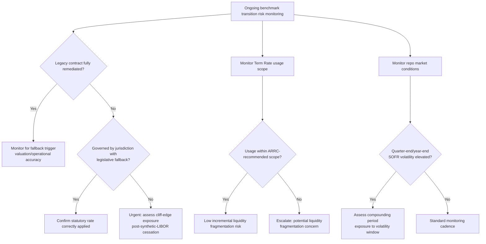

## Remaining Benchmark Transition Risks

### Overview

While the core LIBOR-to-RFR transition milestones have passed — with USD LIBOR's final panel cessation on June 30, 2023, following GBP, EUR, CHF, and JPY LIBOR cessation at end-2021 — the benchmark reform process is not fully complete or risk-free. Residual risks persist across legal, operational, market structure, and emerging-benchmark dimensions. These remaining risks are relevant both for institutions still managing wind-down legacy exposure and for understanding the ongoing evolution of reference rate infrastructure, including ongoing scrutiny of credit-sensitive alternatives, synthetic LIBOR wind-down, and structural questions about RFR-based market resilience.

**Key Points**

- Synthetic LIBOR (GBP, JPY) operated only for a defined wind-down period and has itself now ceased, meaning any remaining "tough legacy" contracts unresolved by that point face a hard cliff-edge risk.
- Term SOFR usage creep beyond its ARRC-recommended scope, and the broader credit-sensitive rate debate, represent ongoing market structure risks to the depth and integrity of RFR-based derivatives liquidity.
- Operational, legal, and conduct risks persist for institutions with residual legacy systems, contract population gaps, or unresolved cross-jurisdictional fallback inconsistencies.

---

### Synthetic LIBOR Wind-Down Completion Risk

**Background:** The UK FCA compelled continued publication of synthetic LIBOR for GBP (1M, 3M, 6M tenors) and JPY (1M, 3M, 6M tenors) settings for a defined transitional period after the panel-based rate ceased, specifically to give tough legacy contracts additional time to either mature naturally or be actively remediated.

**Completion status:** [Verified] Synthetic JPY LIBOR ceased publication after the end of 2022, and synthetic GBP LIBOR for the remaining tenors ceased publication after September 2024, meaning the synthetic LIBOR bridge mechanism itself is no longer available as a permanent solution.

**Residual risk:** [Unverified — population-specific] Any legacy contracts that had not been actively remediated (via bilateral amendment, protocol adherence, or applicable legislative fallback) by the time their relevant synthetic LIBOR setting ceased face a genuine "cliff-edge" scenario with no readily available published benchmark to reference, unless a jurisdiction-specific legislative fallback (of the type enacted in the US) independently applies to fill the gap. Institutions holding older, unremediated legacy paper — particularly structured notes, older securitizations, or bilateral loan agreements outside the scope of syndicated loan market conventions — carry residual legal and operational risk if such contracts were not proactively identified and resolved before the relevant synthetic rate's final cessation date.

---

### Contract Population and Discovery Risk

**Incomplete legacy contract inventories:** [Unverified — institution-dependent] Despite extensive industry-wide remediation efforts, some institutions — particularly those with legacy systems from mergers, acquisitions, or older technology platforms — have faced (and in some cases may continue to face) challenges in maintaining a fully complete and accurate inventory of all LIBOR-referencing legacy contracts, especially older or smaller-value instruments, embedded derivatives within structured products, or contracts inherited through portfolio acquisitions where original documentation is incomplete.

**Embedded and indirect exposure:** LIBOR references can appear in unexpected places beyond obvious floating-rate loans and swaps — discount rate assumptions in actuarial and pension calculations, embedded derivative valuation inputs in structured insurance products, internal transfer pricing mechanisms, and legacy IT system hardcoded assumptions. [Unverified — scope varies by institution] Identifying and remediating these less visible references has generally required more extensive internal audit and legal review than the more visible, directly-referencing loan and derivatives populations, and gaps may persist in some institutions' internal systems even after external-facing contracts have been fully remediated.

---

### Term Rate Scope Creep and Liquidity Fragmentation Risk

**The core concern:** As covered in prior transition material, the ARRC explicitly scoped Term SOFR's recommended use to business loans and related securitizations, deliberately excluding the broad derivatives market, to preserve deep liquidity in compounded-in-arrears SOFR — the convention underlying the OIS and futures markets from which Term SOFR itself is derived.

**Ongoing risk:** [Verified] Market commentary and official sector communications have continued to note the risk that expanding use of Term SOFR beyond its intended scope — for example, into broader derivatives use cases where compounded-in-arrears SOFR is the established convention — could fragment liquidity and undermine the robustness of the SOFR futures and OIS markets that Term SOFR itself depends on for its own construction, creating a potential circularity/liquidity feedback risk if scope creep became sufficiently widespread.

**Credit-sensitive rate debate:** Some market segments, particularly regional and community banks with funding costs that do not track secured Treasury repo rates closely, have continued to express demand for credit-sensitive benchmark alternatives (e.g., AMERIBOR, or previously BSBY before its 2023 discontinuation) that better reflect their actual marginal funding costs. [Unverified — regulatory stance evolving] The persistence of this demand, and the risk that fragmented adoption of multiple credit-sensitive alternatives across different market segments could recreate some of the fragmentation and comparability problems that motivated LIBOR's original reform, remains a live area of market structure discussion rather than a fully settled question.

---

### Legal and Litigation Risk

**Valuation disputes at fallback trigger:** Even with the ISDA protocol and legislative fallback mechanisms broadly successful in preventing widespread litigation, [Unverified — jurisdiction and case-specific] some residual legal disputes have arisen (and could continue to arise) regarding the precise valuation impact of fallback triggers on specific legacy contracts, particularly complex structured products where the interaction between the fallback mechanism and other embedded contractual provisions (early termination triggers, rating downgrade provisions, etc.) was not fully anticipated in original documentation.

**Cross-jurisdictional inconsistency risk:** Because different jurisdictions adopted different legal mechanisms (the UK's synthetic rate redefinition approach versus the US's direct legislative rate substitution approach, versus jurisdictions with no specific legislative intervention at all), [Unverified — comparative legal analysis] contracts with cross-border elements — different governing law than the currency of the referenced benchmark, or counterparties in jurisdictions without equivalent legislative protection — may face residual uncertainty about which legal fallback mechanism definitively applies, particularly in contract disputes that reach litigation or arbitration.

---

### Market Structure and Concentration Risk

**Repo market structural volatility (SOFR-specific):** As noted in RFR mechanics coverage, SOFR's secured, repo-based nature makes it subject to periodic volatility around quarter-end and year-end reporting dates due to dealer balance sheet constraints. [Verified] The Federal Reserve's establishment of a Standing Repo Facility (SRF) in 2021 was designed partly in response to earlier repo market stress episodes (notably September 2019), intended to help dampen extreme SOFR volatility spikes by providing a backstop source of liquidity — though the SRF's ongoing effectiveness in fully containing all future stress episodes is a matter of continued central bank and market monitoring rather than a permanently resolved structural question.

**Concentration in overnight-rate-dependent infrastructure:** With the derivatives market now heavily concentrated around compounded-in-arrears overnight RFRs, [Unverified — systemic characterization] some market structure commentary has raised the question of whether this concentration creates a different, though not necessarily larger, form of systemic dependency on the continued robust functioning of specific overnight funding markets (Treasury repo for SOFR, in particular) compared to the more diversified (if less transaction-robust) panel-bank submission structure of legacy LIBOR — this is a structural characterization debated among market participants rather than a settled empirical conclusion.

---

### Operational and Systems Risk

**Legacy system decommissioning risk:** [Unverified — institution-dependent] Institutions that built parallel-run systems or interim operational workarounds during the active transition period face ongoing decisions about when and how to fully decommission legacy LIBOR-calculation infrastructure versus retaining it for residual legacy contract servicing, audit trail requirements, or dispute resolution needs — premature decommissioning risks operational gaps if unexpected legacy exposure surfaces later, while excessive retention carries ongoing maintenance cost and complexity.

**Vendor and third-party dependency risk:** Institutions relying on third-party vendors, index providers, or outsourced loan/derivatives servicing platforms for RFR compounding calculations, fallback rate application, or Term SOFR licensing carry ongoing counterparty/vendor risk regarding the continued accuracy, availability, and correct methodology application of these third-party calculation services — a risk that shifted in character (from panel-submission risk to calculation-service and licensing dependency risk) rather than disappearing entirely.

---

### Diagram: Residual Risk Categories (svg_diagram)

<svg xmlns="http://www.w3.org/2000/svg" viewBox="0 0 780 420" font-family="Arial, sans-serif">
<text x="390" y="28" font-size="18" font-weight="bold" text-anchor="middle">Remaining Benchmark Transition Risk Map (svg_diagram)</text>
<rect x="30" y="60" width="220" height="100" rx="8" fill="#fdecea" stroke="#c0392b" stroke-width="2" />
<text x="140" y="85" font-size="13" text-anchor="middle" font-weight="bold">Legal / Contractual</text>
<text x="140" y="105" font-size="11" text-anchor="middle">Synthetic LIBOR cliff-edge</text>
<text x="140" y="121" font-size="11" text-anchor="middle">Cross-jurisdiction inconsistency</text>
<text x="140" y="137" font-size="11" text-anchor="middle">Fallback valuation disputes</text>
<rect x="280" y="60" width="220" height="100" rx="8" fill="#e8f0fe" stroke="#1a56db" stroke-width="2" />
<text x="390" y="85" font-size="13" text-anchor="middle" font-weight="bold">Operational</text>
<text x="390" y="105" font-size="11" text-anchor="middle">Contract discovery gaps</text>
<text x="390" y="121" font-size="11" text-anchor="middle">Embedded/indirect references</text>
<text x="390" y="137" font-size="11" text-anchor="middle">Legacy system decommissioning</text>
<rect x="530" y="60" width="220" height="100" rx="8" fill="#fff8e1" stroke="#b8860b" stroke-width="2" />
<text x="640" y="85" font-size="13" text-anchor="middle" font-weight="bold">Market Structure</text>
<text x="640" y="105" font-size="11" text-anchor="middle">Term rate scope creep</text>
<text x="640" y="121" font-size="11" text-anchor="middle">Credit-sensitive rate fragmentation</text>
<text x="640" y="137" font-size="11" text-anchor="middle">Repo market concentration</text>
<line x1="140" y1="160" x2="140" y2="190" stroke="#555" stroke-width="1" />
<line x1="390" y1="160" x2="390" y2="190" stroke="#555" stroke-width="1" />
<line x1="640" y1="160" x2="640" y2="190" stroke="#555" stroke-width="1" />
<line x1="140" y1="190" x2="640" y2="190" stroke="#555" stroke-width="1" />
<line x1="390" y1="190" x2="390" y2="210" stroke="#555" stroke-width="1.5" marker-end="url(#ad)" />
<rect x="140" y="215" width="500" height="90" rx="8" fill="#f4f4f4" stroke="#555" stroke-width="1.5" />
<text x="390" y="240" font-size="12" text-anchor="middle" font-weight="bold">Common thread:</text>
<text x="390" y="260" font-size="11" text-anchor="middle">Core transition largely complete, but residual populations,</text>
<text x="390" y="277" font-size="11" text-anchor="middle">structural dependencies, and market-structure evolution</text>
<text x="390" y="294" font-size="11" text-anchor="middle">require ongoing monitoring rather than one-time resolution</text>
</svg>

---

### Risk Monitoring Flow

---

### Practical Considerations

- **Ongoing regulatory monitoring:** [Verified] The ARRC formally concluded its own active mandate after the completion of the core USD LIBOR transition, but successor bodies, central bank market committees, and prudential regulators (in the US, UK, EU, and Japan) continue to monitor benchmark-related market structure, credit-sensitive rate developments, and any residual legacy contract issues on an ongoing supervisory basis rather than through a dedicated transition-specific taskforce structure.
- **Institutional governance implications:** [Unverified — institution-dependent] Firms are generally expected to maintain some level of ongoing governance and periodic review of residual legacy exposure, fallback rate application accuracy, and Term Rate usage scope compliance as part of standard benchmark risk management frameworks, rather than treating the transition as a one-time historical project now fully closed.
- **New benchmark introduction risk:** [Unverified — forward-looking] Any future introduction of new or modified reference rates (whether credit-sensitive alternatives, further RFR methodology refinements, or additional jurisdictions reforming their own local benchmarks) carries analogous transition risk lessons from the LIBOR experience — robust, pre-drafted fallback language and early multilateral coordination mechanisms are generally regarded as key risk-mitigation lessons drawn from the LIBOR transition experience for any future benchmark change.

**Related Topics**

- Synthetic LIBOR Cessation Timeline and Residual Contract Identification
- Federal Reserve Standing Repo Facility and SOFR Volatility Management
- Credit Sensitive Rate Alternatives: AMERIBOR and the BSBY Discontinuation
- Cross-Jurisdictional Legal Fallback Mechanism Comparison
- Legacy System Decommissioning Governance Frameworks
- Benchmark Governance Lessons for Future Reference Rate Reforms