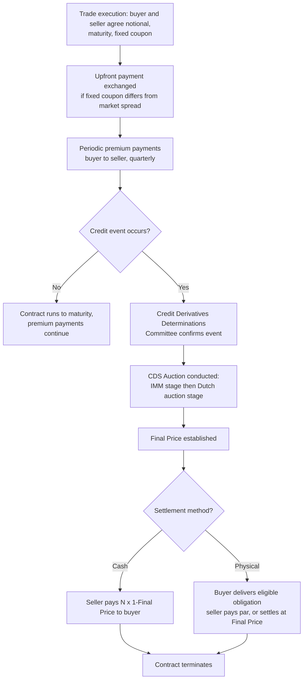

## Credit Default Swap Mechanics and Documentation

### Overview

A credit default swap (CDS) is a bilateral derivative contract that transfers credit risk from a protection buyer to a protection seller: the buyer pays a periodic premium (the spread) in exchange for a contingent payment from the seller if a specified "credit event" (default, bankruptcy, restructuring) occurs on a reference entity or reference obligation. CDS mechanics are governed by a highly standardized documentation framework developed by ISDA, whose evolution — particularly the 2003 and 2014 Definitions, and the "Big Bang" and "Small Bang" Protocols — was designed to reduce basis risk, settlement ambiguity, and counterparty disputes that characterized the pre-standardization era of the market.

**Key Points**

- A CDS transfers credit risk without transferring ownership of the underlying reference obligation — the protection buyer need not own the underlying bond or loan (a "naked" CDS position).
- Standardized coupons (100bps and 500bps for most single-name investment-grade and high-yield contracts respectively) combined with an upfront payment replaced the older convention of a bespoke running spread for every trade, to enable fungibility and easier netting/compression.
- Credit event determination and settlement are now governed by industry-standard Credit Derivatives Determinations Committees (DC) rather than bilateral negotiation between the two original counterparties.

---

### Basic CDS Mechanics

**Parties:**

- **Protection Buyer:** Pays a periodic premium (spread), receives a contingent payment if a credit event occurs on the reference entity.
- **Protection Seller:** Receives the periodic premium, makes the contingent payment upon a credit event, effectively taking on credit risk exposure to the reference entity (economically similar to being long a bond of that issuer, but via derivative form).

**Cash flow structure:**

$$\text{Premium Leg (buyer pays):} \quad N \times s \times \Delta t \quad \text{(paid periodically, e.g., quarterly)}$$

$$\text{Protection Leg (seller pays, contingent):} \quad N \times (1 - R) \quad \text{(paid only if credit event occurs)}$$

where:

- $N$ = notional amount
- $s$ = the running spread (annualized), or for standardized contracts, the fixed coupon (100bps or 500bps)
- $\Delta t$ = accrual period fraction
- $R$ = recovery rate (or, more precisely, the auction-determined final price used to calculate settlement)

**Standardized coupon and upfront payment (post-"Big Bang" convention):** Since the 2009 CDS Big Bang, most single-name CDS trade with a fixed coupon (100bps for investment grade, 500bps for high yield, in North America; similar fixed-coupon conventions apply in other regions with some variation), with the difference between the fixed coupon and the "true" market-clearing spread settled via an upfront payment at trade inception.

$$\text{Upfront Payment} = PV\left(\text{Market Spread} - \text{Fixed Coupon}\right) \text{ over the contract's remaining life}$$

**Example:** If the market-clearing 5-year CDS spread for a reference entity is 250bps, but the trade is documented using the standard 100bps fixed coupon, the protection buyer pays the seller an upfront amount approximately equal to the present value of the 150bps spread differential over the 5-year life of the contract (roughly, though not exactly, $150\text{bps} \times 5 \times N$ before duration/discounting adjustments), in addition to the ongoing 100bps running coupon.

---

### Credit Events

The ISDA Credit Derivatives Definitions specify which events constitute a "credit event" triggering the protection leg payment. The 2014 ISDA Credit Derivatives Definitions (the current market standard, superseding the 2003 Definitions) specify the following standard credit events, applicable depending on the reference entity type and the specific transaction's documentation:

1. **Bankruptcy:** The reference entity becomes insolvent, is unable to pay debts, or undergoes formal bankruptcy/insolvency proceedings (applicable primarily to corporate reference entities, not typically relevant for sovereign reference entities, which have different applicable event sets).
2. **Failure to Pay:** The reference entity fails to make a payment (subject to a specified grace period and materiality/payment threshold) on one or more of its obligations.
3. **Restructuring:** A restructuring of the reference entity's debt (reduction in interest or principal, postponement of payment, change of currency, or subordination) that is not required by the terms of the original obligation and results from a deterioration in creditworthiness. [Verified] Restructuring is the most contentious and variably-documented credit event, with different sub-types (Full Restructuring, Modified Restructuring "Mod R," Modified Modified Restructuring "Mod Mod R," and "No Restructuring") reflecting different regional market conventions on how broadly restructuring-related deliverable obligations should be defined.
4. **Repudiation/Moratorium** and **Obligation Acceleration/Default** (less commonly triggered credit events, more relevant to certain sovereign or specific transaction types, and generally less standard across all documentation than the first three).

**Sovereign-specific considerations:** [Unverified — evolving documentation] Sovereign CDS documentation includes some additional or modified provisions, given that sovereign reference entities cannot undergo bankruptcy in the same legal sense as corporates, and repudiation/moratorium provisions carry particular relevance for sovereign debt restructuring scenarios (a topic that received significant market attention around various historical sovereign debt restructuring episodes).

---

### Credit Derivatives Determinations Committees (DC)

**Purpose:** Prior to standardization, disputes over whether a credit event had actually occurred, and disputes over deliverable obligations and settlement mechanics, were resolved bilaterally or through litigation, creating significant uncertainty and inconsistency across the market for economically similar contracts.

**Structure:** [Verified] ISDA established regional Credit Derivatives Determinations Committees, composed of voting dealer and non-dealer institutional members, responsible for making binding determinations (subject to a specified supermajority voting threshold) on key questions including: whether a credit event has occurred with respect to a reference entity, what obligations are deliverable, and procedural questions relating to CDS auctions.

**Effect on documentation:** Trades that incorporate the DC determination mechanism (the market standard since the 2009 Big Bang Protocol) are bound by DC determinations, removing the need for bilateral credit event determination and providing market-wide consistency — a single DC ruling on a given reference entity applies uniformly across all outstanding CDS contracts referencing that entity that have incorporated the relevant protocol/definitions.

---

### Settlement Mechanics: Physical vs. Cash, and the CDS Auction

**Historical physical settlement:** Originally, upon a credit event, the protection buyer would deliver an eligible deliverable obligation (a bond or loan of the reference entity meeting specified deliverability criteria) to the protection seller in exchange for the full notional payment (par).

**Auction-based cash settlement (current market standard):** [Verified] Following the 2009 protocol changes, the market standard mechanism is a centrally administered CDS auction, run by ISDA-appointed administrators, which determines a single "final price" for the reference entity's deliverable obligations, used to calculate the cash settlement amount for all contracts referencing that entity — rather than requiring each individual protection buyer to source and physically deliver bonds (which could create artificial scarcity/squeeze dynamics in the underlying bond market if a large CDS notional outstanding significantly exceeded the deliverable bond supply, a well-documented historical concern).

$$\text{Cash Settlement Amount} = N \times (1 - \text{Auction Final Price})$$

**Auction mechanics (two-stage process):**

1. **Initial Market Midpoint (IMM) stage:** Participating dealers submit two-way markets (bid/offer quotes) on the reference obligation; these are used to calculate an initial market midpoint, and dealers also submit physical settlement requests indicating net buy/sell interest.
2. **Subsequent Dutch auction stage:** If there is a net open interest to buy or sell the reference obligation, a second-round Dutch auction is conducted among participating dealers to match this net interest, with the final auction price potentially adjusted from the initial midpoint based on this second-round matching process.

**Example:** If a reference entity defaults and the CDS auction determines a final price of 35 (i.e., 35 cents on the dollar, reflecting the market's assessment of ultimate recovery value on the reference obligation), a protection buyer with $10 million notional receives:

$$10{,}000{,}000 \times (1 - 0.35) = \$6{,}500{,}000$$

from the protection seller, while any physically-settling parties can alternatively deliver eligible obligations at the auction-determined price rather than through bilateral physical delivery negotiation.

---

### Reference Entities, Reference Obligations, and Deliverable Obligations

**Reference Entity:** The specific corporate, sovereign, or other legal entity whose credit risk is being transferred (e.g., "a CDS on Company X").

**Reference Obligation:** A specifically identified debt obligation of the reference entity, used primarily to establish the seniority level (senior unsecured, subordinated, etc.) of the credit protection being transacted, since a reference entity can have multiple classes of debt with different seniority and, correspondingly, different expected recovery rates.

**Deliverable Obligations:** The broader universe of obligations of the reference entity (meeting specified characteristics — currency, maturity limitations, transferability, and other standard deliverability criteria under the ISDA Definitions) that can be used to establish the auction final price and, in physical settlement scenarios, actually delivered to satisfy the contract, extending beyond just the specific reference obligation itself, so long as they rank pari passu (or meet the specified seniority matching criteria) with the reference obligation.

---

### CDS Index Products

Beyond single-name CDS, standardized CDS index products aggregate credit exposure across a basket of reference entities:

- **CDX (North America):** CDX.NA.IG (investment grade) and CDX.NA.HY (high yield) are the primary standardized indices, each comprising a fixed basket of 125 (IG) or 100 (HY) reference entities, reconstituted semi-annually (each new "series") to reflect index eligibility rule changes (credit rating migrations, M&A activity, etc.).
- **iTraxx (Europe, Asia):** The European and Asian equivalent index families, similarly structured with semi-annual roll conventions and standardized fixed coupons.

**Single-name vs. index mechanics:** Index CDS function mechanically similarly to single-name CDS (premium leg vs. contingent protection leg) but with the notional and protection payment allocated pro-rata across the constituent reference entities; when a constituent experiences a credit event, that entity is effectively "removed" from the ongoing index notional following an auction/settlement process specific to that constituent, while the remaining index continues with its reduced notional.

---

### Diagram: CDS Cash Flow Structure (svg_diagram)

<svg xmlns="http://www.w3.org/2000/svg" viewBox="0 0 760 380" font-family="Arial, sans-serif">
<text x="380" y="28" font-size="18" font-weight="bold" text-anchor="middle">Credit Default Swap Cash Flow Structure (svg_diagram)</text>
<rect x="40" y="70" width="180" height="90" rx="8" fill="#e8f0fe" stroke="#1a56db" stroke-width="2" />
<text x="130" y="105" font-size="14" text-anchor="middle" font-weight="bold">Protection Buyer</text>
<text x="130" y="125" font-size="12" text-anchor="middle">Pays premium leg</text>
<text x="130" y="143" font-size="12" text-anchor="middle">Hedges credit risk</text>
<rect x="540" y="70" width="180" height="90" rx="8" fill="#fdecea" stroke="#c0392b" stroke-width="2" />
<text x="630" y="105" font-size="14" text-anchor="middle" font-weight="bold">Protection Seller</text>
<text x="630" y="125" font-size="12" text-anchor="middle">Receives premium</text>
<text x="630" y="143" font-size="12" text-anchor="middle">Assumes credit risk</text>
<line x1="220" y1="95" x2="540" y2="95" stroke="#1a56db" stroke-width="2" marker-end="url(#c1)" />
<text x="380" y="88" font-size="11" text-anchor="middle" fill="#1a56db">Premium: N × spread × Δt (periodic)</text>
<line x1="540" y1="140" x2="220" y2="140" stroke="#c0392b" stroke-width="2" marker-end="url(#c2)" />
<text x="380" y="158" font-size="11" text-anchor="middle" fill="#c0392b">Contingent: N × (1 − Recovery), if Credit Event</text>
<line x1="380" y1="180" x2="380" y2="205" stroke="#555" stroke-width="1" stroke-dasharray="4,4" />
<rect x="140" y="210" width="480" height="150" rx="8" fill="#f4f4f4" stroke="#555" stroke-width="1.5" />
<text x="380" y="235" font-size="12" text-anchor="middle" font-weight="bold">Upon Credit Event:</text>
<text x="380" y="257" font-size="11" text-anchor="middle">1. Determinations Committee confirms credit event occurred</text>
<text x="380" y="277" font-size="11" text-anchor="middle">2. CDS Auction held to establish Final Price</text>
<text x="380" y="297" font-size="11" text-anchor="middle">3. Cash settlement: N × (1 − Final Price) paid to buyer</text>
<text x="380" y="317" font-size="11" text-anchor="middle">4. Premium leg accrual ceases as of credit event date</text>
<text x="380" y="340" font-size="10" text-anchor="middle" font-style="italic">(Physical settlement remains an option under standard documentation)</text>
</svg>

---

### CDS Lifecycle Flow

---

### Practical Considerations

- **Basis to cash bonds:** The CDS-bond basis (the difference between a reference entity's CDS spread and its cash bond spread over a comparable benchmark) can diverge due to differing supply/demand dynamics, funding cost differences, cheapest-to-deliver optionality in the CDS (since multiple deliverable obligations can satisfy the contract), and repo market conditions for the underlying bonds — a persistent focus area for relative value and basis trading strategies.
- **Counterparty risk on the seller:** [Verified] Despite central clearing having become standard for a substantial portion of the standardized single-name and index CDS market (reducing bilateral counterparty risk through CCP intermediation and margining), not all CDS activity is centrally cleared, and bilateral counterparty credit risk on uncleared positions remains a relevant risk management consideration, particularly for bespoke or less liquid single-name contracts.
- **Documentation version risk:** [Unverified — legacy-specific] Contracts documented under earlier ISDA Definitions versions (e.g., pre-2014 trades not subsequently amended via protocol) may have different credit event definitions or settlement mechanics than current-standard contracts, requiring careful attention to which definitions version and which supplements/protocols a specific legacy trade has adhered to when assessing its precise contractual terms.

**Related Topics**

- CDS-Bond Basis and Relative Value Trading
- CDS Index Products: CDX and iTraxx Roll Mechanics
- Restructuring Clause Variants (Mod R, Mod Mod R, No Restructuring)
- Sovereign CDS Documentation and Settlement Considerations
- Central Clearing of CDS and CCP Margining Frameworks
- CDS Auction Mechanics: IMM and Dutch Auction Stages in Detail
- Synthetic CDO Structures Referencing CDS Index Tranches