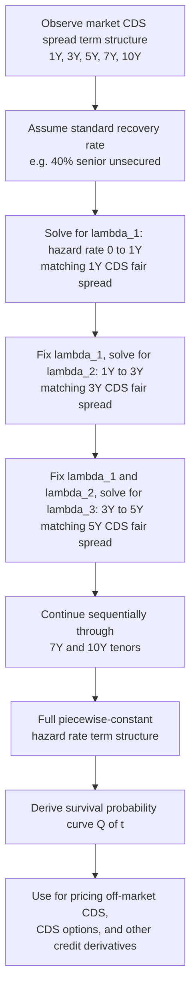

## Default Probability and Hazard Rate Models

### Overview

Hazard rate models provide the mathematical framework for translating observed credit spreads (from CDS or bonds) into implied default probabilities, and conversely for pricing credit derivatives given an assumed or calibrated default probability structure. The core concept is the **hazard rate** (or intensity), representing the instantaneous conditional probability of default given survival to that point in time — the credit market analogue to a mortality/failure rate in actuarial and reliability modeling. This framework, known as the **reduced-form** or **intensity-based** approach to credit modeling, is the dominant methodology used in CDS pricing and default probability curve construction, as distinct from structural models (e.g., Merton-style models) that derive default from a firm's asset value process.

**Key Points**

- The hazard rate $\lambda(t)$ defines survival probability via $Q(t) = \exp\left(-\int_0^t \lambda(u)\,du\right)$; a constant hazard rate implies exponentially distributed default time.
- CDS spreads are approximately linked to the hazard rate and loss-given-default via $s \approx \lambda \times (1-R)$, providing a direct, market-observable calibration route.
- Bootstrapping a full survival probability curve from a term structure of CDS spreads (1Y, 3Y, 5Y, 7Y, 10Y) is standard market practice for constructing default probability curves used in CDS and credit-contingent derivative pricing.

---

### The Hazard Rate Framework

**Definition:** The hazard rate (or default intensity) $\lambda(t)$ is defined such that the probability of default in a small time interval $[t, t+dt]$, conditional on survival to time $t$, is:

$$P(\tau \in [t, t+dt] \mid \tau > t) = \lambda(t)\,dt$$

where $\tau$ is the (random) default time.

**Survival probability:** The probability of survival to time $T$, denoted $Q(T)$, is derived by integrating the hazard rate:

$$Q(T) = P(\tau > T) = \exp\left(-\int_0^T \lambda(u)\,du\right)$$

**Constant hazard rate case:** If $\lambda(t) = \lambda$ is constant, default time is exponentially distributed, and:

$$Q(T) = e^{-\lambda T}$$

$$\text{Cumulative default probability by time } T: \quad F(T) = 1 - Q(T) = 1 - e^{-\lambda T}$$

**Example:** If a reference entity has a constant hazard rate of $\lambda = 2\%$ per annum, the probability of survival to 5 years is:

$$Q(5) = e^{-0.02 \times 5} = e^{-0.10} \approx 0.9048$$

meaning approximately a 9.52% cumulative probability of default within 5 years, under the constant-hazard-rate assumption.

---

### The Reduced-Form (Intensity-Based) Approach vs. Structural Models

**Reduced-form models:** Treat default as an exogenous, unpredictable jump event governed by the hazard rate process, calibrated directly to observed market prices (CDS spreads, bond spreads) without explicitly modeling the firm's underlying capital structure or asset dynamics. [Verified] This is the dominant approach in practitioner CDS pricing precisely because it calibrates directly and exactly to observed market spreads, which is operationally important for consistent mark-to-market and hedging.

**Structural models (for context/contrast):** Model default as occurring when a firm's asset value process (typically modeled as a stochastic process, e.g., geometric Brownian motion in the original Merton model) falls below a default barrier (often related to the firm's liabilities). While theoretically appealing for linking default to fundamental balance sheet dynamics, structural models are less commonly used for direct CDS market pricing and hedging because they generally require additional assumptions (asset value volatility, which is not directly observable) and do not automatically calibrate exactly to observed spread term structures without additional fitting.

---

### Linking Hazard Rate to CDS Spread

Under simplifying assumptions (continuous premium payment, no counterparty risk, deterministic recovery), the CDS premium leg and protection leg can be equated to derive an approximate relationship between the fair CDS spread $s$, the hazard rate $\lambda$, and the recovery rate $R$:

**Premium leg (buyer pays, present value):**

$$PV_{premium} = s \times \int_0^T Q(t) \, DF(t) \, dt$$

**Protection leg (seller pays, present value, contingent on default):**

$$PV_{protection} = (1-R) \times \int_0^T \lambda(t) \, Q(t) \, DF(t) \, dt$$

where $DF(t)$ is the discount factor to time $t$. Setting these equal (the no-arbitrage fair spread condition) and, under the simplifying assumption of a flat hazard rate over the relevant horizon, yields the widely used practitioner approximation:

$$s \approx \lambda \times (1 - R)$$

**Example:** If the market 5-year CDS spread for a reference entity is 300bps (3.00%) and the market convention assumes a standard recovery rate of 40%:

\lambda \approx \frac{s}{1-R} = \frac{0.03}{1-0.40} = \frac{0.03}{0.60} = 0.05 \text{ or } 5\% \text{ per annum}$}

This gives an approximate implied hazard rate of 5% per annum, corresponding (under the constant-hazard assumption) to a 5-year survival probability of:

$$Q(5) = e^{-0.05 \times 5} = e^{-0.25} \approx 0.7788$$

i.e., approximately a 22.12% cumulative 5-year default probability implied by the market spread.

**Important caveat on the approximation:** [Verified] The simple $s \approx \lambda(1-R)$ relationship is a widely used first-order approximation that holds most precisely for short-dated, at-market spreads with continuous premium payment assumptions; more precise calibration — particularly for longer tenors, non-flat hazard curves, or when converting from actual market-quoted upfront-plus-fixed-coupon conventions — requires full numerical bootstrapping using the actual premium and protection leg formulas (discretized for quarterly payment dates, accrued premium on default, and the specific day-count/payment conventions of the standardized CDS contract) rather than the simplified continuous approximation.

---

### Bootstrapping a Hazard Rate (Survival Probability) Curve

Because the market quotes CDS spreads at discrete standard tenors (commonly 1Y, 2Y, 3Y, 5Y, 7Y, 10Y), constructing a full, continuous survival probability curve requires **bootstrapping**: sequentially solving for piecewise-constant (or otherwise parametrized) hazard rates in each tenor bucket, such that the resulting survival curve exactly reprices each observed market CDS spread at its respective maturity.

**Bootstrapping procedure (conceptual):**

1. Using the shortest-maturity CDS spread (e.g., 1Y), solve for the hazard rate $\lambda_1$ over $[0, 1Y]$ that makes the theoretical CDS fair spread (given that hazard rate and the discount curve) equal to the observed 1Y market spread.
2. Using the 1Y hazard rate as fixed for the first year, solve for the hazard rate $\lambda_2$ over $[1Y, 3Y]$ such that the theoretical fair spread for a 3Y CDS (using $\lambda_1$ for year 1 and $\lambda_2$ for years 1–3) matches the observed 3Y market spread.
3. Repeat sequentially outward through the term structure (5Y, 7Y, 10Y), each step solving for the incremental hazard rate in that maturity bucket while holding previously bootstrapped rates fixed for their respective periods.

This produces a piecewise-constant hazard rate term structure $\{\lambda_1, \lambda_2, \lambda_3, ...\}$ and a corresponding survival probability curve $Q(t)$ that exactly reprices the full observed CDS term structure — the standard input used for pricing other credit-contingent instruments (e.g., CDS options, contingent credit default swaps, or valuing off-market/legacy CDS positions) consistently with the observed market.

**Example (illustrative, simplified):**

| Tenor | Market CDS Spread | Bootstrapped Hazard Rate (illustrative, flat recovery 40%) |
| --- | --- | --- |
| 1Y | 150bps | ≈ 2.5% |
| 3Y | 220bps | ≈ 2.9% (incremental, years 1–3) |
| 5Y | 280bps | ≈ 3.7% (incremental, years 3–5) |
| 10Y | 320bps | ≈ 3.4% (incremental, years 5–10) |

[Unverified — illustrative numbers only] These figures are illustrative of the bootstrapping shape (typically showing hazard rates that can rise, fall, or vary across tenors reflecting the market's view of near-term versus longer-term credit risk), not derived from any actual observed market data — actual bootstrapped values depend on the specific spread curve, recovery assumption, discount curve, and precise CDS cash flow conventions used.

**Upward vs. downward-sloping term structures:** An upward-sloping CDS spread curve (higher spreads at longer tenors) generally implies a hazard rate that increases with tenor (deteriorating credit view further out, or simply term/liquidity premium effects), while an inverted curve (higher near-term spreads) — often observed for distressed credits perceived to have elevated near-term default risk — implies a front-loaded, higher near-term hazard rate that may decline for later tenors (reflecting an assumption that if the entity survives the near-term stress period, its conditional forward default risk decreases).

---

### Recovery Rate Assumptions

Because the $s \approx \lambda(1-R)$ relationship (and the more precise bootstrapping procedure) both require a recovery rate assumption, and recovery rate is not independently observable until an actual default and auction occurs, **market convention typically assumes a standardized recovery rate** for curve construction and quoting purposes:

- **Standard market convention:** 40% recovery for most senior unsecured corporate CDS (North America and Europe), with different standard assumptions for subordinated debt (typically lower, e.g., 20-25%) and for certain sovereign or emerging market names (which may use different standardized assumptions reflecting historical recovery experience for that category).

**Impact of recovery assumption on implied hazard rate:** Since $\lambda \approx s / (1-R)$, a higher assumed recovery rate mechanically implies a higher hazard rate (and correspondingly higher implied default probability) for the same observed market spread, since a smaller loss-given-default requires a higher default frequency to generate the same expected loss (and hence the same fair spread). This means implied default probabilities extracted from CDS spreads are inherently a joint output of the spread *and* the recovery assumption, not the spread alone — a common source of confusion when comparing "implied default probabilities" derived using different recovery conventions across data providers or models.

---

### Diagram: Survival Probability Decay Under Constant Hazard Rate (svg_diagram)

<svg xmlns="http://www.w3.org/2000/svg" viewBox="0 0 700 380" font-family="Arial, sans-serif">
<text x="350" y="26" font-size="17" font-weight="bold" text-anchor="middle">Survival Probability Curve: Q(t) = exp(−λt) (svg_diagram)</text>
<line x1="70" y1="320" x2="650" y2="320" stroke="#333" stroke-width="1.5" />
<line x1="70" y1="320" x2="70" y2="50" stroke="#333" stroke-width="1.5" />
<text x="360" y="355" font-size="12" text-anchor="middle">Time (years)</text>
<text x="30" y="185" font-size="12" text-anchor="middle" transform="rotate(-90 30 185)">Survival Probability Q(t)</text>

<text x="65" y="335" font-size="10" text-anchor="middle">0</text>

<text x="185" y="335" font-size="10" text-anchor="middle">2</text>

<text x="305" y="335" font-size="10" text-anchor="middle">4</text>

<text x="425" y="335" font-size="10" text-anchor="middle">6</text>

<text x="545" y="335" font-size="10" text-anchor="middle">8</text>

<text x="645" y="335" font-size="10" text-anchor="middle">10</text>

<text x="60" y="55" font-size="10" text-anchor="end">1.0</text>

<text x="60" y="180" font-size="10" text-anchor="end">0.5</text>

<text x="60" y="318" font-size="10" text-anchor="end">0.0</text>

<path d="M 70 55 Q 130 90, 185 130 Q 245 175, 305 210 Q 365 240, 425 262 Q 485 280, 545 293 Q 605 302, 645 308" fill="none" stroke="`#1a56db`" stroke-width="3" />

<path d="M 70 55 Q 130 130, 185 185 Q 245 235, 305 265 Q 365 288, 425 300 Q 485 308, 545 313 Q 605 316, 645 318" fill="none" stroke="`#c0392b`" stroke-width="3" stroke-dasharray="6,4" />

<rect x="440" y="60" width="14" height="14" fill="#1a56db" />
<text x="460" y="72" font-size="11">λ = 2% (low hazard rate)</text>
<rect x="440" y="82" width="14" height="14" fill="#c0392b" />
<text x="460" y="94" font-size="11">λ = 5% (higher hazard rate)</text>

<text x="360" y="370" font-size="10" text-anchor="middle" font-style="italic">Higher hazard rate produces faster survival probability decay</text>

</svg>

---

### Hazard Rate Bootstrapping Flow

---

### Practical Considerations

- **Model risk from recovery assumption:** [Unverified — market/model-specific] Since implied default probabilities are jointly determined by the observed spread and an assumed (not directly observed) recovery rate, different data vendors or internal models using different standard recovery conventions can produce meaningfully different "implied default probability" figures from the same observed CDS spread, an important reconciliation point when comparing default probability estimates across sources.
- **Term structure interpolation:** Between bootstrapped tenor points, various interpolation conventions (flat forward hazard rates, linear in log-survival-probability, etc.) can be applied, and the choice can have a non-trivial impact on pricing of instruments with cash flows or triggers falling between standard quoted tenors (e.g., valuing a legacy CDS with an odd remaining maturity).
- **Stochastic vs. deterministic hazard rates:** The framework presented here treats the hazard rate as deterministic (calibrated to current market prices) for straightforward CDS pricing; more advanced applications (CDS options, correlation products, counterparty credit risk/CVA modeling) often require modeling the hazard rate itself as a stochastic process, introducing additional volatility and correlation parameters beyond the basic bootstrapped curve.

**Related Topics**

- CDS Premium and Protection Leg Valuation in Full Detail (Discrete Payment Dates)
- Recovery Rate Conventions and Historical Recovery Rate Data by Seniority
- Structural (Merton-Style) Credit Risk Models
- CDS Options and Stochastic Hazard Rate Modeling
- Counterparty Credit Risk and CVA Using Hazard Rate Curves
- Credit Curve Interpolation Methodologies
- Multi-Name Credit Correlation Models for CDO and Basket CDS Pricing