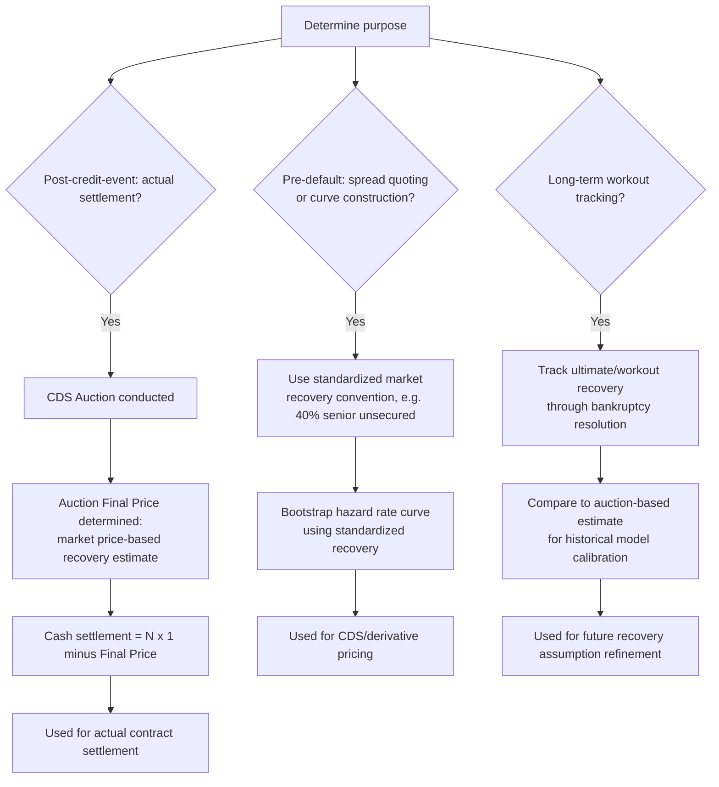

## Recovery Rates and Loss Given Default

### Overview

Recovery rate and loss given default (LGD) are the two complementary measures that quantify how much value creditors retrieve — and lose — when a borrower defaults. Recovery rate ($R$) represents the fraction of exposure recouped post-default (typically expressed as a percentage of par/face value), while loss given default ($LGD = 1 - R$) represents the corresponding fractional loss. These parameters are foundational inputs to CDS pricing, hazard rate calibration, expected loss calculations, regulatory capital models (Basel LGD requirements), and CDS auction settlement mechanics — yet recovery is empirically volatile, seniority- and industry-dependent, and only definitively observed after the resolution of a specific default event, making its estimation and standardization a persistent area of market convention and modeling.

**Key Points**

- $LGD = 1 - R$; both are typically expressed as a percentage of the exposure's face/par value, though actual "recovery" is a function of the ultimate resolution value (auction price, actual recovery in bankruptcy, or negotiated restructuring terms).
- Recovery rates vary substantially by seniority (senior secured recovers more than subordinated), industry, and macroeconomic/credit-cycle conditions (recoveries tend to be lower during systemic credit stress periods, when default rates are simultaneously elevated).
- CDS market convention uses standardized recovery assumptions (commonly 40% senior unsecured) for spread quoting and curve construction purposes, distinct from the actual auction-determined recovery used for final cash settlement upon an actual credit event.

---

### Defining Recovery Rate and LGD

**Basic relationship:**

$$LGD = 1 - R$$

$$\text{Expected Loss} = PD \times LGD \times EAD$$

where $PD$ is probability of default, $LGD$ is loss given default, and $EAD$ is exposure at default (the outstanding notional/exposure amount at the time of default).

**Ways recovery rate is measured in practice:**

1. **Market price-based (trading price) recovery:** The price at which a defaulted obligation trades in the secondary market shortly after default (commonly measured around 30 days post-default in various historical rating-agency studies), reflecting the market's forward-looking expectation of ultimate recovery value, discounted for time and uncertainty. [Verified] This is the basis for CDS auction settlement — the auction-determined final price is fundamentally a market price-based recovery measure, not a direct measurement of eventual actual cash recovered through the resolution/bankruptcy process.
2. **Ultimate (workout) recovery:** The actual present value of cash and/or securities eventually received by creditors through the full resolution process (bankruptcy reorganization, liquidation, or out-of-court restructuring), which can take years to finalize and may differ meaningfully from the earlier market price-based estimate.

**Why the distinction matters:** [Unverified — comparative characterization] Market price-based recovery, used for CDS settlement, reflects the market's collective forward-looking assessment at a specific point shortly after default, incorporating uncertainty and time-value-of-money discounting for the eventual actual workout outcome — it is not intended to equal, and empirically often does not exactly equal, the eventual ultimate/ workout recovery realized years later, though the two are naturally correlated as reflecting the same underlying credit's fundamental recovery prospects.

---

### Drivers of Recovery Rate Variation

**1. Seniority and Priority of Claims**

Recovery rates are strongly ordered by the priority ranking of the specific obligation within the capital structure, reflecting the fundamental bankruptcy principle (absolute priority, though not always perfectly observed in practice) that senior claims are paid in full before subordinated and equity claims receive anything.

| Seniority Class | Typical Standard CDS Recovery Assumption | General Historical Pattern |
| --- | --- | --- |
| Senior Secured | Higher assumption (varies by market/product) | Historically higher average recovery, reflecting collateral backing |
| Senior Unsecured | 40% (standard market convention, NA/Europe) | Most common CDS reference obligation seniority |
| Subordinated | Lower assumption (e.g., 20-25%, varies by convention) | Historically lower average recovery |

[Unverified — historical averages vary by study/period/dataset] Specific historical average recovery rate figures by seniority class vary meaningfully across different rating agency studies, time periods, and default cohorts, and should not be treated as fixed, universal constants — the standardized CDS market convention figures (40% senior unsecured, etc.) are simplifying conventions for quoting and curve-building purposes rather than precise forecasts of any specific future recovery outcome.

**2. Industry and Asset Tangibility**

[Unverified — general pattern, not universal] Industries with substantial tangible, readily saleable assets (e.g., certain capital-intensive industries with physical plant, real estate, or equipment) have historically tended to show different recovery patterns compared to industries with primarily intangible value (e.g., technology, services), reflecting the differing liquidation/going-concern value available to creditors, though this is a general historical tendency rather than a precise, universally applicable rule for any specific company or default event.

**3. Credit Cycle and Macroeconomic Conditions**

[Verified] A well-documented empirical pattern in credit markets is the negative correlation between default rates and recovery rates across the credit cycle — during periods of systemic credit stress (recessions, sector-wide downturns), default rates tend to rise simultaneously with declining recovery rates, since widespread distress in an industry or economy depresses the liquidation/sale value of defaulted companies' assets at precisely the time more companies are defaulting and competing to sell similar assets. This PD-LGD correlation is a significant modeling consideration in credit portfolio risk models and regulatory capital frameworks (e.g., "downturn LGD" concepts in Basel capital requirements), since using recovery assumptions based on average/benign-period data can understate expected losses during systemic stress scenarios.

**4. Capital Structure Complexity and Debt Cushion**

The amount of more-subordinated debt and equity "cushion" beneath a given tranche of debt affects that tranche's expected recovery — more subordinated capital beneath a senior claim provides greater absorption capacity for losses before the senior claim itself is impaired, generally supporting higher expected recovery for that senior tranche, all else equal.

---

### Recovery Rate in CDS Pricing and Settlement

**Standardized recovery for spread quoting/curve construction:** As covered in hazard rate modeling material, CDS market convention typically assumes a fixed, standardized recovery rate (commonly 40% for senior unsecured North American and European corporate reference entities) purely for the purpose of quoting spreads and constructing hazard rate/survival probability curves — this is a market convention simplification, not a prediction of the actual recovery that would be realized if that specific entity defaulted.

**Auction-determined recovery for actual settlement:** Upon an actual credit event, the CDS auction process (initial markets stage plus Dutch auction stage, as covered in CDS mechanics material) determines the actual "Final Price" used for real cash settlement — this auction-determined price is the market's realized, transaction-based recovery estimate for that specific default event and is generally different from (and supersedes, for settlement purposes) the standardized 40% convention used for pre-default spread quoting.

**Example illustrating the distinction:** A CDS on a corporate reference entity might have traded for years with spreads quoted and hazard rates bootstrapped using the standard 40% recovery convention. When the entity actually defaults, the CDS auction might determine a Final Price of, say, 22 (22%), reflecting the specific circumstances of that company's actual financial distress and the market's assessment of its senior unsecured bondholders' realistic recovery prospects — the actual cash settlement uses this auction-determined 22% figure, not the 40% convention that had been used for years of prior spread quoting and curve construction.

$$\text{Actual Cash Settlement} = N \times (1 - 0.22) = N \times 0.78$$

rather than the $N \times (1 - 0.40) = N \times 0.60$ that the standardized convention would have implied.

---

### Recovery Rate Uncertainty as a Risk Factor

**Recovery rate volatility itself is a risk:** Because actual recovery outcomes vary considerably around historical averages (and the standardized market conventions used for quoting), sophisticated credit risk and CDS-related models sometimes incorporate recovery rate as a stochastic variable rather than a fixed constant, particularly for:

- **Digital/binary credit default swaps:** A variant CDS structure where the contingent payment is a fixed amount (unrelated to actual recovery), rather than $(1-R)$ — used specifically by market participants wishing to isolate default timing risk from recovery rate uncertainty.
- **Recovery rate swaps and recovery locks:** Niche derivative structures that allow market participants to specifically trade views on the ultimate recovery rate of a reference entity, separately from the default probability/timing risk embedded in a standard CDS.

**Impact on CDS-bond basis:** [Unverified — relative value characterization] Differences between the market's implicit recovery assumption embedded in CDS pricing versus the recovery expectations embedded in cash bond pricing (which may reflect bond-specific characteristics, such as a specific bond's position in the capital structure or specific collateral) can contribute to observed CDS-bond basis effects, alongside the funding, technical, and cheapest-to-deliver factors also relevant to that basis.

---

### Diagram: Recovery Rate by Seniority Illustration (svg_diagram)

<svg xmlns="http://www.w3.org/2000/svg" viewBox="0 0 700 380" font-family="Arial, sans-serif">
<text x="350" y="26" font-size="17" font-weight="bold" text-anchor="middle">Illustrative Capital Structure and Recovery Priority (svg_diagram)</text>
<rect x="150" y="50" width="400" height="50" fill="#1a56db" opacity="0.85" />
<text x="350" y="80" font-size="13" text-anchor="middle" fill="white" font-weight="bold">Senior Secured Debt (highest priority)</text>
<rect x="150" y="100" width="400" height="50" fill="#4a7fd6" opacity="0.85" />
<text x="350" y="130" font-size="13" text-anchor="middle" fill="white" font-weight="bold">Senior Unsecured Debt</text>
<rect x="150" y="150" width="400" height="50" fill="#c0392b" opacity="0.75" />
<text x="350" y="180" font-size="13" text-anchor="middle" fill="white" font-weight="bold">Subordinated Debt</text>
<rect x="150" y="200" width="400" height="50" fill="#8b2e2e" opacity="0.75" />
<text x="350" y="230" font-size="13" text-anchor="middle" fill="white" font-weight="bold">Equity (lowest priority)</text>
<line x1="570" y1="50" x2="620" y2="50" stroke="#333" stroke-width="1" />
<line x1="570" y1="250" x2="620" y2="250" stroke="#333" stroke-width="1" />
<line x1="620" y1="50" x2="620" y2="250" stroke="#333" stroke-width="1" />
<text x="640" y="155" font-size="11" transform="rotate(90 640 155)" text-anchor="middle">Decreasing Priority / Recovery</text>
<rect x="60" y="280" width="580" height="85" rx="8" fill="#f4f4f4" stroke="#555" stroke-width="1.5" />
<text x="350" y="303" font-size="12" text-anchor="middle" font-weight="bold">General priority pattern (absolute priority principle):</text>
<text x="350" y="323" font-size="11" text-anchor="middle">Higher-ranked claims paid before lower-ranked claims receive value</text>
<text x="350" y="341" font-size="11" text-anchor="middle">Actual recovery outcomes vary by case; absolute priority</text>
<text x="350" y="357" font-size="10" text-anchor="middle" font-style="italic">is not always perfectly observed in negotiated restructurings</text>
</svg>

---

### Recovery Rate Application Flow

---

### Practical Considerations

- **Regulatory capital LGD requirements:** [Unverified — jurisdiction/framework-specific] Banking regulatory capital frameworks (Basel-based) impose specific requirements around LGD estimation for internal ratings-based capital models, including concepts like "downturn LGD" that require institutions to reflect the empirically observed tendency for recovery to be lower during economic downturns, rather than relying solely on long-run average recovery experience — the specific quantitative requirements and permitted estimation methodologies vary by jurisdiction and applicable regulatory framework version.
- **Data limitations for niche sectors/geographies:** [Unverified — data availability varies] Historical recovery rate data is generally more robust and extensively studied for large, liquid corporate bond markets (particularly US and European investment-grade and high-yield corporates) compared to more niche sectors, smaller companies, emerging market corporates, or structured finance recovery experience, where smaller historical default sample sizes can make robust statistical recovery rate estimation more challenging.
- **Recovery estimation for illiquid/private reference entities:** For reference entities without actively traded CDS or liquid bond markets, estimating an appropriate recovery assumption for internal risk modeling or bespoke derivative pricing purposes often requires greater reliance on industry/seniority-based historical averages or comparable-company analysis, given the absence of a direct market-based recovery signal analogous to a CDS auction.

**Related Topics**

- Hazard Rate and Default Probability Bootstrapping Methodology
- CDS Auction Mechanics: IMM and Dutch Auction Stages
- Basel Downturn LGD Requirements and Regulatory Capital Frameworks
- CDS-Bond Basis and Recovery Assumption Divergence
- Digital/Binary Credit Default Swaps and Recovery Rate Isolation
- Absolute Priority Rule and Bankruptcy Resolution Mechanics
- Historical Recovery Rate Studies by Rating Agencies