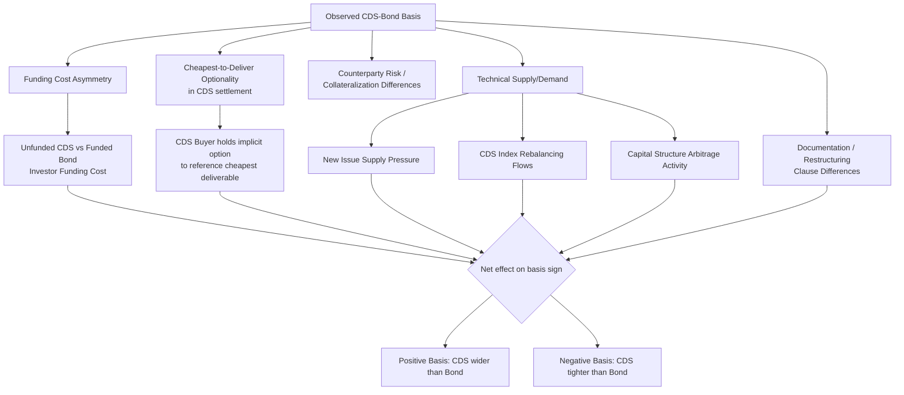

## Credit Spread Curves and the CDS Bond Basis

### Overview

Credit spread curves capture how a reference entity's credit risk premium varies across maturities, providing the term structure input for hazard rate bootstrapping, relative value analysis, and derivative pricing. The CDS-bond basis measures the divergence between the compensation for credit risk embedded in a reference entity's CDS spread versus its cash bond spread, a persistent and economically significant feature of credit markets driven by structural, technical, and funding factors rather than pure credit risk differences. Understanding both the shape of credit curves and the drivers of basis is central to credit relative value trading, hedging effectiveness assessment, and interpreting what CDS and bond markets are respectively pricing.

**Key Points**

- Credit spread curves can be upward-sloping (normal, reflecting increasing cumulative default risk and/or term premium with maturity), flat, or inverted (elevated near-term spreads, typically signaling near-term distress concern).
- The CDS-bond basis is defined as $\text{Basis} = \text{CDS Spread} - \text{Bond Spread}$ (asset swap spread or Z-spread), and can be positive (CDS trading wide of bonds, "positive basis") or negative ("negative basis").
- Funding cost asymmetry, cheapest-to-deliver optionality in CDS, counterparty risk considerations, and technical supply/demand imbalances are the primary structural drivers of basis, distinct from any difference in fundamental credit view.

---

### Credit Spread Curve Shapes and Interpretation

**Normal (upward-sloping) curve:** The most common shape for investment-grade and stable credits, where longer-dated CDS/bond spreads are wider than shorter-dated ones, reflecting (a) increasing cumulative probability of default over a longer horizon and (b) a term premium compensating investors for extended exposure to credit deterioration risk and reduced liquidity at longer tenors.

**Flat curve:** Spreads roughly similar across tenors, sometimes observed for credits where near-term and longer-term default risk assessments are similar, or where market segments show comparable liquidity/demand across the curve.

**Inverted curve:** Short-dated spreads wider than long-dated spreads — a pattern closely associated with acute near-term distress concern. [Verified] An inverted CDS curve is a classic signal that the market is pricing significant near-term default risk (e.g., an imminent liquidity crisis, upcoming refinancing wall, or pending restructuring announcement); the economic logic is that if the market assigns high probability to default occurring imminently, the conditional probability of survival to, and subsequent default within, the more distant future years becomes comparatively lower (since many of the probability-weighted "bad outcomes" are already assumed to occur in the near term), pulling down the incremental (marginal) spread compensation required for the longer tenor relative to the front end.

**Example:** A distressed company facing a debt maturity wall in 12 months might show a CDS curve of: 1Y = 1500bps, 3Y = 900bps, 5Y = 700bps — a steeply inverted shape reflecting market pricing that concentrates default risk expectation in the near-term refinancing window, consistent with the hazard-rate bootstrapping pattern (front-loaded high hazard rate, declining conditional hazard for later tenors) discussed in default probability modeling.

---

### Measuring Bond Credit Spread: Z-Spread and Asset Swap Spread

To compare a cash bond's credit compensation against CDS spreads on a consistent basis, two primary bond spread measures are used:

**Z-spread (zero-volatility spread):** The constant spread that, when added to each point on the risk-free (or relevant benchmark) discount curve, causes the present value of the bond's cash flows to equal its observed market price.

$$P_{bond} = \sum_{i=1}^{n} \frac{CF_i}{(1 + r_i + Z)^{t_i}}$$

where $r_i$ is the benchmark zero rate at each cash flow date, $Z$ is the Z-spread (solved for), and $CF_i$ are the bond's cash flows.

**Asset swap spread (ASW):** The spread over a floating reference rate (historically LIBOR, now the relevant RFR) that would be received/paid in an asset swap package that converts the bond's fixed cash flows into a floating-rate profile, structured such that the package trades at par at inception — a measure that more directly reflects the practical spread a market participant could lock in by combining the bond with an interest rate swap, and which was historically the more commonly quoted convention in dealer markets prior to the more theoretically clean Z-spread gaining broader analytical use, though both remain in use depending on desk/market convention.

[Unverified — comparative nuance] Z-spread and asset swap spread are conceptually related but not always numerically identical for a given bond, since ASW construction involves specific par/market-price asset swap structuring conventions and the specific mechanics of accrued interest and upfront payment treatment in the swap package, whereas Z-spread is a purely discount-curve-based calculation without reference to any actual swap transaction structure.

---

### Defining and Calculating the CDS-Bond Basis

$$\text{CDS-Bond Basis} = \text{CDS Spread} - \text{Bond Spread (Z-spread or ASW)}$$

**Positive basis:** CDS spread trades wider (higher) than the comparable bond spread — protection via CDS is "more expensive" relative to the compensation offered by holding the cash bond.

**Negative basis:** CDS spread trades tighter (lower) than the comparable bond spread — protection via CDS is "cheaper" relative to the cash bond's offered spread, historically a more commonly observed condition in various market regimes (particularly noted as prevalent during and after the 2008 financial crisis, when technical and funding factors pushed many basis relationships negative), though the sign and magnitude of basis varies over time and across credits and is not a fixed, permanent market feature.

**Example:** If a reference entity's 5-year CDS trades at 200bps and its comparable 5-year senior unsecured bond has a Z-spread of 230bps:

$$\text{Basis} = 200\text{bps} - 230\text{bps} = -30\text{bps (negative basis)}$$

This suggests that, before considering the structural/technical factors discussed below, buying the bond and simultaneously buying CDS protection ("negative basis trade") to hedge, would theoretically lock in a small positive carry, since the bond offers greater spread compensation (230bps) than the cost of hedging via CDS (200bps) — though the actual attractiveness and risk of executing such a trade depends heavily on the specific technical factors driving the basis, discussed next.

---

### Structural Drivers of CDS-Bond Basis

**1. Funding Cost Asymmetry**

A CDS position requires no funding of the notional (only margin/collateral posting under a CSA), whereas holding a cash bond requires funding the full purchase price (via repo or balance sheet funding), at the investor's specific funding cost. [Verified] This funding cost differential is one of the most persistently cited structural drivers of basis — an investor whose funding cost for holding the bond is elevated relative to the reference risk-free rate effectively bears an additional cost not present in the unfunded CDS position, which can be reflected in the bond needing to offer additional spread compensation relative to CDS to attract funded investors, contributing to negative basis.

**2. Cheapest-to-Deliver (CTD) Optionality**

As discussed in CDS mechanics, upon a credit event, CDS settlement/auction final price is determined based on the reference entity's deliverable obligations broadly (not just the single specific reference obligation), meaning the protection buyer effectively holds an option to deliver (or have the auction reference) the cheapest eligible deliverable obligation among the reference entity's various debt instruments. [Verified] This cheapest-to-deliver optionality has positive value to the protection buyer, which — in an efficient market — should be reflected in the CDS trading somewhat wider (i.e., contributing toward positive basis) than a specific single bond's spread would otherwise suggest in isolation, since the CDS protection buyer is receiving optionality value not present when simply holding/selling a specific bond.

**3. Counterparty Risk and Collateralization Differences**

The credit risk of the CDS protection seller itself (particularly relevant for uncleared, bilateral CDS trades without robust collateralization) versus the direct ownership risk of a cash bond (subject only to the reference entity's own credit risk, not an intermediary's) can create basis effects, though [Unverified — reduced with clearing] the widespread move toward central clearing of standardized CDS has reduced, though not entirely eliminated for all trade types, the relative significance of this particular driver compared to the earlier bilateral-dominant era of the CDS market.

**4. Technical Supply/Demand Imbalances**

- **New issue supply effects:** Heavy new bond issuance from a reference entity can pressure cash bond spreads wider (to clear increased supply) without a corresponding CDS spread move, temporarily affecting basis.
- **Index-driven CDS technical flows:** CDS index (CDX/iTraxx) rebalancing, hedging flows from structured credit products, and broader macro hedging demand using CDS indices can create CDS-specific technical pressure not mirrored in the underlying single-name cash bond markets.
- **Convertible bond and capital structure arbitrage flows:** Activity in a company's convertible bonds or other capital structure arbitrage strategies can generate CDS-specific hedging demand distinct from outright cash bond market activity.

**5. Restructuring Clause and Documentation Basis**

[Unverified — regional/vintage specific] Differences in which restructuring clause variant (Full Restructuring, Mod R, Mod Mod R, No Restructuring) applies to a specific CDS contract can create legitimate economic differences in the scope of protection offered relative to holding the underlying bond outright, contributing a documentation-driven component to observed basis that is separate from pure funding/technical factors.

---

### The Negative Basis Trade

**Structure:** Buy the cash bond, simultaneously buy CDS protection referencing the same (or a closely related) reference entity, in a scenario where the bond's spread exceeds the CDS spread (negative basis).

**Economic rationale:** If executed and held to maturity (or credit event), the position theoretically locks in the basis as a form of "arbitrage" carry — earning the bond's higher coupon/spread while paying a lower CDS premium for equivalent (though not always perfectly matched) credit protection.

**Practical complications:** [Verified] Negative basis trades are not risk-free arbitrage in practice, for several reasons: the position requires funding the bond purchase (introducing funding cost and repo rate risk over the trade's life, which can itself move adversely), the CDS and bond may have differing maturities or coupon/cash flow structures requiring imperfect hedge ratios, the trade carries mark-to-market volatility from basis fluctuation even before any credit event (potentially generating margin calls or unrealized losses well before any final resolution), and in a credit event, the specific cheapest-to-deliver obligation used in CDS settlement may not exactly match the specific bond held, creating basis risk in the settlement outcome itself relative to the bond's actual realized value.

---

### Diagram: CDS-Bond Basis Structure (svg_diagram)

<svg xmlns="http://www.w3.org/2000/svg" viewBox="0 0 760 380" font-family="Arial, sans-serif">
<text x="380" y="26" font-size="17" font-weight="bold" text-anchor="middle">CDS-Bond Basis: Negative Basis Trade Structure (svg_diagram)</text>
<rect x="40" y="60" width="200" height="90" rx="8" fill="#e8f0fe" stroke="#1a56db" stroke-width="2" />
<text x="140" y="90" font-size="13" text-anchor="middle" font-weight="bold">Cash Bond Position</text>
<text x="140" y="110" font-size="11" text-anchor="middle">Z-spread: 230bps</text>
<text x="140" y="128" font-size="11" text-anchor="middle">Requires funding</text>
<rect x="540" y="60" width="200" height="90" rx="8" fill="#fdecea" stroke="#c0392b" stroke-width="2" />
<text x="640" y="90" font-size="13" text-anchor="middle" font-weight="bold">CDS Protection Bought</text>
<text x="640" y="110" font-size="11" text-anchor="middle">CDS spread: 200bps</text>
<text x="640" y="128" font-size="11" text-anchor="middle">Unfunded, margined</text>

<text x="390" y="105" font-size="20" text-anchor="middle" font-weight="bold">+</text>

<line x1="390" y1="170" x2="390" y2="200" stroke="#555" stroke-width="1" />
<rect x="180" y="200" width="420" height="60" rx="8" fill="#fff8e1" stroke="#b8860b" stroke-width="1.5" />
<text x="390" y="225" font-size="12" text-anchor="middle" font-weight="bold">Net position: Basis = 200 − 230 = −30bps</text>
<text x="390" y="245" font-size="11" text-anchor="middle">Theoretical carry: bond spread income exceeds CDS cost</text>
<line x1="390" y1="260" x2="390" y2="285" stroke="#555" stroke-width="1" />
<rect x="120" y="285" width="540" height="80" rx="8" fill="#f4f4f4" stroke="#555" stroke-width="1.5" />
<text x="390" y="308" font-size="12" text-anchor="middle" font-weight="bold">Real-world complications:</text>
<text x="390" y="326" font-size="11" text-anchor="middle">Funding/repo cost risk, maturity/cash flow mismatch,</text>
<text x="390" y="343" font-size="11" text-anchor="middle">mark-to-market basis volatility, CTD settlement mismatch risk</text>
</svg>

---

### Basis Driver Decomposition Flow

---

### Practical Considerations

- **Basis as a market sentiment indicator:** [Unverified — interpretive, not a precise signal] Persistent or shifting basis levels for a specific reference entity or sector are sometimes used by credit analysts as one input (among several) for gauging relative technical positioning or funding market stress, though basis reflects a combination of multiple structural factors rather than being a clean, isolated signal of any single underlying driver.
- **Basis package trading and index arbitrage:** Beyond single-name negative/positive basis trades, similar basis concepts apply at the CDS index level (comparing CDX/iTraxx index spreads to the weighted-average spread of the underlying constituent single names, known as "index-intrinsics basis" or "skew"), a related but distinct relative value framework from single-name CDS-bond basis.
- **Liquidity considerations in execution:** [Unverified — market/name-specific] The actual tradability and bid-offer cost of executing a specific single-name CDS-bond basis position depends heavily on the liquidity of both the specific CDS contract and the specific bond issue in question, which can vary substantially across reference entities, particularly for smaller-cap or less liquid issuers compared to large, frequently-traded reference entities.

**Related Topics**

- Z-Spread and Asset Swap Spread Calculation Methodologies
- Cheapest-to-Deliver Optionality in CDS Settlement Mechanics
- CDS Index Skew and Index-Intrinsics Basis
- Repo Funding and Its Role in Basis Trade Economics
- Inverted Credit Curves as Distress Signals
- Capital Structure Arbitrage Strategies Using CDS
- Restructuring Clause Variants and Basis Impact