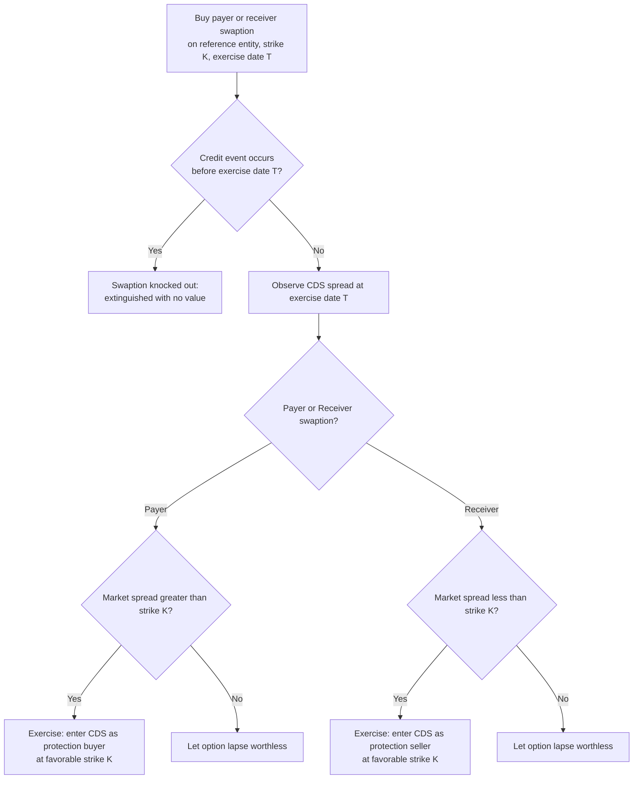

## Credit Default Swaptions

### Overview

A credit default swaption (CDS option, or "CDS swaption") is an option granting the holder the right, but not the obligation, to enter into a specified CDS contract at a predetermined spread (the strike) on a future exercise date. CDS swaptions allow market participants to take views on future credit spread volatility, hedge forward credit exposure, or express directional views on credit spreads with defined, limited downside — extending the options framework familiar from interest rate and equity derivatives into the credit derivatives space, with several credit-specific structural features (particularly around default risk during the option's life) that distinguish CDS swaption mechanics from standard equity or rate options.

**Key Points**

- A payer swaption gives the right to buy protection (pay the fixed spread) at the strike; a receiver swaption gives the right to sell protection (receive the fixed spread) at the strike.
- Unlike equity or rate options, CDS swaptions have a unique "knockout" feature in standard single-name documentation: if the reference entity experiences a credit event before the option's exercise date, the option is typically extinguished (knocked out) rather than automatically exercised into a defaulted-name CDS position.
- Pricing draws on adapted Black-76-style framework applied to forward CDS spreads, but must additionally account for the knockout feature and the distinct dynamics of credit spread (rather than rate or equity price) as the underlying.

---

### Basic Structure and Terminology

**Payer Swaption:** Grants the holder the right to become a protection buyer (pay the fixed premium leg) on the underlying CDS at the strike spread, upon exercise. A payer swaption is economically analogous to a call option on credit spread (or, viewed differently, a put option on the reference entity's credit quality) — the holder profits if spreads widen (credit quality deteriorates) beyond the strike by expiration, since they can then enter into (or, more commonly in practice, cash-settle against) a CDS at the favorable, lower strike premium relative to the wider prevailing market spread.

**Receiver Swaption:** Grants the holder the right to become a protection seller (receive the fixed premium leg) at the strike spread — economically analogous to a put option on credit spread, profiting if spreads tighten (credit quality improves) below the strike, allowing the holder to sell protection at a favorable strike wide of the tighter prevailing market level.

**Key parameters:**

- **Underlying CDS:** The specific single-name or index CDS contract the swaption grants the right to enter (specified reference entity, maturity from the exercise date, standard coupon convention).
- **Strike Spread:** The fixed spread at which the underlying CDS would be transacted upon exercise.
- **Exercise Date:** The single date (European-style is standard market convention for CDS swaptions) on which the holder can elect to exercise.
- **Option Premium:** The upfront amount paid by the option buyer to the option seller for the option itself, separate from the strike spread of the underlying CDS.

---

### The Knockout Feature: A Defining Credit-Specific Mechanic

**The problem:** Unlike an equity option (where the underlying stock price simply reflects ongoing information, including deteriorating credit quality, without the company necessarily "ceasing to exist" as an equity) or most rate options (where the underlying rate doesn't disappear), a CDS's underlying reference entity can experience an actual credit event during the life of the option — fundamentally changing what it would even mean to "exercise into" a CDS on that name after default has already occurred.

**Standard market convention — Knockout provision:** [Verified] Standard CDS swaption documentation includes a knockout provision: if the reference entity (for single-name swaptions) experiences a credit event prior to the swaption's expiration date, the swaption is automatically extinguished (knocked out) with no value, rather than being deemed automatically exercised or settled based on the default.

**Economic rationale:** [Unverified — market design interpretation] This knockout design reflects the practical reality that a CDS swaption is generally intended to express a view on the credit spread dynamics of a name that survives to the exercise date, and pricing/hedging a scenario where the option could instead be exercised into a defaulted-name CDS position (with the attendant complexities of what that would even mean operationally) would be considerably more complex; the market's chosen convention (knockout) simplifies both pricing and the operational/legal mechanics considerably, at the cost of the payer swaption holder losing the option premium entirely in a default scenario despite the default being, in an intuitive sense, an extreme realization of exactly the "spread widening" event the payer swaption was designed to profit from.

**Practical implication for payer swaption buyers:** A payer swaption buyer seeking pure credit deterioration protection needs to be aware that the single most extreme deterioration outcome (outright default before expiration) actually extinguishes their option rather than generating a payout — meaning a payer swaption is a bet on *spread widening short of outright default* before the exercise date, not a comprehensive hedge against default risk itself (a distinction with real practical hedging implications, since outright CDS protection, rather than a CDS payer swaption, remains the more direct instrument for hedging default risk itself).

---

### Pricing Framework: Adapted Black-76 Model

CDS swaptions are commonly priced using an adaptation of the Black-76 model (originally developed for pricing options on interest rate futures/forwards), applied to the forward CDS spread as the underlying, with modification for the credit-specific knockout feature and the "risky annuity" concept.

**Forward CDS spread:** The market-implied spread for a CDS contract that would start at the swaption's exercise date and run for the specified tenor thereafter, derived from the term structure of currently observed CDS spreads (via the hazard rate bootstrapping framework).

**Adapted Black-76 formula (payer swaption, conceptual form):**

$$\text{Payer Swaption Value} = A(0) \times \left[F \times N(d_1) - K \times N(d_2)\right]$$

$$d_1 = \frac{\ln(F/K) + \frac{1}{2}\sigma^2 T}{\sigma\sqrt{T}}, \quad d_2 = d_1 - \sigma\sqrt{T}$$

where:

- $F$ = forward CDS spread (from the exercise date to the underlying CDS maturity)
- $K$ = strike spread
- $\sigma$ = spread volatility (annualized)
- $T$ = time to exercise
- $A(0)$ = the **risky annuity** (present value of a stream of premium payments over the underlying CDS's life, weighted by the survival probability of the reference entity — analogous to the "annuity" or "level" factor in swaption pricing, but incorporating credit survival probability rather than just discounting)
- $N(\cdot)$ = cumulative standard normal distribution function

**The risky annuity's role:** [Verified] The risky annuity $A(0)$ is a critical adaptation specific to credit swaptions, since it must incorporate the reference entity's survival probability over the relevant premium payment period — a payer swaption's value is conditioned on the reference entity actually surviving to the exercise date (per the knockout feature) and the underlying CDS's premium leg cash flows themselves being contingent on continued survival thereafter, distinguishing this from a standard interest rate swaption's annuity, which does not need to incorporate any analogous survival/default contingency.

**Put-call parity (payer-receiver parity) for CDS swaptions:** Analogous to standard option put-call parity, a relationship holds between payer and receiver swaption values of the same strike and expiration (adjusted for the specific credit-contingent risky annuity and forward spread mechanics), allowing consistency checks and replication-based pricing/hedging relationships between the two swaption types.

---

### Credit Spread Volatility as the Key Input

**The central pricing challenge:** Unlike equity or interest rate volatility, where liquid, actively-traded option markets across many strikes and maturities provide relatively continuous implied volatility surface calibration, CDS swaption markets are considerably less liquid than the underlying CDS or CDS index market itself, meaning implied credit spread volatility is a comparatively more sparsely-observed, less continuously calibrated market input.

[Unverified — market liquidity characterization, general] CDS index swaptions (options on CDX/iTraxx index CDS) are generally understood to be meaningfully more liquid than single-name CDS swaptions, given that index-level credit hedging and volatility trading activity from macro credit funds and dealers concentrates liquidity there, while single-name CDS swaption activity tends to be more sporadic and driven by specific situational hedging or event-driven trading needs (e.g., around anticipated M&A, earnings, or credit rating actions for a specific name) rather than continuous two-way market-making comparable to the underlying single-name CDS market itself.

---

### Use Cases

**1. Hedging forward credit exposure:** A portfolio manager anticipating the need to buy protection at a future date (e.g., ahead of an anticipated bond issuance requiring hedging, or ahead of a specific known future risk event) can lock in a maximum cost of protection via a payer swaption, capping their forward hedging cost while retaining the ability to let the option lapse if spreads instead tighten favorably by the exercise date.

**2. Expressing credit spread volatility views:** Since swaption value is directly sensitive to implied credit spread volatility (vega exposure), traders can use CDS swaptions (particularly straddle or strangle combinations of payer and receiver swaptions) to take views on anticipated credit spread volatility around specific events (earnings, litigation outcomes, ratings reviews) independent of a pure directional spread view.

**3. Yield enhancement via receiver swaption writing:** An investor willing to sell credit protection at a specified future spread level (if the market moves there) can write receiver swaptions, collecting premium income in exchange for the (capped, since receiver swaption sellers are effectively short a payer-equivalent exposure) obligation to potentially sell protection at the strike if exercised.

**4. Structuring around anticipated events:** Because of the knockout feature, CDS swaptions are particularly suited to expressing views on "spread widening short of default" scenarios specifically — for example, a view that a company will experience credit deterioration (ratings downgrade, negative earnings surprise) without necessarily defaulting outright within the option's life, a nuanced view that a straightforward outright CDS position does not as precisely isolate.

---

### Diagram: CDS Payer Swaption Payoff Structure (svg_diagram)

<svg xmlns="http://www.w3.org/2000/svg" viewBox="0 0 700 380" font-family="Arial, sans-serif">
<text x="350" y="26" font-size="17" font-weight="bold" text-anchor="middle">CDS Payer Swaption: Payoff vs. Spread at Expiration (svg_diagram)</text>
<line x1="70" y1="300" x2="650" y2="300" stroke="#333" stroke-width="1.5" />
<line x1="70" y1="300" x2="70" y2="50" stroke="#333" stroke-width="1.5" />
<text x="360" y="335" font-size="12" text-anchor="middle">CDS Spread at Exercise Date</text>
<text x="30" y="175" font-size="12" text-anchor="middle" transform="rotate(-90 30 175)">Swaption Payoff</text>
<line x1="70" y1="280" x2="330" y2="280" stroke="#1a56db" stroke-width="3" />
<line x1="330" y1="280" x2="620" y2="90" stroke="#1a56db" stroke-width="3" />
<line x1="330" y1="300" x2="330" y2="60" stroke="#999" stroke-width="1" stroke-dasharray="4,4" />
<text x="330" y="315" font-size="11" text-anchor="middle">Strike (K)</text>
<rect x="470" y="130" width="150" height="70" rx="6" fill="#fdecea" stroke="#c0392b" stroke-width="1.5" />
<text x="545" y="155" font-size="11" text-anchor="middle" font-weight="bold">Above strike:</text>
<text x="545" y="172" font-size="10" text-anchor="middle">Payoff grows with</text>
<text x="545" y="187" font-size="10" text-anchor="middle">spread widening</text>
<circle cx="620" cy="90" r="5" fill="#c0392b" />
<text x="590" y="75" font-size="10" text-anchor="middle" fill="#c0392b">Knockout if</text>
<text x="590" y="60" font-size="10" text-anchor="middle" fill="#c0392b">credit event occurs first</text>
<rect x="100" y="220" width="220" height="55" rx="6" fill="#f4f4f4" stroke="#555" stroke-width="1.5" />
<text x="210" y="240" font-size="10" text-anchor="middle" font-weight="bold">Below strike:</text>
<text x="210" y="256" font-size="10" text-anchor="middle">Option lapses worthless,</text>
<text x="210" y="270" font-size="10" text-anchor="middle">lose premium paid</text>
</svg>

---

### CDS Swaption Lifecycle Flow

---

### Practical Considerations

- **Liquidity concentration in index swaptions:** [Unverified — general market characterization] Given the relatively lower liquidity of single-name CDS swaptions compared to index CDS swaptions, practitioners seeking to express single-name credit volatility views sometimes face wider bid-offer spreads and less continuous market-making than would be available in equivalent index-level products, a practical consideration when structuring single-name credit volatility strategies.
- **Model risk in volatility calibration:** Because implied credit spread volatility is less richly observed across strikes and maturities than in more liquid options markets (equities, rates), calibrating a robust volatility surface for CDS swaption pricing often requires more model-dependent assumptions or extrapolation from limited observable data points, introducing greater model risk relative to asset classes with denser observable option market data.
- **Interaction with restructuring clause and documentation nuances:** As with outright CDS, the specific credit event definitions and restructuring clause variant applicable to the underlying CDS referenced by a swaption affect the precise scope of what constitutes a "credit event" for knockout purposes, requiring the same documentation-level attention to detail as outright CDS positions.

**Related Topics**

- Adapted Black-76 Model and the Risky Annuity Concept
- CDS Index Swaptions on CDX and iTraxx
- Credit Spread Volatility Surface Construction and Calibration
- Forward CDS Spread Derivation from Hazard Rate Curves
- Payer-Receiver Swaption Parity Relationships
- Event-Driven Credit Volatility Trading Strategies
- Restructuring Clause Impact on Credit Derivative Documentation