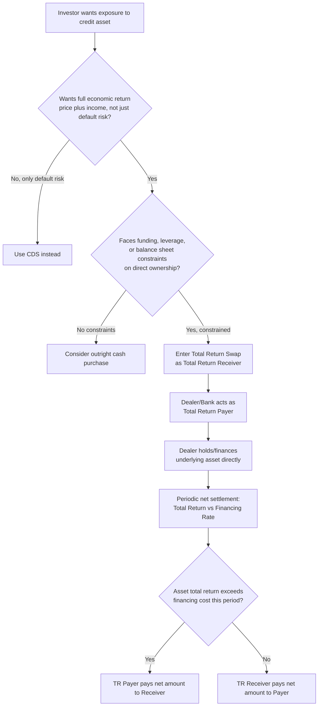

## Financing and Total Return Swaps on Credit Assets

### Overview

A total return swap (TRS) on credit assets is a derivative through which one party (the total return receiver) obtains the full economic exposure of a reference credit asset — coupon income, price appreciation, and price depreciation — without owning it, while the other party (the total return payer, typically the actual owner/financer of the asset) receives a financing-rate-based payment in exchange. Unlike a CDS, which transfers only credit event risk, a TRS transfers the *total* economic return of the underlying asset, combining credit risk transfer with an embedded financing/funding transaction — making TRS fundamentally a leverage and balance-sheet tool as much as a pure credit risk transfer instrument.

**Key Points**

- TRS transfers both credit risk (default, spread widening/tightening) and market/price risk of the underlying asset, unlike CDS, which isolates only credit event risk.
- The total return payer effectively "finances" the position for the receiver, who gains leveraged, off-balance-sheet economic exposure without directly purchasing or funding the asset.
- TRS on credit assets (bonds, loans, or CDS indices) are widely used for balance sheet management, leveraged credit exposure, and providing financing to entities (e.g., hedge funds, structured vehicles) that face constraints on direct asset ownership or leverage.

---

### Basic TRS Structure and Cash Flows

**Parties:**

- **Total Return Payer (TR Payer):** Typically the legal owner of the reference asset (a bond, loan, or basket/index of credit instruments), who retains legal title but passes through the asset's full economic performance to the counterparty. Often a bank or dealer using the TRS to provide synthetic financing.
- **Total Return Receiver (TR Receiver):** Receives the total economic return of the reference asset (coupon/interest income plus price appreciation, or minus price depreciation) in exchange for paying a financing rate (typically a floating reference rate plus a spread) to the TR Payer.

**Cash flow structure:**

$$\text{TR Receiver pays (financing leg):} \quad N \times (r_{ref} + \text{spread}) \times \Delta t$$

$$\text{TR Payer pays (total return leg):} \quad \text{Coupon/interest income} + \left(P_{end} - P_{start}\right)$$

where $N$ is the notional (typically equal to the reference asset's market value at inception), $r_{ref}$ is a reference floating rate (e.g., SOFR post-benchmark reform, replacing LIBOR pre-reform), and $P_{end}, P_{start}$ are the reference asset's prices at the end and start of the relevant period (or, for the final period, at TRS maturity/termination).

**Netting convention:** In practice, the two legs are typically netted into a single payment at each reset date — if the asset's total return (coupon plus price change) exceeds the financing cost, the TR Payer makes a net payment to the TR Receiver; if the financing cost exceeds the asset's total return (e.g., the asset price has fallen), the TR Receiver makes a net payment to the TR Payer.

**Example:** A TR Receiver enters a 1-year TRS on a corporate bond, notional $10 million, referencing SOFR + 50bps as the financing rate, with the bond currently priced at par (100) and paying a 6% annual coupon. Over the year, the bond's price falls to 96 (reflecting spread widening) while SOFR averages 5.30%:

- Total return leg (TR Payer owes): Coupon (6% × $10mm = $600,000) + Price change ((96-100)/100 × $10mm = -$400,000) = **net +$200,000** owed by TR Payer to TR Receiver
- Financing leg (TR Receiver owes): (5.30% + 0.50%) × $10mm = **$580,000** owed by TR Receiver to TR Payer

Net settlement: TR Receiver owes the TR Payer $580,000 - $200,000 = **$380,000**, reflecting that in this scenario the combination of a modest bond total return and the financing cost resulted in a net payment from the receiver, despite the receiver's exposure to the bond's price decline being the primary driver of the poor "return leg" outcome for that period.

---

### TRS as a Financing Mechanism

**Synthetic leverage:** [Verified] A TRS allows the total return receiver to gain full economic exposure to an asset (or basket of assets) without committing the full purchase price as capital — effectively obtaining leveraged exposure, since the receiver's actual cash outlay is typically limited to posting initial margin/collateral under the TRS agreement rather than the asset's full notional value, unlike an outright cash purchase which would require full funding.

**Off-balance-sheet exposure:** Because the TR Payer retains legal ownership of the underlying asset, the TR Receiver gains the asset's economic exposure without the asset appearing on their own balance sheet as a direct holding — a structural feature historically relevant for regulatory capital, leverage ratio, and balance sheet optimization purposes for various types of institutional participants, subject to the specific accounting and regulatory treatment applicable to the receiver's jurisdiction and entity type.

**Why banks act as TR Payers:** [Unverified — general market rationale] Banks and dealers often act as TR Payer/financing providers in credit TRS structures because they may have more efficient funding costs or balance sheet capacity for holding the underlying asset directly (e.g., via repo funding) than the TR Receiver would have for an outright purchase, allowing the dealer to earn a financing spread (the difference between their own funding cost and the rate charged to the TR Receiver) while passing through the underlying asset's market/credit risk.

---

### TRS on CDS Indices

Beyond single bonds or loans, total return swaps are also structured on CDS indices (CDX, iTraxx) themselves, providing an alternative mechanism (distinct from directly trading the CDS index) for gaining leveraged, financed exposure to an index's total return (which incorporates both the income from the index's fixed coupon and the index's price/spread movement).

**Distinction from directly trading CDS index:** [Unverified — structural nuance] A TRS on a CDS index and directly trading the underlying CDS index itself are related but not perfectly identical exposures — a CDS index TRS combines the underlying index's credit/spread exposure with the specific financing rate terms of the TRS structure, meaning the effective "cost of carry" and specific mark-to-market mechanics can differ somewhat from a direct CDS index position, particularly relevant for basis and financing-cost-sensitive relative value strategies.

---

### Comparison: TRS vs. CDS vs. Outright Bond Purchase

| Feature | Outright Bond Purchase | CDS (Protection Buyer) | Total Return Swap (Receiver) |
| --- | --- | --- | --- |
| Exposure captured | Full economic return (price + coupon) | Credit event risk only | Full economic return (price + coupon/income) |
| Funding requirement | Full notional (or repo-financed) | None (only margin/CSA collateral) | Margin/collateral only (financed exposure) |
| Legal ownership of asset | Yes | No (no ownership needed) | No (TR Payer retains ownership) |
| Captures spread widening/tightening (no default) | Yes (via price change) | No (CDS payoff tied to defined credit events, not general spread moves, though CDS mark-to-market does reflect spread changes for open positions) | Yes (via price change) |
| Balance sheet impact | On-balance-sheet asset | Off-balance-sheet derivative | Off-balance-sheet (for receiver) |
| Typical use case | Direct investment | Pure credit event hedging/speculation | Leveraged/financed directional exposure |

**Key distinction — TRS vs. CDS mark-to-market:** [Verified] While a CDS position's mark-to-market value does change with spread movements (an open CDS position gains/loses value as the market spread relative to the contract's fixed coupon changes), a CDS's actual cash flow payoff structure is fundamentally triggered by a defined credit event, whereas a TRS's cash flows are driven by the ongoing, continuous total return of the reference asset — including price fluctuations from spread widening/tightening that fall well short of any credit event — with settlement (netting) typically occurring at each periodic reset date, not solely contingent on default.

---

### Applications Beyond Simple Financing

**1. Providing leveraged exposure to constrained investors:** Hedge funds or other investors facing direct leverage constraints, regulatory capital charges for direct asset ownership, or operational barriers to holding certain asset types directly (e.g., syndicated loans requiring specific administrative/servicing infrastructure) can use TRS to gain the desired economic exposure through a dealer counterparty who handles the actual underlying asset ownership and servicing.

**2. Balance sheet and regulatory capital management:** [Unverified — regulatory-framework dependent] Financial institutions may use TRS structures as part of broader balance sheet optimization strategies, transferring the economic risk (and associated regulatory capital charge, subject to the specific applicable capital framework's treatment of such structures) of a credit asset to a counterparty while retaining legal title, though the specific regulatory capital relief (if any) available through such structures depends heavily on the applicable jurisdiction's capital rules and the specific structuring of the transaction.

**3. Synthetic securitization building blocks:** TRS (and related credit-linked note structures) can serve as building blocks within broader synthetic securitization structures, where the economic risk of a reference credit portfolio is transferred to investors via derivative-based mechanisms rather than a true-sale transfer of the underlying assets.

**4. Warehouse financing for CLOs/CDOs:** [Unverified — structuring practice, general] TRS structures have historically been used in "warehouse" financing arrangements during the accumulation phase of collateralized loan obligation (CLO) or similar structured credit vehicle formation, allowing the eventual CLO manager/sponsor to accumulate a portfolio of underlying loans with financing support from a dealer counterparty via TRS, prior to the vehicle's formal securitization closing.

---

### Diagram: Total Return Swap Cash Flow Structure (svg_diagram)

<svg xmlns="http://www.w3.org/2000/svg" viewBox="0 0 760 400" font-family="Arial, sans-serif">
<text x="380" y="26" font-size="17" font-weight="bold" text-anchor="middle">Total Return Swap on Credit Asset (svg_diagram)</text>
<rect x="40" y="70" width="200" height="100" rx="8" fill="#e8f0fe" stroke="#1a56db" stroke-width="2" />
<text x="140" y="100" font-size="13" text-anchor="middle" font-weight="bold">Total Return Payer</text>
<text x="140" y="120" font-size="11" text-anchor="middle">Owns reference asset</text>
<text x="140" y="137" font-size="11" text-anchor="middle">(e.g., dealer/bank)</text>
<text x="140" y="154" font-size="11" text-anchor="middle">Retains legal title</text>
<rect x="520" y="70" width="200" height="100" rx="8" fill="#fdecea" stroke="#c0392b" stroke-width="2" />
<text x="620" y="100" font-size="13" text-anchor="middle" font-weight="bold">Total Return Receiver</text>
<text x="620" y="120" font-size="11" text-anchor="middle">Gains full economic</text>
<text x="620" y="137" font-size="11" text-anchor="middle">exposure to asset</text>
<text x="620" y="154" font-size="11" text-anchor="middle">(e.g., hedge fund)</text>
<line x1="240" y1="95" x2="520" y2="95" stroke="#1a56db" stroke-width="2" marker-end="url(#t1)" />
<text x="380" y="88" font-size="11" text-anchor="middle" fill="#1a56db">Coupon/Interest + Price Appreciation</text>
<line x1="520" y1="145" x2="240" y2="145" stroke="#c0392b" stroke-width="2" marker-end="url(#t2)" />
<text x="380" y="163" font-size="11" text-anchor="middle" fill="#c0392b">Financing Rate (SOFR + spread) + Price Depreciation</text>
<line x1="140" y1="170" x2="140" y2="220" stroke="#555" stroke-width="1" stroke-dasharray="4,4" />
<rect x="40" y="220" width="200" height="70" rx="8" fill="#f4f4f4" stroke="#555" />
<text x="140" y="245" font-size="11" text-anchor="middle" font-weight="bold">Underlying Reference Asset</text>
<text x="140" y="263" font-size="10" text-anchor="middle">Bond, Loan, or CDS Index</text>
<text x="140" y="278" font-size="10" text-anchor="middle">Legally held by TR Payer</text>
<rect x="290" y="310" width="180" height="60" rx="8" fill="#fff8e1" stroke="#b8860b" stroke-width="1.5" />
<text x="380" y="333" font-size="11" text-anchor="middle" font-weight="bold">Net effect on Receiver:</text>
<text x="380" y="352" font-size="10" text-anchor="middle">Leveraged exposure, no direct</text>
<text x="380" y="365" font-size="10" text-anchor="middle">ownership or full funding</text>
</svg>

---

### TRS Structuring Decision Flow

---

### Practical Considerations

- **Counterparty credit risk on the TR Payer:** Since the TR Receiver depends on the TR Payer to make good on total return payments (and does not directly own the underlying asset), the TR Payer's own creditworthiness is a relevant risk consideration for the receiver, distinct from the reference asset's own credit risk — a dual credit risk exposure (to both the reference asset and the TR Payer counterparty) that outright asset ownership does not carry.
- **Margin and collateral mechanics:** [Unverified — agreement-specific] TRS agreements typically involve initial margin and ongoing variation margin/collateral posting (particularly for uncleared bilateral TRS under standard ISDA/CSA-style documentation) reflecting the mark-to-market value of the total return exposure, with specific margining terms varying by counterparty agreement and applicable regulatory margin requirements for the specific product and jurisdiction.
- **Accounting and regulatory treatment complexity:** [Unverified — jurisdiction and framework dependent] The accounting treatment (on/off-balance-sheet classification) and regulatory capital treatment of TRS positions for both the TR Payer and TR Receiver can be complex and varies by applicable accounting standard and prudential regulatory framework, an area requiring specific technical accounting and regulatory expertise for any given institution's specific facts and circumstances rather than a single universal treatment.

**Related Topics**

- CDS Index Total Return Swaps and Basis to Direct Index Trading
- Synthetic Securitization Structures Using TRS Building Blocks
- CLO Warehouse Financing Mechanics
- Repo Financing vs. TRS Financing Cost Comparison
- Counterparty Credit Risk in Uncleared TRS Agreements
- Regulatory Capital Treatment of Total Return Swap Exposures