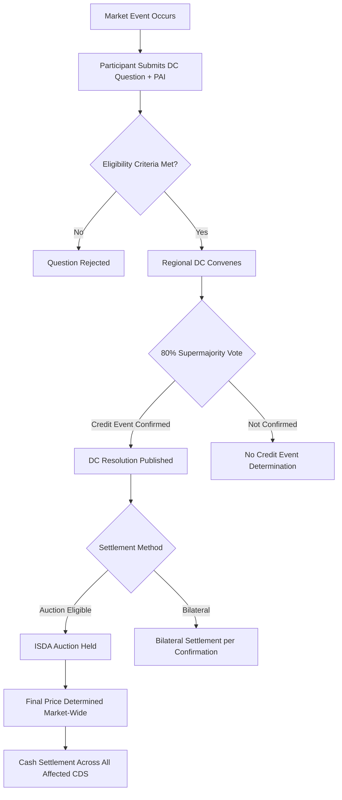

## ISDA Credit Event Determination

### Overview

ISDA Credit Event Determination is the process by which market participants establish whether a triggering event has occurred under the definitions published by the International Swaps and Derivatives Association (ISDA), such that a credit derivative contract (most commonly a Credit Default Swap, or CDS) is activated for settlement. The determination process sits at the intersection of legal documentation, market governance, and derivatives payout mechanics: a credit event is not simply "observed" by counterparties bilaterally, but is formally adjudicated through a centralized industry process for most standardized single-name and index CDS contracts traded since the 2009 "Big Bang" and "Small Bang" Protocols.

### Regulatory and Documentation Framework

**Key Points**

- Governed primarily by the ISDA Credit Derivatives Definitions, with the 2014 Definitions superseding the 2003 Definitions for most new trades
- Credit events are defined contractually in the confirmation and incorporated definitions, not by statute
- Determination is delegated to Credit Derivatives Determinations Committees (DC) rather than left to bilateral dispute between the two counterparties

The 2014 ISDA Credit Derivatives Definitions introduced refinements addressing gaps exposed during the 2008–2012 crisis period, including the Governmental Intervention credit event and more precise successor and restructuring provisions. [Inference] Legacy trades referencing the 2003 Definitions still exist in some portfolios but represent a shrinking share of outstanding notional.

### Enumerated Credit Events

The standard ISDA Credit Derivatives Definitions specify a fixed taxonomy of credit events. Not all events apply to every transaction type (e.g., sovereign vs. corporate reference entities use different applicable event sets by market convention):

1. **Bankruptcy** — insolvency, liquidation proceedings, appointment of a receiver, or similar events under applicable law affecting the Reference Entity
2. **Failure to Pay** — failure by the Reference Entity to make, when and where due, payments in an aggregate amount not less than the Payment Requirement (standard default: $1,000,000 or local currency equivalent), after expiration of any applicable Grace Period
3. **Restructuring** — a change in the terms of one or more Obligations (e.g., reduction in interest/principal, postponement of payment dates, change in ranking of priority) agreed between the Reference Entity and holders due to deterioration in creditworthiness or financial condition
4. **Obligation Acceleration** — obligations becoming due and payable before scheduled maturity as a result of default
5. **Obligation Default** — obligations becoming capable of being declared due and payable before scheduled maturity
6. **Repudiation/Moratorium** — an authorized officer disaffirms or challenges the validity of obligations, typically used for sovereign reference entities
7. **Governmental Intervention** — (2014 Definitions) actions by a governmental authority that affect the rights of a creditor, such as expropriation, transfer, or mandatory cancellation, commonly relevant for bank holding company senior/subordinated debt (bail-in scenarios)

**Obligation Acceleration** and **Obligation Default** are rarely selected as applicable events in standard corporate CDS confirmations under current market convention; **Bankruptcy**, **Failure to Pay**, and **Restructuring** (or **Governmental Intervention** for financials) constitute the effective operative set for most trades. [Unverified] The precise combination applicable to any given trade depends on the transaction type template published by ISDA/Markit for the relevant reference entity sector and jurisdiction, so this should be confirmed against the specific confirmation.

### The Credit Derivatives Determinations Committees (DC) Process

**Key Points**

- Regional DCs (Americas, EMEA, Asia ex-Japan, Japan, Australia-New Zealand) composed of voting sell-side and buy-side dealers, convened by ISDA
- A DC Question is submitted (by a market participant with a position, subject to eligibility rules) asking whether a credit event has occurred with respect to a specified Reference Entity
- The DC deliberates based on submitted evidence (Publicly Available Information, or PAI) and votes; a supermajority threshold determines the outcome
- The determination binds all market participants who have adhered to the relevant ISDA Credit Derivatives Determinations Committees Rules, either via the ISDA Definitions incorporation or through protocol adherence

**Process Flow**

1. **Question Submission**: An eligible market participant submits a DC Question to ISDA regarding a specific Reference Entity, alleging that a credit event has occurred, along with supporting Publicly Available Information (PAI) — typically from at least two recognized public sources (major news services, regulatory filings)
2. **Eligibility Screening**: ISDA and the Secured Parties confirm the question meets submission criteria
3. **DC Deliberation**: The relevant Regional DC convenes (often within 24–48 hours of submission for urgent matters) to review the PAI against the contractual definition of the alleged event
4. **Binding Vote**: A resolution requires an 80% supermajority for most binding determinations; certain procedural matters use different thresholds
5. **Publication**: The DC Resolution is published, along with (if the event is confirmed) the determination of an Auction date, if the event triggers physical or cash settlement via auction mechanics
6. **Auction Settlement (if applicable)**: A centralized auction determines the Final Price used for cash settlement across all affected contracts market-wide, superseding bilateral valuation

### Settlement Mechanics Following Determination

**Key Points**

- **Physical Settlement**: protection buyer delivers a Deliverable Obligation of the Reference Entity in exchange for par from the protection seller (largely superseded by auction cash settlement for standardized contracts)
- **Cash Settlement via Auction**: the ISDA-administered auction process establishes a market-wide Final Price (expressed as a percentage of par) through a two-stage process (Initial Market Midpoint submissions, then a Dutch-auction-style limit order matching)
- Auction Final Price determines the payout: $Payout = Notional \times (1 - FinalPrice)$

The auction methodology, standardized since the 2009 protocols, aims to converge the CDS-implied recovery rate with observable secondary market pricing for defaulted debt, reducing the basis risk and settlement disputes that characterized earlier bilateral physical settlement regimes. [Inference] The existence of a single auction-determined price across the market is generally understood to reduce squeeze risk relative to physical settlement, where protection buyers must source specific deliverable obligations.

### Example

**Example**

Suppose a corporate Reference Entity, "XYZ Corp," misses a scheduled coupon payment of $15,000,000 on a senior unsecured bond, and does not cure within the applicable Grace Period.

1. A dealer holding CDS protection on XYZ Corp submits a DC Question citing the missed payment, supported by a Bloomberg news article and an XYZ Corp regulatory filing as PAI
2. The Americas DC convenes and confirms the payment amount exceeds the $1,000,000 Payment Requirement threshold and the Grace Period has lapsed
3. An 80% supermajority votes "Yes" — Failure to Pay is confirmed as a credit event effective as of the relevant date
4. ISDA schedules a Credit Derivatives Auction for XYZ Corp
5. The auction determines a Final Price of 35% of par
6. For a $10,000,000 notional CDS: $Payout = 10{,}000{,}000 \times (1 - 0.35) = 6{,}500{,}000$
7. The protection seller pays the protection buyer $6,500,000, and the CDS contract terminates

### Restructuring Nuances (2014 Definitions)

**Key Points**

- **Old Restructuring (Old R)**: any deliverable obligation may be used regardless of maturity — largely legacy
- **Modified Restructuring (Mod R)**: limits deliverable obligation maturity to 30 months beyond the CDS scheduled termination date, historically the U.S. corporate market standard
- **Modified-Modified Restructuring (Mod-Mod R)**: intermediate maturity limitation (60 months for restructured obligations, 30 months for others), historically the European market standard
- **No Restructuring (No R / XR)**: Restructuring excluded entirely as an applicable credit event; standard in the current Standard North American Corporate (SNAC) template following the Big Bang Protocol

Market convention shifted heavily toward **No R** for North American single-name corporate CDS after the 2009 Big Bang Protocol, since Restructuring's "soft" nature (voluntary renegotiation rather than hard default) historically produced valuation and deliverable-obligation disputes disproportionate to other event types. [Unverified] Regional and sector conventions (e.g., European corporates, financials, sovereigns) may retain Mod-Mod R or full Restructuring applicability, and should be verified against the specific transaction template in force at trade date.

### Conclusion

**Conclusion**

ISDA Credit Event Determination replaces bilateral, contract-by-contract judgment calls with a centralized, rules-based governance process administered through the Determinations Committees. This standardization — spanning the enumerated event taxonomy, the PAI evidentiary standard, the supermajority voting mechanism, and the subsequent auction-based settlement — is what allows CDS to function as a liquid, fungible risk-transfer instrument rather than a bespoke bilateral contract subject to idiosyncratic dispute resolution.

**Related Topics**

- ISDA Credit Derivatives Auction Mechanics and Final Price Calculation
- Successor Determination for Reference Entities (mergers, spin-offs, LBOs)
- Standard North American Corporate (SNAC) and Standard European Corporate (STEC) CDS Templates
- Sovereign CDS: Repudiation/Moratorium and Asset Package Delivery
- Governmental Intervention and Bail-In Risk in Financial Reference Entities
- CDS-Bond Basis and the Cheapest-to-Deliver Option
- Single Name vs. Index CDS Credit Event Mechanics (CDX/iTraxx tranche implications)